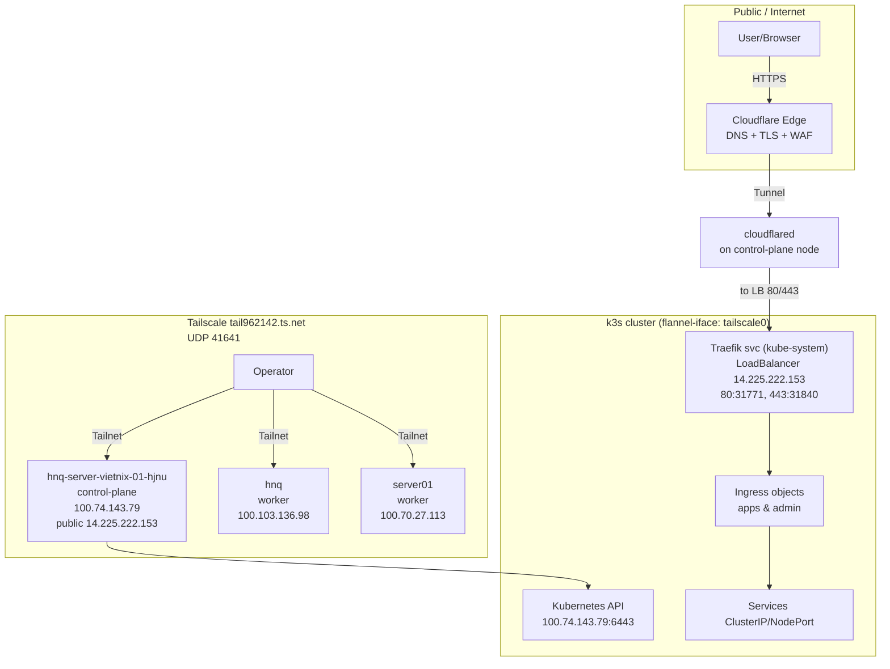
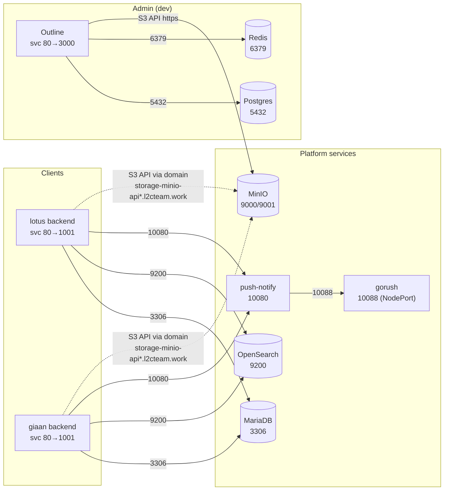

# Kiến trúc hệ thống (k3s + ArgoCD + Tailscale + Cloudflare Tunnel)

> Mục tiêu: “vẽ lại” kiến trúc **toàn hệ thống đang vận hành**, tập trung vào: **k3s**, các **service + ports**, lớp **Tailscale**, và **tunnel**.
>
> Ngày cập nhật: **2026-02-09**.
>
> Ghi chú: Tài liệu này được tổng hợp từ **GitOps trong repo** + **cấu hình host** + snapshot “live” bằng `kubectl get nodes/ns/ingress/svc/pods` (2026-02-09). Một số phần (route chi tiết của Cloudflare Tunnel, firewall/NAT) vẫn cần đối soát theo thực tế vận hành.

## 0) Nguồn dữ liệu dùng để dựng kiến trúc

### Host / OS

- `hostname` (control-plane): `hnq-server-vietnix-01-hjnu`
- k3s config: `/etc/rancher/k3s/config.yaml`
  - `node-ip: 100.74.143.79` (Tailscale IP)
  - `node-external-ip: 14.225.222.153` (Public IP)
  - `flannel-iface: tailscale0` (Pod network “chạy trên” interface Tailscale)
  - TLS SAN: `100.74.143.79`, `hnq-server-vietnix-01-hjnu.tail962142.ts.net`
- k3s add-ons manifests: `/var/lib/rancher/k3s/server/manifests/*` (CoreDNS, Traefik, metrics-server, local-path-provisioner,…)
- systemd services:
  - Tailscale: `/lib/systemd/system/tailscaled.service`, cấu hình port: `/etc/default/tailscaled` (`PORT=41641`)
  - Cloudflare Tunnel: `/etc/systemd/system/cloudflared.service` (chạy `cloudflared tunnel run ...`)

### Kubernetes / GitOps (repo này)

- ArgoCD Applications: `infra/argocd/apps/**`
- Helm charts + values theo env: `infra/helm/**/values-*.yaml`
- Live inventory (để chốt “đang chạy”): `kubectl get nodes/ns/ingress/svc/pods`

---

## 1) Tổng quan kiến trúc (Access → Edge/Tunnel → Ingress → Services)



### Ý nghĩa các lớp

- **Cloudflare Tunnel (cloudflared trên host)**: public domain (vd `*.l2cteam.work`) được route vào hạ tầng nội bộ mà không cần mở port inbound trực tiếp.
- **Public ingress (direct)**: Traefik đang publish `14.225.222.153:80/443` (LB). Tuỳ cấu hình DNS/ZeroTrust, Cloudflare có thể:
  - route qua **Tunnel** (cloudflared), hoặc
  - proxy trực tiếp đến **public IP** (A/AAAA record).
- **Tailscale**:
  - Dùng cho **quản trị (SSH/kubectl)**.
  - Đồng thời được cấu hình làm **node-ip** và **interface cho flannel** của k3s (`tailscale0`) → rất phù hợp nếu bạn có/định join nhiều node qua tailnet.
- **Traefik (Ingress Controller của k3s)**: nhận traffic HTTP/HTTPS và route theo Kubernetes `Ingress` về từng service.
- **NodePort**: một số service (MariaDB, GoRush) được mở **NodePort** để truy cập trực tiếp (thường dùng cho integration/ops).

---

## 2) k3s – nền tảng Kubernetes trên server

### 2.1. Topology nodes (live)

| Node | Role | Internal IP (Tailscale) | External IP | Ghi chú |
|---|---|---:|---:|---|
| `hnq-server-vietnix-01-hjnu` | control-plane | `100.74.143.79` | `14.225.222.153` | Public ingress/LB đang trỏ về đây |
| `hnq` | worker | `100.103.136.98` | (none) | Dev workloads đang chạy chủ yếu ở đây |
| `server01` | worker | `100.70.27.113` | (none) | ArgoCD + Outline đang chạy ở đây |

> Nhận xét: `Internal-IP` đều là dải `100.x` của Tailscale → các node join cluster qua tailnet.

### 2.2. Thông tin node/network (theo `/etc/rancher/k3s/config.yaml` trên control-plane)

- **Node IP (Tailscale):** `100.74.143.79`
- **Node External IP (Public):** `14.225.222.153`
- **Flannel interface:** `tailscale0`
- **Kubernetes API:** `https://100.74.143.79:6443` (cert SAN có `hnq-server-vietnix-01-hjnu.tail962142.ts.net`)

### 2.3. Add-ons mặc định từ k3s manifests

- **Traefik** (Ingress Controller) – `kube-system`
  - EntryPoints mặc định: `web` (80), `websecure` (443)
  - Service: `LoadBalancer` `14.225.222.153` (`80:31771/TCP`, `443:31840/TCP`)
  - k3s ServiceLB: pod `svclb-traefik-*` chạy trên **mọi node** để “publish” LB ra node ports/host ports
  - Có scrape metrics (pod annotation trong manifest)
- **CoreDNS** – DNS cho service discovery (`*.svc.cluster.local`)
- **metrics-server** – metrics cho HPA/`kubectl top`
- **local-path-provisioner** – default StorageClass `local-path` (PV nằm dưới `/var/lib/rancher/k3s/storage` nếu không override)

### 2.4. Phân bố workload (live)

Theo `kubectl get pods -A -o wide` tại thời điểm snapshot:

- **Node `hnq`**: đa số workload **DEV** (clients dev, storage dev, push-notify dev)
- **Node `hnq-server-vietnix-01-hjnu` (control-plane)**: đa số workload **PROD** + system services (Traefik, CoreDNS, Rancher, cert-manager,…)
- **Node `server01`**: **ArgoCD** + **Outline** (admin-workspace-dev)

---

## 3) Inventory toàn hệ thống (live: nodes + domains + ports)

> Snapshot: **2026-02-09** từ `kubectl get svc/ingress/endpointslices -A`.
>
> - `Nodes`: lấy từ EndpointSlice (service endpoints) → phản ánh pod đang chạy trên node nào.
> - `Domain(s)`: lấy từ Ingress rules (nếu service được expose qua Ingress).

| Namespace | Service | Type | Nodes | Domain(s) | Internal ports (svc→target) | NodePort(s) |
|---|---|---|---|---|---|---|
| `admin-workspace-dev` | `outline` | `ClusterIP` | `server01` | `admin-workspace.l2cteam.work` | `http=80→http/TCP` | — |
| `argocd` | `argocd-applicationset-controller` | `ClusterIP` | `server01` | — | `http-webhook=7000→webhook/TCP` | — |
| `argocd` | `argocd-dex-server` | `ClusterIP` | `server01` | — | `http=5556→http/TCP`<br/>`grpc=5557→grpc/TCP` | — |
| `argocd` | `argocd-redis` | `ClusterIP` | `server01` | — | `redis=6379→redis/TCP` | — |
| `argocd` | `argocd-repo-server` | `ClusterIP` | `server01` | — | `tcp-repo-server=8081→repo-server/TCP` | — |
| `argocd` | `argocd-server` | `ClusterIP` | `server01` | `admin-argocd.l2cteam.work` | `http=80→8080/TCP`<br/>`https=443→8080/TCP` | — |
| `cattle-capi-system` | `capi-webhook-service` | `ClusterIP` | `hnq-server-vietnix-01-hjnu` | — | `443→webhook-server/TCP` | — |
| `cattle-fleet-system` | `gitjob` | `ClusterIP` | `hnq-server-vietnix-01-hjnu` | — | `http-80=80→8080/TCP` | — |
| `cattle-fleet-system` | `monitoring-fleet-controller` | `ClusterIP` | `hnq-server-vietnix-01-hjnu` | — | `metrics=8080→8080/TCP` | — |
| `cattle-fleet-system` | `monitoring-gitjob` | `ClusterIP` | `hnq-server-vietnix-01-hjnu` | — | `metrics=8081→8081/TCP` | — |
| `cattle-system` | `imperative-api-extension` | `ClusterIP` | `hnq-server-vietnix-01-hjnu` | — | `6666→6666/TCP` | — |
| `cattle-system` | `rancher` | `ClusterIP` | `hnq-server-vietnix-01-hjnu` | `admin-rancher.l2cteam.work` | `http=80→80/TCP`<br/>`https-internal=443→444/TCP` | — |
| `cattle-system` | `rancher-webhook` | `ClusterIP` | `hnq-server-vietnix-01-hjnu` | — | `https=443→9443/TCP` | — |
| `cert-manager` | `cert-manager` | `ClusterIP` | `hnq-server-vietnix-01-hjnu` | — | `tcp-prometheus-servicemonitor=9402→http-metrics/TCP` | — |
| `cert-manager` | `cert-manager-cainjector` | `ClusterIP` | `hnq-server-vietnix-01-hjnu` | — | `http-metrics=9402→9402/TCP` | — |
| `cert-manager` | `cert-manager-webhook` | `ClusterIP` | `hnq-server-vietnix-01-hjnu` | — | `https=443→https/TCP`<br/>`metrics=9402→http-metrics/TCP` | — |
| `default` | `kubernetes` | `ClusterIP` | — | — | `https=443→6443/TCP` | — |
| `giaan-clinic-dev` | `backend-service` | `ClusterIP` | `hnq` | `dev.giaan-clinic.local` | `http=80→1001/TCP` | — |
| `giaan-clinic-prod` | `backend-service` | `ClusterIP` | `hnq-server-vietnix-01-hjnu` | `client-giaan-clinic.l2cteam.work` | `http=80→1001/TCP` | — |
| `kube-system` | `kube-dns` | `ClusterIP` | `hnq-server-vietnix-01-hjnu` | — | `dns=53→53/UDP`<br/>`dns-tcp=53→53/TCP`<br/>`metrics=9153→9153/TCP` | — |
| `kube-system` | `metrics-server` | `ClusterIP` | `hnq-server-vietnix-01-hjnu` | — | `https=443→https/TCP` | — |
| `kube-system` | `traefik` | `LoadBalancer` | `hnq-server-vietnix-01-hjnu` | `14.225.222.153` | `web=80→web/TCP`<br/>`websecure=443→websecure/TCP` | `web:31771`<br/>`websecure:31840` |
| `lotus-clinic-dev` | `backend-service` | `ClusterIP` | `hnq` | `client-lotus-clinic-dev.l2cteam.work` | `http=80→1001/TCP` | — |
| `lotus-clinic-prod` | `backend-service` | `ClusterIP` | `hnq-server-vietnix-01-hjnu` | `client-lotus-clinic.l2cteam.work` | `http=80→1001/TCP` | — |
| `push-notify-dev` | `gorush` | `NodePort` | `hnq` | — | `http=10088→10088/TCP` | `http:30089` |
| `push-notify-dev` | `push-notify` | `ClusterIP` | `hnq` | — | `http=10080→10080/TCP` | — |
| `push-notify-prod` | `gorush` | `NodePort` | `hnq-server-vietnix-01-hjnu` | — | `http=10088→10088/TCP` | `http:30088` |
| `push-notify-prod` | `push-notify` | `ClusterIP` | `hnq-server-vietnix-01-hjnu` | — | `http=10080→10080/TCP` | — |
| `storage-mariadb-dev` | `mariadb` | `ClusterIP` | `hnq` | — | `mysql=3306→mysql/TCP` | — |
| `storage-mariadb-dev` | `mariadb-headless` | `ClusterIP` | `hnq` | — | `mysql=3306→mysql/TCP` | — |
| `storage-mariadb-dev` | `mariadb-nodeport` | `NodePort` | `hnq` | — | `mysql=3306→mysql/TCP` | `mysql:32016` |
| `storage-mariadb-prod` | `mariadb` | `ClusterIP` | `hnq-server-vietnix-01-hjnu` | — | `mysql=3306→mysql/TCP` | — |
| `storage-mariadb-prod` | `mariadb-headless` | `ClusterIP` | `hnq-server-vietnix-01-hjnu` | — | `mysql=3306→mysql/TCP` | — |
| `storage-mariadb-prod` | `mariadb-nodeport` | `NodePort` | `hnq-server-vietnix-01-hjnu` | — | `mysql=3306→mysql/TCP` | `mysql:32006` |
| `storage-minio-dev` | `minio` | `ClusterIP` | `hnq` | `storage-minio-api-dev.l2cteam.work`<br/>`storage-minio-console-dev.l2cteam.work` | `api=9000→api/TCP`<br/>`console=9001→console/TCP` | — |
| `storage-minio-dev` | `minio-nodeport` | `NodePort` | `hnq` | — | `api=9000→api/TCP`<br/>`console=9001→console/TCP` | `api:32090`<br/>`console:32091` |
| `storage-minio-prod` | `minio` | `ClusterIP` | `hnq-server-vietnix-01-hjnu` | `storage-minio-api.l2cteam.work`<br/>`storage-minio-console.l2cteam.work` | `api=9000→api/TCP`<br/>`console=9001→console/TCP` | — |
| `storage-minio-prod` | `minio-nodeport` | `NodePort` | `hnq-server-vietnix-01-hjnu` | — | `api=9000→api/TCP`<br/>`console=9001→console/TCP` | `api:32080`<br/>`console:32081` |
| `storage-opensearch-dev` | `opensearch` | `ClusterIP` | `hnq` | — | `http=9200→http/TCP`<br/>`metrics=9600→metrics/TCP` | — |
| `storage-opensearch-dev` | `opensearch-headless` | `ClusterIP` | `hnq` | — | `http=9200→http/TCP`<br/>`metrics=9600→metrics/TCP` | — |
| `storage-opensearch-prod` | `opensearch` | `ClusterIP` | `hnq-server-vietnix-01-hjnu` | — | `http=9200→http/TCP`<br/>`metrics=9600→metrics/TCP` | — |
| `storage-opensearch-prod` | `opensearch-headless` | `ClusterIP` | `hnq-server-vietnix-01-hjnu` | — | `http=9200→http/TCP`<br/>`metrics=9600→metrics/TCP` | — |
| `storage-postgres-dev` | `postgres` | `ClusterIP` | `hnq` | — | `postgres=5432→postgres/TCP` | — |
| `storage-postgres-dev` | `postgres-headless` | `ClusterIP` | `hnq` | — | `postgres=5432→postgres/TCP` | — |
| `storage-redis-dev` | `redis` | `ClusterIP` | `hnq` | — | `redis=6379→redis/TCP` | — |

---

## 4) Service dependency graph (luồng nội bộ)

### 4.1. Client backends (lotus/giaan)

- Lắng nghe HTTP trên `:1001` (container) và được expose qua service `backend-service:80`.
- Phụ thuộc (theo `infra/helm/clients/*/files/app/config_*.yaml`):
  - MariaDB: `mariadb.storage-mariadb-<env>` port `3306`
  - OpenSearch: `opensearch.storage-opensearch-<env>` port `9200`
  - Push-notify: `push-notify.push-notify-<env>.svc.cluster.local` port `10080`
  - MinIO: gọi qua **domain** `storage-minio-api(-dev).l2cteam.work` (HTTPS)

### 4.2. push-notify

- `push-notify` service: `10080` (ClusterIP)
- `gorush` service: `10088` (NodePort `30088/30089`)

### 4.3. Outline (dev)

- Expose qua service `outline:80 → 3000`, ingress `admin-workspace.l2cteam.work`
- Phụ thuộc: Postgres + Redis + S3 (MinIO)



---

## 5) Port map (tổng hợp)

### 5.1. Host / Node-level

| Component | Port(s) | Notes |
|---|---|---|
| `tailscaled` | `41641/UDP` | transport của Tailscale (theo `/etc/default/tailscaled`) |
| `kube-apiserver` | `6443/TCP` | bind theo `node-ip` (Tailscale) `100.74.143.79` |
| `traefik` (svc `LoadBalancer`) | `14.225.222.153:80`, `:443` | map nodePort `80:31771/TCP`, `443:31840/TCP` |
| NodePort: MariaDB dev/prod | `32016/TCP`, `32006/TCP` | map vào `3306` |
| NodePort: MinIO dev/prod | `32090/TCP`, `32091/TCP`, `32080/TCP`, `32081/TCP` | map vào `9000`, `9001` |
| NodePort: GoRush dev/prod | `30089/TCP`, `30088/TCP` | map vào `10088` |

### 5.2. In-cluster (ClusterIP) – ports chính

| Service | Port(s) |
|---|---|
| ArgoCD (`argocd-server`) | `80`, `443` |
| Rancher (`cattle-system/rancher`) | `80`, `443` |
| MariaDB | `3306` |
| MinIO | `9000` (API), `9001` (Console) |
| OpenSearch | `9200` (HTTP), `9600` (Metrics) |
| Postgres | `5432` |
| Redis | `6379` |
| push-notify | `10080` |
| client backend | `1001` (container) qua service `80` |
| outline | `3000` (container) qua service `80` |

---

## 6) Checklist đối soát “live” trên server (khuyến nghị)

> Vì môi trường tài liệu có thể lệch với trạng thái thực tế (chart version, replica, service type, NodePorts thực tế, ingress rules,…), hãy chạy các lệnh sau trên server để chốt bản “đang chạy”:

```bash
# Tổng quan k8s
kubectl get nodes -o wide
kubectl get ns

# Inventory theo traffic
kubectl get ingress -A
kubectl get svc -A | egrep -i 'traefik|nodeport|minio|mariadb|opensearch|push-notify|gorush|outline|backend'

# ArgoCD apps (nếu có quyền)
kubectl -n argocd get applications.argoproj.io

# Kiểm tra traefik service
kubectl -n kube-system get svc traefik -o wide

# Kiểm tra cloudflared/tailscale/k3s
systemctl status cloudflared --no-pager
systemctl status tailscaled --no-pager
systemctl status k3s --no-pager
```
