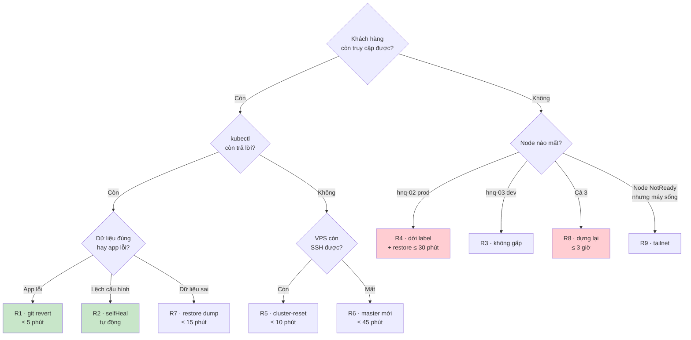

# Phục hồi sự cố — 10 quy trình có đo thời gian

| | |
|---|---|
| **Trạng thái** | Bản nháp, chờ duyệt |
| **Ngày** | 12/09/2026 |
| **Dành cho** | **1 người vận hành**, không có ai để gọi lúc 2 giờ sáng |
| **Topology** | `hnq-01` server (VPS) · `hnq-02` prod (local) · `hnq-03` dev (local) — join qua Tailscale |
| **Liên quan** | [REFACTOR_PLAN.md](./REFACTOR_PLAN.md) · [K3S_OPERATIONS.md](./K3S_OPERATIONS.md) · [SECRET_MANAGEMENT.md](./SECRET_MANAGEMENT.md) · `RUNBOOK.md` |

---

## Cách dùng tài liệu này

Tài liệu này **không phải để đọc lúc đang sự cố từ đầu tới cuối**. Lúc đang sự cố thì làm đúng hai việc:

1. Chạy [phần 1 — 60 giây đầu](#1-60-giây-đầu-tiên) để biết đang hỏng ở đâu.
2. Nhảy thẳng tới đúng **một** quy trình `R*`, làm theo từ trên xuống, không bỏ bước.

Đọc hết tài liệu này là việc của lúc **bình thường** — và phải đọc trước, vì mỗi quy trình có một hai chỗ nếu không biết trước thì mất hàng giờ (chỗ đó được đánh dấu ⚠️).

> **Chuẩn bị trước, 5 phút, làm ngay hôm nay:** `git clone` repo này về máy chính **và** máy phụ, và lưu một bản PDF của file này vào điện thoại. Lúc control-plane chết mà bạn đang ở ngoài, điện thoại là thứ duy nhất bạn có.

### Mục lục

- [1. 60 giây đầu tiên](#1-60-giây-đầu-tiên)
- [2. Recovery kit — ba thứ phải luôn có](#2-recovery-kit--ba-thứ-phải-luôn-có)
- [3. Cây quyết định](#3-cây-quyết-định)
- [R1 · Deploy sai, app lỗi sau khi sync](#r1--deploy-sai-app-lỗi-sau-khi-sync)
- [R2 · Cluster lệch khỏi Git](#r2--cluster-lệch-khỏi-git)
- [R3 · Node dev chết](#r3--node-dev-chết)
- [R4 · Node prod chết, node dev còn sống](#r4--node-prod-chết-node-dev-còn-sống)
- [R5 · etcd hỏng hoặc apiserver không lên, đĩa còn nguyên](#r5--etcd-hỏng-hoặc-apiserver-không-lên-đĩa-còn-nguyên)
- [R6 · VPS mất hoàn toàn, dựng master mới](#r6--vps-mất-hoàn-toàn-dựng-master-mới)
- [R7 · Xoá nhầm dữ liệu trong database](#r7--xoá-nhầm-dữ-liệu-trong-database)
- [R8 · Mất toàn bộ cluster, dựng lại từ số không](#r8--mất-toàn-bộ-cluster-dựng-lại-từ-số-không)
- [R9 · Tailnet sự cố, node NotReady nhưng pod vẫn chạy](#r9--tailnet-sự-cố-node-notready-nhưng-pod-vẫn-chạy)
- [R10 · Đĩa đầy](#r10--đĩa-đầy)
- [4. Diễn tập](#4-diễn-tập)
- [5. Điều gì làm chậm phục hồi](#5-điều-gì-làm-chậm-phục-hồi)

---

## 1. 60 giây đầu tiên

Câu hỏi duy nhất cần trả lời trước khi gõ bất cứ lệnh nào: **khách hàng có đang bị ảnh hưởng không?**

Vì đường dữ liệu không phụ thuộc control-plane ([REFACTOR_PLAN §2.4](./REFACTOR_PLAN.md#24-đường-dữ-liệu-không-phụ-thuộc-master)), câu trả lời rất thường xuyên là **không** — và khi đó bạn có cả ngày để xử lý, không phải 5 phút. Biết được điều này là thứ giảm sai sót nhiều nhất.

```bash
# 1. Khách hàng còn truy cập được không? — CÂU HỎI QUAN TRỌNG NHẤT
curl -sS -o /dev/null -w '%{http_code}\n' https://lotus.l2cteam.work/healthz

# 2. Ba node còn sống không?
tailscale status | grep -E 'hnq-0[123]'

# 3. Control-plane còn trả lời không?
kubectl get --raw /readyz ; kubectl get nodes

# 4. Cái gì đang không Healthy?
kubectl get app -n argocd -o custom-columns=\
NAME:.metadata.name,SYNC:.status.sync.status,HEALTH:.status.health.status | grep -v 'Synced.*Healthy'
```

| Kết quả | Nghĩa là | Đi tới |
|---|---|---|
| (1) `200`, (3) lỗi | Control-plane chết, **khách hàng không bị ảnh hưởng** | [R5](#r5--etcd-hỏng-hoặc-apiserver-không-lên-đĩa-còn-nguyên) → nếu VPS mất thì [R6](#r6--vps-mất-hoàn-toàn-dựng-master-mới). Không gấp. |
| (1) lỗi, (2) thiếu `hnq-02` | Node prod chết | [R4](#r4--node-prod-chết-node-dev-còn-sống) — **gấp** |
| (1) lỗi, (2) đủ 3 node, (3) ổn | Lỗi ở tầng ứng dụng | [R1](#r1--deploy-sai-app-lỗi-sau-khi-sync) |
| (2) thiếu `hnq-03` | Node dev chết | [R3](#r3--node-dev-chết) — không gấp |
| (2) đủ, nhưng (3) báo node `NotReady` | Tailnet sự cố | [R9](#r9--tailnet-sự-cố-node-notready-nhưng-pod-vẫn-chạy) |
| Dữ liệu sai nhưng mọi thứ `Healthy` | Sự cố dữ liệu, không phải hạ tầng | [R7](#r7--xoá-nhầm-dữ-liệu-trong-database) |

> **Quy tắc một dòng:** trước mọi thao tác có chữ `delete`, `reset`, `rm`, hoặc `--force` — chạy `make snapshot` trước. Nó mất 10 giây và đã cứu nhiều người hơn mọi cơ chế khác trong tài liệu này.

---

## 2. Recovery kit — ba thứ phải luôn có

Mất cả 3 máy mà còn đủ 3 thứ dưới đây thì dựng lại được toàn bộ hệ thống. Thiếu một thứ là **mất vĩnh viễn** một phần.

| # | Thứ | Lấy ở đâu | Cất ở đâu | Không có thì |
|---|---|---|---|---|
| 1 | **etcd snapshot** | tự động 6 giờ/lần lên R2 | R2 + 1 bản tải về máy hằng tháng | Mất toàn bộ trạng thái cluster (Application, SealedSecret đã apply, PVC binding) |
| 2 | **k3s server token** | `/var/lib/rancher/k3s/server/token` trên `hnq-01` | **Password manager** | ⚠️ **Snapshot ở #1 thành vô dụng** — token là khoá giải bootstrap data nằm trong snapshot |
| 3 | **Sealed Secrets sealing key** | `kubectl -n kube-system get secret -l sealedsecrets.bitnami.com/sealed-secrets-key -o yaml` | Password manager, **2 nơi** | Phải tạo lại **toàn bộ** secret bằng tay từ giá trị gốc — nếu còn giữ giá trị gốc |

Kèm theo (không bắt buộc nhưng tiết kiệm nhiều thời gian): token của Cloudflare Tunnel, khoá R2, mật khẩu admin ArgoCD, thông tin đăng nhập nhà cung cấp VPS.

### `scripts/dr/kit-check.sh` — chạy hằng tháng

Kit chưa từng kiểm là kit chưa chắc có. Script này **không** in ra giá trị, chỉ trả lời "còn dùng được không":

```bash
#!/usr/bin/env bash
# scripts/dr/kit-check.sh — kiểm recovery kit, KHÔNG in ra giá trị bí mật
set -euo pipefail
FAIL=0
ok(){ echo "  ✅ $1"; }; bad(){ echo "  ❌ $1"; FAIL=1; }

echo "── 1. etcd snapshot trên R2"
LAST=$(rclone lsjson r2:hnq-etcd-snapshots | jq -r 'max_by(.ModTime).ModTime')
AGE_H=$(( ( $(date +%s) - $(date -d "$LAST" +%s) ) / 3600 ))
[ "$AGE_H" -le 12 ] && ok "snapshot mới nhất ${AGE_H}h trước" \
                    || bad "snapshot mới nhất đã ${AGE_H}h — lịch cron có chạy không?"

echo "── 2. k3s token: bản trong password manager khớp bản trên server?"
# So sánh bằng hash, không so bằng giá trị
SRV=$(ssh hnq-01 'sudo sha256sum /var/lib/rancher/k3s/server/token' | cut -d' ' -f1)
read -rsp "  Dán token từ password manager: " KIT; echo
[ "$(printf %s "$KIT" | sha256sum | cut -d' ' -f1)" = "$SRV" ] \
  && ok "token khớp" || bad "TOKEN KHÔNG KHỚP — cập nhật password manager NGAY"

echo "── 3. sealing key"
KEYS=$(kubectl -n kube-system get secret \
  -l sealedsecrets.bitnami.com/sealed-secrets-key -o name | wc -l)
[ "$KEYS" -ge 1 ] && ok "$KEYS key trong cluster" || bad "không thấy sealing key"
echo "  ⚠️  Tự xác nhận bằng mắt: password manager có mục 'sealing key' ở 2 nơi?"

echo "── 4. Bản tải về máy hằng tháng"
NEWEST=$(find ~/hnq-dr -name 'etcd-*.zip' -mtime -35 2>/dev/null | wc -l)
[ "$NEWEST" -ge 1 ] && ok "có bản local dưới 35 ngày" || bad "chưa tải bản nào về máy tháng này"

exit "$FAIL"
```

> ⚠️ **Chỗ bị bỏ sót nhiều nhất trong mọi hệ thống là món #2.** Rất nhiều người backup etcd rất cẩn thận, rồi phát hiện lúc cần restore lên máy mới là không biết token ở đâu. Snapshot không có token thì restore lên máy khác **không giải mã được** — bằng không có backup.

---

## 3. Cây quyết định



---

## R1 · Deploy sai, app lỗi sau khi sync

**Mục tiêu: ≤ 5 phút. RPO: 0.**

Đây là sự cố hay xảy ra nhất, và là lý do tồn tại của gần hết Q8 trong [REFACTOR_PLAN](./REFACTOR_PLAN.md#1-tám-quyết-định-nền-tảng).

```bash
# 1. PR nào vừa vào main? (commit gần nhất đụng service đó)
git log --oneline -5 -- registry/apps/<service>/

# 2. Quay lui — KHÔNG sửa tay trên cluster, KHÔNG argocd rollback
git revert <commit> --no-edit
git push origin HEAD:refs/heads/revert-<service>
gh pr create --fill --title "revert(<service>): quay lui về tag cũ"
gh pr merge --auto --squash        # CI xanh là merge

# 3. Ép sync ngay, không chờ webhook
argocd app sync <service>-prod
```

⚠️ **Đừng dùng `argocd app rollback`.** Nó đưa cluster về trạng thái cũ nhưng Git vẫn ở trạng thái mới → `selfHeal` sẽ kéo lại cái sai trong vòng 3 phút. Sửa ở Git là chỗ duy nhất có tác dụng lâu dài (P1).

**Nếu cần nhanh hơn 5 phút** (CI đang chậm, khách hàng đang mất tiền):

```bash
# Đường break-glass: tạm dừng selfHeal rồi đặt image cũ về, SAU ĐÓ vẫn phải sửa Git
kubectl -n argocd patch app <service>-prod --type merge \
  -p '{"spec":{"syncPolicy":{"automated":null}}}'
kubectl -n <service>-prod set image deploy/<service> <service>=ghcr.io/...:<tag-cũ>
# → rồi làm bước 2 ở trên, và bật lại automated. Ghi 1 dòng vào RUNBOOK.md.
```

---

## R2 · Cluster lệch khỏi Git

**Mục tiêu: tự động.**

Với `selfHeal: true` ở cả dev và prod, mọi `kubectl edit` bằng tay bị ghi lại sau ≤ 3 phút. Việc của bạn chỉ là **biết** nó đang xảy ra:

```bash
make drift
```

Nếu một Application `OutOfSync` mà không tự hết sau 5 phút thì `selfHeal` đang không chạy được — thường vì một trong ba nguyên nhân:

| Nguyên nhân | Kiểm bằng | Sửa |
|---|---|---|
| Resource bị `finalizer` treo | `kubectl get <res> -o yaml \| grep -A3 finalizers` | Xoá finalizer sau khi hiểu vì sao nó ở đó |
| Chart render ra thứ không apply được | `argocd app diff <app>` | Sửa chart, đi qua PR |
| AppProject chặn (đúng như thiết kế) | `kubectl -n argocd logs deploy/argocd-application-controller \| grep -i permitted` | Chart ứng dụng đang cố tạo resource cấp cluster → đó là bug của chart, không phải của AppProject |

---

## R3 · Node dev chết

**Mục tiêu: không ảnh hưởng prod. Không gấp.**

Prod nằm trên `hnq-02`, dev trên `hnq-03` — nên node dev chết là **không có gì phải làm ngay**. Ba việc, làm lúc rảnh:

```bash
# 1. Xác nhận prod không bị kéo theo
kubectl get pod -A -o wide | grep -v hnq-03 | grep -c Running

# 2. Đường dữ liệu còn 1 replica trên hnq-02 — kiểm, vì giờ không còn dự phòng
make drift

# 3. Dựng lại node: cài lại máy, join lại theo REFACTOR_PLAN Phụ lục B3.
#    Dữ liệu dev không cần restore — ArgoCD dựng lại toàn bộ từ Git.
```

⚠️ **`hnq-03` cũng là nơi chạy monitoring**, nên node này chết đồng nghĩa **Prometheus, Grafana và Alertmanager đều mất**. Hệ quả: từ lúc này bạn **không nhận được alert nào nữa** cho tới khi dựng lại node — và im lặng trông giống hệt "mọi thứ đều ổn".

Thứ duy nhất còn báo cho bạn lúc này là [dead man's switch](./K3S_OPERATIONS.md#64-dead-mans-switch--thứ-quan-trọng-nhất-khi-chỉ-có-1-người) — nó sẽ báo trong ~12 phút vì `Watchdog` ngừng ping. Đây chính là trường hợp nó tồn tại để phục vụ. Sau khi đã biết nguyên nhân, tạm **tắt cảnh báo của heartbeat** (hoặc đặt maintenance window) để khỏi bị ping liên tục trong lúc dựng lại node.

⚠️ Trong lúc `hnq-03` chết, **hệ thống đang không có dự phòng cho đường dữ liệu và cũng không có monitoring**. Nếu `hnq-02` cũng chết thì khách hàng down, và bạn chỉ biết qua heartbeat. Nên dựng lại `hnq-03` trong vòng vài ngày, đừng để tháng — đây là lý do R3 "không gấp" nhưng vẫn có hạn.

---

## R4 · Node prod chết, node dev còn sống

**Mục tiêu: ≤ 30 phút. RPO: 1 giờ (nhờ dump logic hằng giờ).**

Quy trình gấp nhất trong tài liệu này. Đọc hết trước khi gõ.

### Bước 0 — quyết định trước đã: chờ hay chuyển?

| Câu hỏi | Nếu có | Nếu không |
|---|---|---|
| Máy có sống lại được trong ≤ 20 phút không? (mất điện, treo, cần cắm lại) | **Chờ.** Bật lại máy là xong, dữ liệu nguyên vẹn, RPO = 0. Đừng chuyển. | Đi tiếp bước 1 |

⚠️ **Đây là bước quan trọng nhất.** Chuyển node là thao tác phá huỷ (phải xoá PVC) và RPO thành 1 giờ. Bật lại máy là RPO 0. Đừng vì sốt ruột mà chọn đường đắt hơn.

### Bước 1 — dời môi trường prod sang node còn sống

```bash
make snapshot                      # luôn luôn, trước mọi thao tác phá huỷ

# Label là boolean, nên hnq-03 nhận được CẢ dev LẪN prod — dev không phải tắt
kubectl label node hnq-03 hnq.dev/env-prod=true --overwrite
kubectl get node hnq-03 --show-labels | tr ',' '\n' | grep hnq.dev
```

Đây là lúc quyết định Q6 ([node chọn bằng label](./REFACTOR_PLAN.md#1-tám-quyết-định-nền-tảng)) trả hết tiền: **một lệnh dời cả môi trường**, không sửa file nào, không merge PR nào.

### Bước 2 — nhường tài nguyên cho prod

`hnq-03` giờ phải chở cả dev lẫn prod. Tắt dev đi:

```bash
for ns in $(kubectl get ns -o name | grep -- '-dev$' | cut -d/ -f2); do
  kubectl -n "$ns" scale deploy,statefulset --all --replicas=0
done
```

⚠️ `scale --replicas=0` một mình **không đủ**: `selfHeal` sẽ kéo lại đúng số replica trong Git sau ≤ 3 phút. Phải tạm dừng `automated` cho app dev trước, rồi mới scale:

```bash
for a in $(kubectl -n argocd get app -o name | grep -- '-dev$'); do
  kubectl -n argocd patch "$a" --type merge -p '{"spec":{"syncPolicy":{"automated":null}}}'
done
```

Không xoá Application dev — chỉ dừng automated và scale về 0, để bật lại là 2 lệnh. **Ghi ngay vào `RUNBOOK.md` rằng hệ thống đang ở trạng thái này**, vì đây là thứ rất dễ quên bật lại sau khi hết sự cố.

> Vòng lặp trên chỉ đụng namespace kết thúc bằng `-dev`, nên **monitoring không bị tắt** — nó ở namespace `monitoring` trên chính `hnq-03` ([K3S_OPERATIONS §2.2](./K3S_OPERATIONS.md#22-ba-node-và-cái-gì-chạy-ở-đâu)). Đó là chủ ý: bạn cần Grafana và alert đang chạy trong suốt quy trình này.

### Bước 3 — cho Kubernetes biết node đã chết

```bash
kubectl delete node hnq-02
```

Pod stateless được tạo lại trên `hnq-03` ngay. Pod **có PVC thì sẽ `Pending`** — vì PVC đang bind vào một PV nằm trên máy đã chết. Đó là đúng, và là nội dung bước 4.

### Bước 4 — giải phóng PVC của từng datastore

⚠️ **Đọc kỹ:** PV dùng `reclaimPolicy: Retain` ([REFACTOR_PLAN §10.4](./REFACTOR_PLAN.md#104-storageclass-hnq-local)) nên xoá PVC **không** xoá dữ liệu trên đĩa của `hnq-02`. Nếu sau này máy đó sống lại, dữ liệu vẫn ở `/srv/k3s/data/`. Đây chính là lý do đặt `Retain`.

```bash
for svc in mariadb postgres redis minio opensearch; do
  kubectl -n storage-$svc-prod get pvc -o name | while read -r pvc; do
    echo "→ xoá $pvc (dữ liệu gốc vẫn còn trên hnq-02)"
    kubectl -n storage-$svc-prod delete "$pvc" --wait=false
  done
  # Xoá pod để StatefulSet tạo lại PVC → local-path cấp volume mới trên hnq-03
  kubectl -n storage-$svc-prod delete pod --all
done

kubectl get pvc -A | grep -- '-prod'      # phải Bound hết trong ~1 phút
```

### Bước 5 — nạp lại dữ liệu

```bash
# Database: dump logic hằng giờ — nhanh nhất, RPO 1 giờ
scripts/dr/restore-db.sh mariadb  prod latest
scripts/dr/restore-db.sh postgres prod latest

# MinIO (file upload): Velero, RPO 24 giờ
velero restore create --from-backup "$(velero backup get -o name | head -1)" \
  --include-namespaces storage-minio-prod --wait
```

### Bước 6 — xác nhận và ghi lại

```bash
make drift                                    # mọi app prod phải Synced/Healthy
curl -sS -o /dev/null -w '%{http_code}\n' https://lotus.l2cteam.work/healthz
kubectl get pod -A -o wide | grep -- '-prod'  # tất cả trên hnq-03
```

- [ ] Ghi vào `RUNBOOK.md`: thời gian thực tế, dữ liệu mất bao nhiêu, chỗ nào chậm
- [ ] Cập nhật cột "đo thực tế" trong [bảng diễn tập](#4-diễn-tập)
- [ ] Lên kế hoạch dựng lại `hnq-02` — trong lúc chưa xong, **prod và dev đang chung một node và không có dự phòng nào**

---

## R5 · etcd hỏng hoặc apiserver không lên, đĩa còn nguyên

**Mục tiêu: ≤ 10 phút. RPO: 6 giờ. Khách hàng không bị ảnh hưởng trong lúc làm.**

Triệu chứng: `kubectl` timeout hoặc trả lỗi TLS, `journalctl -u k3s` có `etcdserver:` hoặc `database space exceeded` / `corrupt`.

### Bước 1 — thử cách rẻ trước

```bash
ssh hnq-01
sudo systemctl restart k3s
sudo journalctl -u k3s -f --no-pager | head -50
```

Khoảng một nửa số lần là xong ở đây. Nếu không:

### Bước 2 — restore snapshot

```bash
# Còn snapshot trên đĩa không?
sudo k3s etcd-snapshot ls

sudo systemctl stop k3s

# ⚠️ CHẠY Ở FOREGROUND. Đợi tới dòng:
#    "Managed etcd cluster membership has been reset, restart without --cluster-reset flag now"
#    rồi Ctrl-C. Đừng để nó chạy tiếp.
sudo k3s server \
  --cluster-reset \
  --cluster-reset-restore-path=/var/lib/rancher/k3s/server/db/snapshots/<tên-snapshot>

sudo systemctl start k3s
kubectl get nodes
```

Nếu đĩa không còn snapshot dùng được thì lấy từ R2 — k3s tải trực tiếp, không cần `rclone`:

```bash
sudo k3s server \
  --cluster-reset \
  --etcd-s3 \
  --etcd-s3-endpoint="<account>.r2.cloudflarestorage.com" \
  --etcd-s3-bucket="hnq-etcd-snapshots" \
  --etcd-s3-access-key="..." --etcd-s3-secret-key="..." \
  --cluster-reset-restore-path="<tên-object-trong-bucket>"
```

### Bước 3 — ⚠️ agent bị từ chối: "Node password rejected"

**Đây là chỗ biến 10 phút thành 2 giờ nếu không biết trước.**

k3s lưu mật khẩu của mỗi agent thành một Secret trong `kube-system`. Nếu snapshot bạn restore **có từ trước khi agent join** (hoặc trước khi agent được cài lại), thì mật khẩu trong snapshot không khớp mật khẩu trên máy agent → agent không join được, log có `Node password rejected, duplicate hostname or contents of '/etc/rancher/node/password' may not match server node-passwd entry`.

```bash
# Trên hnq-01 — xoá entry cũ để agent đăng ký lại
kubectl -n kube-system get secret | grep node-password
kubectl -n kube-system delete secret hnq-02.node-password.k3s hnq-03.node-password.k3s

# Trên từng agent
ssh hnq-02 'sudo systemctl restart k3s-agent'
ssh hnq-03 'sudo systemctl restart k3s-agent'
kubectl get nodes -w
```

### Bước 4 — dọn phần lệch sau restore

Snapshot cũ hơn `main` vài giờ, nên cluster đang ở trạng thái cũ. ArgoCD sẽ tự kéo về đúng Git — chỉ cần ép nó làm ngay:

```bash
kubectl -n argocd patch app -l hnq.dev/env --type merge \
  -p '{"operation":{"sync":{"revision":"main"}}}' 2>/dev/null || \
  argocd app sync -l hnq.dev/env
make drift
```

⚠️ SealedSecret nào tạo **sau** thời điểm snapshot sẽ mất bản đã giải trong cluster — nhưng file mã hoá vẫn ở Git, nên ArgoCD apply lại là controller giải lại. **Điều kiện: sealing key phải không đổi.** Đây là lý do sealing key nằm trong recovery kit.

---

## R6 · VPS mất hoàn toàn, dựng master mới

**Mục tiêu: ≤ 45 phút. RPO: 6 giờ. Khách hàng không bị ảnh hưởng trong lúc làm** (nếu [§2.4](./REFACTOR_PLAN.md#24-đường-dữ-liệu-không-phụ-thuộc-master) đã làm đúng — kiểm bằng `curl` ở bước 0).

Cần: recovery kit món #1 (snapshot) **và** #2 (token). Không có #2 thì quy trình này **không chạy được** và phải đi [R8](#r8--mất-toàn-bộ-cluster-dựng-lại-từ-số-không).

### Bước 0 — xác nhận khách hàng chưa bị ảnh hưởng

```bash
curl -sS -o /dev/null -w '%{http_code}\n' https://lotus.l2cteam.work/healthz
```

`200` → bạn có thời gian. Làm cẩn thận, đừng làm nhanh.

### Bước 1 — ⚠️ xoá device cũ khỏi tailnet TRƯỚC khi dựng máy mới

Nếu không xoá, Tailscale sẽ đặt tên máy mới thành `hnq-01-1` và tên MagicDNS mà 2 agent đang trỏ vào (`hnq-01.<tailnet>.ts.net`) sẽ **trỏ vào máy đã chết**. Khi đó phải SSH vào từng agent sửa cấu hình — đúng cái mà thiết kế ở [Phụ lục B3](./REFACTOR_PLAN.md#phụ-lục-b--dựng-3-node-từ-máy-trắng) muốn tránh.

```
Tailscale admin console → Machines → hnq-01 → Delete
```

### Bước 2 — máy mới: Tailscale, cùng hostname

```bash
curl -fsSL https://tailscale.com/install.sh | sh
sudo tailscale up --hostname=hnq-01
tailscale status | grep hnq-01        # tên phải là hnq-01, KHÔNG phải hnq-01-1
tailscale ip -4                        # IP mới, ghi lại
```

### Bước 3 — cấu hình k3s, dùng lại token cũ

```bash
sudo mkdir -p /etc/rancher/k3s
sudo tee /etc/rancher/k3s/config.yaml >/dev/null <<'YAML'
cluster-init: true
node-name: hnq-01                 # ⚠️ GIỮ NGUYÊN tên cũ
token: "<token từ recovery kit>"  # ⚠️ BẮT BUỘC — khoá giải bootstrap data trong snapshot
node-label:
  - "hnq.dev/role=control-plane"
  - "svccontroller.k3s.cattle.io/enablelb=true"
node-ip: <IP Tailscale MỚI>
node-external-ip: <IP public MỚI>
flannel-iface: tailscale0
tls-san:
  - <IP Tailscale MỚI>
  - hnq-01.<tailnet>.ts.net
  - <IP public MỚI>
write-kubeconfig-mode: "600"
etcd-snapshot-schedule-cron: "0 */6 * * *"
etcd-snapshot-retention: 20
etcd-s3: true
etcd-s3-endpoint: "<account>.r2.cloudflarestorage.com"
etcd-s3-bucket: "hnq-etcd-snapshots"
etcd-s3-access-key: "..."
etcd-s3-secret-key: "..."
YAML

# Cài nhưng CHƯA chạy — phải restore trước khi k3s tự dựng etcd trống
curl -sfL https://get.k3s.io | INSTALL_K3S_SKIP_START=true sh -
```

### Bước 4 — restore từ R2

```bash
sudo k3s server \
  --cluster-reset \
  --etcd-s3 --etcd-s3-endpoint="<account>.r2.cloudflarestorage.com" \
  --etcd-s3-bucket="hnq-etcd-snapshots" \
  --etcd-s3-access-key="..." --etcd-s3-secret-key="..." \
  --cluster-reset-restore-path="<snapshot mới nhất>"
# Đợi dòng "membership has been reset, restart without --cluster-reset flag now" → Ctrl-C

sudo systemctl start k3s
sudo k3s kubectl get nodes
```

### Bước 5 — cho 2 agent quay lại

Vì agent trỏ vào **tên MagicDNS**, không cần sửa gì trên agent. Chỉ cần xử lý node-password như [R5 bước 3](#r5--etcd-hỏng-hoặc-apiserver-không-lên-đĩa-còn-nguyên):

```bash
kubectl -n kube-system delete secret hnq-02.node-password.k3s hnq-03.node-password.k3s
ssh hnq-02 'sudo systemctl restart k3s-agent'
ssh hnq-03 'sudo systemctl restart k3s-agent'
kubectl get nodes -w        # 2 agent phải Ready trong ~1 phút
```

⚠️ Node object cũ của `hnq-01` trong snapshot mang IP cũ. Sau `--cluster-reset` thì thành viên etcd đã reset về node local, nhưng nếu `kubectl get node hnq-01 -o wide` vẫn hiện IP cũ thì `kubectl delete node hnq-01` rồi `systemctl restart k3s` để nó đăng ký lại.

### Bước 6 — dọn dấu vết của IP cũ

| Chỗ | Việc |
|---|---|
| kubeconfig trên máy bạn | `server:` trỏ vào tên MagicDNS, không phải IP → **không phải sửa gì** nếu làm đúng từ đầu |
| Cloudflare DNS record trỏ vào IP public cũ | Sửa, hoặc bỏ hẳn — vì cloudflared đã chạy in-cluster nên record kiểu A thường không còn cần |
| Firewall / whitelist theo IP ở nhà cung cấp bên thứ ba | Cập nhật IP mới |
| `make snapshot` trong Makefile (`ssh hnq-01`) | Không phải sửa — dùng tên |

### Bước 7 — sau khi xong

```bash
make kit-check                  # token trên máy mới = token trong kit
make drift                      # mọi app Synced/Healthy
```

- [ ] Đổi mật khẩu admin ArgoCD (tài khoản cũ vẫn còn từ snapshot, nhưng nên xoay)
- [ ] Ghi thời gian thực tế vào [bảng diễn tập](#4-diễn-tập)

---

## R7 · Xoá nhầm dữ liệu trong database

**Mục tiêu: ≤ 15 phút. RPO: 1 giờ.**

Sự cố dữ liệu hay gặp hơn sự cố hạ tầng rất nhiều, và đây là lý do có lớp dump logic hằng giờ ([REFACTOR_PLAN §10.5](./REFACTOR_PLAN.md#105-backup--ba-lớp-và-một-lớp-mới)). **Đừng restore cả PV để lấy lại một bảng** — chậm hơn hàng chục lần và kéo cả những thứ không liên quan về theo.

### Bước 1 — dừng ghi thêm

```bash
# Quan trọng hơn mọi bước sau: mỗi giây trôi qua là dữ liệu đúng bị ghi đè thêm
kubectl -n <service>-prod scale deploy/<service> --replicas=0
```

### Bước 2 — chọn dump, restore vào database TẠM

⚠️ **Không restore trực tiếp lên database đang chạy.** Restore vào một database tên khác, kiểm dữ liệu, rồi mới chuyển. Restore thẳng lên bản chính là cách biến một sự cố mất 1 giờ dữ liệu thành sự cố mất 1 ngày.

```bash
rclone lsl r2:hnq-dumps/prod/mariadb/ | tail -5      # chọn bản trước lúc sự cố
rclone copy r2:hnq-dumps/prod/mariadb/2026-09-12-14.sql.gz /tmp/

POD=$(kubectl -n storage-mariadb-prod get pod -o name | head -1)
kubectl -n storage-mariadb-prod exec -i "$POD" -- \
  mysql -uroot -p"$PW" -e 'CREATE DATABASE lotus_restore'
gunzip -c /tmp/2026-09-12-14.sql.gz | kubectl -n storage-mariadb-prod exec -i "$POD" -- \
  mysql -uroot -p"$PW" lotus_restore
```

### Bước 3 — chỉ lấy đúng phần bị mất

```sql
-- Chỉ bảng bị xoá, không đụng tới phần dữ liệu mới sau đó vẫn đúng
INSERT INTO lotus.patients SELECT * FROM lotus_restore.patients
  WHERE id NOT IN (SELECT id FROM lotus.patients);
```

### Bước 4 — bật lại, dọn, ghi lại

```bash
kubectl -n <service>-prod scale deploy/<service> --replicas=1
kubectl -n storage-mariadb-prod exec -i "$POD" -- mysql -uroot -p"$PW" -e 'DROP DATABASE lotus_restore'
```

- [ ] `RUNBOOK.md`: nguyên nhân gốc là gì, và **làm gì để không xảy ra lần nữa** (thường là: bỏ quyền `DELETE` của user ứng dụng, hoặc thêm soft-delete)

---

## R8 · Mất toàn bộ cluster, dựng lại từ số không

**Mục tiêu: ≤ 3 giờ. RPO: 1 giờ (database) / 24 giờ (file).**

Trường hợp xấu nhất: cả VPS lẫn 2 máy local mất. Đây cũng là lúc GitOps trả hết tiền — **toàn bộ cấu hình nằm trong Git, không phải trong đầu ai**.

Nếu còn đủ [recovery kit](#2-recovery-kit--ba-thứ-phải-luôn-có) thì làm [R6](#r6--vps-mất-hoàn-toàn-dựng-master-mới) trước (dựng lại master từ snapshot) rồi join 2 node mới — nhanh hơn, vì giữ được SealedSecret đã giải và toàn bộ trạng thái ArgoCD.

Nếu **không còn snapshot** (chỉ còn Git + sealing key) thì dựng lại từ đầu:

| Bước | Việc | Thời gian | Tham chiếu |
|---|---|---|---|
| 1 | Dựng 3 máy, Tailscale, k3s 3 node | 30 phút | [Phụ lục B](./REFACTOR_PLAN.md#phụ-lục-b--dựng-3-node-từ-máy-trắng) |
| 2 | Gắn label, tạo `/srv/k3s/*` | 5 phút | B4 |
| 3 | Cài ArgoCD + `gitops/root.yaml` | 15 phút | B5 |
| 4 | ⚠️ **Restore sealing key TRƯỚC khi ArgoCD sync SealedSecret** | 5 phút | dưới |
| 5 | Chờ ArgoCD dựng toàn bộ | 30 phút | tự động |
| 6 | Restore database từ dump R2 | 30–60 phút | [R7](#r7--xoá-nhầm-dữ-liệu-trong-database) bước 2 |
| 7 | Restore MinIO từ Velero | 30–60 phút | `velero restore create` |
| 8 | Trỏ lại Cloudflare Tunnel, kiểm từng domain | 15 phút | — |

⚠️ **Bước 4 là chỗ dễ làm sai nhất.** Nếu để Sealed Secrets controller tự sinh key mới rồi mới restore key cũ, thì mọi SealedSecret trong Git **không giải được** và bạn phải tạo lại toàn bộ secret bằng tay:

```bash
# Restore key cũ TRƯỚC, rồi restart controller để nó nhận key
kubectl -n kube-system apply -f <sealing-key-backup.yaml>
kubectl -n kube-system rollout restart deploy/sealed-secrets-controller
kubectl -n kube-system logs deploy/sealed-secrets-controller | grep -i 'key'
```

⚠️ **Rate limit của Let's Encrypt.** Dựng lại từ số không nghĩa là **mọi** chứng chỉ phải cấp lại. Let's Encrypt giới hạn 50 cert/tuần cho mỗi domain đăng ký, và một vòng lặp lỗi ăn hết hạn mức rất nhanh. Khi **diễn tập** R8, luôn dùng `letsencrypt-staging`; chỉ đổi sang issuer thật khi đã chắc mọi Ingress đúng.

---

## R9 · Tailnet sự cố, node NotReady nhưng pod vẫn chạy

**Mục tiêu: xác định đúng phạm vi, không làm gì phá huỷ.**

Triệu chứng đặc trưng của topology này: `kubectl get nodes` báo `NotReady`, nhưng SSH vào máy thì container vẫn chạy và vẫn phục vụ request.

```bash
# Nó là sự cố mạng hay sự cố máy?
tailscale status                       # hnq-02 có "offline"? hay "relay"?
tailscale ping hnq-02                  # đi direct hay qua DERP relay?
ssh hnq-02 'sudo crictl ps | head'     # container còn chạy?
```

| Quan sát | Nghĩa là | Làm gì |
|---|---|---|
| `tailscale ping` đi qua **DERP relay** | Mất kết nối direct — chậm hơn nhiều, có thể làm kubelet timeout | Kiểm NAT/firewall, mở UDP 41641 |
| Node `NotReady` nhưng container chạy | Chỉ kubelet không gọi được apiserver | **Không làm gì phá huỷ.** Sửa mạng. Pod tự động ổn lại. |
| Cả 2 node local `NotReady` cùng lúc | Thường là mạng ở chỗ đặt máy, không phải Tailscale | Kiểm internet tại chỗ trước khi nghi Tailscale |

⚠️ **Đừng `kubectl delete node`** trong trường hợp này. Node đang sống, chỉ là không liên lạc được. Xoá node object sẽ kích hoạt xoá pod → mất PVC binding → tự tạo ra [R4](#r4--node-prod-chết-node-dev-còn-sống) cho mình một cách không cần thiết.

Sau 5 phút `NotReady`, Kubernetes bắt đầu evict pod khỏi node đó (taint `node.kubernetes.io/unreachable`). Với pod có PVC local thì pod mới sẽ `Pending` — trông như sự cố lớn nhưng thật ra không mất gì: mạng về là ổn lại.

---

## R10 · Đĩa đầy

**Mục tiêu: ≤ 10 phút.**

Trên `hnq-01` thì đây là sự cố **nghiêm trọng**: etcd hết chỗ ghi là cluster thành read-only.

```bash
ssh hnq-01 'df -h /var/lib/rancher /srv'

# 1. Dọn image cũ — thường lấy lại được nhiều nhất
sudo k3s crictl rmi --prune

# 2. Log container không xoay vòng
sudo du -sh /var/log/pods/* | sort -h | tail -10

# 3. Snapshot etcd cũ tích tụ trên đĩa
sudo k3s etcd-snapshot ls
sudo k3s etcd-snapshot prune --snapshot-retention 10
```

Phòng ngừa (làm ở P0, không phải sau khi đã đầy lần đầu):

- `/srv/k3s` trên **partition riêng** → một service ghi log vô hạn không kéo theo etcd
- Alert #4 ở ngưỡng **85%**, không phải 95% — 15% còn lại là thời gian để xử lý ([K3S_OPERATIONS §6.2](./K3S_OPERATIONS.md#62-tám-alert--không-hơn))
- `etcd-snapshot-retention: 20` thay vì giữ vô hạn

---

## 4. Diễn tập

Đây là phần **không được bỏ**. Một quy trình chưa chạy thử là một quy trình chưa biết mất bao lâu — và con số ở đầu mỗi mục `R*` chỉ là mục tiêu, không phải sự thật, cho tới khi cột bên phải được điền.

| Quy trình | Khi nào diễn tập | Mục tiêu | Đo thực tế | Lần gần nhất |
|---|---|---|---|---|
| [R5](#r5--etcd-hỏng-hoặc-apiserver-không-lên-đĩa-còn-nguyên) restore etcd | **P0** (cluster còn trống) + hằng quý | ≤ 10 phút | _chưa đo_ | — |
| [R6](#r6--vps-mất-hoàn-toàn-dựng-master-mới) master mới | **P0** + 6 tháng/lần | ≤ 45 phút | _chưa đo_ | — |
| [R7](#r7--xoá-nhầm-dữ-liệu-trong-database) restore database | **P5** + hằng quý | ≤ 15 phút | _chưa đo_ | — |
| [R4](#r4--node-prod-chết-node-dev-còn-sống) dời node prod | **P6** + 6 tháng/lần | ≤ 30 phút | _chưa đo_ | — |
| Sealing key | Hằng quý | ≤ 10 phút | _chưa đo_ | — |
| [R8](#r8--mất-toàn-bộ-cluster-dựng-lại-từ-số-không) dựng lại từ 0 | 1 năm/lần, dùng `letsencrypt-staging` | ≤ 3 giờ | _chưa đo_ | — |

### Quy tắc diễn tập cho 1 người

| Quy tắc | Vì sao |
|---|---|
| **Diễn tập ở dev, trừ R5/R6 lần đầu ở P0** | P0 là lúc duy nhất phá cluster không mất gì |
| **Bấm giờ thật, ghi số thật** | Số đẹp mà không đo thì vô nghĩa. Đo ra 50 phút thì sửa mục tiêu thành 50 phút, đừng tự nhủ "lần sau nhanh hơn". |
| **Làm theo tài liệu, không làm theo trí nhớ** | Nếu tài liệu thiếu bước thì đây là lúc phát hiện, không phải lúc sự cố thật |
| **Mỗi lần diễn tập sửa tài liệu ngay** | Chỗ nào phải dừng lại nghĩ là chỗ tài liệu chưa đủ rõ |
| **Đặt lịch nhắc, đừng dựa vào ý chí** | 1 người thì việc không có deadline là việc không bao giờ làm |

---

## 5. Điều gì làm chậm phục hồi

Bảng này là mặt sau của bảng "bảy thứ tồn tại vì MTTR" trong [REFACTOR_PLAN §11.2](./REFACTOR_PLAN.md#112-bảy-thứ-trong-thiết-kế-tồn-tại-chỉ-vì-mttr). Mỗi dòng là một thói quen đã làm chậm ai đó hàng giờ.

| Thói quen | Làm chậm bao nhiêu | Thay bằng |
|---|---|---|
| Sửa tay trên cluster cho nhanh | `selfHeal` kéo lại sau 3 phút → tưởng là sự cố mới | Sửa Git ([R1](#r1--deploy-sai-app-lỗi-sau-khi-sync)) |
| `image: latest` | Không biết version nào từng chạy → không quay lui được | Ghim SHA, có policy CI chặn |
| Backup để trong cluster | Cluster chết là mất backup | R2, ngoài cluster |
| Không biết token ở đâu | Snapshot etcd thành vô dụng → phải đi [R8](#r8--mất-toàn-bộ-cluster-dựng-lại-từ-số-không) thay vì [R6](#r6--vps-mất-hoàn-toàn-dựng-master-mới): 3 giờ thay vì 45 phút | `make kit-check` hằng tháng |
| Agent trỏ vào IP thay vì tên MagicDNS | Thay master phải SSH sửa từng agent lúc đang gấp | `server: https://hnq-01.<tailnet>.ts.net:6443` |
| `kubectl delete node` khi node chỉ mất mạng | Tự tạo [R4](#r4--node-prod-chết-node-dev-còn-sống) không cần thiết | Đọc [R9](#r9--tailnet-sự-cố-node-notready-nhưng-pod-vẫn-chạy) trước |
| Restore cả PV để lấy lại một bảng | Hàng chục phút thay vì 2 phút | Dump logic hằng giờ ([R7](#r7--xoá-nhầm-dữ-liệu-trong-database)) |
| Restore dump thẳng lên DB đang chạy | Mất thêm phần dữ liệu mới đang đúng | Restore vào DB tạm rồi `INSERT ... SELECT` |
| Diễn tập R8 bằng issuer thật | Hết hạn mức Let's Encrypt → **không cấp được cert thật cả tuần** | `letsencrypt-staging` khi diễn tập |
| Không ghi `RUNBOOK.md` | Gặp lại sự cố cũ và điều tra lại từ đầu | 5 dòng, ghi ngay lúc còn nhớ ([K3S_OPERATIONS §10.1](./K3S_OPERATIONS.md#101-quy-tắc)) |
| Chờ "để mai làm" khi node dev chết | Hệ thống đang không có dự phòng đường dữ liệu mà không ai biết | [R3](#r3--node-dev-chết) — dựng lại trong vài ngày |

---

## Nguồn tham khảo

- [k3s — Backup and Restore](https://docs.k3s.io/datastore/backup-restore) — `--cluster-reset`, `--cluster-reset-restore-path`, restore từ S3
- [k3s — Cluster Datastore](https://docs.k3s.io/datastore) · [Node registration / node password](https://docs.k3s.io/architecture)
- [Velero — restore reference](https://velero.io/docs/main/restore-reference/) · [File System Backup](https://velero.io/docs/main/file-system-backup/)
- [Sealed Secrets — key management và backup](https://github.com/bitnami-labs/sealed-secrets#how-can-i-do-a-backup-of-my-sealedsecrets)
- [Let's Encrypt — rate limits](https://letsencrypt.org/docs/rate-limits/)
- [Tailscale — troubleshooting, DERP relay](https://tailscale.com/kb/1023/troubleshooting)

> Các con số mục tiêu (5/10/15/30/45 phút, 3 giờ) là **đề xuất khởi điểm dựa trên quy mô hệ thống này**, không phải số đo. Điền cột "đo thực tế" ở [phần 4](#4-diễn-tập) sau mỗi lần diễn tập, và sửa số mục tiêu theo thực tế thay vì ngược lại.
