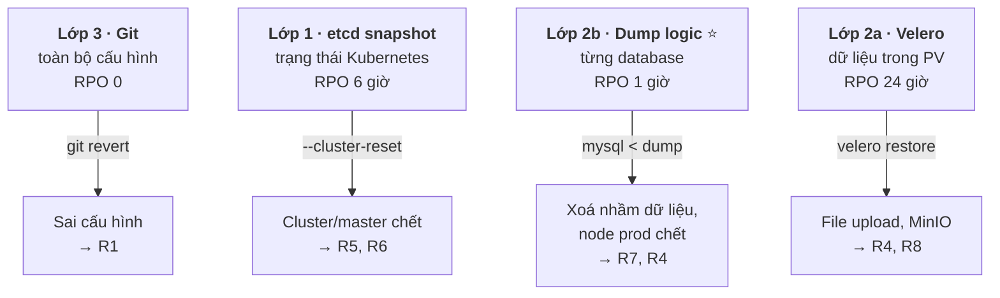

# Vận hành k3s — thiết kế cho 1 người

| | |
|---|---|
| **Trạng thái** | Bản nháp v2, chờ duyệt |
| **Ngày** | 12/09/2026 |
| **Mục tiêu** | Vận hành k3s với **1 người không làm DevOps toàn thời gian**, và khi hỏng thì phục hồi nhanh nhất có thể |
| **Topology** | `hnq-01` server (VPS) · `hnq-02` prod (local) · `hnq-03` dev (local) — join qua Tailscale, **không HA** |
| **Cơ sở** | Best practice cộng đồng — nguồn ở [cuối tài liệu](#nguồn-tham-khảo) |
| **Liên quan** | [REFACTOR_PLAN.md](./REFACTOR_PLAN.md) · [DISASTER_RECOVERY.md](./DISASTER_RECOVERY.md) · [SECRET_MANAGEMENT.md](./SECRET_MANAGEMENT.md) |

---

## Vì sao có tài liệu này

[REFACTOR_PLAN](./REFACTOR_PLAN.md) trả lời *"làm sao deploy service vào cluster"*. [DISASTER_RECOVERY](./DISASTER_RECOVERY.md) trả lời *"hỏng rồi thì làm gì"*. Tài liệu này trả lời câu ở giữa, và cũng là câu tốn thời gian nhất: **"làm sao sống chung với cluster mỗi ngày"** — xem cái gì đang hỏng, nâng cấp, backup, và **biết khi có sự cố mà không phải ngồi canh**.

Nguyên tắc xuyên suốt: **tối ưu cho người vận hành, không tối ưu cho hệ thống.** Với 1 người thì thời gian và sự tỉnh táo là tài nguyên khan hiếm nhất, không phải CPU.

Và một nguyên tắc riêng của bản v2: **giả định người vận hành sẽ có lúc không có mặt.** Mọi thứ trong tài liệu này phải trả lời được câu *"nếu tôi đang ngủ / đang đi đường / mất laptop thì sao?"*.

---

## Mục lục

- [1. Bảy quyết định vận hành](#1-bảy-quyết-định-vận-hành)
- [2. Kiến trúc cluster](#2-kiến-trúc-cluster)
- [3. Bộ công cụ dòng lệnh](#3-bộ-công-cụ-dòng-lệnh)
- [4. Truy cập cluster](#4-truy-cập-cluster)
- [5. Makefile — lệnh hằng ngày](#5-makefile--lệnh-hằng-ngày)
- [6. Giám sát và cảnh báo](#6-giám-sát-và-cảnh-báo)
- [7. Thông báo từ ArgoCD](#7-thông-báo-từ-argocd)
- [8. Nâng cấp k3s](#8-nâng-cấp-k3s)
- [9. Backup — bốn lớp](#9-backup--bốn-lớp)
- [10. Runbook](#10-runbook)
- [11. Lịch vận hành](#11-lịch-vận-hành)
- [12. Lộ trình triển khai](#12-lộ-trình-triển-khai)

---

## 1. Bảy quyết định vận hành

| # | Quyết định | Lý do |
|---|---|---|
| **V1** | **Cài k3s bằng `--cluster-init` (embedded etcd)**, dù chỉ có 1 server và không có ý định HA | **Không phải để HA** ([vì sao không HA](./REFACTOR_PLAN.md#23-vì-sao-không-ha-là-lựa-chọn-đúng-ở-đây)), mà vì etcd có sẵn snapshot theo lịch + upload S3 + `--cluster-reset-restore-path`. Với SQLite thì phải tự viết cron, tự viết upload, tự viết restore — nhiều việc hơn, và là việc mình phải tự debug lúc đang sự cố. Đổi SQLite → etcd sau này là **cài lại cluster**. |
| **V2** | **k9s là công cụ chính hằng ngày**, không phải `kubectl` thuần | Một màn hình thấy hết pod, log, event, resource. Tiết kiệm nhiều thời gian nhất trong mọi thứ ở tài liệu này. |
| **V3** | **kubeconfig `chmod 600` qua Tailscale, KHÔNG cài Tailscale Operator** | Đảo lại quyết định bản v1. Operator giải bài toán "nhiều người, nhiều máy, nhiều credential" — bài toán này không tồn tại với 1 người. Đổi lại nó đặt thêm một thành phần **giữa bạn và apiserver**, và thành phần đó hỏng là không vào được cluster đúng lúc cần nhất. Xem [Phần 4](#4-truy-cập-cluster). |
| **V4** | **Tối đa 8 alert, mỗi alert phải có hành động rõ ràng** | Cộng đồng khuyến nghị 5–10. Nhiều hơn là bắt đầu bỏ qua, và lúc đó cảnh báo thật cũng bị bỏ qua theo. |
| **V5** | **Nâng cấp k3s bằng GitOps** (`system-upgrade-controller` + Plan ghim version) | Nâng cấp = PR đổi một dòng. Có review, có lịch sử, quay lui bằng `git revert`. |
| **V6** | **etcd snapshot đi ra ngoài cluster, lên R2** | Backup cluster vào chính storage của cluster là vòng lặp vô nghĩa khi cluster chết. |
| **V7** | **Dead man's switch bắt buộc**, không phải tuỳ chọn | Đây là quyết định mới và là quyết định quan trọng nhất của bản v2. Với 1 người, mọi cơ chế cảnh báo **nằm trong cluster** đều chết cùng cluster. Phải có một thứ **ngoài** hệ thống ping ngược lại bạn. Xem [6.4](#64-dead-mans-switch--thứ-quan-trọng-nhất-khi-chỉ-có-1-người). |

> Ba quyết định V1, V3, V7 đều đi theo cùng một logic: **đếm số thứ phải còn sống để bạn xử lý được sự cố, rồi làm số đó nhỏ nhất.**

---
## 2. Kiến trúc cluster

### 2.1. Quyết định không sửa lại được: datastore

k3s mặc định dùng **SQLite** — nhẹ, đơn giản, nhưng **không cluster được**, và quan trọng hơn ở đây: **không có cơ chế snapshot sẵn**.

Bản v1 chọn etcd để *"sau này lên HA"*. Bản này đã chốt là **không HA** ([REFACTOR_PLAN §2.3](./REFACTOR_PLAN.md#23-vì-sao-không-ha-là-lựa-chọn-đúng-ở-đây)) — nên lý do phải viết lại. Và lý do mới thậm chí mạnh hơn: **etcd cho bạn đường phục hồi sẵn có, SQLite thì phải tự làm.**

| | SQLite | Embedded etcd (chọn) |
|---|---|---|
| Snapshot theo lịch | Tự viết cron + `sqlite3 .backup` | `etcd-snapshot-schedule-cron` — có sẵn |
| Upload ra ngoài cluster | Tự viết `rclone` + tự xử lý lỗi | `etcd-s3: true` — có sẵn |
| Restore | Tự dừng k3s, tự copy file, tự mong là đúng | `--cluster-reset-restore-path`, có tài liệu chính thức, restore được **trực tiếp từ S3** |
| Restore lên máy khác | Không có quy trình chuẩn | Có — [R6](./DISASTER_RECOVERY.md#r6--vps-mất-hoàn-toàn-dựng-master-mới) |
| Tốn thêm | — | ~100–200 MB RAM, ghi đĩa nhiều hơn |

```bash
# ✅ Server đầu tiên — embedded etcd, dù chỉ có 1 server và không định HA
curl -sfL https://get.k3s.io | sh -s - server --cluster-init ...

# ❌ KHÔNG dùng mặc định (SQLite) — sẽ phải tự xây lại toàn bộ Phần 9
curl -sfL https://get.k3s.io | sh -
```

⚠️ **Không sửa lại được.** Đổi SQLite → etcd sau này là cài lại cluster từ đầu. Đây là quyết định đắt nhất trong cả ngày đầu tiên, và cũng là quyết định mất ít công nhất nếu làm đúng ngay.

Cấu hình đầy đủ ở [REFACTOR_PLAN Phụ lục B2](./REFACTOR_PLAN.md#phụ-lục-b--dựng-3-node-từ-máy-trắng).

### 2.2. Ba node, và cái gì chạy ở đâu

| Node | Kiểu | Nơi đặt | Chạy gì | Mất nó thì |
|---|---|---|---|---|
| `hnq-01` | server | VPS, có IP public | apiserver, etcd, ArgoCD, cert-manager, sealed-secrets, Velero controller | **Khách hàng không bị ảnh hưởng.** Mất `kubectl`, mất sync, mất scheduling. [R5](./DISASTER_RECOVERY.md#r5--etcd-hỏng-hoặc-apiserver-không-lên-đĩa-còn-nguyên)/[R6](./DISASTER_RECOVERY.md#r6--vps-mất-hoàn-toàn-dựng-master-mới) |
| `hnq-02` | agent | máy local | Toàn bộ `*-prod` + datastore prod, 1 replica Traefik/cloudflared/CoreDNS | Prod down. [R4](./DISASTER_RECOVERY.md#r4--node-prod-chết-node-dev-còn-sống) — 30 phút |
| `hnq-03` | agent | máy local | Toàn bộ `*-dev` + datastore dev, 1 replica Traefik/cloudflared/CoreDNS, **Prometheus + Grafana + Alertmanager** | Dev down + **mất monitoring**, prod vẫn chạy. [R3](./DISASTER_RECOVERY.md#r3--node-dev-chết) |

⚠️ **Monitoring đặt trên `hnq-03` (node dev)** — không trên master, và cũng không trên node prod. Cả hai lựa chọn kia đều sai theo cùng một kiểu:

| Đặt ở | Vấn đề |
|---|---|
| `hnq-01` (master) | Mất master là **mất luôn khả năng biết mình mất master** |
| `hnq-02` (prod) | Node prod chết là mất monitoring **đúng lúc đang có sự cố prod** — tức là mất nó đúng lúc cần nó nhất |
| `hnq-03` (dev) ✅ | Mất nó khi node dev chết — trường hợp ít nghiêm trọng nhất. Và khi phải dời prod sang `hnq-03` ([R4](./DISASTER_RECOVERY.md#r4--node-prod-chết-node-dev-còn-sống)) thì dev đã scale về 0, có đủ chỗ cho cả prod lẫn monitoring |

> Giới hạn cần biết: khi apiserver chết, Prometheus mất service discovery và sẽ dần không biết target mới. Nó vẫn scrape được target đã biết trong một lúc, nhưng đừng coi đây là giải pháp đầy đủ — thứ **bảo đảm** bạn biết là [dead man's switch](#64-dead-mans-switch--thứ-quan-trọng-nhất-khi-chỉ-có-1-người).

### 2.3. Gắn nhãn node ngay khi cài

```bash
kubectl label node hnq-01 hnq.dev/role=control-plane
kubectl label node hnq-02 hnq.dev/env-prod=true hnq.dev/storage=true hnq.dev/edge=true
kubectl label node hnq-03 hnq.dev/env-dev=true  hnq.dev/storage=true hnq.dev/edge=true
```

Values trong repo tham chiếu **nhãn**, không tham chiếu hostname — đổi hoặc thêm node không phải sửa file nào. Đây là quyết định Q6 của [REFACTOR_PLAN](./REFACTOR_PLAN.md#1-tám-quyết-định-nền-tảng), và nhãn dạng boolean là để [R4](./DISASTER_RECOVERY.md#r4--node-prod-chết-node-dev-còn-sống) gọn lại thành một lệnh — [lý do đầy đủ](./REFACTOR_PLAN.md#101-gắn-label-cho-node).

### 2.4. Add-on của k3s — quyết định có ý thức

k3s cài sẵn Traefik, ServiceLB, local-path, metrics-server. Giữ hết, nhưng **cấu hình lại 3 trong 4 cái**:

| Add-on | Giữ? | Phải cấu hình lại |
|---|---|---|
| **Traefik** | ✅ | 2 replica + antiAffinity + `nodeSelector: hnq.dev/edge` — [REFACTOR_PLAN §10.7](./REFACTOR_PLAN.md#107-ghim-đường-dữ-liệu-lên-2-node-local) |
| **ServiceLB** | ✅ | Chỉ chạy trên `hnq-01` (node duy nhất có IP public) — xem dưới |
| **local-path** | ✅ | Thêm StorageClass `hnq-local` với `reclaimPolicy: Retain` — [REFACTOR_PLAN §10.4](./REFACTOR_PLAN.md#104-storageclass-hnq-local) |
| **metrics-server** | ✅ | Không cần sửa |
| **CoreDNS** | ✅ | 2 replica trên 2 node local |

ServiceLB mặc định chạy `svclb-*` trên **mọi** node. Với 2 node local nằm sau NAT, những pod đó không publish được gì — chỉ chiếm chỗ và thêm một thứ nữa để nhìn nhầm lúc debug. Cách hạn chế là gắn nhãn `svccontroller.k3s.cattle.io/enablelb` cho node được phép; khi có ít nhất một node mang nhãn này thì **chỉ node đó đủ điều kiện**:

```bash
kubectl label node hnq-01 svccontroller.k3s.cattle.io/enablelb=true
kubectl -n kube-system get pod -l svccontroller.k3s.cattle.io/svcname -o wide
# → chỉ được thấy pod trên hnq-01
```

```yaml
# /etc/rancher/k3s/config.yaml — phần add-on
# Giữ Traefik (dùng làm ingress), giữ local-path, giữ metrics-server.
# disable:
#   - traefik          # chỉ tắt nếu tự cài ingress controller khác

etcd-snapshot-schedule-cron: "0 */6 * * *"
etcd-snapshot-retention: 20
```

### 2.5. Tailscale làm mạng cluster — ba chỗ hay sai

Cả 3 node join cluster qua tailnet (`flannel-iface: tailscale0`), nên pod network chạy **trên** Tailscale. Cách này đang chạy ổn ở hệ thống cũ, nhưng có ba chỗ sai thì rất khó đoán về sau.

**(1) MTU — chỗ sai tệ nhất.** `tailscale0` có MTU 1280; flannel vxlan trừ thêm phần header nên MTU pod còn khoảng 1230. Nếu MTU bị đặt sai (thường vì đổi `flannel-iface` sau khi cluster đã chạy), triệu chứng **không giống lỗi mạng**: request nhỏ chạy bình thường, request lớn hoặc TLS handshake treo vô thời hạn. Rất nhiều giờ đã bị đốt vào việc đi tìm bug ở tầng ứng dụng.

```bash
ssh hnq-02 'cat /run/flannel/subnet.env'     # ghi lại FLANNEL_MTU, phải ~1230
# Kiểm thật: ping giữa 2 pod trên 2 node khác nhau, cấm phân mảnh
kubectl run nettest --image=nicolaka/netshoot -it --rm -- \
  sh -c 'ping -M do -s 1400 <IP pod node khác>; ping -M do -s 1180 <IP pod node khác>'
# ĐÚNG: -s 1400 báo "message too long", -s 1180 chạy được.
# SAI:  -s 1400 chạy được → MTU đang sai, sửa trước khi đưa workload vào.
```

**(2) Kết nối đi qua DERP relay thay vì direct.** Khi NAT chặn, Tailscale vẫn hoạt động nhưng đi qua relay của họ — chậm hơn nhiều, và đủ để làm kubelet timeout lúc cao điểm.

```bash
tailscale ping hnq-02      # phải thấy "direct", không phải "via DERP"
```

Nếu ra relay: mở UDP `41641` ở nơi đặt máy local, hoặc bật UPnP/NAT-PMP trên router.

**(3) Node `NotReady` mà máy vẫn sống.** Đặc trưng của topology này và **rất dễ xử lý sai** — chi tiết và cái không được làm ở [R9](./DISASTER_RECOVERY.md#r9--tailnet-sự-cố-node-notready-nhưng-pod-vẫn-chạy).

> **Cách khác:** k3s ≥ 1.27 có tích hợp Tailscale sẵn (`--vpn-auth`), tự đặt `node-ip` và `flannel-iface`. Gọn hơn khi cài, nhưng ít nhìn thấy hơn khi debug. Kế hoạch chọn cấu hình tường minh — xem [REFACTOR_PLAN Phụ lục B3](./REFACTOR_PLAN.md#phụ-lục-b--dựng-3-node-từ-máy-trắng).

---
## 3. Bộ công cụ dòng lệnh

Đây là phần có tỷ lệ **giá trị / công sức cao nhất trong toàn bộ tài liệu**. Cài một lần, dùng mỗi ngày.

### 3.1. Bốn công cụ cộng đồng dùng nhiều nhất

| Công cụ | Làm gì | Vì sao cần |
|---|---|---|
| **k9s** | Giao diện terminal cho toàn cluster | Thấy pod, log, event, resource usage trong một màn hình. Thay được ~80% lệnh `kubectl` gõ hằng ngày. |
| **stern** | Xem log nhiều pod cùng lúc | `stern backend` gom log mọi replica, tô màu theo pod. Debug nhanh hơn hẳn `kubectl logs`. |
| **kubectx / kubens** | Đổi context và namespace | Gõ `kubens lotus-clinic-prod` thay vì `-n lotus-clinic-prod` mọi lệnh |
| **krew** | Trình quản lý plugin `kubectl` | Cổng vào các plugin bên dưới |

> kubectx/kubens có hơn 19.000 sao GitHub và *"được cài sẵn trên máy của hầu hết kỹ sư"*. k9s và stern cùng nhau *"phủ phần lớn nhu cầu quan sát cluster và gom log theo thời gian thực mà không cần dựng thêm hạ tầng gì"*.

### 3.2. Script cài — chạy trên **máy chính và máy phụ**

```bash
#!/usr/bin/env bash
# scripts/setup-workstation.sh
set -euo pipefail

echo "→ krew (trình quản lý plugin kubectl)"
(
  set -x; cd "$(mktemp -d)"
  OS="$(uname | tr '[:upper:]' '[:lower:]')"
  ARCH="$(uname -m | sed -e 's/x86_64/amd64/' -e 's/aarch64/arm64/')"
  curl -fsSLO "https://github.com/kubernetes-sigs/krew/releases/latest/download/krew-${OS}_${ARCH}.tar.gz"
  tar zxvf "krew-${OS}_${ARCH}.tar.gz"
  "./krew-${OS}_${ARCH}" install krew
)
export PATH="${KREW_ROOT:-$HOME/.krew}/bin:$PATH"

echo "→ Công cụ chính"
brew install k9s stern kubectx helm kubeconform yq jq 2>/dev/null || {
  # Linux
  curl -sS https://webi.sh/k9s | sh
  curl -sS https://webi.sh/stern | sh
}

echo "→ Plugin kubectl"
kubectl krew install \
  ctx ns         `# đổi context / namespace` \
  tree           `# xem cây quan hệ resource — rất hữu ích khi debug ArgoCD` \
  neat           `# bỏ field thừa khi xem YAML` \
  df-pv          `# xem dung lượng PV còn lại` \
  images         `# liệt kê image mọi pod đang chạy` \
  resource-capacity  `# so request/limit với dung lượng node`

cat <<'RC' >> ~/.bashrc
# ── Kubernetes ──
export PATH="${KREW_ROOT:-$HOME/.krew}/bin:$PATH"
alias k=kubectl
alias kx=kubectx
alias kn=kubens
source <(kubectl completion bash)
complete -o default -F __start_kubectl k
RC

echo "✅ Xong. Mở terminal mới rồi gõ 'k9s'."
```

### 3.3. Phím tắt k9s cần thuộc

Học 10 phím này là đủ cho 90% công việc:

| Phím | Việc |
|---|---|
| `:pod` `:svc` `:ing` `:app` | Nhảy tới loại resource *(`:app` = ArgoCD Application)* |
| `0` … `9` | Lọc theo namespace |
| `/` | Tìm kiếm |
| `l` | Xem log pod đang chọn |
| `d` | `describe` |
| `y` | Xem YAML |
| `s` | Mở shell vào container |
| `Ctrl-d` | Xoá resource |
| `Shift-c` / `Shift-m` | Sắp xếp theo CPU / RAM |
| `:pulse` | Tổng quan sức khoẻ cluster |

> Dành 30 phút buổi đầu để học k9s. Đây là khoản đầu tư hoàn vốn trong tuần đầu tiên — và là thứ bạn sẽ mở đầu tiên trong mọi sự cố về sau.
>
> ⚠️ Chạy script này trên **cả máy phụ** ([4.3](#43-máy-phụ--bắt-buộc-không-phải-tuỳ-chọn)). Máy phụ không có công cụ là máy phụ không dùng được.

### 3.4. Plugin `kubectl tree` — đáng nhắc riêng

Khi ArgoCD báo một Application `Degraded` mà không rõ vì sao:

```bash
kubectl tree deployment backend -n lotus-clinic-prod
# NAMESPACE          NAME                      READY  REASON
# lotus-clinic-prod  Deployment/backend        -
# lotus-clinic-prod  └─ReplicaSet/backend-7d4  -
# lotus-clinic-prod    └─Pod/backend-7d4-x2k9p False  ContainersNotReady
```

Thấy ngay chuỗi quan hệ cha–con và chỗ đứt.

---

## 4. Truy cập cluster

### 4.1. Đảo lại quyết định của bản v1

Bản v1 khuyến nghị Tailscale Kubernetes Operator, với lý do: *"mỗi kubeconfig là một credential tĩnh dùng chung; 3 người × nhiều máy = nhiều bản sao không kiểm soát được."*

Lý do đó **đúng cho 3 người và sai cho 1 người**. Bài toán Operator giải quyết là *"nhiều danh tính, nhiều thiết bị, cần RBAC theo từng người, cần thu hồi khi có người rời đội"*. Không có bài toán nào trong đó tồn tại ở đây.

Còn cái giá thì vẫn nguyên: Operator là một Deployment nằm **giữa bạn và apiserver**. Nó chết, hoặc OAuth client của nó hết hạn, là bạn không `kubectl` được — đúng lúc bạn cần nhất.

| | Tailscale Operator | kubeconfig qua tailnet (chọn) |
|---|---|---|
| Số thứ phải sống để `kubectl` được | apiserver + Operator + Tailscale OAuth | apiserver + Tailscale |
| Danh tính theo người | ✅ | ❌ — không cần, chỉ có 1 người |
| Thu hồi khi có người rời đội | ✅ | ❌ — không có ai để thu hồi |
| API server lộ ra internet | ✅ Không | ✅ Không — apiserver bind vào IP Tailscale |
| Debug được lúc sự cố | Phải hiểu thêm 1 thành phần | SSH vào `hnq-01` là xong |

**Xét lại khi nào:** có người thứ hai vào cluster. Lúc đó Operator là câu trả lời đúng, và cài mất khoảng 1 giờ.

### 4.2. Cấu hình tối thiểu, và nó thật sự đủ

```bash
# Trên hnq-01: k3s đã bind apiserver vào IP Tailscale (node-ip), nên kubeconfig
# lấy về là dùng được từ bất cứ máy nào trong tailnet — không mở port ra internet.
ssh hnq-01 'sudo cat /etc/rancher/k3s/k3s.yaml' > ~/.kube/config-hnq
chmod 600 ~/.kube/config-hnq

# ⚠️ Đổi server sang TÊN MagicDNS, không để IP.
# Lý do: khi phải dựng VPS mới (R6), IP đổi nhưng tên thì không.
sed -i 's|server: https://127.0.0.1:6443|server: https://hnq-01.<tailnet>.ts.net:6443|' \
  ~/.kube/config-hnq

export KUBECONFIG=~/.kube/config-hnq
kubectl get nodes
```

Bốn quy tắc, không có ngoại lệ:

- `--write-kubeconfig-mode=600` trên server (mặc định k3s là `644` — ai trên máy đó cũng đọc được)
- `chmod 600` cho file trên máy bạn
- **Không commit kubeconfig** vào bất kỳ repo nào, kể cả private
- **Không để kubeconfig trong thư mục đồng bộ cloud** (Dropbox, iCloud, Google Drive)

### 4.3. Máy phụ — bắt buộc, không phải tuỳ chọn

Với 1 người, *"laptop chết"* và *"hệ thống không ai vận hành được"* là **cùng một sự cố** nếu chỉ có một máy cấu hình sẵn.

Máy phụ (máy bàn, hoặc một máy local ngay tại chỗ) phải có đủ:

- [ ] Tailscale, đã join tailnet
- [ ] `~/.kube/config-hnq`, `chmod 600`
- [ ] `git clone` repo này
- [ ] `scripts/setup-workstation.sh` đã chạy (k9s, stern, kubectx, krew)
- [ ] Đăng nhập được password manager (nơi có [recovery kit](./DISASTER_RECOVERY.md#2-recovery-kit--ba-thứ-phải-luôn-có))
- [ ] SSH key vào cả 3 node

**Kiểm 6 tháng một lần**, cùng dịp diễn tập — vì máy phụ không dùng thường xuyên là máy phụ âm thầm hết hạn.

### 4.4. Đường break-glass khi kubectl không dùng được

Thứ tự thử, từ rẻ tới đắt:

| Bậc | Cách | Khi nào |
|---|---|---|
| 1 | `kubectl` từ máy chính | Bình thường |
| 2 | `kubectl` từ máy phụ | Máy chính chết |
| 3 | `ssh hnq-01` rồi `sudo k3s kubectl ...` | Tailscale trên máy bạn có vấn đề, hoặc kubeconfig sai |
| 4 | SSH vào `hnq-02` / `hnq-03`, dùng `sudo crictl ps` / `crictl logs` | apiserver chết hẳn — vẫn xem và restart được container ([R5](./DISASTER_RECOVERY.md#r5--etcd-hỏng-hoặc-apiserver-không-lên-đĩa-còn-nguyên)) |
| 5 | Console của nhà cung cấp VPS | Tailscale trên `hnq-01` chết → không SSH được |

⚠️ **Bậc 5 phải thử trước khi cần tới nó.** Nhiều người phát hiện console/VNC của nhà cung cấp cần xác thực 2 lớp bằng số điện thoại đã đổi — đúng lúc đang sự cố. Đăng nhập thử một lần ở P0, và lưu cách vào vào password manager.

### 4.5. RBAC — 2 nhóm sẵn, dù giờ chỉ có 1 người

```yaml
# Toàn quyền — hiện tại chỉ có bạn
apiVersion: rbac.authorization.k8s.io/v1
kind: ClusterRoleBinding
metadata:
  name: team-admin
roleRef: { apiGroup: rbac.authorization.k8s.io, kind: ClusterRole, name: cluster-admin }
subjects:
  - { apiGroup: rbac.authorization.k8s.io, kind: Group, name: "tailnet:infra" }
---
# Chỉ đọc — chỗ để sẵn cho người thứ hai
apiVersion: rbac.authorization.k8s.io/v1
kind: ClusterRoleBinding
metadata:
  name: team-readonly
roleRef: { apiGroup: rbac.authorization.k8s.io, kind: ClusterRole, name: view }
subjects:
  - { apiGroup: rbac.authorization.k8s.io, kind: Group, name: "tailnet:team" }
```

> Hai file này chưa dùng tới khi chỉ có 1 người (kubeconfig của k3s là `cluster-admin` sẵn). Vẫn commit vào repo để khi có người thứ hai thì đã có chỗ đặt — và lúc đó bật Tailscale Operator là RBAC này có tác dụng ngay.

---
## 5. Makefile — lệnh hằng ngày

Gói những thứ hay gõ thành lệnh ngắn, ai cũng nhớ được:

```makefile
ENV ?= dev

.PHONY: help status logs sh top events sync diff pending drift snapshot kit-check dr

help:            ## Danh sách lệnh
	@grep -E '^[a-zA-Z_-]+:.*?## .*$$' $(MAKEFILE_LIST) | \
	  awk 'BEGIN {FS=":.*?## "}; {printf "  \033[36m%-12s\033[0m %s\n", $$1, $$2}'

status:          ## Bảng service: tag dev ↔ prod ↔ trạng thái ArgoCD
	@scripts/status.sh

pending:         ## Service nào ở dev đang chờ lên prod
	@scripts/status.sh --pending-only

logs:            ## Log của service: make logs SVC=lotus-clinic ENV=prod
	@stern -n $(SVC)-$(ENV) . --tail 100

sh:              ## Mở shell: make sh SVC=lotus-clinic ENV=dev
	@kubectl -n $(SVC)-$(ENV) exec -it \
	  $$(kubectl -n $(SVC)-$(ENV) get pod -o name | head -1) -- sh

top:             ## Node và pod đang ăn tài nguyên nhất
	@kubectl top nodes
	@echo && kubectl top pods -A --sort-by=memory | head -15

events:          ## Event bất thường gần đây toàn cluster
	@kubectl get events -A --sort-by=.lastTimestamp \
	  --field-selector type!=Normal | tail -30

drift:           ## Cái gì lệch Git + đường dữ liệu có còn dự phòng không
	@scripts/drift.sh

sync:            ## Ép ArgoCD sync: make sync SVC=lotus-clinic ENV=dev
	@argocd app sync $(SVC)-$(ENV)

snapshot:        ## etcd snapshot ngay — CHẠY TRƯỚC MỌI VIỆC NGUY HIỂM
	@ssh hnq-01 'sudo k3s etcd-snapshot save --name manual-$$(date +%Y%m%d-%H%M)'

kit-check:       ## Recovery kit còn đủ và còn dùng được? (hằng tháng)
	@scripts/dr/kit-check.sh

dr:              ## Mở quy trình phục hồi — gõ cái này khi đang sự cố
	@echo "→ docs/DISASTER_RECOVERY.md · phần '60 giây đầu tiên'"
	@sed -n '/## 1. 60 giây đầu tiên/,/## 2. Recovery kit/p' docs/DISASTER_RECOVERY.md
```

Bốn lệnh đáng thuộc nằm lòng: **`make drift`** (hằng tuần), **`make snapshot`** (trước mọi việc nguy hiểm), **`make kit-check`** (hằng tháng), **`make dr`** (lúc đang sự cố, khi không nhớ nổi phải làm gì).

⚠️ `make snapshot` chạy qua `ssh hnq-01` chứ không chạy local — etcd chỉ có trên server. Và nó dùng **tên MagicDNS**, nên khi thay VPS thì Makefile không phải sửa.

### `scripts/status.sh` — thứ ArgoCD UI không có

Bảng so tag dev ↔ prod. Đây chính là khoảng trống mà tôi từng định giải bằng một web API:

```bash
#!/usr/bin/env bash
# scripts/status.sh [--pending-only]
set -euo pipefail
PENDING_ONLY="${1:-}"

printf "%-22s %-12s %-12s %-10s %s\n" SERVICE DEV PROD PENDING ARGOCD
printf '%.0s─' {1..78}; echo

for f in registry/apps/*/service.yaml; do
  name=$(basename "$(dirname "$f")")
  dev=$(yq -r '.image.tag // "-"'  "registry/apps/$name/values-dev.yaml"  2>/dev/null || echo -)
  prod=$(yq -r '.image.tag // "-"' "registry/apps/$name/values-prod.yaml" 2>/dev/null || echo -)

  pending="-"
  [ "$dev" != "$prod" ] && [ "$prod" != "-" ] && pending="⬆ CHỜ"
  [ "$prod" = "-" ]     && pending="dev-only"
  [ "$PENDING_ONLY" = "--pending-only" ] && [ "$pending" = "-" ] && continue

  argo=$(kubectl -n argocd get app "$name-prod" \
          -o jsonpath='{.status.sync.status}/{.status.health.status}' 2>/dev/null || echo "-")

  printf "%-22s %-12s %-12s %-10s %s\n" "$name" "$dev" "$prod" "$pending" "$argo"
done
```

```
SERVICE                DEV          PROD         PENDING    ARGOCD
──────────────────────────────────────────────────────────────────
lotus-clinic           7bcd1234     f1eb557d     ⬆ CHỜ      Synced/Healthy
giaan-clinic           a3f9021c     a3f9021c     -          Synced/Healthy
hocmon-clinic          bb17e4d2     -            dev-only   -
storage-mariadb        11.4.3       11.4.3       -          Synced/Healthy
```

~30 dòng bash, thay cho endpoint `GET /promotions` và cả một web app.

---

## 6. Giám sát và cảnh báo

### 6.1. Chọn stack

| | kube-prometheus-stack | VictoriaMetrics k8s-stack |
|---|---|---|
| Mức phổ biến | Mặc định của cộng đồng | Đang tăng |
| Tài nguyên | Nặng hơn | Nhẹ hơn rõ rệt |
| Tài liệu, StackOverflow | Rất nhiều | Ít hơn |
| Tương thích | — | Drop-in replacement |

> *"kube-prometheus-stack deploys everything you need in one Helm chart... for most teams under 500 nodes, this is the right answer."*

**Khuyến nghị: kube-prometheus-stack.** Với 1 người, việc tra được lỗi trên Google quan trọng hơn tiết kiệm vài trăm MB RAM — và nó có sẵn alert `Watchdog` mà [6.4](#64-dead-mans-switch--thứ-quan-trọng-nhất-khi-chỉ-có-1-người) cần. VictoriaMetrics chỉ xét lại nếu Prometheus thật sự ăn hết tài nguyên node — và vì nó tương thích ngược, đổi sau không đau.

### 6.2. Tám alert — không hơn

Đây là phần quan trọng nhất của mục này.

> *"Start with 5-10 essential alerts where every alert must have a clear action, and if the response is 'look at it later', it should be a warning, not critical."*

Với 1 người không có ca trực, **alert bị bỏ qua là alert vô dụng** — và tệ hơn, nó làm bạn bỏ qua cả alert thật. Ngưỡng chịu đựng ở đây thấp hơn đội 3 người: 8 là trần, không phải mục tiêu.

| # | Alert | Ngưỡng | Hành động ngay |
|---|---|---|---|
| 1 | **Pod restart liên tục** | `CrashLoopBackOff` > 5 phút | `make logs SVC=x ENV=y` |
| 2 | **Deployment không đủ replica** | ready < desired, > 10 phút | Xem event, xem node còn chỗ không |
| 3 | **Node không sẵn sàng** | `NotReady` > 5 phút | SSH vào node, kiểm tra `k3s` service |
| 4 | **Đĩa sắp đầy** | > 85% | Dọn image cũ: `k3s crictl rmi --prune` |
| 5 | **PV sắp đầy** | > 85% | Mở rộng hoặc dọn dữ liệu |
| 6 | **Chứng chỉ TLS sắp hết hạn** | < 14 ngày | Kiểm tra cert-manager, kiểm tra DNS |
| 7 | **ArgoCD Application lệch** | `OutOfSync` > 30 phút | `make drift` xem ai sửa tay |
| 8 | **Backup thất bại** | Velero hoặc etcd snapshot lỗi | Xử lý ngay — đây là lưới an toàn cuối |

Mọi thứ khác vào Grafana để xem khi cần, **không gửi thông báo**.

```yaml
# Ví dụ 2 rule, phần còn lại theo cùng khuôn
groups:
  - name: hnq-critical
    rules:
      - alert: PodCrashLooping
        expr: rate(kube_pod_container_status_restarts_total[10m]) * 600 > 3
        for: 5m
        labels: { severity: critical }
        annotations:
          summary: "{{ $labels.namespace }}/{{ $labels.pod }} đang restart liên tục"
          action: "make logs SVC={{ $labels.namespace }}"

      - alert: CertExpiringSoon
        expr: (certmanager_certificate_expiration_timestamp_seconds - time()) / 86400 < 14
        for: 1h
        labels: { severity: warning }
        annotations:
          summary: "Chứng chỉ {{ $labels.name }} hết hạn sau {{ $value | humanize }} ngày"
          action: "kubectl describe certificate {{ $labels.name }} -n {{ $labels.namespace }}"
```

> **Trường `action` là bắt buộc** trong mọi rule. Nếu không viết nổi một hành động cụ thể thì alert đó không nên tồn tại — hãy để nó là dashboard.

### 6.3. Ba dashboard, không cần hơn

| Dashboard | Trả lời câu hỏi |
|---|---|
| **Cluster overview** | Node còn khoẻ không? CPU/RAM/đĩa còn bao nhiêu? |
| **Service overview** | Mỗi service: replica, restart, latency, error rate |
| **Storage** | PV nào sắp đầy? |

Dùng dashboard có sẵn của kube-prometheus-stack, đừng tự vẽ. Chỉ tự làm cái "Service overview" cho khớp nhãn của mình.

---

### 6.4. Dead man's switch — thứ quan trọng nhất khi chỉ có 1 người

Đây là quyết định V7, và là phần bổ sung quan trọng nhất của bản v2.

Mọi thứ ở [6.2](#62-tám-alert--không-hơn) có một lỗ hổng chung: **Alertmanager nằm trong cluster.** Nếu cluster chết, node chết, mất điện ở chỗ đặt máy, hoặc Prometheus bị OOM — thì thứ có nhiệm vụ báo cho bạn cũng chết theo, **và bạn không nhận được gì cả**. Với đội có ca trực thì sẽ có người phát hiện; với 1 người thì sự im lặng đó trông **giống hệt** như "mọi thứ đều ổn".

Cách chữa là đảo ngược chiều: thay vì chờ hệ thống báo khi có lỗi, **bắt hệ thống báo cáo là nó còn sống**, và để một dịch vụ **bên ngoài** kêu lên khi báo cáo đó ngừng tới.

`kube-prometheus-stack` có sẵn alert `Watchdog` — một alert **luôn luôn** firing, tồn tại đúng cho mục đích này.

```yaml
# values của kube-prometheus-stack
alertmanager:
  config:
    route:
      receiver: telegram
      routes:
        # Watchdog đi riêng, KHÔNG vào kênh chat — nó bắn liên tục
        - receiver: heartbeat
          matchers: [ 'alertname="Watchdog"' ]
          repeat_interval: 2m          # ngắn hơn grace period của dịch vụ ngoài
          group_wait: 0s
    receivers:
      - name: heartbeat
        webhook_configs:
          # healthchecks.io / Better Stack / cronitor — chọn cái nào cũng được
          - url: https://hc-ping.com/<uuid>
            send_resolved: false
      - name: telegram
        telegram_configs:
          - bot_token_file: /etc/alertmanager/secrets/telegram/token
            chat_id: -100xxxxxxxxx
```

Cấu hình phía dịch vụ ngoài: period 2 phút, grace 10 phút → **không nhận được ping trong 12 phút thì gửi thông báo đẩy về điện thoại và email.**

| Cái này bắt được | Alert trong cluster có bắt được? |
|---|---|
| Mất điện ở chỗ đặt 2 node local | ❌ |
| Mất internet ở chỗ đặt máy | ❌ |
| Node chạy Prometheus chết | ❌ |
| Prometheus bị OOM / đĩa đầy | ❌ |
| Cả cluster chết | ❌ |
| Alertmanager cấu hình sai và không gửi được gì | ❌ |

Sáu dòng đó là **chính xác những sự cố tệ nhất có thể xảy ra**, và không có cái nào được phủ bởi 8 alert ở 6.2. Chi phí: khoảng 15 phút cấu hình, và miễn phí ở gói cá nhân của mọi dịch vụ kể trên.

⚠️ **Phải kiểm thử, không được giả định.** Đây là mục bắt buộc của P5:

```bash
# Tắt Alertmanager và bấm giờ. Phải có thông báo về điện thoại trong ~12 phút.
kubectl -n monitoring scale deploy/alertmanager-kube-prometheus-stack --replicas=0
# → chờ, xác nhận điện thoại có thông báo, rồi:
kubectl -n monitoring scale deploy/alertmanager-kube-prometheus-stack --replicas=1
```

### 6.5. Thông báo phải tới được điện thoại

Với 1 người, một alert chỉ hiện trên màn hình laptop là một alert bị bỏ qua mỗi khi bạn không ở trước laptop — tức là phần lớn thời gian.

| Kênh | Dùng cho | Tới được điện thoại? |
|---|---|---|
| Telegram (kênh chung) | 8 alert ở 6.2 + ArgoCD + CI | ✅ — bật thông báo cho đúng kênh đó, và **chỉ** kênh đó |
| Dịch vụ heartbeat (6.4) | Hệ thống đã chết hoàn toàn | ✅ push + email + (tuỳ gói) gọi điện |
| Email | Bản sao lưu để tra lại | Chậm, nhưng còn khi Telegram lỗi |

⚠️ **Đừng dùng cùng một kênh Telegram cho alert và cho chat bình thường.** Kênh lẫn tin nhắn thường là kênh bị tắt thông báo sau hai tuần.

---
## 7. Thông báo từ ArgoCD

### 7.1. Chỉ báo khi có vấn đề

ArgoCD Notifications cài sẵn trong chart. Điểm mấu chốt là **cấu hình đúng trigger**:

> *"ArgoCD notifications can be configured to alert only on failed syncs and degraded health, reducing notification fatigue."*

Báo mỗi lần sync thành công nghe có vẻ hay, nhưng sau một tuần là không ai đọc nữa.

```yaml
# values của chart argo-cd
notifications:
  enabled: true

  secret:
    create: false
    name: argocd-notifications-secret    # SealedSecret chứa telegram-token

  notifiers:
    service.telegram: |
      token: $telegram-token

  templates:
    template.sync-failed: |
      message: |
        ❌ *{{.app.metadata.name}}* sync thất bại
        {{.app.status.operationState.message}}
        {{.context.argocdUrl}}/applications/{{.app.metadata.name}}
    template.health-degraded: |
      message: |
        ⚠️ *{{.app.metadata.name}}* đang Degraded
        {{.context.argocdUrl}}/applications/{{.app.metadata.name}}

  triggers:
    trigger.on-sync-failed: |
      - when: app.status.operationState.phase in ['Error', 'Failed']
        send: [sync-failed]
    trigger.on-health-degraded: |
      - when: app.status.health.status == 'Degraded'
        send: [health-degraded]

  subscriptions:
    - recipients: [telegram:-100xxxxxxxxx]
      triggers: [on-sync-failed, on-health-degraded]
```

### 7.2. Một kênh duy nhất

**Gửi hết vào một kênh chat** — Telegram hoặc Slack. Đừng chia kênh theo môi trường hay theo service: chia kênh chỉ có ý nghĩa khi có nhiều đội, còn ở đây nó chỉ làm bạn phải theo dõi nhiều chỗ.

⚠️ Kênh này phải **không lẫn tin nhắn thường** và phải bật thông báo đẩy về điện thoại — xem [6.5](#65-thông-báo-phải-tới-được-điện-thoại). Ngoại lệ duy nhất là `Watchdog`, đi ra dịch vụ heartbeat bên ngoài ([6.4](#64-dead-mans-switch--thứ-quan-trọng-nhất-khi-chỉ-có-1-người)).

Nguồn gửi vào kênh đó:

| Nguồn | Gửi gì |
|---|---|
| **ArgoCD** | Sync thất bại, Application `Degraded` |
| **Alertmanager** | 8 alert ở [Phần 6.2](#62-tám-alert--không-hơn) |
| **GitHub Actions** | CI hỏng trên `main` |
| **Velero** | Backup thất bại |

---

## 8. Nâng cấp k3s

### 8.1. Quy tắc bất di bất dịch

> *"Kubernetes supports upgrading one minor version at a time and should not skip minor versions (e.g., go 1.28 → 1.29 → 1.30, not 1.28 → 1.30)."*
>
> *"Always take an etcd backup before upgrading and test the upgrade process in a non-production environment first."*

Nhảy cóc minor version là cách nhanh nhất để hỏng cluster.

### 8.2. Nâng cấp bằng GitOps

`system-upgrade-controller` của Rancher đọc resource `Plan` — mà `Plan` là YAML, nên nó nằm trong repo và đi qua PR như mọi thứ khác:

```yaml
# registry/apps/k3s-upgrade/manifests/plan.yaml
apiVersion: upgrade.cattle.io/v1
kind: Plan
metadata:
  name: k3s-server
  namespace: system-upgrade
spec:
  concurrency: 1                       # từng node một
  cordon: true                         # cordon trước khi nâng
  nodeSelector:
    matchExpressions:
      - { key: node-role.kubernetes.io/control-plane, operator: In, values: ["true"] }
  serviceAccountName: system-upgrade
  upgrade:
    image: rancher/k3s-upgrade
  # ⚠️ GHIM version cụ thể — KHÔNG dùng channel: stable
  version: v1.31.5+k3s1
```

Nâng cấp trở thành: **PR đổi một dòng `version`**. Có review, có lịch sử, quay lui bằng `git revert`.

> **Vì sao ghim version thay vì `channel: stable`:** channel nghĩa là cluster tự nâng cấp lúc nào không biết, có thể đúng giờ cao điểm. Ghim version nghĩa là **bạn chọn thời điểm**.

### 8.3. Hai Plan, và thứ tự bắt buộc

Với 1 server + 2 agent thì cần **hai** Plan, và thứ tự giữa chúng không được đảo: **server trước, agent sau.** Agent chạy version mới hơn server là cấu hình không được hỗ trợ.

```yaml
# Plan thứ hai — agent, phụ thuộc Plan của server
apiVersion: upgrade.cattle.io/v1
kind: Plan
metadata:
  name: k3s-agent
  namespace: system-upgrade
spec:
  concurrency: 1                       # từng node một — hnq-02 rồi hnq-03
  cordon: true
  nodeSelector:
    matchExpressions:
      - { key: node-role.kubernetes.io/control-plane, operator: NotIn, values: ["true"] }
  prepare:
    image: rancher/k3s-upgrade
    args: ["prepare", "k3s-server"]     # ⚠️ chờ Plan server xong mới chạy
  serviceAccountName: system-upgrade
  upgrade:
    image: rancher/k3s-upgrade
  version: v1.31.5+k3s1                 # ⚠️ PHẢI khớp version của Plan server
```

⚠️ **`concurrency: 1` trên Plan agent là bắt buộc ở topology này.** Nâng cả 2 node local cùng lúc nghĩa là **cả 2 replica Traefik và cloudflared cùng xuống** — mất toàn bộ traffic khách hàng trong vài phút. Với `concurrency: 1` thì luôn còn một node phục vụ.

### 8.4. Quy trình mỗi lần nâng cấp

```bash
# 1. Snapshot trước — luôn luôn
make snapshot

# 2. Đọc release note, đặc biệt phần breaking changes
#    https://github.com/k3s-io/k3s/releases

# 3. PR đổi version trong CẢ HAI plan.yaml (nâng 1 minor một lần)

# 4. Merge → controller nâng hnq-01 trước, rồi hnq-02, rồi hnq-03

# 5. Kiểm tra
kubectl get nodes                     # version mới, đều Ready
make drift                            # không app nào lệch, đường dữ liệu đủ 2 replica
kubectl get pods -A | grep -v Running # không pod nào kẹt
```

> **Nâng cấp `hnq-01` có downtime control-plane vài phút** — apiserver restart. Workload không bị ảnh hưởng ([REFACTOR_PLAN §2.4](./REFACTOR_PLAN.md#24-đường-dữ-liệu-không-phụ-thuộc-master)), nhưng trong lúc đó không `kubectl` được và ArgoCD không sync được. Đây là lý do nâng cấp nên làm lúc rảnh, không phải lúc đang chờ deploy gì.

### 8.5. Nhịp độ

| Loại | Khi nào |
|---|---|
| Bản vá bảo mật (CVE cao) | Trong vòng 1 tuần |
| Bản vá thường (patch) | Hằng quý |
| Minor version | 6 tháng/lần, từng bước một |
| Chart bên thứ ba | Renovate tự mở PR, duyệt hằng tuần |

---

## 9. Backup — bốn lớp

> Quy trình **khôi phục** nằm ở [DISASTER_RECOVERY.md](./DISASTER_RECOVERY.md). Phần này chỉ nói **chuẩn bị gì để quy trình đó chạy được**.

### 9.1. Bốn lớp, bốn mục đích khác nhau



**Lớp 3 mạnh nhất và miễn phí** — nhờ GitOps, phần lớn "khôi phục" chỉ là `git revert` rồi để ArgoCD sync lại.

**Lớp 2b là bổ sung mới của bản v2**, và trong thực tế là lớp được dùng nhiều nhất. Lý do: sự cố dữ liệu thường gặp không phải "node cháy" mà là *"vừa chạy sai một câu UPDATE"*. Restore cả PV 50 GB để lấy lại một bảng là chậm hơn hàng chục lần một `mysqldump` 200 MB.

### 9.2. Lớp 1 — etcd snapshot

k3s có sẵn, kể cả phần upload S3:

```yaml
# /etc/rancher/k3s/config.yaml trên hnq-01
etcd-snapshot-schedule-cron: "0 */6 * * *"   # 6 giờ/lần
etcd-snapshot-retention: 20                   # ~5 ngày

# Upload thẳng lên object storage NGOÀI cluster (V6)
etcd-s3: true
etcd-s3-endpoint: "<account>.r2.cloudflarestorage.com"
etcd-s3-bucket: "hnq-etcd-snapshots"
etcd-s3-access-key: "..."
etcd-s3-secret-key: "..."
```

Vì sao **Cloudflare R2**:

- Snapshot nhỏ (vài MB) → gần như không tốn tiền ở quy mô này
- **Không thu phí egress** → lúc restore không phải nghĩ tới chi phí tải về
- k3s restore được **trực tiếp từ S3**, không cần tải thủ công ([R5](./DISASTER_RECOVERY.md#r5--etcd-hỏng-hoặc-apiserver-không-lên-đĩa-còn-nguyên))

⚠️ **Snapshot không có token là snapshot vô dụng.** Đây là món #2 của [recovery kit](./DISASTER_RECOVERY.md#2-recovery-kit--ba-thứ-phải-luôn-có) và là chỗ bị bỏ sót nhiều nhất. Kiểm bằng `make kit-check` hằng tháng.

Quy tắc **3-2-1** ở quy mô này: bản trên `hnq-01` + bản trên R2 + một bản tải về máy hằng tháng.

### 9.3. Lớp 2a — Velero, ghi trực tiếp vào R2

Bản v1 để Velero ghi vào MinIO trong cluster rồi `rclone sync` ra ngoài hằng tuần. Bỏ cách đó: nghĩa là backup **thật sự dùng được** có thể đã 7 ngày tuổi, và thêm hai thứ phải bảo trì (MinIO + job đồng bộ).

```yaml
backupStorageLocation:
  - name: r2
    provider: aws
    bucket: hnq-velero
    config:
      region: auto
      s3Url: https://<account>.r2.cloudflarestorage.com
      s3ForcePathStyle: "true"
      checksumAlgorithm: ""      # ⚠️ thiếu dòng này là upload lên R2 lỗi
```

| Phạm vi | Tần suất | Giữ |
|---|---|---|
| Namespace `*-prod` + PV | 1 ngày/lần | 30 ngày |
| Namespace `*-dev` | 1 tuần/lần | 7 ngày |
| Namespace `argocd` | — **không cần** | — |

⚠️ **Không cần backup `argocd` nữa** (khác bản v1). ArgoCD ở cấu hình này **không có PersistentVolume** — toàn bộ trạng thái của nó là CR trong etcd. Nên lớp 1 đã phủ hết. Đây là một trong những lợi ích của việc bỏ `redis-ha` ([REFACTOR_PLAN §8](./REFACTOR_PLAN.md#việc-phải-làm-ngay-khi-cài-argocd)).

> Băng thông là giới hạn thật ở đây: 2 node local upload PV qua internet nhà/văn phòng. Đo một lần lúc cấu hình, và nếu một backup đầy chạy quá vài giờ thì giảm phạm vi Velero xuống chỉ những PV **không** có dump logic (MinIO, OpenSearch) và dựa vào lớp 2b cho database.

### 9.4. Lớp 2b — dump logic hằng giờ

Chạy bằng CronJob trong cluster, ghi ra `/srv/k3s/dump/` rồi đẩy lên R2:

```yaml
# registry/apps/backup-dump/... — chạy trên node của chính datastore
schedule: "5 * * * *"          # phút thứ 5 mỗi giờ
nodeSelector: { hnq.dev/storage: "true" }
retention:
  local: 24h                   # 24 bản trên đĩa, để restore không cần mạng
  remote: 7d                   # 7 ngày trên R2
```

Repo cũ đã có `infra/scripts/mariadb_backup_restore.sh` và `minio_backup_restore.sh` — port sang `scripts/backup/`, bọc thành CronJob.

⚠️ **Giữ 24 bản trên đĩa local** là có chủ ý: khi phải restore mà mạng ra R2 đang chậm hoặc chính mạng là vấn đề, bản trên đĩa cho bạn restore ngay. Nó chỉ vô dụng đúng trong trường hợp mất cả node — và trường hợp đó đã có bản trên R2.

### 9.5. Diễn tập — bắt buộc

**Backup chưa từng khôi phục thử thì chưa phải backup** (P6 của [REFACTOR_PLAN](./REFACTOR_PLAN.md#sáu-nguyên-tắc)). Đây là câu nhàm nhưng vẫn là nguyên nhân số một khiến backup vô dụng đúng lúc cần.

Lịch, phạm vi và bảng ghi số đo ở [DISASTER_RECOVERY §4](./DISASTER_RECOVERY.md#4-diễn-tập). Điểm quan trọng nhất: **lần diễn tập đầu tiên phải là ở P0, khi cluster còn trống** — lúc đó phá cluster không mất gì.

---

## 10. Runbook

`docs/RUNBOOK.md` là tài liệu **quan trọng nhất** khi chỉ có 1 người. Với đội 3 người thì nó chống rủi ro *"chỉ một người biết cách xử lý"*. Với 1 người thì nó chống một rủi ro gần hơn và chắc chắn hơn: **bạn sẽ không nhớ.** Sự cố gặp cách đây 4 tháng, lúc 2 giờ sáng, bạn sẽ điều tra lại từ đầu — trừ khi lúc đó bạn đã viết 5 dòng.

### 10.1. Quy tắc

Mỗi lần gặp sự cố, **trước khi quên**, ghi 5 dòng:

```markdown
## 2026-09-20 — Pod backend CrashLoopBackOff sau khi đổi secret

**Triệu chứng:** lotus-clinic-prod, pod restart liên tục, log báo "access denied for user"
**Nguyên nhân:** đổi DB_PASSWORD trong SealedSecret nhưng pod chưa restart → vẫn dùng giá trị cũ
**Xử lý:** `kubectl -n lotus-clinic-prod rollout restart deploy/backend`
**Phòng ngừa:** annotation `hnq.dev/secret-checksum` đã có trong chart — lần này quên cập nhật
**Thời gian:** 25 phút
```

### 10.2. Khung có sẵn cho những sự cố hay gặp

Viết trước những mục này ở P6, kể cả khi chưa gặp. Bốn mục cuối là **đặc trưng của topology 3-node-qua-Tailscale** — không có trong runbook mẫu nào trên mạng, và đều là loại sự cố mất hàng giờ nếu gặp lần đầu mà không biết trước:

| Tình huống | Bước đầu tiên |
|---|---|
| Pod `CrashLoopBackOff` | `make logs SVC=x ENV=y` → đọc log, xem `kubectl describe pod` phần Events |
| Pod `Pending` mãi | `kubectl describe pod` → thường là hết tài nguyên, hoặc PV không gắn được node |
| ArgoCD `OutOfSync` không tự hết | `make drift` → xem có ai `kubectl edit` tay không; `argocd app diff` |
| Ingress trả 404 / 502 | Kiểm tra Service có endpoint không → `kubectl get endpointslice -n <ns>` |
| Chứng chỉ không cấp được | `kubectl describe certificate` → thường là DNS chưa trỏ, hoặc rate limit của Let's Encrypt |
| Node `NotReady` | ⚠️ **Máy sống hay chết?** `tailscale status` + SSH. Máy sống = [R9](./DISASTER_RECOVERY.md#r9--tailnet-sự-cố-node-notready-nhưng-pod-vẫn-chạy), **không** `delete node`. Máy chết = [R4](./DISASTER_RECOVERY.md#r4--node-prod-chết-node-dev-còn-sống)/[R3](./DISASTER_RECOVERY.md#r3--node-dev-chết) |
| Đĩa đầy | [R10](./DISASTER_RECOVERY.md#r10--đĩa-đầy) — `k3s crictl rmi --prune`, kiểm log không xoay vòng, `etcd-snapshot prune` |
| Database không kết nối được | Secret đúng chưa → pod đã restart sau khi đổi secret chưa → pod và DB có **cùng node** không? |
| `kubectl` timeout, apiserver không lên | [R5](./DISASTER_RECOVERY.md#r5--etcd-hỏng-hoặc-apiserver-không-lên-đĩa-còn-nguyên). Kiểm trước: khách hàng có bị ảnh hưởng không? Thường là **không** → không gấp |
| **Request nhỏ chạy, request lớn / TLS treo** | MTU pod network qua Tailscale ([2.5](#25-tailscale-làm-mạng-cluster--ba-chỗ-hay-sai)). Triệu chứng không giống lỗi mạng — nhớ mục này để khỏi mất 3 giờ tìm bug ở tầng ứng dụng |
| Pod `Pending` với `volume node affinity conflict` | PVC đang bind vào PV trên node khác. Sau [R4](./DISASTER_RECOVERY.md#r4--node-prod-chết-node-dev-còn-sống) thì đúng như dự kiến; ngoài ra là `nodeSelector` sai |
| Agent không join lại sau khi restore etcd | `Node password rejected` — xoá Secret `<node>.node-password.k3s` ([R5 bước 3](./DISASTER_RECOVERY.md#r5--etcd-hỏng-hoặc-apiserver-không-lên-đĩa-còn-nguyên)) |

### 10.3. Thay `ONBOARDING.md` bằng `BREAK_GLASS.md`

Bản v1 có `ONBOARDING.md` cho người mới vào đội. Khi chỉ có 1 người thì **không có ai để onboard** — nên tài liệu đó chưa cần viết. Cái cần viết là tài liệu ngược lại: **một trang cho người không biết Kubernetes, dùng khi không liên lạc được với bạn.**

Nội dung mẫu và lý do ở [REFACTOR_PLAN §14.1](./REFACTOR_PLAN.md#141-rủi-ro-lớn-nhất-một-người). Ba điểm quan trọng:

| | |
|---|---|
| **Viết cho ai** | Người không biết k8s — đồng nghiệp, người thân, một freelancer được gọi vào |
| **Trả lời đúng 3 câu** | Hệ thống ở đâu? Việc gì **không** được làm? Gọi ai / lấy recovery kit ở đâu? |
| **Đã có người đọc thử** | Tài liệu chưa ai đọc là tài liệu chưa biết là có dùng được — cho một người thật đọc một lần ở P6 |

> Viết `ONBOARDING.md` khi có người thứ hai. Lúc đó nội dung 6 bước của bản v1 vẫn đúng, chỉ thay bước 1 bằng cách lấy kubeconfig ở [4.2](#42-cấu-hình-tối-thiểu-và-nó-thật-sự-đủ).

---

## 11. Lịch vận hành

Với 1 người thì lịch phải **ngắn tới mức làm được cả lúc đang bận**. Mỗi dòng dưới đây đều đã bị cắt cho tới khi chỉ còn thứ không thay thế được bằng tự động hoá.

| Nhịp | Việc | Mất bao lâu | Nếu bỏ thì sao |
|---|---|---|---|
| **Hằng ngày** | Liếc kênh chat xem có alert không | 1 phút | Sự cố nhỏ thành sự cố lớn |
| **Hằng tuần** | Duyệt PR của Renovate | 15 phút | Tích nợ version, nâng cấp sau này đau hơn |
| | `make drift` — có ai sửa tay không, **và 3 thành phần đường dữ liệu có đủ 2 replica trên 2 node không** | 5 phút | Mất dự phòng mà không biết — xem dưới |
| | Xem dashboard đĩa và PV | 5 phút | [R10](./DISASTER_RECOVERY.md#r10--đĩa-đầy) lúc 2 giờ sáng |
| **Hằng tháng** | `make kit-check` | 5 phút | Snapshot có mà token không → [R8](./DISASTER_RECOVERY.md#r8--mất-toàn-bộ-cluster-dựng-lại-từ-số-không) 3 giờ thay vì [R6](./DISASTER_RECOVERY.md#r6--vps-mất-hoàn-toàn-dựng-master-mới) 45 phút |
| | Tải một bản etcd snapshot về máy (quy tắc 3-2-1) | 10 phút | Mất cả cluster lẫn R2 là mất hết |
| | Rà `docs/RUNBOOK.md`, bổ sung sự cố trong tháng | 20 phút | Điều tra lại từ đầu khi gặp lại sự cố cũ |
| **Hằng quý** | **Diễn tập** — 1 quy trình mỗi quý, luân phiên theo [bảng](./DISASTER_RECOVERY.md#4-diễn-tập) | 1–2 giờ | Đây là thứ **duy nhất** chứng minh các con số RTO là thật |
| | Nâng cấp k3s bản vá | 1 giờ | CVE tích tụ |
| | Backup lại sealing key + rà secret quá hạn xoay vòng | 30 phút | — |
| **6 tháng** | Kiểm **máy phụ** còn dùng được ([4.3](#43-máy-phụ--bắt-buộc-không-phải-tuỳ-chọn)) | 15 phút | Máy phụ hết hạn âm thầm = không có máy phụ |
| | Đăng nhập thử console của nhà cung cấp VPS ([4.4](#44-đường-break-glass-khi-kubectl-không-dùng-được)) | 10 phút | Phát hiện 2FA đã đổi số đúng lúc đang sự cố |

Tổng: khoảng **25 phút mỗi tuần**, cộng **nửa ngày mỗi quý**. Nếu vượt nhiều thì có chỗ nào đó đang quá phức tạp so với nhu cầu — đọc lại [REFACTOR_PLAN §13](./REFACTOR_PLAN.md#13-những-gì-cố-tình-không-làm).

### `make drift` — kiểm cả dự phòng, không chỉ kiểm lệch Git

Ở topology này, "mọi thứ Healthy" **không** có nghĩa là "còn dự phòng". Cả 2 replica Traefik có thể đang nằm chung một node mà ArgoCD vẫn báo xanh. Nên `drift.sh` kiểm cả hai việc:

```bash
#!/usr/bin/env bash
# scripts/drift.sh
set -euo pipefail

echo "── Application lệch khỏi Git"
kubectl -n argocd get applications.argoproj.io \
  -o custom-columns=NAME:.metadata.name,SYNC:.status.sync.status,HEALTH:.status.health.status \
  | grep -v 'Synced.*Healthy' || echo "  ✅ Mọi thứ khớp Git"

echo "── Đường dữ liệu: phải 2 pod, trên 2 node khác nhau, không có hnq-01"
for app in traefik cloudflared coredns; do
  NODES=$(kubectl get pod -A -l "app.kubernetes.io/name=$app" \
    -o jsonpath='{range .items[*]}{.spec.nodeName}{"\n"}{end}' | sort -u)
  N=$(echo "$NODES" | grep -c .)
  if [ "$N" -lt 2 ]; then
    echo "  ❌ $app chỉ trên $N node — KHÔNG CÒN DỰ PHÒNG: $(echo $NODES)"
  elif echo "$NODES" | grep -q hnq-01; then
    echo "  ⚠️  $app có replica trên hnq-01 (master) — sai nodeSelector"
  else
    echo "  ✅ $app: $(echo $NODES | tr '\n' ' ')"
  fi
done

echo "── Node"
kubectl get nodes -o custom-columns=\
NAME:.metadata.name,STATUS:.status.conditions[-1].type,VERSION:.status.nodeInfo.kubeletVersion
```

---

## 12. Lộ trình triển khai

Đan xen với các phase của [REFACTOR_PLAN §12](./REFACTOR_PLAN.md#12-lộ-trình), không phải làm thêm sau.

### P0 — cùng lúc dựng cluster

- [ ] Cài k3s với **`--cluster-init`** (V1) — [quyết định không sửa lại được](#21-quyết-định-không-sửa-lại-được-datastore)
- [ ] 2 agent join qua **tên MagicDNS** của master, không qua IP
- [ ] Gắn nhãn 3 node ([2.3](#23-gắn-nhãn-node-ngay-khi-cài)), tạo `/srv/k3s/{data,dump,snapshots}`
- [ ] **Kiểm MTU pod network** ([2.5](#25-tailscale-làm-mạng-cluster--ba-chỗ-hay-sai)) — làm trước khi đưa workload vào
- [ ] `tailscale ping` giữa 3 node phải là **direct**, không qua DERP
- [ ] ServiceLB chỉ trên `hnq-01` ([2.4](#24-add-on-của-k3s--quyết-định-có-ý-thức))
- [ ] `etcd-snapshot-schedule-cron` + upload **R2** (V6)
- [ ] **Cất k3s token vào password manager** — món #2 của recovery kit
- [ ] Chạy `scripts/setup-workstation.sh` trên **máy chính và máy phụ** ([4.3](#43-máy-phụ--bắt-buộc-không-phải-tuỳ-chọn))
- [ ] **Đăng nhập thử console nhà cung cấp VPS** ([4.4](#44-đường-break-glass-khi-kubectl-không-dùng-được)) — bậc 5, phải thử trước khi cần
- [ ] **30 phút học k9s**
- [ ] **Diễn tập [R5](./DISASTER_RECOVERY.md#r5--etcd-hỏng-hoặc-apiserver-không-lên-đĩa-còn-nguyên) + [R6](./DISASTER_RECOVERY.md#r6--vps-mất-hoàn-toàn-dựng-master-mới) ngay bây giờ, khi cluster còn trống**

### P3 — khi cấu hình đường dữ liệu

- [ ] Traefik 2 replica + cloudflared in-cluster + CoreDNS 2 replica
- [ ] `scripts/drift.sh` kiểm được cả phần dự phòng ([11](#make-drift--kiểm-cả-dự-phòng-không-chỉ-kiểm-lệch-git))
- [ ] **Thử tắt `hnq-01` 5 phút, xác nhận domain public vẫn trả 200**

### P5 — monitoring và lưới an toàn

- [ ] kube-prometheus-stack, **đặt trên `hnq-03`, không trên master và không trên node prod** ([2.2](#22-ba-node-và-cái-gì-chạy-ở-đâu))
- [ ] Đúng **8 alert**, mỗi cái có trường `action`
- [ ] **Dead man's switch + kiểm thử bằng cách tắt Alertmanager** ([6.4](#64-dead-mans-switch--thứ-quan-trọng-nhất-khi-chỉ-có-1-người)) — mục bắt buộc
- [ ] Thông báo tới được **điện thoại** ([6.5](#65-thông-báo-phải-tới-được-điện-thoại))
- [ ] ArgoCD Notifications → kênh chat, chỉ báo khi thất bại
- [ ] Velero → R2 (`checksumAlgorithm: ""`) + CronJob dump hằng giờ
- [ ] **Diễn tập [R7](./DISASTER_RECOVERY.md#r7--xoá-nhầm-dữ-liệu-trong-database)**
- [ ] 3 dashboard

### P6 — trước khi bật prod

- [ ] `system-upgrade-controller` + `Plan` ghim version
- [ ] `scripts/status.sh` + `scripts/drift.sh` + Makefile đầy đủ
- [ ] `docs/RUNBOOK.md` — viết trước 8 tình huống ở [10.2](#102-khung-có-sẵn-cho-những-sự-cố-hay-gặp)
- [ ] `docs/BREAK_GLASS.md` + **chia sẻ emergency access của password manager cho 1 người** ([REFACTOR_PLAN §14.1](./REFACTOR_PLAN.md#141-rủi-ro-lớn-nhất-một-người))
- [ ] **Diễn tập [R4](./DISASTER_RECOVERY.md#r4--node-prod-chết-node-dev-còn-sống)**

### Danh sách kiểm tra khi coi là xong

**Cluster**
- [ ] Cài bằng `--cluster-init` (kiểm: `kubectl get node` thấy role `etcd` trên `hnq-01`)
- [ ] 3 node đúng nhãn, không có values nào tham chiếu hostname
- [ ] MTU pod network đúng — `ping -M do -s 1400` giữa 2 node **phải lỗi**
- [ ] `tailscale ping` giữa 3 node là **direct**
- [ ] Không workload ứng dụng nào nằm trên `hnq-01`: `kubectl get pod -A -o wide | grep hnq-01` chỉ ra thành phần hệ thống
- [ ] etcd snapshot chạy tự động **và** có mặt trên R2

**Đường dữ liệu**
- [ ] Traefik, cloudflared, CoreDNS: mỗi cái 2 pod, 2 node local khác nhau
- [ ] Đã thử tắt `hnq-01` và domain public vẫn trả 200
- [ ] Không còn `cloudflared` chạy bằng systemd trên VPS

**Công cụ và truy cập**
- [ ] Máy chính **và** máy phụ đều có k9s, stern, kubectx, kubeconfig `chmod 600`
- [ ] `make status`, `make logs`, `make drift`, `make kit-check` chạy được
- [ ] Đã đăng nhập thử console nhà cung cấp VPS một lần

**Quan sát**
- [ ] Đúng 8 alert, mỗi cái có `action` cụ thể
- [ ] Monitoring **không** nằm trên master
- [ ] **Dead man's switch đã kiểm thử** — tắt Alertmanager thì điện thoại có thông báo
- [ ] ArgoCD chỉ báo khi thất bại, không báo mỗi lần sync
- [ ] Alert tới được điện thoại, ở một kênh không lẫn chat thường

**An toàn**
- [ ] Recovery kit đủ **3 món**, `make kit-check` xanh
- [ ] Đã restore thử etcd snapshot thành công **một lần** ([R5](./DISASTER_RECOVERY.md#r5--etcd-hỏng-hoặc-apiserver-không-lên-đĩa-còn-nguyên))
- [ ] Đã dựng thử master mới từ snapshot **một lần** ([R6](./DISASTER_RECOVERY.md#r6--vps-mất-hoàn-toàn-dựng-master-mới))
- [ ] Đã restore thử một database từ dump **một lần** ([R7](./DISASTER_RECOVERY.md#r7--xoá-nhầm-dữ-liệu-trong-database))
- [ ] Đã dời thử môi trường prod sang node khác **một lần** ([R4](./DISASTER_RECOVERY.md#r4--node-prod-chết-node-dev-còn-sống))
- [ ] Mọi ô "đo thực tế" trong [bảng diễn tập](./DISASTER_RECOVERY.md#4-diễn-tập) đã có số
- [ ] Nâng cấp k3s là PR đổi một dòng

**Con người**
- [ ] `RUNBOOK.md` có sẵn 8 tình huống
- [ ] `BREAK_GLASS.md` viết xong, và **một người khác đã đọc nó một lần**
- [ ] Một người khác truy cập được recovery kit trong password manager
- [ ] Bản PDF của `DISASTER_RECOVERY.md` có trong điện thoại

---
## Nguồn tham khảo

**Tài liệu chính thức**

- [k3s — Cluster Datastore](https://docs.k3s.io/datastore) · [Embedded etcd](https://docs.k3s.io/datastore/ha-embedded) · [Backup và Restore](https://docs.k3s.io/datastore/backup-restore)
- [k3s — Architecture](https://docs.k3s.io/architecture) (đăng ký node, node password) · [Networking / distributed multicloud](https://docs.k3s.io/networking/distributed-multicloud) (tích hợp Tailscale, `--vpn-auth`)
- [k3s — Volumes and Storage](https://docs.k3s.io/add-ons/storage) · [Service Load Balancer](https://docs.k3s.io/networking/networking-services) (nhãn `enablelb`)
- [k3s — Automated upgrades](https://docs.k3s.io/upgrades/automated) (Plan cho server và agent)

**Công cụ**

- [k9s](https://k9scli.io/) · [stern](https://github.com/stern/stern) · [kubectx/kubens](https://github.com/ahmetb/kubectx) · [krew](https://krew.sigs.k8s.io/)
- [system-upgrade-controller](https://github.com/rancher/system-upgrade-controller) · [Velero](https://velero.io/)
- [Prometheus Watchdog / dead man's switch](https://prometheus.io/docs/alerting/latest/configuration/#webhook_config) · [healthchecks.io](https://healthchecks.io/)

**Best practice cộng đồng**

- [Tailscale Kubernetes Operator GA](https://tailscale.com/blog/k8s-operator-ga) — cơ sở cho quyết định V3 của bản v1; bản v2 [đảo lại quyết định này](#41-đảo-lại-quyết-định-của-bản-v1) vì chỉ còn 1 người
- [Tailscale — troubleshooting, DERP relay](https://tailscale.com/kb/1023/troubleshooting)
- [devoriales — Must-Have Kubernetes CLI Tools](https://devoriales.com/must-have-kubernetes-cli-tools-every-platform-engineer-should-know)
- [Big Iron — k3s datastore decision: SQLite vs embedded etcd](https://www.bigiron.cc/guides/k3s-single-node-with-embedded-etcd-vs-sqlite)
- [pickuma — k3s vs MicroK8s vs k0s cho đội nhỏ](https://pickuma.com/for-dev/k3s-vs-microk8s-vs-k0s-lightweight-kubernetes-small-teams/)
- [OneUptime — k3s backup và restore](https://oneuptime.com/blog/post/2026-02-02-k3s-backup-restore/view) · [nâng cấp an toàn](https://oneuptime.com/blog/post/2026-01-27-k3s-upgrade/view) · [etcd maintenance](https://oneuptime.com/blog/post/2026-02-02-k3s-etcd-maintenance/view)
- [The New Stack — Reduce Alert Fatigue](https://thenewstack.io/reduce-alert-fatigue-and-improve-your-kubernetes-monitoring/)
- [Last9 — Kubernetes Alerting That Won't Burn You Out](https://last9.io/blog/kubernetes-alerting/)
- [OneUptime — ArgoCD notifications chỉ báo khi sync thất bại](https://oneuptime.com/blog/post/2026-02-26-argocd-notifications-failed-syncs-only/view)
- [Metoro — Best Kubernetes Monitoring Tools 2026](https://metoro.io/blog/best-kubernetes-monitoring-tools)

> Nhóm blog kỹ thuật phản ánh xu hướng phổ biến chứ không phải chuẩn chính thức. Các con số cụ thể (8 alert, ngưỡng 85%, nhịp nâng cấp, grace 12 phút của heartbeat) là đề xuất khởi điểm — điều chỉnh theo thực tế sau vài tháng chạy.
>
> Hai quyết định của bản v1 đã bị **đảo lại** trong bản v2, cả hai vì cùng một lý do (3 người → 1 người): **V3** Tailscale Operator → kubeconfig qua tailnet ([4.1](#41-đảo-lại-quyết-định-của-bản-v1)), và **lý do chọn etcd** từ *"để sau này HA"* → *"để có đường phục hồi sẵn có"* ([2.1](#21-quyết-định-không-sửa-lại-được-datastore)). Quyết định thì đổi, nhưng **kết luận kỹ thuật giữ nguyên** ở cả hai — nên không phải cài lại gì.
