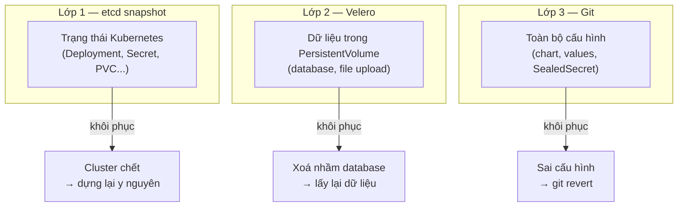

# Vận hành k3s — thiết kế cho đội 3 người

| | |
|---|---|
| **Trạng thái** | Bản nháp, chờ duyệt |
| **Ngày** | 11/09/2026 |
| **Mục tiêu** | Vận hành k3s thuận tiện nhất có thể với 3 người, không ai làm DevOps toàn thời gian |
| **Cơ sở** | Best practice cộng đồng — nguồn ở [cuối tài liệu](#nguồn-tham-khảo) |
| **Liên quan** | [REFACTOR_PLAN.md](./REFACTOR_PLAN.md) · [SECRET_MANAGEMENT.md](./SECRET_MANAGEMENT.md) · [RESEARCH_BEST_PRACTICES.md](./RESEARCH_BEST_PRACTICES.md) |

---

## Vì sao có tài liệu này

[REFACTOR_PLAN](./REFACTOR_PLAN.md) trả lời *"làm sao deploy service vào cluster"*. Tài liệu này trả lời câu còn lại và cũng là câu tốn thời gian hơn: **"làm sao sống chung với cluster mỗi ngày"** — xem cái gì đang hỏng, nâng cấp, backup, khôi phục, và biết khi nào có sự cố mà không phải ngồi canh.

Nguyên tắc xuyên suốt: **tối ưu cho người vận hành, không tối ưu cho hệ thống.** Với 3 người thì thời gian và sự tỉnh táo là tài nguyên khan hiếm nhất, không phải CPU.

---

## Mục lục

- [1. Bảy quyết định vận hành](#1-bảy-quyết-định-vận-hành)
- [2. Kiến trúc cluster](#2-kiến-trúc-cluster)
- [3. Bộ công cụ dòng lệnh](#3-bộ-công-cụ-dòng-lệnh)
- [4. Truy cập cluster cho 3 người](#4-truy-cập-cluster-cho-3-người)
- [5. Makefile — lệnh hằng ngày](#5-makefile--lệnh-hằng-ngày)
- [6. Giám sát và cảnh báo](#6-giám-sát-và-cảnh-báo)
- [7. Thông báo từ ArgoCD](#7-thông-báo-từ-argocd)
- [8. Nâng cấp k3s](#8-nâng-cấp-k3s)
- [9. Backup và khôi phục](#9-backup-và-khôi-phục)
- [10. Runbook](#10-runbook)
- [11. Lịch vận hành](#11-lịch-vận-hành)
- [12. Lộ trình triển khai](#12-lộ-trình-triển-khai)

---

## 1. Bảy quyết định vận hành

| # | Quyết định | Lý do |
|---|---|---|
| **V1** | **Cài k3s bằng `--cluster-init` (embedded etcd) ngay từ đầu**, kể cả khi chỉ có 1 server | Chuyển SQLite → etcd sau này là **cài lại cluster**. Làm đúng từ đầu tốn 0 công, sửa sau tốn một ngày downtime. |
| **V2** | **k9s là công cụ chính hằng ngày**, không phải `kubectl` thuần | Một màn hình thấy hết pod, log, event, resource. Tiết kiệm nhiều thời gian nhất trong mọi thứ ở tài liệu này. |
| **V3** | **Truy cập cluster qua Tailscale Operator**, không phát tán file kubeconfig | Mỗi kubeconfig là một credential tĩnh dùng chung. 3 người × nhiều máy = nhiều bản sao không kiểm soát được. |
| **V4** | **Tối đa 8 alert, mỗi alert phải có hành động rõ ràng** | Cộng đồng khuyến nghị 5–10. Nhiều hơn là bắt đầu bỏ qua, và lúc đó cảnh báo thật cũng bị bỏ qua theo. |
| **V5** | **Nâng cấp k3s bằng GitOps** (`system-upgrade-controller` + Plan ghim version) | Nâng cấp = PR đổi một dòng. Có review, có lịch sử, có rollback. |
| **V6** | **etcd snapshot đi ra ngoài cluster** | Backup cluster vào chính storage của cluster là vòng lặp vô nghĩa khi cluster chết. |
| **V7** | **Runbook viết ngay khi gặp sự cố**, không để sau | Với 3 người, kiến thức trong đầu một người là rủi ro lớn nhất của hệ thống. |

---

## 2. Kiến trúc cluster

### 2.1. Quyết định quan trọng nhất: datastore

k3s mặc định dùng **SQLite** — nhẹ, đơn giản, nhưng **không cluster được**. Muốn có HA sau này phải đổi sang etcd, và việc đổi đó là **cài lại cluster từ đầu**.

Tài liệu cộng đồng nói rõ:

> *"Single node now, planning HA (3+ servers) within a year: embedded etcd from day one (switching later is a reinstall)."*

Vì đang xây mới, chi phí chọn đúng lúc này gần như bằng không:

```bash
# ✅ Cài server đầu tiên — dùng embedded etcd ngay cả khi chỉ có 1 node
curl -sfL https://get.k3s.io | sh -s - server \
  --cluster-init \
  --node-name=hnq-01 \
  --write-kubeconfig-mode=600

# ❌ KHÔNG dùng mặc định (SQLite) nếu có ý định thêm server sau này
curl -sfL https://get.k3s.io | sh -
```

Đánh đổi: etcd tốn thêm ~100–200 MB RAM và ghi đĩa nhiều hơn SQLite. Với server hiện đại thì không đáng kể.

**Phần thưởng bất ngờ:** k3s có sẵn cơ chế snapshot etcd tự động kèm upload thẳng lên S3 — xem [Phần 9](#9-backup-và-khôi-phục). Backup etcd thực ra *dễ hơn* backup SQLite.

### 2.2. Bao nhiêu node?

> *"For small teams, you probably don't need high availability on day one — a single-node K3s cluster with daily backups and a documented restore procedure will outlast the actual reliability needs of most early-stage products."*

Hai lựa chọn hợp lý:

| | A. 1 server + N agent | B. 3 server (HA thật) |
|---|---|---|
| Chịu được mất 1 node | ❌ Mất control-plane là mất cả | ✅ Còn quorum |
| Chi phí | 1 server | 3 server |
| Độ phức tạp vận hành | Thấp | Vừa (cần quorum lẻ, cần LB cho API) |
| Khôi phục khi hỏng | Restore snapshot, ~15 phút downtime | Tự động |
| Hợp với 3 người | ✅ **Khuyến nghị** | Khi có SLA cam kết với khách hàng |

**Khuyến nghị: phương án A**, nhưng cài `--cluster-init` (V1) để lên B sau này chỉ là thêm 2 server:

```bash
# Về sau, thêm server thứ 2 và 3 — không cần cài lại gì
curl -sfL https://get.k3s.io | sh -s - server \
  --server https://hnq-01:6443 --token <token> --node-name=hnq-02
```

### 2.3. Gắn nhãn node ngay khi cài

```bash
kubectl label node hnq-01 hnq.dev/workload=prod hnq.dev/storage=true
kubectl label node hnq-02 hnq.dev/workload=dev
```

Values trong repo tham chiếu **nhãn**, không tham chiếu hostname — đổi hoặc thêm node không phải sửa file nào. Đây là quyết định Q6 của [REFACTOR_PLAN](./REFACTOR_PLAN.md#1-bảy-quyết-định-nền-tảng).

### 2.4. Tắt add-on không dùng

k3s cài sẵn Traefik, ServiceLB, local-path, metrics-server. Giữ hết trừ khi có lý do — nhưng **quyết định có ý thức**, đừng để mặc định rồi sau ngạc nhiên:

```yaml
# /etc/rancher/k3s/config.yaml
cluster-init: true
node-name: hnq-01
write-kubeconfig-mode: "600"

# Giữ Traefik (dùng làm ingress), giữ local-path, giữ metrics-server
# disable:
#   - traefik          # chỉ tắt nếu tự cài ingress controller khác

# etcd snapshot tự động — xem Phần 9
etcd-snapshot-schedule-cron: "0 */6 * * *"
etcd-snapshot-retention: 20
```

---

## 3. Bộ công cụ dòng lệnh

Đây là phần có tỷ lệ **giá trị / công sức cao nhất trong toàn bộ tài liệu**. Cài một lần, dùng mỗi ngày.

### 3.1. Bốn công cụ cộng đồng dùng nhiều nhất

| Công cụ | Làm gì | Vì sao cần |
|---|---|---|
| **k9s** | Giao diện terminal cho toàn cluster | Thấy pod, log, event, resource usage trong một màn hình. Thay được ~80% lệnh `kubectl` gõ hằng ngày. |
| **stern** | Xem log nhiều pod cùng lúc | `stern backend` gom log mọi replica, tô màu theo pod. Debug nhanh hơn hẳn `kubectl logs`. |
| **kubectx / kubens** | Đổi context và namespace | Gõ `kubens lotus-clinic-prod` thay vì `-n lotus-clinic-prod` mọi lệnh |
| **krew** | Trình quản lý plugin `kubectl` | Cổng vào các plugin bên dưới |

> kubectx/kubens có hơn 19.000 sao GitHub và *"được cài sẵn trên máy của hầu hết kỹ sư"*. k9s và stern cùng nhau *"phủ phần lớn nhu cầu quan sát cluster và gom log theo thời gian thực mà không cần dựng thêm hạ tầng gì"*.

### 3.2. Script cài — chạy trên máy của cả 3 người

```bash
#!/usr/bin/env bash
# scripts/setup-workstation.sh
set -euo pipefail

echo "→ krew (trình quản lý plugin kubectl)"
(
  set -x; cd "$(mktemp -d)"
  OS="$(uname | tr '[:upper:]' '[:lower:]')"
  ARCH="$(uname -m | sed -e 's/x86_64/amd64/' -e 's/aarch64/arm64/')"
  curl -fsSLO "https://github.com/kubernetes-sigs/krew/releases/latest/download/krew-${OS}_${ARCH}.tar.gz"
  tar zxvf "krew-${OS}_${ARCH}.tar.gz"
  "./krew-${OS}_${ARCH}" install krew
)
export PATH="${KREW_ROOT:-$HOME/.krew}/bin:$PATH"

echo "→ Công cụ chính"
brew install k9s stern kubectx helm kubeconform yq jq 2>/dev/null || {
  # Linux
  curl -sS https://webi.sh/k9s | sh
  curl -sS https://webi.sh/stern | sh
}

echo "→ Plugin kubectl"
kubectl krew install \
  ctx ns         `# đổi context / namespace` \
  tree           `# xem cây quan hệ resource — rất hữu ích khi debug ArgoCD` \
  neat           `# bỏ field thừa khi xem YAML` \
  df-pv          `# xem dung lượng PV còn lại` \
  images         `# liệt kê image mọi pod đang chạy` \
  resource-capacity  `# so request/limit với dung lượng node`

cat <<'RC' >> ~/.bashrc
# ── Kubernetes ──
export PATH="${KREW_ROOT:-$HOME/.krew}/bin:$PATH"
alias k=kubectl
alias kx=kubectx
alias kn=kubens
source <(kubectl completion bash)
complete -o default -F __start_kubectl k
RC

echo "✅ Xong. Mở terminal mới rồi gõ 'k9s'."
```

### 3.3. Phím tắt k9s cần thuộc

Học 10 phím này là đủ cho 90% công việc:

| Phím | Việc |
|---|---|
| `:pod` `:svc` `:ing` `:app` | Nhảy tới loại resource *(`:app` = ArgoCD Application)* |
| `0` … `9` | Lọc theo namespace |
| `/` | Tìm kiếm |
| `l` | Xem log pod đang chọn |
| `d` | `describe` |
| `y` | Xem YAML |
| `s` | Mở shell vào container |
| `Ctrl-d` | Xoá resource |
| `Shift-c` / `Shift-m` | Sắp xếp theo CPU / RAM |
| `:pulse` | Tổng quan sức khoẻ cluster |

> Dành 30 phút buổi đầu cho cả 3 người cùng học k9s. Đây là khoản đầu tư hoàn vốn trong tuần đầu tiên.

### 3.4. Plugin `kubectl tree` — đáng nhắc riêng

Khi ArgoCD báo một Application `Degraded` mà không rõ vì sao:

```bash
kubectl tree deployment backend -n lotus-clinic-prod
# NAMESPACE          NAME                      READY  REASON
# lotus-clinic-prod  Deployment/backend        -
# lotus-clinic-prod  └─ReplicaSet/backend-7d4  -
# lotus-clinic-prod    └─Pod/backend-7d4-x2k9p False  ContainersNotReady
```

Thấy ngay chuỗi quan hệ cha–con và chỗ đứt.

---

## 4. Truy cập cluster cho 3 người

### 4.1. Vấn đề với kubeconfig

Cách mặc định là copy `/etc/rancher/k3s/k3s.yaml` cho từng người. Nhưng:

> *"Every kubeconfig file is a shared static credential, and risk grows with each new device added to the fleet."*

3 người × laptop + máy bàn = 6 bản sao của cùng một credential `cluster-admin`. Một người nghỉ việc là phải xoay khoá toàn cluster. Một laptop mất là như nhau.

### 4.2. Giải pháp: Tailscale Kubernetes Operator

Bạn đã dùng Tailscale cho hạ tầng cũ, nên đây gần như miễn phí:

```bash
helm repo add tailscale https://pkgs.tailscale.com/helmcharts
helm upgrade --install tailscale-operator tailscale/tailscale-operator \
  --namespace tailscale --create-namespace \
  --set-string oauth.clientId="$TS_CLIENT_ID" \
  --set-string oauth.clientSecret="$TS_CLIENT_SECRET" \
  --set-string apiServerProxyConfig.mode="true"
```

Sau đó mỗi người tự cấu hình trên máy mình:

```bash
tailscale configure kubeconfig hnq-cluster
kubectl get nodes    # chạy được ngay, không cần file kubeconfig nào
```

Lợi ích:

| | Phát kubeconfig | Tailscale Operator |
|---|---|---|
| Credential tĩnh dùng chung | ❌ Có | ✅ Không |
| Người nghỉ việc | Xoay khoá cả cluster | Gỡ khỏi tailnet là xong |
| Biết ai làm gì | ❌ Không | ✅ Danh tính theo tailnet |
| RBAC theo từng người | Khó | ✅ Operator mạo danh đúng danh tính, dùng RBAC chuẩn |
| API server lộ ra internet | Có thể | ✅ Không bao giờ |

> *"In auth mode, the proxy authenticates incoming requests based on the source Tailscale identity and impersonates that identity when forwarding to the Kubernetes API server, letting you use standard Kubernetes RBAC."*

### 4.3. RBAC cho 3 người

Đơn giản thôi — 2 nhóm:

```yaml
# Mọi người: đọc mọi thứ, xem log, mở shell vào pod dev
apiVersion: rbac.authorization.k8s.io/v1
kind: ClusterRoleBinding
metadata:
  name: team-readonly
roleRef: { apiGroup: rbac.authorization.k8s.io, kind: ClusterRole, name: view }
subjects:
  - { apiGroup: rbac.authorization.k8s.io, kind: Group, name: "tailnet:team" }
---
# Đội hạ tầng: toàn quyền
apiVersion: rbac.authorization.k8s.io/v1
kind: ClusterRoleBinding
metadata:
  name: team-admin
roleRef: { apiGroup: rbac.authorization.k8s.io, kind: ClusterRole, name: cluster-admin }
subjects:
  - { apiGroup: rbac.authorization.k8s.io, kind: Group, name: "tailnet:infra" }
```

> **Lưu ý thực tế:** với 3 người thì rất có thể cả 3 đều ở nhóm `infra`. Vẫn nên tách hai nhóm sẵn — để khi có người thứ tư thì đã có sẵn chỗ đặt, không phải nghĩ lại lúc đang vội.

### 4.4. Nếu chưa muốn dùng Tailscale Operator

Tối thiểu phải làm:

- `--write-kubeconfig-mode=600` (mặc định k3s là `644` — ai trên máy đó cũng đọc được)
- Không commit kubeconfig vào bất kỳ repo nào, kể cả private
- Không để kubeconfig trong thư mục được đồng bộ lên cloud

---

## 5. Makefile — lệnh hằng ngày

Gói những thứ hay gõ thành lệnh ngắn, ai cũng nhớ được:

```makefile
ENV ?= dev

.PHONY: help status logs sh top events sync diff pending drift snapshot

help:            ## Danh sách lệnh
	@grep -E '^[a-zA-Z_-]+:.*?## .*$$' $(MAKEFILE_LIST) | \
	  awk 'BEGIN {FS=":.*?## "}; {printf "  \033[36m%-12s\033[0m %s\n", $$1, $$2}'

status:          ## Bảng service: tag dev ↔ prod ↔ trạng thái ArgoCD
	@scripts/status.sh

pending:         ## Service nào ở dev đang chờ lên prod
	@scripts/status.sh --pending-only

logs:            ## Log của service: make logs SVC=lotus-clinic ENV=prod
	@stern -n $(SVC)-$(ENV) . --tail 100

sh:              ## Mở shell: make sh SVC=lotus-clinic ENV=dev
	@kubectl -n $(SVC)-$(ENV) exec -it \
	  $$(kubectl -n $(SVC)-$(ENV) get pod -o name | head -1) -- sh

top:             ## Node và pod đang ăn tài nguyên nhất
	@kubectl top nodes
	@echo && kubectl top pods -A --sort-by=memory | head -15

events:          ## Event bất thường gần đây toàn cluster
	@kubectl get events -A --sort-by=.lastTimestamp \
	  --field-selector type!=Normal | tail -30

drift:           ## Application nào đang lệch khỏi Git
	@kubectl -n argocd get applications.argoproj.io \
	  -o custom-columns=NAME:.metadata.name,SYNC:.status.sync.status,HEALTH:.status.health.status \
	  | grep -v 'Synced.*Healthy' || echo "✅ Mọi thứ khớp Git"

sync:            ## Ép ArgoCD sync: make sync SVC=lotus-clinic ENV=dev
	@argocd app sync $(SVC)-$(ENV)

snapshot:        ## Tạo etcd snapshot ngay (trước khi làm gì nguy hiểm)
	@sudo k3s etcd-snapshot save --name manual-$$(date +%Y%m%d-%H%M)
```

### `scripts/status.sh` — thứ ArgoCD UI không có

Bảng so tag dev ↔ prod. Đây chính là khoảng trống mà tôi từng định giải bằng một web API:

```bash
#!/usr/bin/env bash
# scripts/status.sh [--pending-only]
set -euo pipefail
PENDING_ONLY="${1:-}"

printf "%-22s %-12s %-12s %-10s %s\n" SERVICE DEV PROD PENDING ARGOCD
printf '%.0s─' {1..78}; echo

for f in registry/apps/*/service.yaml; do
  name=$(basename "$(dirname "$f")")
  dev=$(yq -r '.image.tag // "-"'  "registry/apps/$name/values-dev.yaml"  2>/dev/null || echo -)
  prod=$(yq -r '.image.tag // "-"' "registry/apps/$name/values-prod.yaml" 2>/dev/null || echo -)

  pending="-"
  [ "$dev" != "$prod" ] && [ "$prod" != "-" ] && pending="⬆ CHỜ"
  [ "$prod" = "-" ]     && pending="dev-only"
  [ "$PENDING_ONLY" = "--pending-only" ] && [ "$pending" = "-" ] && continue

  argo=$(kubectl -n argocd get app "$name-prod" \
          -o jsonpath='{.status.sync.status}/{.status.health.status}' 2>/dev/null || echo "-")

  printf "%-22s %-12s %-12s %-10s %s\n" "$name" "$dev" "$prod" "$pending" "$argo"
done
```

```
SERVICE                DEV          PROD         PENDING    ARGOCD
──────────────────────────────────────────────────────────────────
lotus-clinic           7bcd1234     f1eb557d     ⬆ CHỜ      Synced/Healthy
giaan-clinic           a3f9021c     a3f9021c     -          Synced/Healthy
hocmon-clinic          bb17e4d2     -            dev-only   -
storage-mariadb        11.4.3       11.4.3       -          Synced/Healthy
```

~30 dòng bash, thay cho endpoint `GET /promotions` và cả một web app.

---

## 6. Giám sát và cảnh báo

### 6.1. Chọn stack

| | kube-prometheus-stack | VictoriaMetrics k8s-stack |
|---|---|---|
| Mức phổ biến | Mặc định của cộng đồng | Đang tăng |
| Tài nguyên | Nặng hơn | Nhẹ hơn rõ rệt |
| Tài liệu, StackOverflow | Rất nhiều | Ít hơn |
| Tương thích | — | Drop-in replacement |

> *"kube-prometheus-stack deploys everything you need in one Helm chart... for most teams under 500 nodes, this is the right answer."*

**Khuyến nghị: kube-prometheus-stack.** Với 3 người, việc tra được lỗi trên Google quan trọng hơn tiết kiệm vài trăm MB RAM. VictoriaMetrics chỉ xét lại nếu Prometheus thật sự ăn hết tài nguyên node — và vì nó tương thích ngược, đổi sau không đau.

### 6.2. Tám alert — không hơn

Đây là phần quan trọng nhất của mục này.

> *"Start with 5-10 essential alerts where every alert must have a clear action, and if the response is 'look at it later', it should be a warning, not critical."*

Với 3 người không có ca trực, **alert bị bỏ qua là alert vô dụng** — và tệ hơn, nó làm bạn bỏ qua cả alert thật.

| # | Alert | Ngưỡng | Hành động ngay |
|---|---|---|---|
| 1 | **Pod restart liên tục** | `CrashLoopBackOff` > 5 phút | `make logs SVC=x ENV=y` |
| 2 | **Deployment không đủ replica** | ready < desired, > 10 phút | Xem event, xem node còn chỗ không |
| 3 | **Node không sẵn sàng** | `NotReady` > 5 phút | SSH vào node, kiểm tra `k3s` service |
| 4 | **Đĩa sắp đầy** | > 85% | Dọn image cũ: `k3s crictl rmi --prune` |
| 5 | **PV sắp đầy** | > 85% | Mở rộng hoặc dọn dữ liệu |
| 6 | **Chứng chỉ TLS sắp hết hạn** | < 14 ngày | Kiểm tra cert-manager, kiểm tra DNS |
| 7 | **ArgoCD Application lệch** | `OutOfSync` > 30 phút | `make drift` xem ai sửa tay |
| 8 | **Backup thất bại** | Velero hoặc etcd snapshot lỗi | Xử lý ngay — đây là lưới an toàn cuối |

Mọi thứ khác vào Grafana để xem khi cần, **không gửi thông báo**.

```yaml
# Ví dụ 2 rule, phần còn lại theo cùng khuôn
groups:
  - name: hnq-critical
    rules:
      - alert: PodCrashLooping
        expr: rate(kube_pod_container_status_restarts_total[10m]) * 600 > 3
        for: 5m
        labels: { severity: critical }
        annotations:
          summary: "{{ $labels.namespace }}/{{ $labels.pod }} đang restart liên tục"
          action: "make logs SVC={{ $labels.namespace }}"

      - alert: CertExpiringSoon
        expr: (certmanager_certificate_expiration_timestamp_seconds - time()) / 86400 < 14
        for: 1h
        labels: { severity: warning }
        annotations:
          summary: "Chứng chỉ {{ $labels.name }} hết hạn sau {{ $value | humanize }} ngày"
          action: "kubectl describe certificate {{ $labels.name }} -n {{ $labels.namespace }}"
```

> **Trường `action` là bắt buộc** trong mọi rule. Nếu không viết nổi một hành động cụ thể thì alert đó không nên tồn tại — hãy để nó là dashboard.

### 6.3. Ba dashboard, không cần hơn

| Dashboard | Trả lời câu hỏi |
|---|---|
| **Cluster overview** | Node còn khoẻ không? CPU/RAM/đĩa còn bao nhiêu? |
| **Service overview** | Mỗi service: replica, restart, latency, error rate |
| **Storage** | PV nào sắp đầy? |

Dùng dashboard có sẵn của kube-prometheus-stack, đừng tự vẽ. Chỉ tự làm cái "Service overview" cho khớp nhãn của mình.

---

## 7. Thông báo từ ArgoCD

### 7.1. Chỉ báo khi có vấn đề

ArgoCD Notifications cài sẵn trong chart. Điểm mấu chốt là **cấu hình đúng trigger**:

> *"ArgoCD notifications can be configured to alert only on failed syncs and degraded health, reducing notification fatigue."*

Báo mỗi lần sync thành công nghe có vẻ hay, nhưng sau một tuần là không ai đọc nữa.

```yaml
# values của chart argo-cd
notifications:
  enabled: true

  secret:
    create: false
    name: argocd-notifications-secret    # SealedSecret chứa telegram-token

  notifiers:
    service.telegram: |
      token: $telegram-token

  templates:
    template.sync-failed: |
      message: |
        ❌ *{{.app.metadata.name}}* sync thất bại
        {{.app.status.operationState.message}}
        {{.context.argocdUrl}}/applications/{{.app.metadata.name}}
    template.health-degraded: |
      message: |
        ⚠️ *{{.app.metadata.name}}* đang Degraded
        {{.context.argocdUrl}}/applications/{{.app.metadata.name}}

  triggers:
    trigger.on-sync-failed: |
      - when: app.status.operationState.phase in ['Error', 'Failed']
        send: [sync-failed]
    trigger.on-health-degraded: |
      - when: app.status.health.status == 'Degraded'
        send: [health-degraded]

  subscriptions:
    - recipients: [telegram:-100xxxxxxxxx]
      triggers: [on-sync-failed, on-health-degraded]
```

### 7.2. Một kênh duy nhất

Với 3 người, **gửi hết vào một kênh chat chung** — Telegram hoặc Slack. Đừng chia kênh theo môi trường hay theo service: chia kênh chỉ có ý nghĩa khi có nhiều đội, còn ở đây nó chỉ làm mọi người phải theo dõi nhiều chỗ.

Nguồn gửi vào kênh đó:

| Nguồn | Gửi gì |
|---|---|
| **ArgoCD** | Sync thất bại, Application `Degraded` |
| **Alertmanager** | 8 alert ở [Phần 6.2](#62-tám-alert--không-hơn) |
| **GitHub Actions** | CI hỏng trên `main` |
| **Velero** | Backup thất bại |

---

## 8. Nâng cấp k3s

### 8.1. Quy tắc bất di bất dịch

> *"Kubernetes supports upgrading one minor version at a time and should not skip minor versions (e.g., go 1.28 → 1.29 → 1.30, not 1.28 → 1.30)."*
>
> *"Always take an etcd backup before upgrading and test the upgrade process in a non-production environment first."*

Nhảy cóc minor version là cách nhanh nhất để hỏng cluster.

### 8.2. Nâng cấp bằng GitOps

`system-upgrade-controller` của Rancher đọc resource `Plan` — mà `Plan` là YAML, nên nó nằm trong repo và đi qua PR như mọi thứ khác:

```yaml
# registry/apps/k3s-upgrade/manifests/plan.yaml
apiVersion: upgrade.cattle.io/v1
kind: Plan
metadata:
  name: k3s-server
  namespace: system-upgrade
spec:
  concurrency: 1                       # từng node một
  cordon: true                         # cordon trước khi nâng
  nodeSelector:
    matchExpressions:
      - { key: node-role.kubernetes.io/control-plane, operator: In, values: ["true"] }
  serviceAccountName: system-upgrade
  upgrade:
    image: rancher/k3s-upgrade
  # ⚠️ GHIM version cụ thể — KHÔNG dùng channel: stable
  version: v1.31.5+k3s1
```

Nâng cấp trở thành: **PR đổi một dòng `version`**. Có review, có lịch sử, quay lui bằng `git revert`.

> **Vì sao ghim version thay vì `channel: stable`:** channel nghĩa là cluster tự nâng cấp lúc nào không biết, có thể đúng giờ cao điểm. Ghim version nghĩa là **bạn chọn thời điểm**.

### 8.3. Quy trình mỗi lần nâng cấp

```bash
# 1. Snapshot trước — luôn luôn
make snapshot

# 2. Đọc release note, đặc biệt phần breaking changes
#    https://github.com/k3s-io/k3s/releases

# 3. PR đổi version trong plan.yaml (nâng 1 minor một lần)

# 4. Merge → controller cordon, drain, nâng cấp, uncordon từng node

# 5. Kiểm tra
kubectl get nodes                     # version mới, đều Ready
make drift                            # không app nào lệch
kubectl get pods -A | grep -v Running # không pod nào kẹt
```

### 8.4. Nhịp độ

| Loại | Khi nào |
|---|---|
| Bản vá bảo mật (CVE cao) | Trong vòng 1 tuần |
| Bản vá thường (patch) | Hằng quý |
| Minor version | 6 tháng/lần, từng bước một |
| Chart bên thứ ba | Renovate tự mở PR, duyệt hằng tuần |

---

## 9. Backup và khôi phục

### 9.1. Ba lớp, ba mục đích khác nhau



**Lớp 3 là mạnh nhất và miễn phí** — nhờ GitOps, phần lớn "khôi phục" chỉ là `git revert` rồi để ArgoCD sync lại. Hai lớp kia dành cho dữ liệu, thứ mà Git không giữ.

### 9.2. Lớp 1 — etcd snapshot

k3s có sẵn, kể cả phần upload S3:

```yaml
# /etc/rancher/k3s/config.yaml
etcd-snapshot-schedule-cron: "0 */6 * * *"   # 6 giờ/lần
etcd-snapshot-retention: 20                   # giữ 5 ngày

# Upload thẳng lên object storage NGOÀI cluster (V6)
etcd-s3: true
etcd-s3-endpoint: "<account>.r2.cloudflarestorage.com"
etcd-s3-bucket: "hnq-etcd-snapshots"
etcd-s3-access-key: "..."
etcd-s3-secret-key: "..."
```

> ⚠️ **Đừng đẩy etcd snapshot vào MinIO chạy trong chính cluster này.** Cluster chết là mất luôn backup. Snapshot rất nhỏ (vài MB), nên dịch vụ như Cloudflare R2 hoặc Backblaze B2 gần như không tốn tiền ở quy mô này.

Cộng đồng khuyến nghị **quy tắc 3-2-1**: 3 bản sao, 2 loại phương tiện, 1 bản ở nơi khác. Với hệ thống này: bản trên node + bản trên R2 + bản tải về máy hằng tháng là đủ.

### 9.3. Lớp 2 — Velero

| Phạm vi | Tần suất | Giữ |
|---|---|---|
| Namespace `*-prod` + PV | 6 giờ/lần | 30 ngày |
| Namespace `*-dev` | 1 ngày/lần | 7 ngày |
| Namespace `argocd` | 1 ngày/lần | 30 ngày |

Namespace `argocd` dễ bị quên nhưng mất nó là mất toàn bộ cấu hình GitOps đang chạy.

Velero ghi vào MinIO trong cluster được — nhưng phải có **job đồng bộ ra ngoài hằng tuần** (`rclone sync` sang R2), nếu không thì vẫn là vòng lặp như mục 9.2.

### 9.4. Diễn tập khôi phục — bắt buộc

**Backup chưa từng khôi phục thử thì chưa phải backup.** Đây là câu nhàm nhưng vẫn là nguyên nhân số một khiến backup vô dụng đúng lúc cần.

Hằng quý, làm đủ 3 việc và ghi kết quả vào `docs/RUNBOOK.md`:

```bash
# 1. Khôi phục etcd vào cluster tạm
k3d cluster create test-restore
sudo k3s server --cluster-reset \
  --cluster-reset-restore-path=/var/lib/rancher/k3s/server/db/snapshots/<snapshot>

# 2. Khôi phục một PV bằng Velero
velero restore create --from-backup <backup> \
  --include-namespaces lotus-clinic-prod \
  --namespace-mappings lotus-clinic-prod:restore-test

# 3. Khôi phục sealing key của Sealed Secrets
#    → xem SECRET_MANAGEMENT.md
```

---

## 10. Runbook

`docs/RUNBOOK.md` là tài liệu **quan trọng nhất** với đội 3 người. Không phải vì nội dung kỹ thuật, mà vì nó là thứ duy nhất chống lại rủi ro *"chỉ một người biết cách xử lý"*.

### 10.1. Quy tắc

Mỗi lần gặp sự cố, **trước khi quên**, ghi 5 dòng:

```markdown
## 2026-09-20 — Pod backend CrashLoopBackOff sau khi đổi secret

**Triệu chứng:** lotus-clinic-prod, pod restart liên tục, log báo "access denied for user"
**Nguyên nhân:** đổi DB_PASSWORD trong SealedSecret nhưng pod chưa restart → vẫn dùng giá trị cũ
**Xử lý:** `kubectl -n lotus-clinic-prod rollout restart deploy/backend`
**Phòng ngừa:** annotation `hnq.dev/secret-checksum` đã có trong chart — lần này quên cập nhật
**Thời gian:** 25 phút
```

### 10.2. Khung có sẵn cho những sự cố hay gặp

Viết trước 8 mục này ở Tuần 5, kể cả khi chưa gặp:

| Tình huống | Bước đầu tiên |
|---|---|
| Pod `CrashLoopBackOff` | `make logs SVC=x ENV=y` → đọc log, xem `kubectl describe pod` phần Events |
| Pod `Pending` mãi | `kubectl describe pod` → thường là hết tài nguyên, hoặc PV không gắn được node |
| ArgoCD `OutOfSync` không tự hết | `make drift` → xem có ai `kubectl edit` tay không; `argocd app diff` |
| Ingress trả 404 / 502 | Kiểm tra Service có endpoint không → `kubectl get endpointslice -n <ns>` |
| Chứng chỉ không cấp được | `kubectl describe certificate` → thường là DNS chưa trỏ, hoặc rate limit của Let's Encrypt |
| Node `NotReady` | SSH vào → `systemctl status k3s` / `journalctl -u k3s -n 100` |
| Đĩa đầy | `k3s crictl rmi --prune` dọn image cũ; kiểm tra log không xoay vòng |
| Database không kết nối được | Secret đúng chưa → pod đã restart sau khi đổi secret chưa → NetworkPolicy? |

### 10.3. Onboarding

`docs/ONBOARDING.md` — người mới đọc một lần là làm được:

1. Vào tailnet, chạy `tailscale configure kubeconfig`
2. Chạy `scripts/setup-workstation.sh`
3. Mở `k9s`, đi một vòng cluster
4. Đọc `REFACTOR_PLAN.md` phần 3–6 (cấu trúc repo và luồng deploy)
5. **Tự tay thêm một service test** rồi xoá đi
6. Đọc `RUNBOOK.md`

Mục 5 là mục quan trọng nhất. Đọc tài liệu không thay được việc tự làm một lần.

---

## 11. Lịch vận hành

| Nhịp | Việc | Ai | Mất bao lâu |
|---|---|---|---|
| **Hằng ngày** | Liếc kênh chat xem có alert không | Ai cũng được | 1 phút |
| | `make status` trước khi promote | Người promote | 1 phút |
| **Hằng tuần** | Duyệt PR của Renovate | Luân phiên | 15 phút |
| | `make drift` — kiểm tra không ai sửa tay | Luân phiên | 5 phút |
| | Xem dashboard đĩa và PV | Luân phiên | 5 phút |
| **Hằng tháng** | Tải một bản etcd snapshot về máy (quy tắc 3-2-1) | Đội hạ tầng | 10 phút |
| | Rà `docs/RUNBOOK.md`, bổ sung sự cố trong tháng | Cả đội | 30 phút |
| **Hằng quý** | **Diễn tập khôi phục** (etcd + Velero + sealing key) | Cả đội | 2 giờ |
| | Nâng cấp k3s bản vá | Đội hạ tầng | 1 giờ |
| | Backup lại sealing key của Sealed Secrets | Đội hạ tầng | 10 phút |
| | Rà lại secret quá hạn xoay vòng | Đội hạ tầng | 30 phút |

Tổng: khoảng **30 phút mỗi tuần** cộng **nửa ngày mỗi quý**. Đây là con số thực tế — nếu vượt nhiều thì có chỗ nào đó đang quá phức tạp so với nhu cầu.

---

## 12. Lộ trình triển khai

Đan xen với 6 tuần của [REFACTOR_PLAN](./REFACTOR_PLAN.md#11-lộ-trình-6-tuần), không phải làm thêm sau.

### Tuần 1 — cùng lúc dựng cluster

- [ ] Cài k3s với **`--cluster-init`** (V1) — quyết định không sửa lại được
- [ ] Gắn nhãn node, tạo `/srv/k3s/{dev,prod}`
- [ ] Bật `etcd-snapshot-schedule-cron` + upload S3 ra **ngoài** cluster (V6)
- [ ] Cài Tailscale Operator, cả 3 người chạy `tailscale configure kubeconfig`
- [ ] Cả 3 người chạy `scripts/setup-workstation.sh`
- [ ] **30 phút cùng học k9s**

### Tuần 3 — khi có monitoring

- [ ] kube-prometheus-stack qua registry
- [ ] Viết đúng **8 alert**, mỗi cái có trường `action`
- [ ] ArgoCD Notifications → kênh chat chung
- [ ] 3 dashboard

### Tuần 5 — vận hành

- [ ] Velero + lịch backup + job đồng bộ ra ngoài
- [ ] **Diễn tập khôi phục lần đầu** — etcd + Velero + sealing key
- [ ] `system-upgrade-controller` + `Plan` ghim version
- [ ] `scripts/status.sh` + Makefile
- [ ] `docs/RUNBOOK.md` — viết trước 8 tình huống ở [10.2](#102-khung-có-sẵn-cho-những-sự-cố-hay-gặp)
- [ ] `docs/ONBOARDING.md`

### Danh sách kiểm tra khi coi là xong

**Cluster**
- [ ] Cài bằng `--cluster-init` (kiểm: `kubectl get node` thấy role `etcd`)
- [ ] Node có nhãn `hnq.dev/workload`, không có values nào tham chiếu hostname
- [ ] etcd snapshot chạy tự động **và** đẩy ra ngoài cluster

**Công cụ**
- [ ] Cả 3 người có k9s, stern, kubectx, krew
- [ ] Cả 3 người `kubectl get nodes` được qua Tailscale, không ai giữ file kubeconfig
- [ ] `make status`, `make logs`, `make drift` chạy được

**Quan sát**
- [ ] Đúng 8 alert, mỗi cái có `action` cụ thể
- [ ] Alert về đúng kênh cả 3 người cùng thấy
- [ ] ArgoCD chỉ báo khi thất bại, không báo mỗi lần sync

**An toàn**
- [ ] Đã khôi phục thử etcd snapshot thành công **một lần**
- [ ] Đã khôi phục thử một PV bằng Velero **một lần**
- [ ] Đã khôi phục thử sealing key **một lần**
- [ ] Nâng cấp k3s là PR đổi một dòng

**Con người**
- [ ] `RUNBOOK.md` có sẵn 8 tình huống
- [ ] `ONBOARDING.md` đã được ít nhất một người làm theo từ đầu tới cuối
- [ ] Cả 3 người đều đã tự tay thêm một service

---

## Nguồn tham khảo

**Tài liệu chính thức**

- [k3s — High Availability Embedded etcd](https://docs.k3s.io/datastore/ha-embedded)
- [k3s — Architecture](https://docs.k3s.io/architecture)
- [k3s — Volumes and Storage](https://docs.k3s.io/add-ons/storage)
- [Tailscale — Kubernetes Operator](https://tailscale.com/docs/kubernetes-operator) · [API server access](https://tailscale.com/docs/kubernetes-operator/api-server-access)

**Công cụ**

- [k9s](https://k9scli.io/) · [stern](https://github.com/stern/stern) · [kubectx/kubens](https://github.com/ahmetb/kubectx) · [krew](https://krew.sigs.k8s.io/)
- [system-upgrade-controller](https://github.com/rancher/system-upgrade-controller) · [Velero](https://velero.io/)

**Best practice cộng đồng**

- [Tailscale Kubernetes Operator GA](https://tailscale.com/blog/k8s-operator-ga) — vì sao không phát tán kubeconfig
- [devoriales — Must-Have Kubernetes CLI Tools](https://devoriales.com/must-have-kubernetes-cli-tools-every-platform-engineer-should-know)
- [Big Iron — k3s datastore decision: SQLite vs embedded etcd](https://www.bigiron.cc/guides/k3s-single-node-with-embedded-etcd-vs-sqlite)
- [pickuma — k3s vs MicroK8s vs k0s cho đội nhỏ](https://pickuma.com/for-dev/k3s-vs-microk8s-vs-k0s-lightweight-kubernetes-small-teams/)
- [OneUptime — k3s backup và restore](https://oneuptime.com/blog/post/2026-02-02-k3s-backup-restore/view) · [nâng cấp an toàn](https://oneuptime.com/blog/post/2026-01-27-k3s-upgrade/view) · [etcd maintenance](https://oneuptime.com/blog/post/2026-02-02-k3s-etcd-maintenance/view)
- [The New Stack — Reduce Alert Fatigue](https://thenewstack.io/reduce-alert-fatigue-and-improve-your-kubernetes-monitoring/)
- [Last9 — Kubernetes Alerting That Won't Burn You Out](https://last9.io/blog/kubernetes-alerting/)
- [OneUptime — ArgoCD notifications chỉ báo khi sync thất bại](https://oneuptime.com/blog/post/2026-02-26-argocd-notifications-failed-syncs-only/view)
- [Metoro — Best Kubernetes Monitoring Tools 2026](https://metoro.io/blog/best-kubernetes-monitoring-tools)

> Nhóm blog kỹ thuật phản ánh xu hướng phổ biến chứ không phải chuẩn chính thức. Các con số cụ thể (8 alert, ngưỡng 85%, nhịp nâng cấp) là đề xuất khởi điểm — điều chỉnh theo thực tế sau vài tháng chạy.
