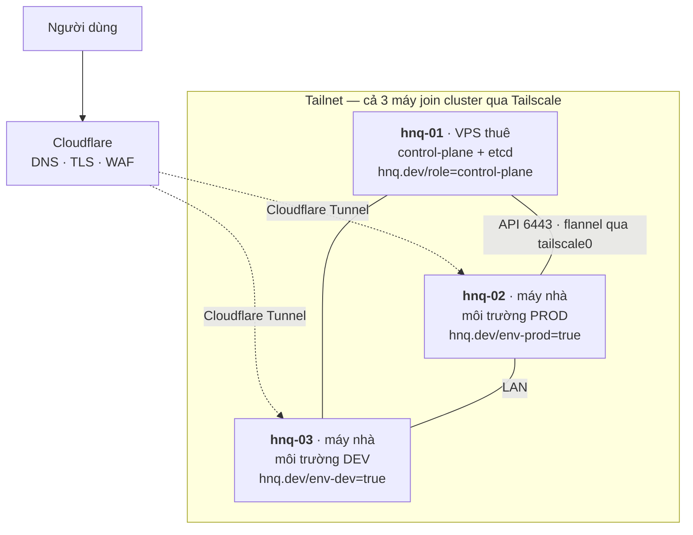

# Kế hoạch hạ tầng k3s + ArgoCD

> **Đọc file này 1 lần** để hiểu hệ thống. Vận hành hằng ngày → [OPERATIONS.md](./OPERATIONS.md). Đang có sự cố → [RECOVERY.md](./RECOVERY.md).

| | |
|---|---|
| **Bối cảnh** | Xây mới hoàn toàn, repo GitHub mới, không migrate dữ liệu cũ |
| **Phần cứng** | 1 VPS thuê (master) + 2 máy ở nhà (node), join cluster qua Tailscale |
| **Người vận hành** | 1 người |
| **Mục tiêu** | Dùng đúng pattern cộng đồng đã kiểm chứng, và **khi hỏng thì phục hồi nhanh nhất** |
| **Cơ sở** | [RESEARCH_BEST_PRACTICES.md](./RESEARCH_BEST_PRACTICES.md) — hồ sơ tra cứu, không cần đọc để triển khai |

---

## 1. Toàn bộ hệ thống trong một trang

Mọi thứ trong repo này là **một pattern cộng đồng đã dùng rộng rãi**, không có gì tự chế:

| Thành phần | Chọn gì | Vì sao đây là lựa chọn phổ biến |
|---|---|---|
| Kubernetes | **k3s** + embedded etcd | Bản phân phối nhẹ phổ biến nhất cho cluster nhỏ. etcd cho snapshot + restore có sẵn. |
| GitOps | **ArgoCD** | Chuẩn de-facto. UI có sẵn thay cho portal tự viết. |
| Sinh Application | **ApplicationSet** cho service của mình, **App-of-Apps** cho chart bên thứ ba | Phân vai đúng như cộng đồng khuyến nghị: factory cho cái lặp lại, danh sách tường minh cho cái cố định |
| Môi trường | **1 branch `main`**, tách bằng thư mục + file values | Branch-per-environment là anti-pattern có tên. 1 branch mới promote được từng service một. |
| Chart | **1 library chart + 2 chart chung** | `webservice` cho mọi HTTP service, `datastore` cho mọi database. Thêm service = viết values, không viết template. |
| Secret | **Sealed Secrets** | Rào cản thấp nhất, không cần hệ thống ngoài. Lộ trình chuẩn là bắt đầu ở đây. |
| Ingress | **Traefik** (có sẵn trong k3s) + **cert-manager** | Mặc định của k3s, không cần thay |
| Vào từ internet | **Cloudflare Tunnel** chạy in-cluster | Cách phổ biến nhất để đưa máy ở nhà (sau NAT, IP động) ra internet |
| Giám sát | **kube-prometheus-stack** | Mặc định của cộng đồng, tra lỗi trên Google dễ nhất |
| Backup | **etcd snapshot → R2** + **Velero** + **dump database** | 3 lớp, mỗi lớp một mục đích |
| Nâng cấp | **system-upgrade-controller** | Cách chuẩn của Rancher cho k3s: nâng cấp = PR đổi một dòng |
| Nâng version chart | **Renovate** | Tự mở PR khi có bản mới |

Chỗ duy nhất đi khác số đông là **không làm HA** và **không dùng storage phân tán** — lý do ở [§3](#3-vì-sao-không-ha) và [§7](#7-lưu-trữ).

---

## 2. Topology



| Máy | Chạy gì | Nếu mất nó |
|---|---|---|
| **hnq-01** (VPS) | apiserver, etcd, ArgoCD, cert-manager, sealed-secrets, Velero | **Khách hàng không bị ảnh hưởng.** Mất `kubectl`, mất sync, mất scheduling. → [R5](./RECOVERY.md#r5--etcd-hỏng-hoặc-apiserver-không-lên)/[R6](./RECOVERY.md#r6--vps-mất-hoàn-toàn) |
| **hnq-02** (nhà) | mọi `*-prod` + database prod, 1 Traefik, 1 cloudflared, 1 CoreDNS | Prod down → [R4](./RECOVERY.md#r4--node-prod-chết), ~30 phút |
| **hnq-03** (nhà) | mọi `*-dev` + database dev, 1 Traefik, 1 cloudflared, 1 CoreDNS, **monitoring** | Dev down + mất monitoring, prod vẫn chạy → [R3](./RECOVERY.md#r3--node-dev-chết) |

**Ba lý do chia như vậy:**

1. **etcd không tranh đĩa với workload** — nguyên nhân phổ biến nhất làm cluster k3s một-server treo.
2. **Dữ liệu khách hàng không nằm trên VPS thuê** — mất VPS là mất control-plane, không phải mất dữ liệu.
3. **Monitoring ở node dev** — đặt trên master thì mất master là mất luôn khả năng biết; đặt trên node prod thì node prod chết là mất monitoring đúng lúc cần nó nhất.

> Master **không** taint. Thay vào đó CI có policy bắt buộc mọi workload khai `nodeSelector` — sai là CI chặn, không phải phát hiện lúc pod đã nằm nhầm chỗ.

---

## 3. Vì sao không HA

Không phải vì thiếu máy. Với topology này, HA **làm hệ thống tệ hơn**:

| | 1 server (chọn) | 3 server HA qua Tailscale |
|---|---|---|
| Mỗi lần ghi etcd | Ghi đĩa local, xong | Chờ quorum **qua WAN**, độ trễ thay đổi theo giờ |
| Mất 1 đường mạng | Không ảnh hưởng | Có thể **mất quorum → cluster read-only** dù cả 3 máy đều sống |
| Số thứ có thể hỏng | 1 etcd | 3 etcd + load balancer cho API + đồng bộ version 3 máy |

Đổi lại phải làm thật tốt **hai** thứ dưới đây. Làm được hai thứ này thì "1 server, không HA" từ rủi ro thành lựa chọn hợp lý.

### 3.1. Đường dữ liệu không phụ thuộc master

Khi control-plane chết, **kubelet không giết container đang chạy** — pod vẫn phục vụ. Vấn đề chỉ là ba thành phần trên đường đi của request thường bị vô tình đặt hết lên master. Chữa bằng cách ghim mỗi thứ **2 replica lên 2 máy ở nhà**:

| Thành phần | Cấu hình | Nếu không làm |
|---|---|---|
| **Traefik** | 2 replica, antiAffinity theo node, `nodeSelector: hnq.dev/edge` | Master chết → không còn ingress → 100% request lỗi |
| **cloudflared** | **In-cluster** 2 replica (không phải systemd trên VPS) | Tunnel trên VPS → master chết là mất đường vào |
| **CoreDNS** | 2 replica + antiAffinity | Pod không phân giải được `*.svc.cluster.local` |

Kết quả khi `hnq-01` chết hoàn toàn:

- ✅ Cloudflare → tunnel (máy nhà) → Traefik (máy nhà) → pod (máy nhà): **traffic không đứt**
- ❌ Không `kubectl`, không sync, không tạo pod mới, không cấp chứng chỉ mới

Nghĩa là mất master là **việc xử lý trong ngày, không phải việc thức đêm**.

### 3.2. Đường phục hồi đã diễn tập

Toàn bộ ở [RECOVERY.md](./RECOVERY.md). Mục tiêu:

| Sự cố | Phục hồi trong | Mất dữ liệu tối đa |
|---|---|---|
| Deploy sai | 5 phút | 0 |
| Node prod chết | 30 phút | 1 giờ |
| etcd hỏng (VPS còn) | 10 phút | 6 giờ |
| VPS mất hẳn | 45 phút | 6 giờ |
| Mất cả 3 máy | 3 giờ | 1 giờ |

---

## 4. Tám quyết định nền tảng

| # | Quyết định | Lý do gọn |
|---|---|---|
| **Q1** | 1 branch `main`, môi trường tách bằng file values | Promote được từng service một |
| **Q2** | Mọi thay đổi qua PR, nhưng **CI là cửa duyệt, không phải người** | 1 người thì GitHub không cho tự approve PR của mình. PR vẫn giữ vì cho 3 thứ: diff để đọc lại, lịch sử, và 1 commit để `git revert`. |
| **Q3** | ApplicationSet cho service mình, Application tường minh cho chart bên thứ ba | Factory cho cái lặp, danh sách cho cái cố định |
| **Q4** | Sealed Secrets | Không cần hệ thống ngoài |
| **Q5** | Prod `selfHeal: true` + `prune: false`; dev cả hai `true` | `selfHeal` chống sửa tay. `prune: false` để 1 lỗi ApplicationSet không xoá hàng loạt. |
| **Q6** | Node chọn bằng **label boolean**, không bằng hostname | `kubectl label node hnq-03 hnq.dev/env-prod=true` = **dời cả môi trường prod**, không đụng dev. Đây là bước 1 của [R4](./RECOVERY.md#r4--node-prod-chết). |
| **Q7** | Không xây web UI/API riêng | ArgoCD UI + k9s + script đã phủ hết |
| **Q8** | **Mọi thay đổi phải quay lui được trong vài phút** | Cụ thể: image tag ghim SHA (cấm `latest`), `prune: false` ở prod, `Retain` cho mọi PV, snapshot trước việc nguy hiểm |

---

## 5. Cấu trúc repo

```text
HNQ-Infra/                     (branch main duy nhất)
│
├── registry/apps/       ⭐ NƠI DUY NHẤT sửa khi thêm service
│   ├── lotus-clinic/
│   │   ├── service.yaml        # chart nào, bật env nào, cần secret gì
│   │   ├── values-dev.yaml     # chỉ ghi phần KHÁC mặc định (~10 dòng)
│   │   ├── values-prod.yaml
│   │   └── config/
│   └── … (4 clinic, push-notify, 5 storage, outline, cloudflared)
│
├── charts/              ⭐ Hiếm khi sửa — 3 chart cho toàn hệ thống
│   ├── hnq-common/             # library chart: labels, probes, ingress, sync-wave
│   ├── webservice/             # mọi HTTP service
│   └── datastore/              # mọi database một node
│
├── env/{dev,prod}.yaml  ⭐ Khác biệt dev ↔ prod
│
├── gitops/
│   ├── root.yaml               # ⭐ FILE DUY NHẤT apply tay, đúng 1 lần
│   └── bootstrap/              # 2 AppProject + ApplicationSet + 5 chart bên thứ ba
│
├── secrets/{dev,prod}/         # SealedSecret đã mã hoá — an toàn để commit
│
├── ci/{policy,scripts}/        # Rego + new-service.sh, render-all.sh, promote.sh
│
├── scripts/
│   ├── status.sh  drift.sh  backup/
│   └── dr/              ⭐ NƠI ĐI TỚI KHI ĐANG SỰ CỐ
│       ├── kit-check.sh        restore-etcd.sh
│       ├── rebuild-master.sh   failover-prod.sh   restore-db.sh
│
├── .github/{workflows,CODEOWNERS,renovate.json}
├── docs/
└── Makefile
```

### Thêm 1 service mới tốn gì

```bash
make new-service NAME=abc-clinic CHART=webservice
# → tạo registry/apps/abc-clinic/{service,values-dev,values-prod}.yaml
# → commit, mở PR, CI xanh, merge
```

**Không phải viết file ArgoCD nào** — ApplicationSet tự phát hiện sau khi merge.

---

## 6. Cách ApplicationSet hoạt động

### File khai báo service

`registry/apps/lotus-clinic/service.yaml` — toàn bộ những gì ArgoCD cần biết:

```yaml
apiVersion: hnq.dev/v1
kind: ServiceRelease
metadata:
  name: lotus-clinic
  owner: hunho247
spec:
  category: app                  # app | platform → quyết định AppProject
  chart: webservice              # webservice | datastore
  environments:                  # chưa có "prod" → chưa có Application prod
    - env: dev
    - env: prod
  requiredSecrets:               # tên secret, KHÔNG phải giá trị — CI dùng để kiểm thiếu sót
    - name: lotus-clinic-backend
      keys: [DB_PASSWORD, JWT_SECRET]
```

`values-dev.yaml` chỉ ghi phần khác mặc định:

```yaml
image: { repository: ghcr.io/hnq-tech/lotus-backend, tag: 6aebe241 }
ingress: { host: lotus-dev.l2cteam.work }
app: { configFile: config/config_dev.yaml, secretName: lotus-clinic-backend }
```

Mọi thứ khác — port, probe, resources, nodeSelector, issuer, imagePullSecrets, serviceMonitor, storageClass — đến từ `env/dev.yaml` và `charts/webservice/values.yaml`. Namespace suy ra theo quy ước `<tên>-<env>`, không phải khai.

### Một ApplicationSet thay cho 24 file Application

```yaml
# gitops/bootstrap/appset-apps.yaml  (rút gọn — phần quan trọng)
spec:
  goTemplate: true
  generators:
    - matrix:
        generators:
          - git:                                  # (1) quét mọi file khai báo
              repoURL: &repo https://github.com/hunho247/HNQ-Infra.git
              revision: main
              files: [{ path: "registry/apps/*/service.yaml" }]
          - list:                                 # (2) bung theo env khai trong chính file đó
              elementsYaml: "{{ toJson .spec.environments }}"
  template:
    metadata:
      name: "{{ .metadata.name }}-{{ .env }}"
    spec:
      project: "{{ .spec.category }}"             # app | platform
      source:
        repoURL: *repo
        targetRevision: main
        path: "charts/{{ .spec.chart }}"
        helm:
          releaseName: "{{ .metadata.name }}"
          valueFiles:                             # "/" = tính từ gốc repo
            - values.yaml
            - "/env/{{ .env }}.yaml"
            - "/registry/apps/{{ .metadata.name }}/values-{{ .env }}.yaml"
      destination:
        namespace: "{{ .metadata.name }}-{{ .env }}"
      syncPolicy:
        automated:
          selfHeal: true
          prune: {{ if eq .env "dev" }}true{{ else }}false{{ end }}   # Q5
        syncOptions: [CreateNamespace=true, PruneLast=true, ServerSideApply=true]
```

Vì chỉ có **một branch**, `targetRevision: main` ghi cứng được — không phải bọc ApplicationSet trong Helm chart. Đây là lợi ích lớn nhất của Q1.

### Chart bên thứ ba dùng Application tường minh

`cert-manager`, `sealed-secrets`, `kube-prometheus-stack`, `velero`, `traefik-config` — 5 file, mỗi cái ~20 dòng, thay đổi vài tháng một lần, Renovate tự mở PR nâng version.

### Bootstrap — một lệnh duy nhất trong đời cluster

```bash
kubectl -n argocd apply -f gitops/root.yaml   # Application trỏ vào gitops/bootstrap, recurse
```

Xong. Mọi thứ còn lại tự dựng.

---

## 7. Lưu trữ

### StorageClass `hnq-local`

k3s có sẵn `local-path-provisioner`, nhưng StorageClass mặc định dùng `reclaimPolicy: Delete` — **xoá PVC là mất dữ liệu**. Khai thêm một StorageClass dùng chung provisioner đó nhưng `Retain`:

```yaml
apiVersion: storage.k8s.io/v1
kind: StorageClass
metadata: { name: hnq-local }
provisioner: rancher.io/local-path
reclaimPolicy: Retain                 # Q8 — xoá PVC KHÔNG mất dữ liệu
volumeBindingMode: WaitForFirstConsumer
```

`env/*.yaml` khai `persistence.storageClass: hnq-local` nên không service nào phải tự nhớ; CI có policy chặn nếu khai sai.

> **Không dùng PV viết tay.** Lúc node prod chết, PV viết tay thêm một bước *"viết 5 file PV trỏ sang node mới rồi apply"* — làm lúc đang gấp và rất dễ gõ sai path. Với `local-path` thì PVC được tạo lại là provisioner tự cấp volume trên node mới.

### Đường dẫn

```text
/srv/k3s/data/       ← local-path cấp volume ở đây
/srv/k3s/dump/       ← dump database hằng giờ
/srv/k3s/snapshots/  ← etcd snapshot (chỉ hnq-01)
```

Đặt trên partition riêng nếu được — để một service ghi log vô hạn không kéo etcd chết theo.

### Không dùng Longhorn

Longhorn cho phép node prod chết thì pod tự chạy lại chỗ khác. Nhưng: master là VPS ở xa nối qua WAN, và replication khối qua WAN thì chậm và dễ gây ra chính sự cố nó định phòng. Quan trọng hơn — **khi Longhorn hỏng, một người sửa nó lâu hơn restore từ dump.** Nó tăng MTBF nhưng tăng cả MTTR, ngược mục tiêu.

Xét lại khi: có máy nhà thứ ba chung LAN **và** có người thứ hai biết vận hành nó.

### Backup — 4 lớp

| Lớp | Cái gì | Đi đâu | Tần suất | Mất tối đa |
|---|---|---|---|---|
| **1 · etcd snapshot** | Toàn bộ trạng thái k8s | **Cloudflare R2** | 6 giờ | 6 giờ |
| **2a · Velero** | Dữ liệu trong PV | **R2 trực tiếp** | prod 1 ngày | 24 giờ |
| **2b · Dump database** | `mysqldump` / `pg_dump` từng DB | `/srv/k3s/dump/` → R2 | **1 giờ** | **1 giờ** |
| **3 · Git** | Toàn bộ cấu hình | GitHub | mỗi commit | 0 |

Hai điểm quan trọng:

- **Không để backup trong cluster.** Cluster chết là mất luôn backup. R2 không thu phí egress nên lúc restore không phải tính tiền.
- **Lớp 2b là lớp dùng nhiều nhất.** Sự cố thật thường không phải "node cháy" mà là *"vừa chạy sai một câu UPDATE"*. Restore cả PV 50 GB để lấy lại một bảng là chậm hơn hàng chục lần một `mysqldump` 200 MB.

---

## 8. Môi trường và promotion

Dev và prod khác nhau bằng file values, tag luôn là SHA:

```text
registry/apps/lotus-clinic/values-dev.yaml    → tag: 7bcd1234   (mới, đang test)
registry/apps/lotus-clinic/values-prod.yaml   → tag: f1eb557d   (ổn định)
```

| Môi trường | Luồng |
|---|---|
| **Dev** | push code → CI build ghcr → CI mở PR đổi `image.tag` → CI xanh → **tự merge** → ArgoCD sync |
| **Prod** | `make promote NAME=lotus-clinic` → script kiểm 3 cửa → mở PR → bạn đọc diff → merge → sync |

### Branch protection — khác chỗ này vì chỉ có 1 người

| Thiết lập | Giá trị | Vì sao |
|---|---|---|
| Require pull request | ✅ Bật | Giữ |
| **Require approvals** | **0** | GitHub **không cho tự approve PR của mình** → bật lên là tự khoá mình ra khỏi repo |
| **Require status checks** | ✅ Bật | **Đây là cửa duyệt duy nhất** — nên CI phải nghiêm |
| Force push / xoá `main` | ❌ Chặn | Giữ |
| Cho admin bypass | ✅ Cho | Cần đường break-glass khi CI hỏng mà prod đang đỏ. Mỗi lần bypass ghi 1 dòng vào `RUNBOOK`. |

`CODEOWNERS` giữ lại nhưng đổi mục đích — từ "bắt buộc duyệt" thành "nhắc mình dừng lại 10 giây" khi PR đụng `values-prod.yaml`, `env/prod.yaml`, `gitops/`, `charts/`, `secrets/prod/`.

### `promote.sh` — 3 cửa duyệt thay cho người thứ hai

Script chạy trên máy bạn (máy có quyền vào cluster) nên **kiểm được thứ CI trên GitHub không thấy**:

```bash
# 1. dev phải Synced + Healthy
[ "$SYNC/$HEALTH" = "Synced/Healthy" ] || exit 1

# 2. pod dev phải sống liên tục ≥ 30 phút và 0 restart
[ "$AGE_MIN" -ge 30 ] && [ "$RESTARTS" -eq 0 ] || echo "⚠️ dùng --force nếu chắc"

# 3. commit ghi rõ đường quay lui
git commit -m "release($SVC): prod $CUR → $TAG

Quay lui: git revert <commit này> → prod về $CUR
dev đã chạy $TAG liên tục ${AGE_MIN} phút, 0 restart."
```

Chặt hơn "đồng nghiệp bấm approve" — một người duyệt PR đổi tag không có cách nào biết pod ở dev có restart hay không.

---

## 9. Secret

**Sealed Secrets.** Mã hoá bằng public key của controller, commit vào Git an toàn, chỉ controller trong cluster giải được.

```bash
kubectl create secret generic lotus-clinic-backend -n lotus-clinic-prod \
  --from-literal=DB_PASSWORD='...' --dry-run=client -o yaml \
| kubeseal --format yaml > secrets/prod/lotus-clinic/backend.yaml

git add secrets/prod/lotus-clinic/backend.yaml   # an toàn — đã mã hoá
```

**Ngay sau khi cài controller, backup sealing key:**

```bash
kubectl -n kube-system get secret \
  -l sealedsecrets.bitnami.com/sealed-secrets-key -o yaml > ~/sealing-key.yaml
# → password manager (2 nơi) + USB mã hoá, rồi: shred -u ~/sealing-key.yaml
```

⚠️ **Sealing key là món #3 của [recovery kit](./RECOVERY.md#recovery-kit).** Mất nó thì mọi file trong `secrets/` thành vô nghĩa.

⚠️ **Với 1 người, "cất 2 nơi" chưa đủ** — cả 2 nơi đều chỉ mình bạn vào được. Bật **emergency access** (1Password / Bitwarden) cho một người bạn tin. Người đó không cần biết Kubernetes, chỉ cần mở được mục đó khi cần.

Controller tự xoay key mỗi 30 ngày và giữ key cũ để giải secret đã seal → **đặt lịch backup lại hằng quý** (đã nằm trong [lịch vận hành](./OPERATIONS.md#lịch-vận-hành)).

CI có `gitleaks` chặn secret thô lọt vào repo, và `check-secrets.sh` kiểm `requiredSecrets` trong registry đã có đủ file trong `secrets/<env>/` chưa.

---

## 10. AppProject — 2 cái, không phải 6

| Project | Dùng cho | `clusterResourceWhitelist` |
|---|---|---|
| **app** | Ứng dụng, namespace `*-dev` / `*-prod` | `[]` — **chặn hoàn toàn** ClusterRole, CRD… |
| **platform** | Chart bên thứ ba, mọi namespace | `[{group: "*", kind: "*"}]` |

Giá trị thật: một chart ứng dụng viết sai **không thể** tạo `ClusterRole` hay đụng vào `kube-system`.

### ArgoCD — giữ `admin`, bỏ OIDC

Với 1 người, Dex/GitHub OIDC thêm chuỗi phụ thuộc dài (ArgoCD → Dex → GitHub OAuth → GitHub org), mỗi mắt hỏng là **không đăng nhập được đúng lúc đang sự cố**. Đổi lại được danh tính theo người — thứ chỉ có nghĩa khi nhiều người.

```yaml
configs:
  cm:   { admin.enabled: "true", timeout.reconciliation: 180s }
  rbac: { policy.default: "" }      # deny-by-default
server:
  ingress: { enabled: false }       # ⚠️ KHÔNG BAO GIỜ lộ ra internet — chỉ vào qua tailnet
redis-ha: { enabled: false }        # ArgoCD không có PV → restore etcd là nó trở lại nguyên trạng
```

Ba việc bắt buộc: đổi mật khẩu admin ngay sau khi cài (cất cùng recovery kit), `kubectl -n argocd get ingress` phải trống, và `policy.default: ""`.

---

## 11. CI trên GitHub Actions

Một workflow `validate.yml` chạy trên mọi PR:

```text
yamllint → JSON Schema (service.yaml) → helm lint + unittest
        → check-secrets.sh → render-all.sh → kubeconform → conftest
        → gitleaks + trivy
```

`render-all.sh` render **mọi service × mọi môi trường** rồi kiểm — nên một ApplicationSet sinh sai tên hoặc một values thiếu trường đều bị bắt trước khi vào `main`.

### Policy bắt buộc (`ci/policy/`, viết bằng Rego)

| Rule | Ngăn được |
|---|---|
| Mọi container có `resources.limits` + `requests` | Một pod ăn hết CPU node |
| Cấm `image: *:latest` | Deploy không tái tạo được → không quay lui được (Q8) |
| Bắt buộc `readinessProbe` | Traffic vào pod chưa sẵn sàng |
| Cấm `hostNetwork`, `privileged` | Xung đột port, thoát container |
| Ingress phải có `cert-manager.io/cluster-issuer` | Domain chạy không TLS |
| **Mọi workload khai `nodeSelector`** | Pod rơi xuống `hnq-01` và tranh I/O với etcd |
| **Mọi PVC dùng `storageClassName: hnq-local`** | Rơi về `local-path` mặc định (`Delete`) → xoá PVC là mất dữ liệu |

Hai dòng cuối là đặc thù của topology này, không có trong bộ policy mẫu nào.

---

## 12. Lộ trình

Đơn vị là **ngày công của 1 người**, không phải tuần lịch. Tổng ~26 ngày công → làm 2–3 ngày/tuần thì khoảng **9–12 tuần**.

| Phase | Nội dung | Ngày |
|---|---|---|
| **P0** · Cluster + đường lùi | 3 node + label + đường dẫn · etcd snapshot → R2 · recovery kit · **diễn tập restore lúc cluster còn trống** | 4 |
| **P1** · GitOps nền | ArgoCD + sealed-secrets + `root.yaml` · CI + Renovate + branch protection | 3 |
| **P2** · Chart | `hnq-common` + unittest · `webservice` + `datastore` + schema | 4 |
| **P3** · Đường dữ liệu | Traefik ×2 + cloudflared in-cluster + CoreDNS ×2 · StorageClass | 2 |
| **P4** · Service ở dev | 5 storage + push-notify · 4 clinic + outline | 4 |
| **P5** · Lưới an toàn | Velero → R2 + dump hằng giờ · monitoring + 8 alert + **dead man's switch** | 4 |
| **P6** · Prod | Bật prod từng service · promote · **diễn tập dời node prod** · `RUNBOOK` + `BREAK_GLASS` | 3 |
| **P7** · Tuỳ chọn | `make new-service` · `status.sh` · system-upgrade-controller | 2 |

### 🚧 Hai cửa chặn không được vượt

> **Cửa 1 — không đi tiếp P1 trước khi P0 xong.** Diễn tập restore lúc cluster còn trống là lúc **rẻ nhất trong cả đời cluster**: sai thì `k3s-uninstall.sh` rồi làm lại, không mất gì. Bỏ qua đây là sẽ diễn tập lần đầu lúc đang có dữ liệu thật.
>
> **Cửa 2 — không bật prod (P6) trước khi P5 xong.** Không có Velero + dump hằng giờ thì mọi service prod **không có đường lùi**. Đây là cửa quan trọng nhất của cả lộ trình.

Danh sách việc chi tiết từng phase nằm ở [OPERATIONS.md §checklist](./OPERATIONS.md#checklist-triển-khai).

---

## 13. Cố tình KHÔNG làm

Mỗi dòng **đã cân nhắc và quyết định bỏ** vì với 1 người, nó tăng MTTR nhiều hơn giảm MTBF.

| Không làm | Vì sao | Xét lại khi |
|---|---|---|
| **HA 3 server** | Quorum etcd qua WAN tệ hơn 1 server ([§3](#3-vì-sao-không-ha)) | Có 3 máy **chung LAN** + có SLA cam kết |
| **Longhorn** | Khi nó hỏng, sửa lâu hơn restore ([§7](#7-lưu-trữ)) | Có máy thứ 3 chung LAN **và** người thứ hai biết vận hành |
| **Dex / OIDC cho ArgoCD** | 4 phụ thuộc phải sống mới đăng nhập được ([§10](#argocd--giữ-admin-bỏ-oidc)) | Có người thứ hai |
| **Tailscale K8s Operator** | Thêm một thành phần giữa bạn và apiserver | Có ≥ 3 người hoặc cần RBAC theo người |
| **Require approvals trên PR** | GitHub không cho tự approve PR của mình | Ngay khi có người thứ hai |
| **2 branch dev/prod** | Không promote chọn lọc được | Không bao giờ |
| **`replicas: 2` cho app prod** | Cả 2 replica rơi cùng 1 node → không chống được gì, chỉ nhân đôi kết nối DB | Khi có 2 node cùng chạy prod |
| **MinIO làm chỗ chứa backup** | Backup vào chính cluster là vòng lặp vô nghĩa | Không bao giờ |
| **Kargo** | Ngưỡng hữu ích từ 3 môi trường | Khi thêm `staging` |
| **Backstage / portal tự viết** | ArgoCD UI + k9s + script đã phủ hết | >10 đội, hoặc >25 service |
| **Sync window, NetworkPolicy, ArgoCD HA, kube-score, Progressive Sync** | Chưa xứng quy mô | Xem [RESEARCH](./RESEARCH_BEST_PRACTICES.md) |
| **External Secrets Operator** | Cần Vault hoặc cloud secret manager | Khi có cluster thứ hai |

> Với 1 người, **cái không xây là cái không hỏng lúc 2 giờ sáng**.

---

## 14. Rủi ro

| Rủi ro | Mức | Cách giảm |
|---|---|---|
| **Người duy nhất không liên lạc được** | 🔴 | [§14.1](#141-rủi-ro-lớn-nhất-một-người) — bắt buộc, không phải "nên làm" |
| **Mất k3s token** → snapshot etcd thành vô dụng | 🔴 | Trong [recovery kit](./RECOVERY.md#recovery-kit), `make kit-check` hằng tháng |
| **Mất sealing key** | 🔴 | Backup ngay khi cài, 2 nơi + emergency access |
| **Chưa diễn tập, tới lúc cần thì hỏng** | 🔴 | Diễn tập là **cửa chặn** của P0/P5/P6 |
| **Mất điện / mất mạng ở nhà** | 🟠 | Điểm yếu thật của topology này. **UPS cho 2 máy là món rẻ nhất mua được thêm uptime.** Mạng single-ISP thì cân nhắc 4G dự phòng. |
| VPS bị nhà cung cấp khoá | 🟠 | [R6](./RECOVERY.md#r6--vps-mất-hoàn-toàn) ≤ 45 phút; traffic không đứt trong lúc đó |
| Node prod chết, dữ liệu local không truy cập được | 🟠 | Dump hằng giờ → mất tối đa 1 giờ. Diễn tập ở P6. |
| MTU pod network sai qua Tailscale | 🟡 | Kiểm ngay ở P0 — triệu chứng rất khó đoán (request nhỏ chạy, request lớn treo) |
| Tailnet sự cố → node `NotReady` | 🟡 | Container vẫn chạy; [R9](./RECOVERY.md#r9--tailnet-sự-cố) |

### 14.1. Rủi ro lớn nhất: một người

Với đội 3 người, rủi ro là *"chỉ một người hiểu hệ thống"*. Với 1 người thì đó **là single point of failure của cả hệ thống**, và không `ONBOARDING.md` nào chữa được. Ba việc tối thiểu, làm ở P6, mỗi việc dưới 1 giờ:

**1. Một người thứ hai giữ được recovery kit.** Không cần biết Kubernetes — chỉ cần emergency access vào password manager, và biết rằng nó tồn tại.

**2. `docs/BREAK_GLASS.md` — một trang cho người không biết k8s:**

```markdown
# Nếu không liên lạc được với người vận hành
Hệ thống: 1 VPS (hnq-01, nhà cung cấp X, tài khoản Y) + 2 máy tại <địa chỉ>.
Khách hàng đang dùng: <danh sách domain>.

## KHÔNG được làm
- Không tắt, không cài lại 2 máy ở nhà — dữ liệu khách hàng nằm ở đó.
- Không xoá VPS. Nếu bị khoá vì chưa trả tiền: <cách trả>.

## Nếu website khách hàng không truy cập được
1. Kiểm 2 máy ở nhà còn điện và mạng không → nguyên nhân phổ biến nhất.
2. Còn thì gọi <người vận hành>, hoặc <người kỹ thuật dự phòng: tên, sđt>.
3. Recovery kit + mật khẩu: mục "HNQ recovery kit" trong <password manager>.

## Toàn bộ hạ tầng mô tả trong Git
github.com/hunho247/HNQ-Infra → docs/RECOVERY.md
Người biết Kubernetes đọc file đó là dựng lại được từ số không.
```

**3. Hệ thống tự sống được vài ngày không ai chạm.** Đây là lý do thật của `selfHeal`, probe đúng, `Restart=always`, 2 replica đường dữ liệu, Renovate — và của [dead man's switch](./OPERATIONS.md#dead-mans-switch), thứ cho bạn biết hệ thống **đã** chết khi mọi cơ chế bên trong đã chết theo.

> Thứ tự ưu tiên khi phải chọn: **tự chữa được > có runbook > chỉ mình biết.** Người phải debug thứ "thông minh mà chỉ mình hiểu" lúc 2 giờ sáng cũng là bạn — và lúc đó bạn không thông minh bằng bây giờ.
