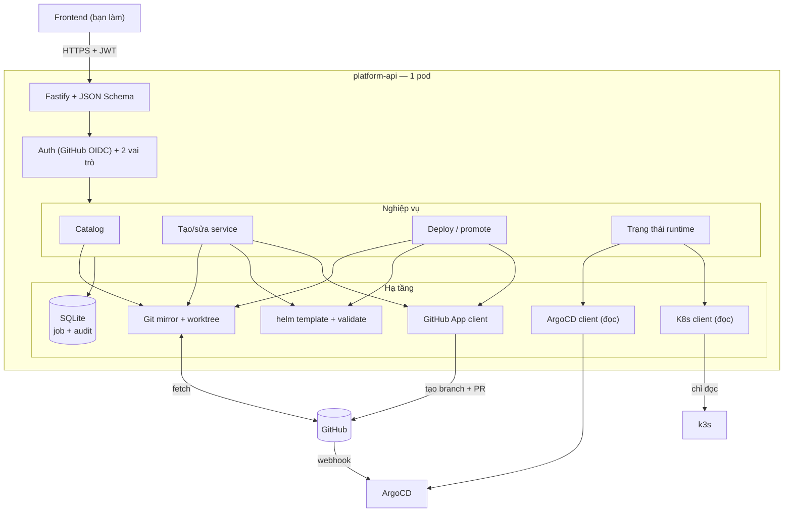
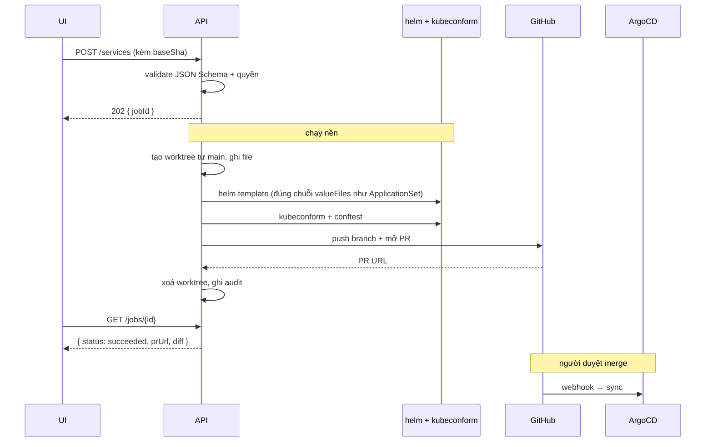
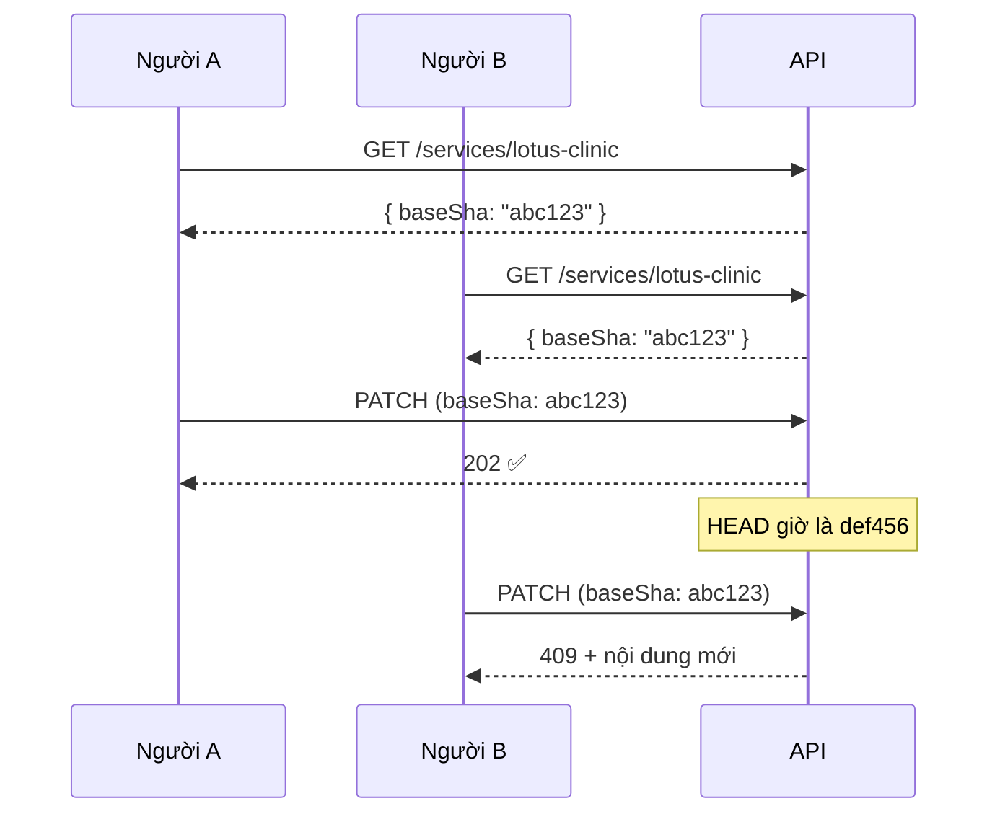
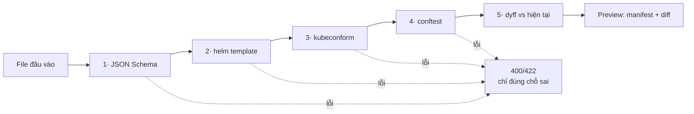

# Kế hoạch Platform API (Backend)

| | |
|---|---|
| **Trạng thái** | Bản nháp · **Tuỳ chọn — chỉ làm khi thấy thật sự cần** |
| **Ngày** | 11/09/2026 |
| **Bối cảnh** | Đội 3 người, repo GitHub, 1 branch `main` |
| **Phạm vi** | Backend + hợp đồng API. Frontend do bạn tự làm. |
| **Liên quan** | [REFACTOR_PLAN.md](./REFACTOR_PLAN.md) · [SECRET_MANAGEMENT.md](./SECRET_MANAGEMENT.md) |

---

## Đọc phần này trước

Với đội 3 người, tôi khuyên **làm theo 3 bước và dừng lại bất cứ lúc nào thấy đủ**:

| Bước | Nội dung | Công sức | Khi nào cần |
|---|---|---|---|
| **0** | `make new-service` — script scaffold CLI | **1 ngày** | Ngay. Giải quyết ~80% nhu cầu. |
| **1** | API + UI **chỉ đọc**: danh mục service, trạng thái, log | 1,5 tuần | Khi phải mở 3 tab (ArgoCD, GitHub, terminal) mới biết cái gì đang chạy |
| **2** | API **ghi**: tạo service, deploy, promote qua PR | 2 tuần | Khi có người ngoài đội hạ tầng cần deploy |

**Bước 0 rất có thể là đủ.** Ba người đều biết `kubectl` và `git` thì một script tốt có giá trị hơn một web app phải bảo trì.

Tài liệu này mô tả đầy đủ Bước 1 và 2 để bạn có hợp đồng API sẵn sàng khi cần. Nhưng đừng xây trước khi thấy đau.

---

## Mục lục

- [1. Bước 0 — script scaffold](#1-bước-0--script-scaffold)
- [2. Nguyên tắc](#2-nguyên-tắc)
- [3. Kiến trúc](#3-kiến-trúc)
- [4. Công nghệ](#4-công-nghệ)
- [5. Lớp Git](#5-lớp-git)
- [6. Lớp render](#6-lớp-render)
- [7. Quy ước API](#7-quy-ước-api)
- [8. HỢP ĐỒNG API](#8-hợp-đồng-api)
- [9. Phân quyền](#9-phân-quyền)
- [10. Triển khai](#10-triển-khai)
- [11. Lộ trình](#11-lộ-trình)

---

## 1. Bước 0 — script scaffold

Làm cái này trước. Một ngày công, không phải bảo trì gì.

```bash
#!/usr/bin/env bash
# ci/scripts/new-service.sh <tên> <chart>
set -euo pipefail
NAME="$1"; CHART="${2:-webservice}"
DIR="registry/apps/$NAME"

[[ "$NAME" =~ ^[a-z0-9]([-a-z0-9]*[a-z0-9])?$ ]] || { echo "Tên không hợp lệ"; exit 1; }
[ -d "$DIR" ] && { echo "$NAME đã tồn tại"; exit 1; }

mkdir -p "$DIR"
sed -e "s/{{NAME}}/$NAME/g" -e "s|{{CHART}}|$CHART|g" \
    ci/templates/service.yaml > "$DIR/service.yaml"
sed -e "s/{{NAME}}/$NAME/g" -e "s/{{ENV}}/dev/g" \
    ci/templates/values.yaml > "$DIR/values-dev.yaml"
sed -e "s/{{NAME}}/$NAME/g" -e "s/{{ENV}}/prod/g" \
    ci/templates/values.yaml > "$DIR/values-prod.yaml"

git checkout -b "add-$NAME"
git add "$DIR" && git commit -m "feat($NAME): thêm service mới"
git push -u origin "add-$NAME"
gh pr create --fill --base main

echo "✅ Đã mở PR. ArgoCD sẽ tạo Application sau khi merge."
```

Khuôn mẫu trong `ci/templates/` phải **đúng sẵn** — có resource limits, có probe, có ServiceMonitor, có khai báo `requiredSecrets`. Đây là khái niệm "golden path": làm đúng phải dễ hơn làm sai.

Cùng một logic này sau đó trở thành phần lõi của API ở Bước 2, nên không có công sức nào bị bỏ đi.

---

## 2. Nguyên tắc

| # | Nguyên tắc | Nghĩa là |
|---|---|---|
| **N1** | **Backend ghi vào Git, không ghi vào cluster** | Không `kubectl apply`, không `helm install`. |
| **N2** | **Backend chỉ mở PR, không push vào `main`** | Nhờ quyết định Q2 của [REFACTOR_PLAN](./REFACTOR_PLAN.md#1-bảy-quyết-định-nền-tảng), mọi thay đổi đều qua PR — kể cả bump tag dev. Backend không bao giờ cần quyền push `main`. |
| **N3** | **Xem trước rồi mới ghi** | Mọi thao tác ghi có endpoint `preview` trả về diff YAML thật. |
| **N4** | **Kiểm tra ở backend, không chỉ ở CI** | `helm template` + `kubeconform` + `conftest` chạy **trước khi** mở PR. Biết sai ngay, không chờ CI. |

### Vì sao N1 quan trọng

Nếu backend gọi thẳng Kubernetes API thì ArgoCD với `selfHeal: true` sẽ **hoàn tác** thay đổi sau vài phút. Người dùng thấy thay đổi rồi tự biến mất, không hiểu vì sao. Ngoài ra cluster có trạng thái không có trong Git → mất khả năng tái tạo.

### N2 làm bảo mật đơn giản hơn nhiều

Backend chỉ cần GitHub App với quyền: tạo branch + mở PR. Không cần token bypass branch protection. Kẻ chiếm được backend chỉ mở được PR — vẫn cần người duyệt. Xem [SECRET_MANAGEMENT §5 Hàng rào 3](./SECRET_MANAGEMENT.md#hàng-rào-3--backend-không-push-được-vào-main).

---

## 3. Kiến trúc



### Luồng một thao tác ghi



---

## 4. Công nghệ

| Thành phần | Chọn | Lý do |
|---|---|---|
| Runtime | **Node.js 20 + TypeScript** | Đội đã quen |
| HTTP | **Fastify 5** | Validate bằng JSON Schema là cơ chế gốc — khớp nguyên tắc "schema là hợp đồng". Tự sinh OpenAPI. |
| Tài liệu API | **@fastify/swagger** | `GET /openapi.json` + Swagger UI ở `/docs` → bạn sinh client TypeScript cho UI |
| Git | **`simple-git`** + gọi `git` trực tiếp | Cần worktree, `isomorphic-git` không hỗ trợ tốt |
| YAML | **`yaml` (eemeli)** | Giữ nguyên comment và thứ tự khi sửa → diff sạch |
| Schema | **Ajv 8** (draft 2020-12) | Cùng thư viện với CI → hành vi giống hệt |
| GitHub | **Octokit** (GitHub App) | Chính thức |
| Kubernetes | **`@kubernetes/client-node`** | Chính thức |
| Database | **SQLite** (`better-sqlite3`) + PVC | Dữ liệu nhỏ, 1 replica → nhất quán |
| Hàng đợi job | **`p-queue`** trong tiến trình | 1 replica, tải thấp. Không cần Redis. |
| Log | **`pino`** + middleware danh sách trắng | Xem [SECRET_MANAGEMENT](./SECRET_MANAGEMENT.md#hàng-rào-4--không-có-api-nào-trả-về-giá-trị-secret) |

**1 replica.** Backend giữ git mirror cục bộ và hàng đợi trong bộ nhớ. Nhiều replica sẽ cần khoá phân tán — không đáng ở tải này. Đánh đổi: downtime ngắn khi deploy, chấp nhận được vì mọi thao tác đều bất đồng bộ và thử lại được.

---

## 5. Lớp Git

### 5.1. Mirror + worktree

```text
/data/
├── repo.git/          # bare mirror, chỉ fetch, không checkout
├── worktrees/<jobId>/ # tạm, dùng xong xoá
└── platform.db
```

**Đọc** — không cần worktree:

```ts
const readFile = (path: string) =>
  exec('git', ['-C', REPO, 'show', `origin/main:${path}`]);

const listFiles = (glob: string) =>
  exec('git', ['-C', REPO, 'ls-tree', '-r', '--name-only', 'origin/main', '--', glob])
    .then(o => o.split('\n').filter(Boolean));
```

Vài mili giây, không đụng đĩa, không tranh chấp giữa các request.

**Ghi** — worktree tạm:

```ts
async function withWorktree<T>(branch: string, fn: (dir: string) => Promise<T>) {
  const dir = `${WORKTREES}/${ulid()}`;
  await exec('git', ['-C', REPO, 'fetch', 'origin', 'main']);
  await exec('git', ['-C', REPO, 'worktree', 'add', '-b', branch, dir, 'origin/main']);
  try {
    return await fn(dir);
  } finally {
    await exec('git', ['-C', REPO, 'worktree', 'remove', '--force', dir]).catch(() => {});
    await exec('git', ['-C', REPO, 'branch', '-D', branch]).catch(() => {});
  }
}
```

Đồng bộ mirror: mỗi 60 giây + khi nhận webhook GitHub + luôn luôn trước mỗi thao tác ghi.

### 5.2. Chống ghi đè

Khoá lạc quan bằng git SHA:



Quy tắc: `baseSha` khác HEAD **nhưng file liên quan không đổi** → vẫn cho ghi. Chỉ chặn khi đúng file đó đã đổi.

### 5.3. Đặt tên branch

| Thao tác | Branch | PR vào |
|---|---|---|
| Tạo service | `platform/add-<tên>` | `main` |
| Sửa cấu hình | `platform/update-<tên>` | `main` |
| Deploy dev | `platform/deploy-<tên>-dev-<tag>` | `main` *(tự merge khi CI xanh)* |
| Deploy/promote prod | `platform/release-<tên>-<tag>` | `main` *(cần 1 approval)* |
| Xoá service | `platform/remove-<tên>` | `main` |
| Secret | `platform/secret-<tên>-<env>` | `main` |

Tiền tố `platform/` cố định. GitHub App không có quyền push `main`, chỉ tạo được branch và PR.

> **Deploy dev vẫn qua PR nhưng tự merge** nhờ workflow `auto-merge-dev.yml` ([REFACTOR_PLAN §6.3](./REFACTOR_PLAN.md#63-vì-sao-dev-cũng-dùng-pr-q2)). Người dùng cảm nhận như deploy trực tiếp, nhưng vẫn có audit đầy đủ và backend không cần đặc quyền nào.

---

## 6. Lớp render

Backend phải render **giống hệt ArgoCD** thì preview mới có nghĩa:

```ts
const args = [
  'template', name, `${wt}/charts/${chart}`,
  '--values', `${wt}/charts/${chart}/values.yaml`,
  '--values', `${wt}/env/${env}.yaml`,
  '--values', `${wt}/registry/apps/${name}/values-${env}.yaml`,
  '--set', `global.serviceName=${name}`,
  '--namespace', `${name}-${env}`,
];
```

> ⚠️ Thứ tự `--values` phải khớp **chính xác** với `valueFiles` trong ApplicationSet. Lệch thứ tự là preview nói một đằng, ArgoCD làm một nẻo.
>
> **Cách chống:** một test so mảng `--values` của backend với `valueFiles` parse từ `gitops/bootstrap/appset-apps.yaml`. Chạy trong CI.

### Chuỗi kiểm tra



Lỗi phải chỉ đúng chỗ, không dán stack trace:

```json
{
  "type": "https://hnq.dev/errors/validation",
  "title": "Cấu hình không hợp lệ",
  "status": 422,
  "stage": "policy",
  "violations": [{
    "rule": "require-resource-limits",
    "path": "spec.template.spec.containers[0].resources.limits",
    "message": "Container 'backend' thiếu resources.limits",
    "hint": "Thêm resources.limits vào values-prod.yaml"
  }]
}
```

Cache render theo `sha256(chartSha + valuesSha + env)`, TTL 1 giờ — render mất 3–10 giây.

---

## 7. Quy ước API

| | |
|---|---|
| Base URL | `https://platform.l2cteam.work/api/v1` |
| Xác thực | `Authorization: Bearer <JWT>` — đăng nhập qua GitHub OIDC |
| Tài liệu | `GET /api/v1/openapi.json` · Swagger UI ở `/docs` |
| Lỗi | `application/problem+json` (RFC 9457) |

> **Cho phía frontend:** OpenAPI sinh tự động từ JSON Schema của từng route nên **luôn khớp code**.
> ```bash
> npx openapi-typescript https://platform.l2cteam.work/api/v1/openapi.json -o src/api.d.ts
> ```

### Sync hay async

| Loại | Cách |
|---|---|
| **Đọc** (catalog, status) | Đồng bộ |
| **Ghi** và **preview** | `202 Accepted` + `jobId`, poll `GET /jobs/{id}` mỗi 1–2 giây |
| **Log** | SSE |

Preview cũng async vì `helm template` + validate mất 3–15 giây.

### Mã lỗi

| Mã | Khi nào |
|---|---|
| `400` | Sai định dạng / không qua schema |
| `401` / `403` | Chưa đăng nhập / không đủ quyền |
| `404` | Không tìm thấy |
| `409` | Xung đột phiên bản (`baseSha` cũ) |
| `422` | Đúng định dạng nhưng không qua policy/render |
| `502` | GitHub / ArgoCD / k8s không phản hồi |

### Chống gửi trùng

```http
Idempotency-Key: 01J8XQF3K2M4N5P6R7S8T9V0W1
```

Gửi lại cùng khoá trong 24 giờ → trả về job cũ, không tạo PR thứ hai.

---

## 8. HỢP ĐỒNG API

### Bảng tổng hợp

| Method | Endpoint | Quyền | Bước |
|---|---|---|---|
| `POST` | `/auth/github/callback` | — | 1 |
| `GET` | `/auth/me` | dev | 1 |
| `GET` | `/meta/schema/service` | dev | 1 |
| `GET` | `/meta/charts` | dev | 1 |
| `GET` | `/meta/environments` | dev | 1 |
| `GET` | `/services` | dev | **1** |
| `GET` | `/services/{name}` | dev | **1** |
| `GET` | `/services/{name}/manifest/{env}` | dev | 1 |
| `GET` | `/services/{name}/status` | dev | **1** |
| `GET` | `/services/{name}/pods` | dev | 1 |
| `GET` | `/services/{name}/logs` | dev | **1** (SSE) |
| `GET` | `/services/{name}/events` | dev | 1 |
| `POST` | `/services/{name}/sync` | dev | 1 |
| `GET` | `/services/{name}/releases` | dev | 1 |
| `GET` | `/promotions` | dev | 1 |
| `POST` | `/services/preview` | dev | **2** |
| `POST` | `/services` | dev | **2** |
| `PATCH` | `/services/{name}` | dev | 2 |
| `DELETE` | `/services/{name}` | admin | 2 |
| `POST` | `/services/{name}/deploy` | dev (dev) / admin (prod) | **2** |
| `POST` | `/services/{name}/promote` | admin | **2** |
| `POST` | `/services/{name}/rollback` | admin | 2 |
| `GET` | `/secrets/public-key` | dev | 2 |
| `GET` | `/services/{name}/secrets` | dev | 2 |
| `PUT` | `/services/{name}/secrets` | admin | 2 |
| `GET` | `/jobs/{id}` | chủ job / admin | 2 |
| `GET` | `/audit` | admin | 2 |

---

### 8.1. Xác thực

Dùng **GitHub OIDC**, không tự quản mật khẩu. Vai trò suy ra từ GitHub team.

```jsonc
// GET /auth/me → 200
{
  "username": "nguyen-van-a",
  "role": "admin",                    // developer | admin
  "githubTeams": ["hunho247/infra"],
  "permissions": {
    "dev":  ["read", "write", "deploy", "sync"],
    "prod": ["read", "write", "deploy", "sync"]
  }
}
```

---

### 8.2. Siêu dữ liệu

#### `GET /meta/schema/service`

Trả về `registry/schema/service.schema.json` đọc từ `main`. Frontend dùng sinh form.

```jsonc
{
  "$schema": "https://json-schema.org/draft/2020-12/schema",
  "type": "object",
  "required": ["apiVersion", "kind", "metadata", "spec"],
  "properties": {
    "metadata": {
      "type": "object",
      "required": ["name", "owner"],
      "properties": {
        "name": {
          "type": "string",
          "pattern": "^[a-z0-9]([-a-z0-9]*[a-z0-9])?$",
          "maxLength": 40,
          "title": "Tên service",
          "description": "Chữ thường, số, gạch ngang"
        },
        "owner": { "type": "string", "title": "Đội sở hữu" }
      }
    },
    "spec": {
      "type": "object",
      "required": ["category", "chart", "environments"],
      "properties": {
        "category": { "enum": ["app", "platform"], "title": "Loại" },
        "chart":    { "enum": ["webservice", "datastore"], "title": "Chart" },
        "environments": {
          "type": "array", "minItems": 1, "title": "Môi trường",
          "items": {
            "type": "object", "required": ["env"],
            "properties": { "env": { "enum": ["dev", "prod"] } }
          }
        },
        "requiredSecrets": {
          "type": "array", "title": "Secret cần thiết",
          "items": {
            "type": "object", "required": ["name", "keys"],
            "properties": {
              "name": { "type": "string" },
              "keys": { "type": "array", "items": { "type": "string" } },
              "type": { "enum": ["text", "binary"], "default": "text" }
            }
          }
        }
      }
    }
  }
}
```

#### `GET /meta/environments`

```jsonc
{
  "environments": [
    {
      "name": "dev",
      "autoMerge": true,              // PR bump tag dev tự merge
      "prune": true,
      "domainSuffix": "l2cteam.work",
      "defaults": { /* nội dung env/dev.yaml */ }
    },
    {
      "name": "prod",
      "autoMerge": false,             // cần 1 approval
      "prune": false,
      "domainSuffix": "l2cteam.work",
      "defaults": { /* env/prod.yaml */ }
    }
  ]
}
```

---

### 8.3. Danh mục — Bước 1

#### `GET /services`

```http
GET /services?category=app&env=prod&q=clinic
```

```jsonc
{
  "items": [{
    "name": "lotus-clinic",
    "owner": "team-clinic",
    "category": "app",
    "chart": "webservice",
    "environments": [
      {
        "env": "dev",
        "namespace": "lotus-clinic-dev",
        "imageTag": "7bcd1234",
        "status": { "sync": "Synced", "health": "Healthy" },
        "url": "https://lotus-dev.l2cteam.work"
      },
      {
        "env": "prod",
        "namespace": "lotus-clinic-prod",
        "imageTag": "f1eb557d",
        "status": { "sync": "Synced", "health": "Healthy" },
        "url": "https://lotus.l2cteam.work"
      }
    ],
    "promotionPending": true,         // dev đang chạy tag mới hơn prod
    "updatedAt": "2026-09-10T08:12:00Z"
  }],
  "total": 11,
  "baseSha": "abc123f"
}
```

#### `GET /services/{name}`

```jsonc
{
  "name": "lotus-clinic",
  "owner": "team-clinic",
  "spec": { /* toàn bộ service.yaml */ },
  "environments": [{
    "env": "dev",
    "namespace": "lotus-clinic-dev",
    "values": { /* values-dev.yaml đã parse */ },
    "effectiveValues": { /* sau khi gộp chart + env + service */ },
    "status": {
      "sync": "Synced", "health": "Healthy",
      "argocdApp": "lotus-clinic-dev",
      "lastSyncAt": "2026-09-10T08:15:00Z",
      "revision": "a1b2c3d"
    }
  }],
  "requiredSecrets": [
    { "name": "lotus-clinic-backend", "keys": ["DB_PASSWORD", "JWT_SECRET"], "exists": true }
  ],
  "files": {
    "service":    "registry/apps/lotus-clinic/service.yaml",
    "valuesDev":  "registry/apps/lotus-clinic/values-dev.yaml",
    "valuesProd": "registry/apps/lotus-clinic/values-prod.yaml"
  },
  "baseSha": "abc123f"
}
```

> `effectiveValues` là giá trị **sau khi gộp 3 tầng**. Hữu ích cho UI: hiện được "giá trị thực tế đang chạy" và "cái nào do bạn ghi đè".

---

### 8.4. Trạng thái runtime — Bước 1

#### `GET /services/{name}/status?env=dev`

```jsonc
{
  "service": "lotus-clinic", "env": "dev",
  "argocd": {
    "application": "lotus-clinic-dev",
    "sync": "Synced", "health": "Healthy",
    "revision": "3a4b5c6",
    "lastSyncAt": "2026-09-11T08:30:00Z"
  },
  "workload": {
    "replicas": { "desired": 1, "ready": 1, "available": 1 },
    "image": "ghcr.io/hnq-tech/lotus-backend:7bcd1234",
    "restarts24h": 0
  },
  "endpoints": [
    { "type": "ingress", "url": "https://lotus-dev.l2cteam.work", "tls": true }
  ],
  "resources": [
    { "kind": "Deployment", "name": "backend", "status": "Healthy" },
    { "kind": "Service",    "name": "backend", "status": "Healthy" },
    { "kind": "Ingress",    "name": "backend", "status": "Healthy" }
  ]
}
```

#### `POST /services/{name}/sync?env=dev`

Thao tác **duy nhất** chạm vào cluster — và chỉ là bảo ArgoCD đọc lại Git.

```jsonc
// Request
{ "prune": false }

// 200
{ "application": "lotus-clinic-dev", "phase": "Running", "startedAt": "..." }
```

#### `GET /services/{name}/logs?env=dev&pod=...&tail=200&follow=true`

SSE:

```
event: log
data: {"ts":"2026-09-11T09:00:01Z","pod":"backend-7d4b8c9f5-x2k9p","line":"Server listening on :1001"}

event: end
data: {"reason":"client_closed"}
```

> ⚠️ Log có thể chứa secret nếu ứng dụng lỡ in ra. Mọi lần xem log đều ghi vào audit.

#### `GET /promotions`

Trả lời: *"cái gì đang ở dev mà chưa lên prod, bao lâu rồi?"*

```jsonc
{
  "services": [
    {
      "name": "lotus-clinic",
      "devTag": "7bcd1234", "prodTag": "f1eb557d",
      "pending": true,
      "devDeployedAt": "2026-09-10T08:12:00Z",
      "daysInDev": 1,
      "promoteUrl": "/api/v1/services/lotus-clinic/promote"
    },
    {
      "name": "hocmon-clinic",
      "devTag": "abc1234", "prodTag": null,
      "pending": true,
      "reason": "prod_env_not_enabled",
      "daysInDev": 14,
      "hint": "Thêm { env: prod } vào spec.environments"
    }
  ]
}
```

---

### 8.5. Tạo và sửa service — Bước 2

#### `POST /services/preview`

Endpoint quan trọng nhất cho trải nghiệm: UI hiện diff **trước khi** người dùng bấm xác nhận.

```jsonc
// Request
{
  "operation": "create",
  "service": {
    "apiVersion": "hnq.dev/v1",
    "kind": "ServiceRelease",
    "metadata": { "name": "abc-clinic", "owner": "team-clinic" },
    "spec": {
      "category": "app",
      "chart": "webservice",
      "environments": [{ "env": "dev" }]
    }
  },
  "values": {
    "dev": {
      "image": { "repository": "ghcr.io/hnq-tech/abc-backend", "tag": "abc1234" },
      "ingress": { "host": "abc-dev.l2cteam.work" }
    }
  }
}
```

```jsonc
// 202 → GET /jobs/{id} khi xong
{
  "status": "succeeded",
  "progress": [
    { "stage": "schema",      "status": "passed", "durationMs": 12 },
    { "stage": "render",      "status": "passed", "durationMs": 3200 },
    { "stage": "kubeconform", "status": "passed", "durationMs": 450 },
    { "stage": "policy",      "status": "passed", "durationMs": 180 }
  ],
  "result": {
    "valid": true,
    "files": [
      { "path": "registry/apps/abc-clinic/service.yaml",    "action": "create", "content": "..." },
      { "path": "registry/apps/abc-clinic/values-dev.yaml", "action": "create", "content": "..." }
    ],
    "resources": [
      { "kind": "Deployment", "name": "backend", "action": "create" },
      { "kind": "Service",    "name": "backend", "action": "create" },
      { "kind": "Ingress",    "name": "backend", "action": "create" }
    ],
    "diff": "+ Deployment/backend\n+ Service/backend\n+ Ingress/backend",
    "warnings": ["Chưa khai báo requiredSecrets — nếu app cần secret, hãy bổ sung."]
  }
}
```

Khi không hợp lệ:

```jsonc
{
  "status": "succeeded",              // job chạy xong
  "result": {
    "valid": false,                   // nhưng cấu hình sai
    "violations": [{
      "stage": "policy",
      "rule": "require-resource-limits",
      "message": "Container 'backend' thiếu resources.limits",
      "severity": "error",
      "hint": "Để env/dev.yaml tự áp dụng, hoặc ghi rõ trong values-dev.yaml"
    }]
  }
}
```

> Phân biệt: `job.status` = job có chạy xong không. `result.valid` = cấu hình có hợp lệ không. Cấu hình sai **không phải** job lỗi.

#### `POST /services`

```jsonc
// Request — như preview, thêm mô tả PR
{
  "service": { /* ... */ },
  "values":  { /* ... */ },
  "pullRequest": {
    "title": "feat(abc-clinic): thêm service mới",
    "body": "Môi trường dev cho phòng khám ABC",
    "reviewers": ["tran-van-b"]
  }
}

// 202 → GET /jobs/{id}
{
  "status": "succeeded",
  "result": {
    "branch": "platform/add-abc-clinic",
    "prUrl": "https://github.com/hunho247/HNQ-Infra/pull/42",
    "prNumber": 42,
    "filesChanged": [
      "registry/apps/abc-clinic/service.yaml",
      "registry/apps/abc-clinic/values-dev.yaml"
    ],
    "nextStep": "Chờ duyệt PR. Sau khi merge, ArgoCD tự tạo Application abc-clinic-dev."
  }
}
```

#### `PATCH /services/{name}`

```jsonc
// Request
{
  "baseSha": "abc123f",               // BẮT BUỘC
  "patch": {
    "values": { "prod": { "replicas": 3 } }
  },
  "pullRequest": { "title": "perf(lotus-clinic): prod lên 3 replica" }
}

// 409 nếu người khác đã sửa
{
  "type": "https://hnq.dev/errors/conflict",
  "title": "Cấu hình đã bị thay đổi bởi người khác",
  "status": 409,
  "currentSha": "def456a", "yourSha": "abc123f",
  "conflictingPaths": ["registry/apps/lotus-clinic/values-prod.yaml"],
  "currentContent": { /* nội dung mới để client tự gộp */ }
}
```

---

### 8.6. Deploy và promote — Bước 2

#### `POST /services/{name}/deploy`

```jsonc
// Request
{ "env": "dev", "imageTag": "7bcd1234", "reason": "Sửa lỗi tính phí khám" }
```

```jsonc
// dev → PR tự merge
{
  "status": "succeeded",
  "result": {
    "mode": "pr_auto_merge",
    "prUrl": "https://github.com/hunho247/HNQ-Infra/pull/43",
    "previousTag": "6aebe241", "newTag": "7bcd1234",
    "note": "PR sẽ tự merge khi CI xanh (~2 phút), rồi ArgoCD sync."
  }
}

// prod → PR cần duyệt
{
  "status": "succeeded",
  "result": {
    "mode": "pr_review_required",
    "prUrl": "https://github.com/hunho247/HNQ-Infra/pull/44",
    "previousTag": "f1eb557d", "newTag": "7bcd1234",
    "note": "Cần 1 approval theo CODEOWNERS."
  }
}
```

Kiểm tra trước khi cho deploy:

| Kiểm tra | Lỗi |
|---|---|
| Image tồn tại trong registry | `422 image-not-found` |
| Tag không phải `latest` | `422 policy-violation` |
| Người dùng có quyền ở môi trường đó | `403` |
| **Với prod: tag này đã chạy ở dev chưa** | `422 not-tested-in-dev` *(bỏ qua được bằng `"force": true`)* |

> Kiểm tra cuối là hiện thực hoá đúng quy trình bạn muốn: **test dev trước rồi mới prod**. Backend chủ động chặn thay vì dựa vào kỷ luật.

#### `POST /services/{name}/promote`

Copy tag từ dev sang prod — thao tác dùng nhiều nhất.

```jsonc
// Request
{ "reason": "Test xong ở dev, release cho khách" }

// 202 → GET /jobs/{id}
{
  "status": "succeeded",
  "result": {
    "fromTag": "7bcd1234", "previousProdTag": "f1eb557d",
    "prUrl": "https://github.com/hunho247/HNQ-Infra/pull/45",
    "daysInDev": 3,
    "changelog": [
      { "sha": "7bcd1234", "message": "fix: sửa lỗi tính phí khám", "author": "nguyen-van-a" },
      { "sha": "6aebe241", "message": "feat: báo cáo doanh thu",    "author": "tran-van-b" }
    ]
  }
}
```

`changelog` lấy từ git log của repo ứng dụng (giữa `previousProdTag` và `fromTag`) — để người duyệt PR biết đang duyệt cái gì.

#### `POST /services/{name}/rollback`

```jsonc
// Request
{ "env": "prod", "toTag": "f1eb557d", "reason": "Tag mới gây lỗi 500 ở trang thanh toán" }
// hoặc: { "env": "prod", "steps": 1, "reason": "..." }

// Kết quả
{
  "result": {
    "currentTag": "7bcd1234", "rollbackTo": "f1eb557d",
    "prUrl": "https://github.com/hunho247/HNQ-Infra/pull/46",
    "labels": ["urgent", "rollback"]
  }
}
```

> **Cân nhắc:** rollback prod vẫn cần PR + approval dù đang có sự cố. Muốn nhanh hơn, giải pháp đúng là **cấu hình GitHub cho phép merge PR nhãn `rollback` với 0 approval**, chứ không phải cho backend bỏ qua quy trình. Đường tắt trong code là đường tắt vĩnh viễn.
>
> Với 3 người, cách thực tế nhất khi khẩn cấp: sửa `values-prod.yaml` trực tiếp trên GitHub web và tự merge. Backend không cần giải quyết mọi tình huống.

---

### 8.7. Secret — Bước 2

Thiết kế đầy đủ ở [SECRET_MANAGEMENT §5](./SECRET_MANAGEMENT.md#5-khi-có-platform-api).

#### `GET /services/{name}/secrets?env=prod`

**Không bao giờ trả về giá trị.**

```jsonc
{
  "service": "lotus-clinic", "env": "prod",
  "secrets": [
    {
      "name": "lotus-clinic-backend",
      "declared": true, "exists": true,
      "keys": [
        { "key": "DB_PASSWORD", "updatedAt": "2026-08-01T10:00:00Z", "updatedBy": "tran-van-b", "ageDays": 41 },
        { "key": "JWT_SECRET",  "updatedAt": "2026-03-15T08:00:00Z", "ageDays": 180, "rotationDue": true }
      ],
      "file": "secrets/prod/lotus-clinic/backend.yaml"
    },
    { "name": "lotus-clinic-keystore", "declared": true, "exists": false, "keys": [] }
  ],
  "warnings": [
    "Secret 'lotus-clinic-keystore' được khai báo là cần nhưng chưa có ở prod.",
    "'JWT_SECRET' đã 180 ngày chưa đổi (khuyến nghị 90 ngày)."
  ]
}
```

#### `PUT /services/{name}/secrets?env=prod`

Nhận **một trong hai** dạng — cả hai đều là dữ liệu đã mã hoá, backend không bao giờ thấy bản rõ:

```jsonc
// (a) Trình duyệt đã mã hoá
{
  "baseSha": "abc123f",
  "secretName": "lotus-clinic-backend",
  "mode": "sealed",
  "sealed": { "DB_PASSWORD": "AgBv7Kq2mN8x..." },
  "reason": "Xoay vòng quý 3"
}

// (b) Dán kết quả kubeseal từ máy mình
{
  "baseSha": "abc123f",
  "mode": "manifest",
  "manifest": "apiVersion: bitnami.com/v1alpha1\nkind: SealedSecret\n...",
  "reason": "..."
}
```

> **Không có chế độ gửi bản rõ.** Đây là khác biệt so với bản trước — với 3 người thì `kubeseal` là đủ, không cần chấp nhận rủi ro để đổi lấy tiện lợi.

```jsonc
// 202 → GET /jobs/{id}
{
  "result": {
    "prUrl": "https://github.com/hunho247/HNQ-Infra/pull/47",
    "secretName": "lotus-clinic-backend",
    "keysChanged": ["DB_PASSWORD"],
    "podRestartTriggered": true,      // đã cập nhật secretChecksum trong cùng PR
    "warning": "Pod sẽ khởi động lại khi PR được merge."
  }
}
```

Backend kiểm tra trước khi commit:

| Kiểm tra | Lỗi |
|---|---|
| SealedSecret hợp lệ về cú pháp | `400 invalid-sealed-secret` |
| `metadata.namespace` khớp `<service>-<env>` | `422 namespace-mismatch` |
| Phạm vi là `strict` | `422 unsafe-scope` |
| Key khớp `requiredSecrets` | `422 undeclared-key` *(cảnh báo, bỏ qua được)* |

---

### 8.8. Job và audit

#### `GET /jobs/{id}`

```jsonc
{
  "id": "01J8XQF3K2M4N5P6R7S8T9V0W1",
  "type": "service.create",
  "status": "running",                // queued|running|succeeded|failed|cancelled
  "actor": "nguyen-van-a",
  "createdAt": "2026-09-11T09:00:00Z",
  "progress": [
    { "stage": "schema",       "status": "passed",  "durationMs": 12 },
    { "stage": "render",       "status": "passed",  "durationMs": 3200 },
    { "stage": "kubeconform",  "status": "running" },
    { "stage": "policy",       "status": "pending" },
    { "stage": "pull_request", "status": "pending" }
  ],
  "result": null, "error": null
}
```

#### `GET /audit`

```jsonc
{
  "items": [{
    "ts": "2026-09-11T09:15:22Z",
    "actor": "nguyen-van-a",
    "action": "secret.update",
    "service": "lotus-clinic", "env": "prod",
    "detail": { "secretName": "lotus-clinic-backend", "keyNames": ["DB_PASSWORD"] },
    "result": "pr_opened",
    "prUrl": "https://github.com/hunho247/HNQ-Infra/pull/47"
  }],
  "nextCursor": "...", "hasMore": true
}
```

`detail` chỉ có **tên** key, không bao giờ có giá trị.

---

## 9. Phân quyền

Hai vai trò. Với 3 người thì bốn vai trò là bureaucracy.

| Vai trò | GitHub team | Xem | Sửa cấu hình | Deploy dev | Deploy prod | Secret | Xoá service |
|---|---|:---:|:---:|:---:|:---:|:---:|:---:|
| `developer` | mọi thành viên | ✅ | ✅ (PR) | ✅ | ❌ | 👁 metadata | ❌ |
| `admin` | `hunho247/infra` | ✅ | ✅ | ✅ | ✅ | ✅ ghi | ✅ |

```ts
// Kiểm ở middleware, không rải rác trong handler
const RULES = {
  'deploy':         { dev: 'developer', prod: 'admin' },
  'sync':           { dev: 'developer', prod: 'admin' },
  'service.write':  { dev: 'developer', prod: 'developer' },  // vẫn qua PR nên an toàn
  'service.delete': { dev: 'admin',     prod: 'admin' },
  'secret.write':   { dev: 'admin',     prod: 'admin' },
};
```

> **Quan trọng:** API không được rộng hơn quyền thật. Việc chặn `deploy prod` ở tầng API chỉ là trải nghiệm tốt hơn — rào chắn thật nằm ở **CODEOWNERS + branch protection của GitHub**. Ngay cả khi API bị bypass, PR vẫn cần approval.

---

## 10. Triển khai

### 10.1. Chính nó là một service trong registry

```yaml
# registry/apps/platform-api/service.yaml
apiVersion: hnq.dev/v1
kind: ServiceRelease
metadata:
  name: platform-api
  owner: team-infra
spec:
  category: platform
  chart: webservice
  environments:
    - env: prod
  requiredSecrets:
    - name: platform-api
      keys: [JWT_SECRET, GITHUB_APP_ID, GITHUB_APP_PRIVATE_KEY, ARGOCD_TOKEN]
```

Backend deploy chính nó bằng đúng cơ chế nó quản lý — vừa gọn, vừa là bài kiểm tra tốt.

### 10.2. Biến môi trường

```yaml
env:
  - { name: REPO_URL,       value: "https://github.com/hunho247/HNQ-Infra.git" }
  - { name: REPO_CACHE_DIR, value: "/data/repo.git" }
  - { name: DB_PATH,        value: "/data/platform.db" }
  - { name: ARGOCD_URL,     value: "http://argocd-server.argocd.svc" }
  - { name: GITHUB_OWNER,   value: "hunho247" }
  - { name: GITHUB_REPO,    value: "HNQ-Infra" }

envFromSecret:
  enabled: true
  secretName: platform-api
```

### 10.3. Quyền GitHub App

| Quyền | Mức | Vì sao |
|---|---|---|
| Contents | Write | Tạo branch |
| Pull requests | Write | Mở PR |
| Metadata | Read | Bắt buộc |
| **`main`** | Protected | App **không** nằm trong danh sách bypass |

Kiểm chứng: thử `git push` vào `main` bằng token của App — phải bị từ chối.

### 10.4. Quyền Kubernetes

Xem [SECRET_MANAGEMENT §5 Hàng rào 2](./SECRET_MANAGEMENT.md#hàng-rào-2--backend-không-đọc-được-secret-trong-cluster). Tóm tắt:

- ✅ Đọc: `pods`, `services`, `events`, `configmaps`, `pods/log`, `deployments`, `statefulsets`, `applications`
- ❌ **Không quyền nào** trên `secrets`
- ❌ **Không** `create`/`update`/`delete` trên bất cứ thứ gì

```bash
SA=system:serviceaccount:platform-api-prod:platform-api
kubectl auth can-i get    secrets     --as=$SA -A   # no
kubectl auth can-i create deployments --as=$SA -A   # no
kubectl auth can-i get    pods        --as=$SA -A   # yes
```

Đưa 3 lệnh này vào GitHub Actions chạy sau mỗi lần deploy.

### 10.5. Image

```dockerfile
FROM node:20-alpine AS build
WORKDIR /app
COPY package*.json ./
RUN npm ci
COPY . .
RUN npm run build && npm prune --production

FROM node:20-alpine
RUN apk add --no-cache git ca-certificates

# Phiên bản phải KHỚP với .github/workflows/validate.yml
ARG HELM_VERSION=3.16.0
ARG KUBECONFORM_VERSION=0.6.7
ARG CONFTEST_VERSION=0.56.0
RUN set -eux; \
    wget -qO- "https://get.helm.sh/helm-v${HELM_VERSION}-linux-amd64.tar.gz" \
      | tar xz -C /tmp && mv /tmp/linux-amd64/helm /usr/local/bin/; \
    wget -qO- "https://github.com/yannh/kubeconform/releases/download/v${KUBECONFORM_VERSION}/kubeconform-linux-amd64.tar.gz" \
      | tar xz -C /usr/local/bin kubeconform; \
    wget -qO- "https://github.com/open-policy-agent/conftest/releases/download/v${CONFTEST_VERSION}/conftest_${CONFTEST_VERSION}_Linux_x86_64.tar.gz" \
      | tar xz -C /usr/local/bin conftest

WORKDIR /app
COPY --from=build /app/dist ./dist
COPY --from=build /app/node_modules ./node_modules
USER 1000
EXPOSE 3000
CMD ["node", "dist/main.js"]
```

> Lệch phiên bản `helm`/`kubeconform`/`conftest` giữa image và CI là preview nói một đằng, CI nói một nẻo. Đặt làm biến chung trong một file, cả hai nơi cùng đọc.

---

## 11. Lộ trình

### Bước 0 — 1 ngày (nên làm ngay)

- [ ] `ci/scripts/new-service.sh` + `ci/templates/`
- [ ] `ci/scripts/promote.sh`
- [ ] `make new-service`, `make promote` trong Makefile

**Dừng ở đây và dùng vài tháng.** Nếu vẫn thấy khó chịu thì đi tiếp.

### Bước 1 — 1,5 tuần (chỉ đọc)

| Việc | Kết quả |
|---|---|
| Khởi tạo TypeScript + Fastify + OpenAPI | `/health`, `/openapi.json` |
| `GitRepository`: mirror + đọc file | Có unit test |
| Đăng nhập GitHub OIDC + 2 vai trò | Middleware kiểm quyền |
| `/meta/*`, `/services`, `/services/{name}` | Xong |
| `ArgoCDClient` + `K8sClient` (chỉ đọc) | Xong |
| `/status`, `/pods`, `/events`, `/logs` (SSE) | Xong |
| `/promotions`, `/sync` | Xong |

**Xong khi:** một trang duy nhất hiện được toàn bộ service, môi trường, tag, trạng thái, và mở được log.

> Đây thường là bước có tỷ lệ giá trị/công sức cao nhất. Không còn phải mở ArgoCD + GitHub + terminal cùng lúc.

### Bước 2 — 2 tuần (ghi)

| Việc | Kết quả |
|---|---|
| `Renderer` + test đối chiếu `valueFiles` với ApplicationSet | Job CI |
| `JobQueue` + `/jobs/{id}` | Xong |
| `POST /services/preview` | Diff thật |
| GitHub App: tạo branch + PR | Xong |
| `POST /services`, `PATCH`, `DELETE` | Xong |
| `/deploy`, `/promote`, `/rollback` | Xong |
| `/secrets` (chỉ metadata + ghi dạng đã mã hoá) | Xong |
| Audit log + middleware danh sách trắng | Xong + test |
| Kiểm chứng RBAC (3 lệnh `can-i`) | Job CI |

### Danh sách kiểm tra khi bàn giao

**Hợp đồng API**
- [ ] `GET /openapi.json` hợp lệ, đủ mọi endpoint
- [ ] `npx openapi-typescript <url> -o api.d.ts` chạy không lỗi
- [ ] Mọi endpoint có ví dụ request/response
- [ ] Mọi lỗi theo chuẩn `problem+json`

**Tính đúng đắn**
- [ ] Preview render **giống hệt** ArgoCD — có test tự động
- [ ] `baseSha` chặn được ghi đè — có test 2 người ghi đồng thời
- [ ] `Idempotency-Key` chặn PR trùng
- [ ] Job thất bại không để lại worktree rác

**Bảo mật**
- [ ] 3 lệnh `kubectl auth can-i` cho kết quả đúng
- [ ] GitHub App không push được `main` — đã thử thật
- [ ] Không endpoint nào trả về giá trị secret — đã rà toàn bộ route
- [ ] Middleware log dùng danh sách trắng — đã test với payload chứa secret

**Vận hành**
- [ ] `platform-api` tự deploy bằng registry của nó
- [ ] SQLite nằm trong lịch backup Velero
- [ ] Phiên bản helm/kubeconform/conftest khớp CI — có job kiểm tra

---

## Phụ lục — Khung OpenAPI

```yaml
openapi: 3.1.0
info:
  title: HNQ Platform API
  version: 1.0.0
  description: |
    Quản lý hạ tầng k3s qua GitOps.
    Mọi thay đổi ghi vào Git dưới dạng Pull Request — không ghi thẳng vào cluster.
    Thao tác ghi trả về 202 kèm jobId; theo dõi bằng GET /jobs/{id}.
servers:
  - url: https://platform.l2cteam.work/api/v1

security:
  - bearerAuth: []

components:
  securitySchemes:
    bearerAuth: { type: http, scheme: bearer, bearerFormat: JWT }

  schemas:
    Problem:
      type: object
      required: [type, title, status]
      properties:
        type:     { type: string, format: uri }
        title:    { type: string }
        status:   { type: integer }
        detail:   { type: string }

    Job:
      type: object
      required: [id, type, status, createdAt]
      properties:
        id:        { type: string, description: ULID }
        type:      { type: string }
        status:    { type: string, enum: [queued, running, succeeded, failed, cancelled] }
        progress:  { type: array, items: { $ref: '#/components/schemas/JobStage' } }
        result:    { type: object, nullable: true }
        error:     { $ref: '#/components/schemas/Problem', nullable: true }
        createdAt: { type: string, format: date-time }

    JobStage:
      type: object
      properties:
        stage:      { type: string, enum: [schema, render, kubeconform, policy, pull_request] }
        status:     { type: string, enum: [pending, running, passed, failed] }
        durationMs: { type: integer }

  responses:
    Accepted:
      description: Đã nhận, đang xử lý nền
      content:
        application/json:
          schema:
            type: object
            properties:
              jobId:     { type: string }
              statusUrl: { type: string }

# paths sinh tự động từ JSON Schema của từng route Fastify.
# Bản đầy đủ ở GET /openapi.json
```
