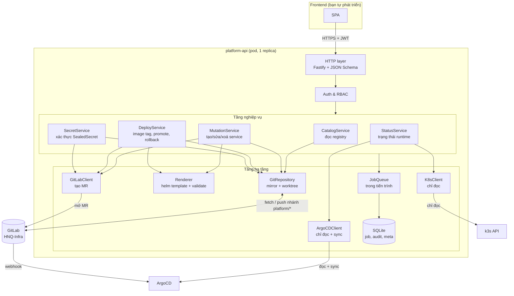
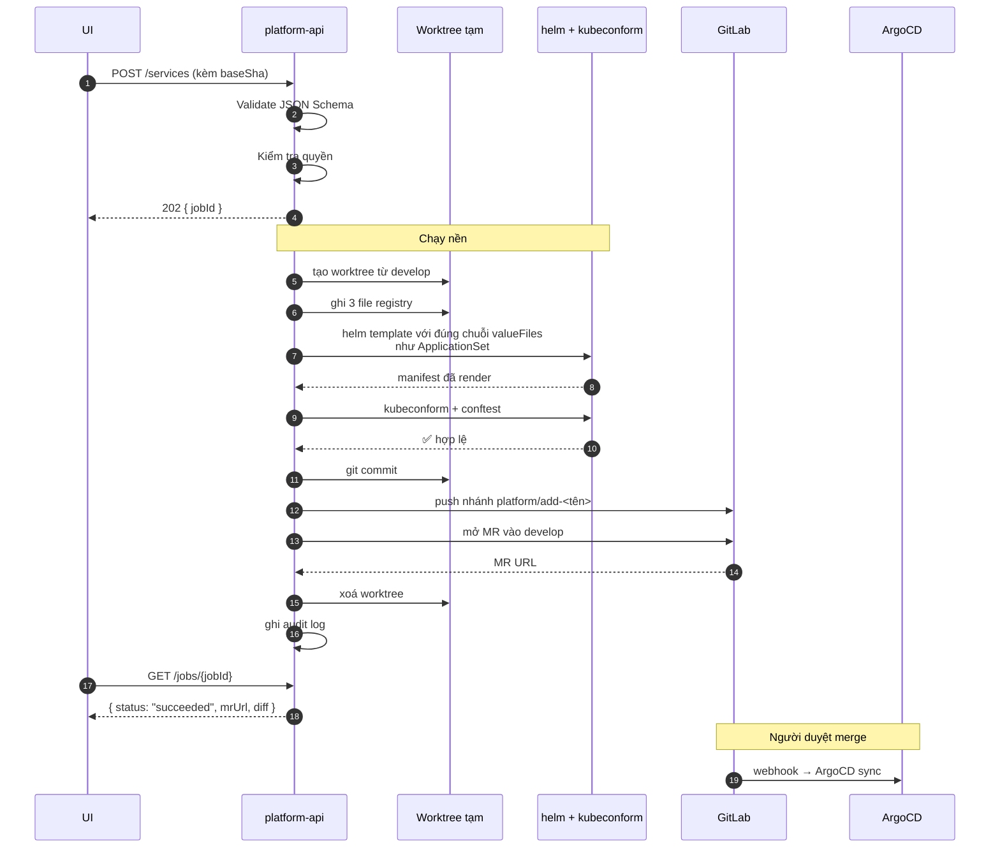
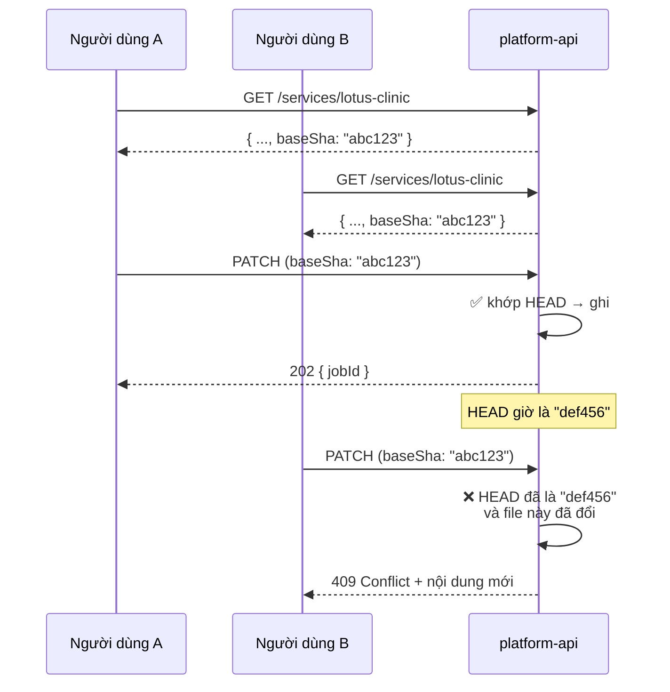
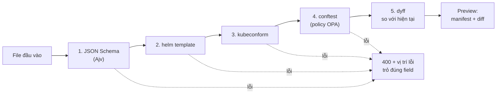
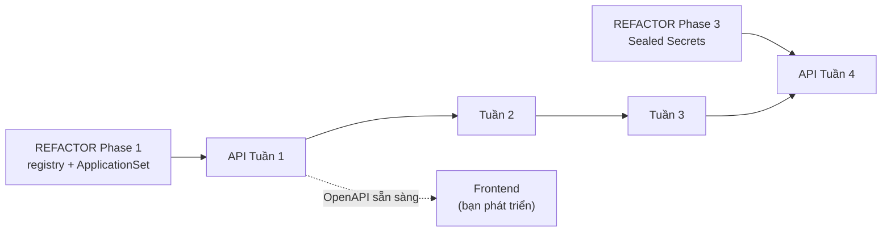

# Kế hoạch phát triển Platform API (Backend)

| | |
|---|---|
| **Trạng thái** | Bản nháp, chờ duyệt |
| **Ngày** | 11/09/2026 |
| **Mục tiêu** | Backend để thao tác file hạ tầng, commit Git, deploy lên k3s qua HTTP API |
| **Phạm vi** | Chỉ backend + hợp đồng API. Frontend do bạn tự phát triển. |
| **Liên quan** | [REFACTOR_PLAN.md](./REFACTOR_PLAN.md) · [SECRET_MANAGEMENT.md](./SECRET_MANAGEMENT.md) |

---

## Mục lục

- [1. Mục tiêu và nguyên tắc](#1-mục-tiêu-và-nguyên-tắc)
- [2. Vì sao là service riêng](#2-vì-sao-là-service-riêng-chứ-không-nhét-vào-server-control)
- [3. Kiến trúc](#3-kiến-trúc)
- [4. Công nghệ](#4-công-nghệ)
- [5. Lớp Git — thiết kế chi tiết](#5-lớp-git--thiết-kế-chi-tiết)
- [6. Lớp Render và kiểm tra](#6-lớp-render-và-kiểm-tra)
- [7. Mô hình dữ liệu](#7-mô-hình-dữ-liệu)
- [8. Quy ước chung của API](#8-quy-ước-chung-của-api)
- [9. HỢP ĐỒNG API](#9-hợp-đồng-api)
- [10. Phân quyền](#10-phân-quyền)
- [11. Triển khai](#11-triển-khai)
- [12. Lộ trình 4 tuần](#12-lộ-trình-4-tuần)
- [13. Danh sách kiểm tra khi bàn giao](#13-danh-sách-kiểm-tra-khi-bàn-giao)

---

## 1. Mục tiêu và nguyên tắc

### Mục tiêu

Cho phép thao tác toàn bộ vòng đời một service trên k3s qua HTTP API, không cần biết Helm, ArgoCD hay kubectl:

| Nhóm | Việc làm được |
|---|---|
| **Tạo service** | Điền thông tin → backend sinh file khai báo + values → mở MR |
| **Sửa cấu hình** | Đổi domain, resources, số replica, biến môi trường → MR |
| **Deploy** | Đổi image tag ở dev (commit thẳng) hoặc prod (MR) |
| **Đưa lên prod** | Copy tag từ dev sang prod → MR |
| **Quay lui** | Trả về tag trước đó → MR |
| **Xem trạng thái** | Sync/health từ ArgoCD, pod, log, event từ Kubernetes |
| **Quản lý secret** | Nhập secret đã mã hoá → MR (xem [SECRET_MANAGEMENT.md](./SECRET_MANAGEMENT.md)) |

### Bốn nguyên tắc không thoả hiệp

| # | Nguyên tắc | Nghĩa là |
|---|---|---|
| **N1** | **Backend ghi vào Git, không ghi vào cluster** | Không `kubectl apply`, không `helm install`. Mọi thay đổi đi qua commit. |
| **N2** | **Xem trước rồi mới ghi** | Mọi thao tác ghi đều có endpoint `preview` tương ứng, trả về diff YAML thật. Người dùng thấy trước cái gì sẽ đổi. |
| **N3** | **Kiểm tra ở backend, không chỉ ở CI** | Backend chạy `helm template` + `kubeconform` + `conftest` **trước khi** mở MR. Người dùng biết sai ngay, không phải chờ CI 5 phút. |
| **N4** | **Schema là hợp đồng duy nhất** | `registry/schema/service.schema.json` vừa validate CI, vừa validate API, vừa sinh form UI. Một nguồn. |

### Vì sao N1 quan trọng đến vậy

Nếu backend gọi thẳng Kubernetes API:

- Cluster có trạng thái không có trong Git → mất tính tái tạo
- ArgoCD với `selfHeal: true` sẽ **hoàn tác** thay đổi sau 3 phút — người dùng thấy thay đổi rồi tự biến mất, không hiểu vì sao
- Không có lịch sử, không quay lui được
- Backend cần quyền ghi lên cluster → bị chiếm quyền là mất cả hệ thống (xem [mô hình đe doạ T2](./SECRET_MANAGEMENT.md#1-mô-hình-đe-doạ))

---

## 2. Vì sao là service riêng, chứ không nhét vào `server-control`

`server-control` đã có sẵn Node.js + React + JWT auth, nhìn qua thì tái sử dụng rất hợp lý. Nhưng **không nên gộp**, vì lý do bảo mật:

| | `server-control` | `platform-api` |
|---|---|---|
| Chức năng | Wake-on-LAN, SSH shutdown/restart server vật lý | Thao tác Git, xem trạng thái k8s |
| Thông tin nhạy cảm giữ trong pod | **SSH private key** vào các server | **Token ghi Git** |
| Cần `hostNetwork` | Có (để gửi gói WoL broadcast) | Không |
| Số người dùng | Ít, chỉ quản trị viên | Nhiều, cả lập trình viên |

Nếu gộp: một pod vừa có SSH private key vào server vật lý, vừa có token ghi repo hạ tầng, vừa chạy `hostNetwork`, vừa mở cho nhiều người dùng. Chiếm được pod đó là chiếm cả hệ thống.

**Tách riêng thì mỗi service chỉ giữ đúng thứ nó cần.** Vẫn dùng chung chart `apps/webservice` và cùng một cơ chế xác thực, chỉ khác pod.

> Có thể dùng chung frontend nếu muốn — một SPA gọi cả hai API. Đó là quyết định của phía frontend, không ảnh hưởng thiết kế backend.

---

## 3. Kiến trúc



### Luồng một thao tác ghi



---

## 4. Công nghệ

| Thành phần | Lựa chọn | Lý do |
|---|---|---|
| Runtime | **Node.js 20 LTS + TypeScript** | Cùng hệ với `server-control`, team đã quen |
| HTTP framework | **Fastify 5** | Validate bằng JSON Schema là cơ chế gốc — khớp đúng nguyên tắc N4. Tự sinh OpenAPI. Nhanh hơn Express đáng kể. |
| Sinh tài liệu API | **@fastify/swagger + @fastify/swagger-ui** | `GET /openapi.json` + trang `/docs`. Bạn dùng để sinh client TypeScript cho UI. |
| Thao tác Git | **`simple-git`** + gọi `git` trực tiếp | `isomorphic-git` không hỗ trợ worktree tốt |
| Xử lý YAML | **`yaml` (eemeli)** | Giữ nguyên comment và thứ tự khi sửa file — quan trọng để diff sạch |
| Validate schema | **Ajv 8** (draft 2020-12) | Cùng thư viện với CI → hành vi giống hệt |
| Helm / kubeconform / conftest | Gọi binary trong image | Chạy đúng phiên bản như CI |
| Client Kubernetes | **`@kubernetes/client-node`** | Chính thức |
| Client ArgoCD | `fetch` tới REST API | Không cần SDK |
| Client GitLab | `fetch` tới REST API v4 | Không cần SDK |
| Cơ sở dữ liệu | **SQLite** (`better-sqlite3`) + PVC | Dữ liệu nhỏ; backend chạy 1 replica vì giữ git mirror cục bộ → SQLite là lựa chọn nhất quán |
| Hàng đợi job | **Trong tiến trình** (`p-queue`) | 1 replica, tải thấp. Không cần Redis. |
| Log | **`pino`** + middleware danh sách trắng | Xem [SECRET_MANAGEMENT.md §5.2](./SECRET_MANAGEMENT.md#52-middleware-che-log--dùng-danh-sách-trắng) |

### Vì sao 1 replica

Backend giữ một git mirror cục bộ và hàng đợi job trong bộ nhớ. Chạy nhiều replica sẽ cần khoá phân tán và mirror dùng chung — phức tạp không cần thiết ở tải này.

Đánh đổi: có downtime ngắn khi deploy. Chấp nhận được, vì đây là công cụ nội bộ và mọi thao tác đều là bất đồng bộ có thể thử lại.

> Nếu sau này cần HA: chuyển SQLite sang Postgres, chuyển hàng đợi sang Redis, dùng khoá phân tán trên Redis. Kiến trúc đã tách lớp sẵn nên đổi không khó.

---

## 5. Lớp Git — thiết kế chi tiết

Đây là phần dễ sai nhất. Ba vấn đề phải giải: **đọc nhanh**, **ghi an toàn**, và **không tranh chấp**.

### 5.1. Mirror + worktree

```text
/var/lib/platform-api/
├── repo.git/              # bare mirror, chỉ fetch, không bao giờ checkout
├── worktrees/             # worktree tạm, mỗi thao tác ghi một cái
│   └── <jobId>/
└── data.db                # SQLite
```

**Đọc** — không cần worktree, `git show` trực tiếp từ bare repo:

```ts
// Đọc file từ một branch bất kỳ, không checkout
async function readFile(ref: string, path: string): Promise<string> {
  return exec('git', ['-C', REPO, 'show', `${ref}:${path}`]);
}

// Liệt kê file khớp mẫu
async function listFiles(ref: string, glob: string): Promise<string[]> {
  const out = await exec('git', ['-C', REPO, 'ls-tree', '-r', '--name-only', ref, '--', glob]);
  return out.split('\n').filter(Boolean);
}
```

Nhanh (vài ms), không đụng đĩa, không tranh chấp giữa các request.

**Ghi** — worktree tạm, dùng xong xoá:

```ts
async function withWorktree<T>(
  baseBranch: string,
  newBranch: string,
  fn: (dir: string) => Promise<T>
): Promise<T> {
  const dir = `${WORKTREES}/${ulid()}`;
  await exec('git', ['-C', REPO, 'fetch', 'origin', baseBranch]);
  await exec('git', ['-C', REPO, 'worktree', 'add', '-b', newBranch, dir, `origin/${baseBranch}`]);
  try {
    return await fn(dir);
  } finally {
    // Luôn dọn, kể cả khi lỗi
    await exec('git', ['-C', REPO, 'worktree', 'remove', '--force', dir]).catch(() => {});
    await exec('git', ['-C', REPO, 'branch', '-D', newBranch]).catch(() => {});
  }
}
```

### 5.2. Đồng bộ mirror

| Cơ chế | Tần suất | Mục đích |
|---|---|---|
| Định kỳ | 60 giây | Phòng khi webhook hỏng |
| Webhook GitLab | Ngay khi có push | Cập nhật tức thì |
| Trước mọi thao tác ghi | Luôn luôn | Không bao giờ ghi lên base cũ |

```ts
// Chạy mỗi 60s và khi nhận webhook
async function syncMirror() {
  await exec('git', ['-C', REPO, 'fetch', '--prune', 'origin',
                     '+refs/heads/develop:refs/remotes/origin/develop',
                     '+refs/heads/main:refs/remotes/origin/main']);
}
```

Chỉ fetch 2 branch cần thiết, không fetch toàn bộ — tránh kéo về hàng trăm nhánh `platform/*` cũ.

### 5.3. Chống ghi đè lẫn nhau

Dùng khoá lạc quan (optimistic locking) bằng git SHA:



Quy tắc kiểm tra:

- `baseSha` khớp HEAD → cho ghi
- `baseSha` khác HEAD nhưng **các file liên quan không đổi** → vẫn cho ghi (không cần chặn nếu người khác sửa service khác)
- `baseSha` khác HEAD và file liên quan đã đổi → `409`, trả về nội dung mới để client tự xử lý

Thêm một khoá tuần tự trong tiến trình theo tên service, tránh hai job cùng ghi một service cùng lúc.

### 5.4. Quy ước đặt tên nhánh

| Thao tác | Tên nhánh | MR vào |
|---|---|---|
| Tạo service | `platform/add-<tên>-<ulid>` | `develop` |
| Sửa cấu hình | `platform/update-<tên>-<ulid>` | `develop` |
| Xoá service | `platform/remove-<tên>-<ulid>` | `develop` |
| Deploy dev | *(không có nhánh — commit thẳng)* | — |
| Deploy prod / promote | `platform/release-<tên>-<tag>` | `main` |
| Quay lui | `platform/rollback-<tên>-<tag>` | `main` hoặc `develop` |
| Secret | `platform/secret-<tên>-<env>-<ulid>` | `develop` hoặc `main` |

Tiền tố `platform/` là cố định — nhờ nó GitLab chặn được backend push vào `develop`/`main` (xem [Hàng rào 2](./SECRET_MANAGEMENT.md#hàng-rào-2--token-git-không-push-được-vào-branch-deploy)).

### 5.5. Ngoại lệ duy nhất: deploy dev commit thẳng

Deploy lên dev là thao tác dùng nhiều nhất trong ngày. Bắt mở MR mỗi lần thì không ai dùng.

```ts
// Chỉ áp dụng cho: đổi image.tag, ở môi trường dev, trên file values-dev.yaml
const isDirectCommitAllowed =
  env === 'dev' &&
  changedPaths.every(p => p.match(/^registry\/[^/]+\/[^/]+\/values-dev\.yaml$/)) &&
  changedKeys.every(k => k === 'image.tag');
```

Ba điều kiện cùng lúc, kiểm tra ở backend **và** ở protected branch rule của GitLab. Thay đổi nào khác — kể cả ở dev — đều phải qua MR.

> **Secret không nằm trong ngoại lệ này.** Mọi thay đổi secret đều qua MR, kể cả dev ([Hàng rào 7](./SECRET_MANAGEMENT.md#hàng-rào-7--mọi-thay-đổi-secret-đều-phải-qua-mr-kể-cả-dev)).

---

## 6. Lớp Render và kiểm tra

Backend phải render **giống hệt ArgoCD** thì preview mới có ý nghĩa. Nghĩa là dùng đúng chuỗi `valueFiles` mà ApplicationSet dùng:

```ts
async function render(worktree: string, service: ServiceRelease, env: string) {
  const args = [
    'template', service.metadata.name,
    `${worktree}/charts/${service.spec.chart}`,
    '--values', `${worktree}/charts/${service.spec.chart}/values.yaml`,
    '--values', `${worktree}/env/${env}/defaults.yaml`,
    '--values', `${worktree}/registry/${dir(service)}/${service.metadata.name}/values-${env}.yaml`,
    '--set', `global.serviceName=${service.metadata.name}`,
    '--namespace', namespaceOf(service, env),
  ];
  return exec('helm', args);
}
```

> ⚠️ Thứ tự `--values` phải khớp **chính xác** với `valueFiles` trong ApplicationSet. Lệch thứ tự là preview nói một đằng, ArgoCD làm một nẻo — loại bug rất khó phát hiện.
>
> **Cách chống:** viết một test so sánh trực tiếp mảng `--values` của backend với danh sách `valueFiles` parse ra từ `gitops/bootstrap/templates/appset-*.yaml`. Chạy trong CI.

### Chuỗi kiểm tra



Mỗi bước lỗi đều phải trả về thông báo **chỉ đúng chỗ sai**, không phải dán nguyên stack trace:

```json
{
  "type": "https://hnq.dev/errors/validation",
  "title": "Cấu hình không hợp lệ",
  "status": 400,
  "stage": "policy",
  "violations": [
    {
      "rule": "require-resource-limits",
      "path": "spec.template.spec.containers[0].resources.limits",
      "message": "Container 'backend' thiếu resources.limits",
      "hint": "Thêm resources.limits.cpu và resources.limits.memory vào values-prod.yaml"
    }
  ]
}
```

### Bộ nhớ đệm

Render mất 3–10 giây. Cache theo khoá `sha256(chartSha + valuesSha + env)`, TTL 1 giờ, tối đa 200 mục. Preview lại cùng nội dung thì trả ngay.

---

## 7. Mô hình dữ liệu

SQLite, 5 bảng. **Không bảng nào chứa giá trị secret.**

```sql
-- Người dùng (hoặc bỏ nếu dùng OIDC của GitLab)
CREATE TABLE users (
  id            TEXT PRIMARY KEY,
  username      TEXT UNIQUE NOT NULL,
  email         TEXT,
  password_hash TEXT,                   -- bcrypt, chỉ khi auth cục bộ
  role          TEXT NOT NULL,          -- viewer | developer | maintainer | admin
  active        INTEGER DEFAULT 1,
  created_at    TEXT NOT NULL
);

-- Job bất đồng bộ
CREATE TABLE jobs (
  id           TEXT PRIMARY KEY,        -- ULID
  type         TEXT NOT NULL,           -- service.preview | service.create | deploy | ...
  status       TEXT NOT NULL,           -- queued | running | succeeded | failed | cancelled
  actor        TEXT NOT NULL,
  input        TEXT NOT NULL,           -- JSON — ĐÃ LỌC BỎ trường nhạy cảm
  result       TEXT,                    -- JSON: mrUrl, diff, commitSha...
  error        TEXT,                    -- JSON theo chuẩn problem+json
  progress     TEXT,                    -- JSON: [{ stage, status, startedAt }]
  idem_key     TEXT,                    -- khoá chống gửi trùng
  created_at   TEXT NOT NULL,
  finished_at  TEXT
);
CREATE UNIQUE INDEX idx_jobs_idem ON jobs(idem_key) WHERE idem_key IS NOT NULL;

-- Audit — chỉ ghi thêm, không sửa không xoá
CREATE TABLE audit_log (
  id         TEXT PRIMARY KEY,
  ts         TEXT NOT NULL,
  actor      TEXT NOT NULL,
  actor_ip   TEXT,
  action     TEXT NOT NULL,
  service    TEXT,
  env        TEXT,
  detail     TEXT NOT NULL,             -- JSON — KHÔNG BAO GIỜ chứa giá trị secret
  result     TEXT NOT NULL,
  mr_url     TEXT
);
CREATE INDEX idx_audit_ts      ON audit_log(ts DESC);
CREATE INDEX idx_audit_service ON audit_log(service, ts DESC);

-- Siêu dữ liệu secret — CHỈ tên key và vân tay
CREATE TABLE secret_meta (
  service     TEXT NOT NULL,
  env         TEXT NOT NULL,
  secret_name TEXT NOT NULL,
  key_name    TEXT NOT NULL,
  fingerprint TEXT NOT NULL,            -- sha256(salt || giá trị) — KHÔNG phải giá trị
  seal_mode   TEXT NOT NULL,            -- browser | server | pasted
  updated_at  TEXT NOT NULL,
  updated_by  TEXT NOT NULL,
  PRIMARY KEY (service, env, secret_name, key_name)
);

-- Cache render
CREATE TABLE render_cache (
  key        TEXT PRIMARY KEY,          -- sha256(chartSha + valuesSha + env)
  manifest   TEXT NOT NULL,
  created_at TEXT NOT NULL
);
```

> **Quy tắc bất biến:** không có cột nào trong toàn bộ schema chứa giá trị secret. Đây là ràng buộc thiết kế, phải kiểm trong code review mỗi lần đổi schema.

Audit còn được ghi song song ra file append-only `/data/audit.jsonl` — phòng trường hợp database bị can thiệp.

---

## 8. Quy ước chung của API

### 8.1. Thông tin cơ bản

| | |
|---|---|
| Base URL | `https://platform.l2cteam.work/api/v1` |
| Định dạng | `application/json; charset=utf-8` |
| Xác thực | `Authorization: Bearer <JWT>` |
| Tài liệu | `GET /api/v1/openapi.json` · Swagger UI ở `/docs` |
| Phiên bản | Trong đường dẫn (`/v1`). Thay đổi phá vỡ tương thích → `/v2`. |

> **Quan trọng cho phía frontend:** OpenAPI được sinh tự động từ JSON Schema của từng route, nên **luôn đúng với code**. Bạn có thể sinh client TypeScript bằng `openapi-typescript` và có type đầy đủ:
> ```bash
> npx openapi-typescript https://platform.l2cteam.work/api/v1/openapi.json -o src/api.d.ts
> ```

### 8.2. Sync hay async

| Loại | Cách hoạt động |
|---|---|
| **Đọc** (catalog, status, log) | Đồng bộ, trả kết quả ngay |
| **Ghi** và **preview** | Bất đồng bộ — trả `202 Accepted` + `jobId` |

Vì sao preview cũng async: `helm template` + `kubeconform` + `conftest` mất 3–15 giây. Giữ kết nối HTTP treo lâu như vậy là thiết kế tồi.

Theo dõi job bằng 2 cách:

- **Polling:** `GET /jobs/{id}` mỗi 1–2 giây
- **SSE:** `GET /jobs/{id}/events` — nhận cập nhật tiến độ theo thời gian thực

### 8.3. Định dạng lỗi — RFC 9457

Mọi lỗi trả về `application/problem+json`:

```json
{
  "type": "https://hnq.dev/errors/conflict",
  "title": "Cấu hình đã bị thay đổi bởi người khác",
  "status": 409,
  "detail": "File registry/tenants/lotus-clinic/values-prod.yaml đã đổi kể từ khi bạn tải về.",
  "instance": "/api/v1/services/lotus-clinic",
  "currentSha": "def456a",
  "yourSha": "abc123f",
  "conflictingPaths": ["registry/tenants/lotus-clinic/values-prod.yaml"]
}
```

| Mã | Khi nào |
|---|---|
| `400` | Dữ liệu sai định dạng hoặc không qua được schema |
| `401` | Chưa đăng nhập hoặc token hết hạn |
| `403` | Không đủ quyền cho thao tác này |
| `404` | Không tìm thấy service / job |
| `409` | Xung đột phiên bản (`baseSha` cũ) |
| `422` | Đúng định dạng nhưng không qua được policy / render |
| `429` | Quá nhiều request |
| `502` | GitLab / ArgoCD / k8s không phản hồi |

### 8.4. Chống gửi trùng

Mọi request ghi nên kèm:

```http
Idempotency-Key: 01J8XQF3K2M4N5P6R7S8T9V0W1
```

Gửi lại cùng khoá trong 24 giờ → trả về đúng job cũ, không tạo MR thứ hai.

### 8.5. Phân trang

```http
GET /api/v1/audit?limit=50&cursor=eyJ0cyI6IjIwMjYtMDktMTEifQ
```

```json
{
  "items": [ ... ],
  "nextCursor": "eyJ0cyI6IjIwMjYtMDktMTAifQ",
  "hasMore": true
}
```

---

## 9. HỢP ĐỒNG API

### Bảng tổng hợp

| Method | Endpoint | Quyền tối thiểu | Sync/Async |
|---|---|---|---|
| **Xác thực** ||||
| `POST` | `/auth/login` | — | sync |
| `POST` | `/auth/refresh` | — | sync |
| `POST` | `/auth/logout` | viewer | sync |
| `GET` | `/auth/me` | viewer | sync |
| **Siêu dữ liệu** ||||
| `GET` | `/meta/schema/service` | viewer | sync |
| `GET` | `/meta/charts` | viewer | sync |
| `GET` | `/meta/environments` | viewer | sync |
| `GET` | `/meta/health` | — | sync |
| **Danh mục** ||||
| `GET` | `/services` | viewer | sync |
| `GET` | `/services/{name}` | viewer | sync |
| `GET` | `/services/{name}/values/{env}` | viewer | sync |
| `GET` | `/services/{name}/manifest/{env}` | viewer | sync |
| **Thay đổi cấu hình** ||||
| `POST` | `/services/preview` | developer | **async** |
| `POST` | `/services` | developer | **async** |
| `PATCH` | `/services/{name}` | developer | **async** |
| `DELETE` | `/services/{name}` | maintainer | **async** |
| `POST` | `/services/{name}/environments` | maintainer | **async** |
| **Deploy** ||||
| `POST` | `/services/{name}/deploy` | developer (dev) / maintainer (prod) | **async** |
| `POST` | `/services/{name}/promote` | maintainer | **async** |
| `POST` | `/services/{name}/rollback` | maintainer | **async** |
| `GET` | `/services/{name}/releases` | viewer | sync |
| **Trạng thái runtime** ||||
| `GET` | `/services/{name}/status` | viewer | sync |
| `POST` | `/services/{name}/sync` | developer (dev) / maintainer (prod) | sync |
| `GET` | `/services/{name}/pods` | viewer | sync |
| `GET` | `/services/{name}/logs` | developer | SSE |
| `GET` | `/services/{name}/events` | viewer | sync |
| **Secret** ||||
| `GET` | `/secrets/public-key` | developer | sync |
| `GET` | `/services/{name}/secrets` | developer | sync |
| `PUT` | `/services/{name}/secrets` | maintainer | **async** |
| `DELETE` | `/services/{name}/secrets/{secretName}/keys/{key}` | maintainer | **async** |
| **Vận hành** ||||
| `GET` | `/promotions` | viewer | sync |
| `GET` | `/jobs/{id}` | chủ job hoặc admin | sync |
| `GET` | `/jobs/{id}/events` | chủ job hoặc admin | SSE |
| `POST` | `/jobs/{id}/cancel` | chủ job hoặc admin | sync |
| `GET` | `/audit` | maintainer | sync |

---

### 9.1. Xác thực

#### `POST /auth/login`

```jsonc
// Request
{ "username": "nguyen.van.a", "password": "..." }

// 200
{
  "accessToken": "eyJhbGciOi...",
  "expiresIn": 900,                    // 15 phút
  "refreshToken": "...",               // đặt trong httpOnly cookie
  "user": {
    "id": "01J8X...",
    "username": "nguyen.van.a",
    "role": "developer",
    "permissions": ["service.read", "service.write", "deploy.dev", "sync.dev"]
  }
}
```

> **Khuyến nghị:** dùng OIDC của GitLab thay vì mật khẩu riêng. Vừa bớt một chỗ lưu mật khẩu, vừa map thẳng nhóm GitLab sang vai trò. Nếu làm vậy, `/auth/login` đổi thành `/auth/oidc/start` + `/auth/oidc/callback`.

#### `GET /auth/me`

```jsonc
// 200
{
  "id": "01J8X...",
  "username": "nguyen.van.a",
  "role": "developer",
  "permissions": ["service.read", "service.write", "deploy.dev", "sync.dev"],
  "environments": { "dev": ["read", "write", "deploy", "sync"], "prod": ["read"] }
}
```

---

### 9.2. Siêu dữ liệu

#### `GET /meta/schema/service`

Trả về JSON Schema để frontend tự sinh form. **Đây chính là file `registry/schema/service.schema.json`** đọc từ branch `develop`.

```jsonc
// 200
{
  "$schema": "https://json-schema.org/draft/2020-12/schema",
  "$id": "https://hnq.dev/schema/service.json",
  "type": "object",
  "required": ["apiVersion", "kind", "metadata", "spec"],
  "properties": {
    "metadata": {
      "type": "object",
      "required": ["name", "owner"],
      "properties": {
        "name": {
          "type": "string",
          "pattern": "^[a-z0-9]([-a-z0-9]*[a-z0-9])?$",
          "maxLength": 40,
          "title": "Tên service",
          "description": "Chữ thường, số và dấu gạch ngang"
        },
        "owner":       { "type": "string", "title": "Team sở hữu" },
        "description": { "type": "string", "title": "Mô tả ngắn" }
      }
    },
    "spec": {
      "type": "object",
      "required": ["category", "chart", "environments"],
      "properties": {
        "category": { "enum": ["tenant", "platform", "admin"], "title": "Loại" },
        "chart":    { "enum": ["apps/webservice", "apps/datastore"], "title": "Chart" },
        "environments": {
          "type": "array", "minItems": 1, "title": "Môi trường",
          "items": {
            "type": "object",
            "required": ["env", "namespace"],
            "properties": {
              "env":       { "enum": ["dev", "prod"] },
              "namespace": { "type": "string", "pattern": "^[a-z0-9-]+$" }
            }
          }
        },
        "requiredSecrets": {
          "type": "array", "title": "Secret cần thiết",
          "items": {
            "type": "object",
            "required": ["name", "keys"],
            "properties": {
              "name": { "type": "string" },
              "keys": { "type": "array", "items": { "type": "string" } },
              "type": { "enum": ["text", "binary"], "default": "text" }
            }
          }
        }
      }
    }
  }
}
```

#### `GET /meta/charts`

```jsonc
// 200
{
  "charts": [
    {
      "id": "apps/webservice",
      "name": "Web Service",
      "description": "HTTP service không giữ trạng thái, có ingress và probe",
      "version": "1.0.0",
      "valuesSchema": { /* JSON Schema của values.yaml */ },
      "suitableFor": ["tenant", "platform", "admin"]
    },
    {
      "id": "apps/datastore",
      "name": "Datastore",
      "description": "Cơ sở dữ liệu hoặc kho lưu trữ một node, có persistent volume",
      "version": "1.0.0",
      "valuesSchema": { /* ... */ },
      "suitableFor": ["platform"]
    }
  ]
}
```

#### `GET /meta/environments`

```jsonc
// 200
{
  "environments": [
    {
      "name": "dev",
      "branch": "develop",
      "argocdProjectPrefix": "tenants-dev",
      "domainSuffix": "l2cteam.work",
      "directCommitAllowed": true,       // deploy dev không cần MR
      "defaults": { /* nội dung env/dev/defaults.yaml */ }
    },
    {
      "name": "prod",
      "branch": "main",
      "argocdProjectPrefix": "tenants-prod",
      "domainSuffix": "l2cteam.work",
      "directCommitAllowed": false,      // luôn cần MR
      "defaults": { /* ... */ }
    }
  ]
}
```

---

### 9.3. Danh mục service

#### `GET /services`

```http
GET /services?category=tenant&env=prod&owner=team-clinic&q=clinic&limit=50
```

```jsonc
// 200
{
  "items": [
    {
      "name": "lotus-clinic",
      "owner": "team-clinic",
      "description": "Backend hệ thống phòng khám Lotus",
      "category": "tenant",
      "chart": "apps/webservice",
      "environments": [
        {
          "env": "dev",
          "namespace": "lotus-clinic-dev",
          "imageTag": "6aebe241",
          "status": { "sync": "Synced", "health": "Healthy" },
          "url": "https://client-lotus-clinic-dev.l2cteam.work"
        },
        {
          "env": "prod",
          "namespace": "lotus-clinic-prod",
          "imageTag": "f1eb557d",
          "status": { "sync": "Synced", "health": "Healthy" },
          "url": "https://client-lotus-clinic.l2cteam.work"
        }
      ],
      "promotionPending": true,          // dev đang chạy tag mới hơn prod
      "updatedAt": "2026-09-10T08:12:00Z"
    }
  ],
  "total": 4,
  "baseSha": "abc123f"                   // dùng cho request ghi tiếp theo
}
```

#### `GET /services/{name}`

```jsonc
// 200
{
  "name": "lotus-clinic",
  "owner": "team-clinic",
  "category": "tenant",
  "chart": "apps/webservice",
  "spec": { /* toàn bộ nội dung service.yaml */ },
  "environments": [
    {
      "env": "dev",
      "namespace": "lotus-clinic-dev",
      "values": { /* nội dung values-dev.yaml đã parse */ },
      "effectiveValues": { /* sau khi gộp với env defaults + chart defaults */ },
      "status": {
        "sync": "Synced", "health": "Healthy",
        "argocdApp": "lotus-clinic-dev",
        "lastSyncAt": "2026-09-10T08:15:00Z",
        "revision": "a1b2c3d"
      }
    }
  ],
  "requiredSecrets": [
    { "name": "lotus-clinic-backend-secrets", "keys": ["DB_PASSWORD", "JWT_SECRET"] }
  ],
  "files": {
    "service":     "registry/tenants/lotus-clinic/service.yaml",
    "valuesDev":   "registry/tenants/lotus-clinic/values-dev.yaml",
    "valuesProd":  "registry/tenants/lotus-clinic/values-prod.yaml"
  },
  "baseSha": "abc123f"
}
```

> `effectiveValues` là giá trị **sau khi gộp** cả 3 tầng (chart defaults → env defaults → values riêng). Rất hữu ích cho UI: hiển thị được "giá trị thực tế đang chạy là gì" và "giá trị nào do bạn ghi đè".

#### `GET /services/{name}/manifest/{env}`

```jsonc
// 200
{
  "service": "lotus-clinic",
  "env": "dev",
  "manifest": "apiVersion: apps/v1\nkind: Deployment\n...",   // YAML đã render
  "resources": [
    { "kind": "Deployment", "name": "backend-service", "namespace": "lotus-clinic-dev" },
    { "kind": "Service",    "name": "backend-service", "namespace": "lotus-clinic-dev" },
    { "kind": "Ingress",    "name": "backend-service", "namespace": "lotus-clinic-dev" }
  ],
  "renderedAt": "2026-09-11T09:00:00Z",
  "fromCache": true
}
```

---

### 9.4. Tạo và sửa service

#### `POST /services/preview` — xem trước, không ghi gì

Endpoint quan trọng nhất cho trải nghiệm người dùng: cho phép UI hiện diff **trước khi** người dùng bấm xác nhận.

```jsonc
// Request
{
  "operation": "create",               // create | update | delete
  "service": {
    "apiVersion": "hnq.dev/v1",
    "kind": "ServiceRelease",
    "metadata": { "name": "hocmon-clinic-v2", "owner": "team-clinic" },
    "spec": {
      "category": "tenant",
      "chart": "apps/webservice",
      "project": "tenants",
      "environments": [{ "env": "dev", "namespace": "hocmon-clinic-v2-dev" }]
    }
  },
  "values": {
    "dev": {
      "image": { "repository": "registry.gitlab.com/hnq-tech/clients/hocmon/backend", "tag": "abc1234" },
      "ingress": { "host": "client-hocmon-v2-dev.l2cteam.work" }
    }
  }
}
```

```jsonc
// 202
{ "jobId": "01J8XQF3K2M4N5P6R7S8T9V0W1", "statusUrl": "/api/v1/jobs/01J8XQ..." }
```

```jsonc
// GET /jobs/01J8XQ... → 200 khi xong
{
  "id": "01J8XQF3K2M4N5P6R7S8T9V0W1",
  "type": "service.preview",
  "status": "succeeded",
  "progress": [
    { "stage": "schema",     "status": "passed", "durationMs": 12 },
    { "stage": "render",     "status": "passed", "durationMs": 3200 },
    { "stage": "kubeconform","status": "passed", "durationMs": 450 },
    { "stage": "policy",     "status": "passed", "durationMs": 180 }
  ],
  "result": {
    "valid": true,
    "files": [
      {
        "path": "registry/tenants/hocmon-clinic-v2/service.yaml",
        "action": "create",
        "content": "apiVersion: hnq.dev/v1\nkind: ServiceRelease\n..."
      },
      {
        "path": "registry/tenants/hocmon-clinic-v2/values-dev.yaml",
        "action": "create",
        "content": "image:\n  repository: ...\n"
      }
    ],
    "manifest": "apiVersion: apps/v1\nkind: Deployment\n...",
    "diff": "+ Deployment/backend-service\n+ Service/backend-service\n+ Ingress/backend-service",
    "resources": [
      { "kind": "Deployment", "name": "backend-service", "action": "create" },
      { "kind": "Service",    "name": "backend-service", "action": "create" },
      { "kind": "Ingress",    "name": "backend-service", "action": "create" }
    ],
    "warnings": [
      "Service chưa khai báo requiredSecrets — nếu app cần secret, hãy bổ sung."
    ]
  }
}
```

Khi không hợp lệ:

```jsonc
// GET /jobs/... → 200 (job chạy xong nhưng kết quả là không hợp lệ)
{
  "status": "succeeded",
  "result": {
    "valid": false,
    "violations": [
      {
        "stage": "policy",
        "rule": "require-resource-limits",
        "path": "spec.template.spec.containers[0].resources.limits",
        "message": "Container 'backend' thiếu resources.limits",
        "severity": "error",
        "hint": "Thêm resources.limits vào values-dev.yaml, hoặc để env defaults tự áp dụng"
      }
    ]
  }
}
```

> Phân biệt: `job.status` nói **job có chạy xong không**, `result.valid` nói **cấu hình có hợp lệ không**. Cấu hình sai không phải job lỗi.

#### `POST /services` — tạo service

```jsonc
// Request — giống preview, thêm phần mô tả MR
{
  "service": { /* như trên */ },
  "values": { /* như trên */ },
  "mergeRequest": {
    "title": "feat: thêm service hocmon-clinic-v2",
    "description": "Tạo môi trường dev cho phiên bản mới của phòng khám Hóc Môn",
    "assignReviewers": ["tran.van.b"],
    "removeSourceBranch": true
  }
}
```

```http
Idempotency-Key: 01J8XQF3K2M4N5P6R7S8T9V0W1
```

```jsonc
// 202
{ "jobId": "01J8XR...", "statusUrl": "/api/v1/jobs/01J8XR..." }

// GET /jobs/01J8XR... khi xong
{
  "status": "succeeded",
  "result": {
    "branch": "platform/add-hocmon-clinic-v2-01J8XR",
    "commitSha": "9f8e7d6",
    "mrUrl": "https://gitlab.com/hnq-tech/hnq-infra/-/merge_requests/142",
    "mrIid": 142,
    "filesChanged": [
      "registry/tenants/hocmon-clinic-v2/service.yaml",
      "registry/tenants/hocmon-clinic-v2/values-dev.yaml"
    ],
    "nextStep": "Chờ duyệt MR. Sau khi merge, ArgoCD sẽ tự tạo Application hocmon-clinic-v2-dev."
  }
}
```

#### `PATCH /services/{name}` — sửa cấu hình

```jsonc
// Request
{
  "baseSha": "abc123f",                 // BẮT BUỘC — chống ghi đè
  "patch": {
    "values": {
      "prod": {
        "replicas": 3,
        "resources": { "limits": { "cpu": "1000m", "memory": "1Gi" } }
      }
    }
  },
  "mergeRequest": { "title": "perf(lotus-clinic): tăng replicas prod lên 3" }
}
```

```jsonc
// 409 nếu có người khác đã sửa
{
  "type": "https://hnq.dev/errors/conflict",
  "title": "Cấu hình đã bị thay đổi bởi người khác",
  "status": 409,
  "currentSha": "def456a",
  "yourSha": "abc123f",
  "conflictingPaths": ["registry/tenants/lotus-clinic/values-prod.yaml"],
  "currentContent": { /* nội dung mới, để client tự merge */ }
}
```

#### `POST /services/{name}/environments` — bật thêm môi trường

Chính là thao tác "đưa service từ dev lên prod lần đầu":

```jsonc
// Request
{
  "baseSha": "abc123f",
  "env": "prod",
  "namespace": "hocmon-clinic-v2-prod",
  "values": {
    "image": { "tag": "abc1234" },
    "ingress": { "host": "client-hocmon-v2.l2cteam.work" }
  }
}

// 202 → MR vào develop (thêm "prod" vào spec.environments)
// Sau khi merge develop → main, ArgoCD prod mới tạo Application
```

```jsonc
// 422 nếu chưa đủ secret cho prod
{
  "type": "https://hnq.dev/errors/missing-secrets",
  "title": "Chưa đủ secret cho môi trường prod",
  "status": 422,
  "missing": [
    { "secretName": "hocmon-clinic-v2-backend-secrets", "keys": ["DB_PASSWORD", "JWT_SECRET"] }
  ],
  "hint": "Tạo secret cho prod trước bằng PUT /services/hocmon-clinic-v2/secrets?env=prod"
}
```

---

### 9.5. Deploy

#### `POST /services/{name}/deploy`

```jsonc
// Request
{
  "env": "dev",
  "imageTag": "7bcd1234",
  "reason": "Sửa lỗi tính phí khám"      // ghi vào commit message và audit
}
```

Hành vi khác nhau theo môi trường:

```jsonc
// dev → commit thẳng vào develop
{
  "status": "succeeded",
  "result": {
    "mode": "direct_commit",
    "branch": "develop",
    "commitSha": "3a4b5c6",
    "previousTag": "6aebe241",
    "newTag": "7bcd1234",
    "argocdWillSyncIn": "~30 giây"
  }
}

// prod → mở MR vào main
{
  "status": "succeeded",
  "result": {
    "mode": "merge_request",
    "branch": "platform/release-lotus-clinic-7bcd1234",
    "mrUrl": "https://gitlab.com/.../merge_requests/143",
    "previousTag": "f1eb557d",
    "newTag": "7bcd1234"
  }
}
```

Kiểm tra trước khi cho deploy:

| Kiểm tra | Lỗi trả về |
|---|---|
| Image tồn tại trong registry | `422 image-not-found` |
| Tag không phải `latest` | `422 policy-violation` |
| Người dùng có quyền ở môi trường đó | `403` |
| Với prod: tag này đã từng chạy ở dev chưa | `422 not-tested-in-dev` (cảnh báo, có thể bỏ qua bằng `"force": true`) |

> Kiểm tra cuối cùng là hiện thực hoá đúng yêu cầu của bạn: **test ở dev trước rồi mới lên prod**. Backend chủ động chặn, không chỉ dựa vào kỷ luật của con người.

#### `POST /services/{name}/promote` — đưa tag từ dev lên prod

```jsonc
// Request
{ "reason": "Đã test xong ở dev, release cho khách hàng" }

// 202 → GET /jobs/{id}
{
  "status": "succeeded",
  "result": {
    "mode": "merge_request",
    "fromEnv": "dev",   "fromTag": "7bcd1234",
    "toEnv":   "prod",  "previousProdTag": "f1eb557d",
    "branch": "platform/release-lotus-clinic-7bcd1234",
    "mrUrl": "https://gitlab.com/.../merge_requests/144",
    "changelog": [
      { "sha": "7bcd1234", "message": "fix: sửa lỗi tính phí khám",   "author": "nguyen.van.a" },
      { "sha": "6aebe241", "message": "feat: thêm báo cáo doanh thu", "author": "tran.van.b" }
    ]
  }
}
```

`changelog` lấy từ git log của repo ứng dụng (giữa `previousProdTag` và `fromTag`) — để người duyệt MR biết chính xác họ đang duyệt cái gì.

#### `POST /services/{name}/rollback`

```jsonc
// Request
{ "env": "prod", "toTag": "f1eb557d", "reason": "Tag mới gây lỗi 500 ở trang thanh toán" }

// hoặc quay lui về bản trước đó
{ "env": "prod", "steps": 1, "reason": "..." }
```

```jsonc
// Kết quả
{
  "status": "succeeded",
  "result": {
    "mode": "merge_request",
    "currentTag": "7bcd1234",
    "rollbackTo": "f1eb557d",
    "mrUrl": "https://gitlab.com/.../merge_requests/145",
    "urgent": true,
    "hint": "MR đã gắn nhãn 'urgent'. Cần 1 approval để merge."
  }
}
```

> **Cân nhắc quan trọng:** quay lui prod vẫn cần MR và approval, dù đang có sự cố. Nếu muốn nhanh hơn, giải pháp đúng là **giảm số approval cần thiết cho MR có nhãn `rollback`** trên GitLab, chứ không phải cho backend bỏ qua quy trình. Đường tắt trong code là đường tắt vĩnh viễn.

#### `GET /services/{name}/releases`

```jsonc
// 200
{
  "releases": [
    {
      "env": "prod", "tag": "f1eb557d",
      "deployedAt": "2026-09-05T10:20:00Z",
      "deployedBy": "tran.van.b",
      "commitSha": "8d9e0f1",
      "mrUrl": "https://gitlab.com/.../merge_requests/138",
      "current": true
    },
    {
      "env": "prod", "tag": "e2a3b4c5",
      "deployedAt": "2026-08-28T14:00:00Z",
      "deployedBy": "nguyen.van.a",
      "current": false
    }
  ]
}
```

Lấy từ `git log --follow` trên file `values-<env>.yaml`, lọc các commit đổi `image.tag`.

---

### 9.6. Trạng thái runtime

#### `GET /services/{name}/status?env=dev`

```jsonc
// 200
{
  "service": "lotus-clinic",
  "env": "dev",
  "argocd": {
    "application": "lotus-clinic-dev",
    "sync": "Synced",
    "health": "Healthy",
    "revision": "3a4b5c6",
    "lastSyncAt": "2026-09-11T08:30:00Z",
    "operationState": "Succeeded",
    "conditions": []
  },
  "workload": {
    "replicas": { "desired": 1, "ready": 1, "available": 1, "updated": 1 },
    "image": "registry.gitlab.com/.../lotus-backend:7bcd1234",
    "restarts24h": 0
  },
  "endpoints": [
    { "type": "ingress", "url": "https://client-lotus-clinic-dev.l2cteam.work", "tls": true }
  ],
  "resources": [
    { "kind": "Deployment", "name": "backend-service", "status": "Healthy", "message": "" },
    { "kind": "Service",    "name": "backend-service", "status": "Healthy", "message": "" },
    { "kind": "Ingress",    "name": "backend-service", "status": "Healthy", "message": "" }
  ]
}
```

#### `POST /services/{name}/sync?env=dev`

Thao tác **duy nhất** chạm vào cluster — và cũng chỉ là bảo ArgoCD "đọc lại Git đi", không thay đổi gì.

```jsonc
// Request
{ "prune": false, "dryRun": false }

// 200
{ "operation": "sync", "application": "lotus-clinic-dev", "phase": "Running", "startedAt": "..." }

// 403 với prod, nếu người dùng chỉ là developer
```

#### `GET /services/{name}/pods?env=dev`

```jsonc
// 200
{
  "pods": [
    {
      "name": "backend-service-7d4b8c9f5-x2k9p",
      "status": "Running",
      "ready": "1/1",
      "restarts": 0,
      "age": "2d4h",
      "node": "server02",
      "containers": [
        { "name": "backend", "image": "...:7bcd1234", "ready": true, "restartCount": 0 }
      ]
    }
  ]
}
```

#### `GET /services/{name}/logs?env=dev&pod=...&container=backend&tail=200&follow=true`

Server-Sent Events:

```
event: log
data: {"ts":"2026-09-11T09:00:01.123Z","pod":"backend-service-7d4b8c9f5-x2k9p","line":"Server listening on :1001"}

event: log
data: {"ts":"2026-09-11T09:00:02.456Z","pod":"backend-service-7d4b8c9f5-x2k9p","line":"Connected to MariaDB"}

event: end
data: {"reason":"client_closed"}
```

> ⚠️ **Log có thể chứa secret** nếu ứng dụng vô tình in ra. Vì vậy `GET /logs` yêu cầu quyền `developer` trở lên, và mọi lần xem log đều ghi vào audit.

#### `GET /services/{name}/events?env=dev`

```jsonc
// 200
{
  "events": [
    {
      "ts": "2026-09-11T08:31:02Z",
      "type": "Normal", "reason": "Scheduled",
      "object": "Pod/backend-service-7d4b8c9f5-x2k9p",
      "message": "Successfully assigned lotus-clinic-dev/... to server02"
    }
  ]
}
```

---

### 9.7. Secret

Thiết kế đầy đủ ở [SECRET_MANAGEMENT.md](./SECRET_MANAGEMENT.md). Phần này chỉ mô tả hợp đồng API.

#### `GET /secrets/public-key`

```jsonc
// 200
{
  "certificate": "-----BEGIN CERTIFICATE-----\nMIIE...\n-----END CERTIFICATE-----",
  "fetchedAt": "2026-09-11T09:00:00Z",
  "expiresAt": "2026-12-10T09:00:00Z",
  "algorithm": "RSA-OAEP-SHA256 + AES-256-GCM",
  "scopeRequired": "strict",
  "labelFormat": "{namespace}/{secretName}"
}
```

Frontend dùng chứng chỉ này để mã hoá ngay tại trình duyệt. Backend cache 1 giờ.

#### `GET /services/{name}/secrets?env=prod`

**Không bao giờ trả về giá trị.**

```jsonc
// 200
{
  "service": "lotus-clinic",
  "env": "prod",
  "secrets": [
    {
      "name": "lotus-clinic-backend-secrets",
      "declared": true,                              // có trong requiredSecrets
      "exists": true,                                // có file trong secrets/prod/
      "sealedScope": "strict",
      "keys": [
        {
          "key": "DB_PASSWORD",
          "fingerprint": "sha256:8f4e2a1c9b...",
          "updatedAt": "2026-08-01T10:00:00Z",
          "updatedBy": "tran.van.b",
          "sealMode": "browser",
          "ageDays": 41,
          "rotationDue": false
        },
        {
          "key": "JWT_SECRET",
          "fingerprint": "sha256:3b9d7f05a2...",
          "updatedAt": "2026-03-15T08:00:00Z",
          "ageDays": 180,
          "rotationDue": true                        // quá chu kỳ khuyến nghị
        }
      ],
      "file": "secrets/prod/lotus-clinic/backend-secrets.yaml"
    },
    {
      "name": "lotus-clinic-keystore",
      "declared": true,
      "exists": false,                               // ⚠️ khai báo cần nhưng chưa có
      "keys": []
    }
  ],
  "warnings": [
    "Secret 'lotus-clinic-keystore' được khai báo là cần nhưng chưa tồn tại ở môi trường prod.",
    "Khoá 'JWT_SECRET' đã 180 ngày chưa đổi (khuyến nghị 90 ngày)."
  ]
}
```

#### `PUT /services/{name}/secrets?env=prod`

Nhận **một trong ba** dạng, tương ứng ba cách ở [SECRET_MANAGEMENT.md §3](./SECRET_MANAGEMENT.md#3-ba-cách-đưa-secret-vào-hệ-thống):

```jsonc
// Cách A — trình duyệt đã mã hoá (KHUYẾN NGHỊ)
{
  "baseSha": "abc123f",
  "secretName": "lotus-clinic-backend-secrets",
  "mode": "sealed",
  "sealed": {
    "DB_PASSWORD": "AgBv7Kq2mN8x...",     // đã mã hoá, backend không giải mã được
    "JWT_SECRET":  "AgCp9Lr3nO9y..."
  },
  "reason": "Xoay vòng định kỳ quý 3"
}
```

```jsonc
// Cách B — backend mã hoá (chỉ khi Cách A chưa sẵn sàng)
{
  "baseSha": "abc123f",
  "secretName": "lotus-clinic-backend-secrets",
  "mode": "plaintext",
  "values": { "DB_PASSWORD": "..." },
  "reason": "..."
}
```

```jsonc
// Cách C — dán SealedSecret tự tạo bằng kubeseal
{
  "baseSha": "abc123f",
  "mode": "manifest",
  "manifest": "apiVersion: bitnami.com/v1alpha1\nkind: SealedSecret\n...",
  "reason": "..."
}
```

```jsonc
// 202 → GET /jobs/{id}
{
  "status": "succeeded",
  "result": {
    "mode": "merge_request",              // secret LUÔN qua MR, kể cả dev
    "branch": "platform/secret-lotus-clinic-prod-01J8XS",
    "mrUrl": "https://gitlab.com/.../merge_requests/146",
    "secretName": "lotus-clinic-backend-secrets",
    "keysChanged": ["DB_PASSWORD", "JWT_SECRET"],
    "fingerprintsBefore": { "DB_PASSWORD": "sha256:8f4e...", "JWT_SECRET": "sha256:3b9d..." },
    "fingerprintsAfter":  { "DB_PASSWORD": "sha256:5c7b...", "JWT_SECRET": "sha256:9e1a..." },
    "podRestartTriggered": true,          // đã cập nhật annotation checksum trong cùng MR
    "warning": "Pod sẽ khởi động lại khi MR được merge."
  }
}
```

Backend kiểm tra trước khi commit:

| Kiểm tra | Lỗi |
|---|---|
| SealedSecret hợp lệ về cú pháp | `400 invalid-sealed-secret` |
| `metadata.namespace` khớp service + env | `422 namespace-mismatch` |
| Phạm vi là `strict` (không `cluster-wide`) | `422 unsafe-scope` |
| Các key khớp `requiredSecrets` trong registry | `422 undeclared-key` (cảnh báo, bỏ qua được) |
| Với `mode: plaintext` — Cách B có đang bật không | `403 plaintext-mode-disabled` |

> Backend **chỉ ghi** `mode` và vân tay vào audit log. Không bao giờ ghi giá trị, ngay cả ở `mode: plaintext`.

#### `DELETE /services/{name}/secrets/{secretName}/keys/{key}?env=prod`

```jsonc
// 202 → mở MR xoá key khỏi SealedSecret
{ "jobId": "01J8XT..." }
```

---

### 9.8. Vận hành

#### `GET /promotions` — hàng chờ lên prod

Endpoint đặc thù cho mô hình 2 branch của bạn. Trả lời câu hỏi: *"cái gì đang ở dev mà chưa lên prod, và bao lâu rồi?"*

```jsonc
// 200
{
  "branchLag": {
    "develop": "3a4b5c6",
    "main":    "8d9e0f1",
    "commitsAhead": 7,
    "oldestUnpromotedAt": "2026-09-05T10:00:00Z",
    "daysBehind": 6
  },
  "services": [
    {
      "name": "lotus-clinic",
      "devTag":  "7bcd1234",
      "prodTag": "f1eb557d",
      "pending": true,
      "devDeployedAt": "2026-09-10T08:12:00Z",
      "daysInDev": 1,
      "promoteUrl": "/api/v1/services/lotus-clinic/promote"
    },
    {
      "name": "hocmon-clinic-v2",
      "devTag":  "abc1234",
      "prodTag": null,
      "pending": true,
      "reason": "prod_env_not_enabled",
      "daysInDev": 14,
      "hint": "Môi trường prod chưa được bật. Dùng POST /services/hocmon-clinic-v2/environments"
    }
  ],
  "unpromotedCommits": [
    { "sha": "3a4b5c6", "message": "chore(lotus-clinic): dev image → 7bcd1234", "author": "ci-bot", "date": "2026-09-10T08:12:00Z" }
  ]
}
```

#### `GET /jobs/{id}`

```jsonc
// 200
{
  "id": "01J8XQF3K2M4N5P6R7S8T9V0W1",
  "type": "service.create",
  "status": "running",                    // queued | running | succeeded | failed | cancelled
  "actor": "nguyen.van.a",
  "createdAt": "2026-09-11T09:00:00Z",
  "progress": [
    { "stage": "schema",      "status": "passed",  "durationMs": 12 },
    { "stage": "render",      "status": "passed",  "durationMs": 3200 },
    { "stage": "kubeconform", "status": "running" },
    { "stage": "policy",      "status": "pending" },
    { "stage": "commit",      "status": "pending" },
    { "stage": "merge_request","status": "pending" }
  ],
  "result": null,
  "error": null
}
```

#### `GET /jobs/{id}/events` — SSE theo dõi tiến độ

```
event: progress
data: {"stage":"render","status":"running"}

event: progress
data: {"stage":"render","status":"passed","durationMs":3200}

event: done
data: {"status":"succeeded","result":{"mrUrl":"https://..."}}
```

#### `GET /audit`

```http
GET /audit?service=lotus-clinic&action=secret.update&from=2026-09-01&limit=50
```

```jsonc
// 200
{
  "items": [
    {
      "id": "01J8XS...",
      "ts": "2026-09-11T09:15:22Z",
      "actor": "nguyen.van.a",
      "actorIp": "100.74.143.12",
      "action": "secret.update",
      "service": "lotus-clinic",
      "env": "prod",
      "detail": {
        "secretName": "lotus-clinic-backend-secrets",
        "keyNames": ["DB_PASSWORD"],      // chỉ TÊN key
        "sealMode": "browser"
      },
      "result": "mr_opened",
      "mrUrl": "https://gitlab.com/.../merge_requests/146"
    }
  ],
  "nextCursor": "...",
  "hasMore": true
}
```

---

## 10. Phân quyền

### 10.1. Bốn vai trò

| Vai trò | Xem | Sửa cấu hình | Deploy dev | Deploy prod | Secret | Xem log | Audit |
|---|:---:|:---:|:---:|:---:|:---:|:---:|:---:|
| `viewer` | ✅ | ❌ | ❌ | ❌ | ❌ | ❌ | ❌ |
| `developer` | ✅ | ✅ (MR) | ✅ | ❌ | 👁 chỉ metadata | ✅ | ❌ |
| `maintainer` | ✅ | ✅ (MR) | ✅ | ✅ (MR) | ✅ ghi | ✅ | ✅ |
| `admin` | ✅ | ✅ | ✅ | ✅ | ✅ | ✅ | ✅ |

### 10.2. Nguyên tắc quan trọng nhất

> **Vai trò trong Platform API không được rộng hơn vai trò trong ArgoCD.**

Nếu API cho `developer` sync prod trong khi `AppProject` của ArgoCD chặn, người dùng sẽ nhận lỗi khó hiểu từ ArgoCD sau khi API đã báo thành công. Tệ hơn: nếu API **rộng hơn** thật, ta đã tạo ra một đường vòng qua RBAC của ArgoCD.

Cách làm đúng: map vai trò API sang đúng `AppProject.roles` đã định nghĩa ở [REFACTOR_PLAN.md Phần 9](./REFACTOR_PLAN.md#phần-9--appproject-và-phân-quyền), và với thao tác sync thì **gọi ArgoCD bằng token của chính người dùng** (nếu dùng OIDC chung), chứ không dùng token chung của service.

### 10.3. Ràng buộc theo môi trường

```ts
// Kiểm tra ở tầng middleware, không rải rác trong từng handler
const RULES = {
  'deploy':        { dev: 'developer',  prod: 'maintainer' },
  'sync':          { dev: 'developer',  prod: 'maintainer' },
  'secret.write':  { dev: 'maintainer', prod: 'maintainer' },  // secret luôn cần maintainer
  'service.write': { dev: 'developer',  prod: 'developer'  },  // vẫn qua MR nên an toàn
  'service.delete':{ dev: 'maintainer', prod: 'maintainer' },
};
```

---

## 11. Triển khai

### 11.1. Chính nó cũng là một service trong registry

`registry/platform/platform-api/service.yaml`:

```yaml
apiVersion: hnq.dev/v1
kind: ServiceRelease
metadata:
  name: platform-api
  owner: team-infra
  description: Backend quản lý hạ tầng qua API
spec:
  category: platform
  chart: apps/webservice
  project: admin
  environments:
    - env: dev
      namespace: platform-api-dev
    - env: prod
      namespace: platform-api-prod
  requiredSecrets:
    - name: platform-api-credentials
      keys: [JWT_SECRET, GITLAB_TOKEN, ARGOCD_TOKEN, FINGERPRINT_SALT]
```

Backend deploy chính nó bằng đúng cơ chế nó quản lý. Vừa gọn, vừa là bài kiểm tra tốt cho hệ thống.

### 11.2. Các biến môi trường

```yaml
env:
  - { name: NODE_ENV,        value: production }
  - { name: PORT,            value: "3000" }
  - { name: REPO_URL,        value: "https://gitlab.com/hnq-tech/hnq-infra.git" }
  - { name: REPO_CACHE_DIR,  value: "/data/repo.git" }
  - { name: DB_PATH,         value: "/data/platform.db" }
  - { name: AUDIT_LOG_PATH,  value: "/data/audit.jsonl" }
  - { name: ARGOCD_URL,      value: "http://argocd-server.argocd.svc" }
  - { name: GITLAB_API_URL,  value: "https://gitlab.com/api/v4" }
  - { name: GITLAB_PROJECT_ID, value: "12345678" }
  - { name: SEALED_SECRETS_NAMESPACE,  value: "kube-system" }
  - { name: SEALED_SECRETS_CONTROLLER, value: "sealed-secrets" }
  - { name: ALLOW_PLAINTEXT_SECRET_MODE, value: "false" }   # Cách B — mặc định TẮT

envFromSecret:
  enabled: true
  secretName: platform-api-credentials
  # JWT_SECRET, GITLAB_TOKEN, ARGOCD_TOKEN, FINGERPRINT_SALT
```

### 11.3. Quyền trên Kubernetes

Xem đầy đủ ở [SECRET_MANAGEMENT.md Hàng rào 1](./SECRET_MANAGEMENT.md#hàng-rào-1--backend-không-có-quyền-đọc-secret-trong-cluster). Tóm tắt:

- ✅ Đọc: `pods`, `services`, `events`, `configmaps`, `deployments`, `statefulsets`, `pods/log`, `applications`
- ❌ **Không có bất kỳ quyền nào** trên `secrets`
- ❌ **Không có** `create`/`update`/`delete` trên bất kỳ resource nào

Kiểm chứng sau khi deploy:

```bash
SA=system:serviceaccount:platform-api-prod:platform-api

kubectl auth can-i get    secrets     --as=$SA -A   # phải trả về "no"
kubectl auth can-i list   secrets     --as=$SA -A   # phải trả về "no"
kubectl auth can-i create deployments --as=$SA -A   # phải trả về "no"
kubectl auth can-i get    pods        --as=$SA -A   # phải trả về "yes"
```

Đưa 4 lệnh này vào một job CI chạy sau mỗi lần deploy.

### 11.4. Image

```dockerfile
FROM node:20-alpine AS build
WORKDIR /app
COPY package*.json ./
RUN npm ci
COPY . .
RUN npm run build && npm prune --production

FROM node:20-alpine
RUN apk add --no-cache git ca-certificates

# Cài đúng phiên bản như CI dùng — khác phiên bản là preview sai
ARG HELM_VERSION=3.16.0
ARG KUBECONFORM_VERSION=0.6.7
ARG CONFTEST_VERSION=0.56.0
RUN set -eux; \
    wget -qO- "https://get.helm.sh/helm-v${HELM_VERSION}-linux-amd64.tar.gz" \
      | tar xz -C /tmp && mv /tmp/linux-amd64/helm /usr/local/bin/; \
    wget -qO- "https://github.com/yannh/kubeconform/releases/download/v${KUBECONFORM_VERSION}/kubeconform-linux-amd64.tar.gz" \
      | tar xz -C /usr/local/bin kubeconform; \
    wget -qO- "https://github.com/open-policy-agent/conftest/releases/download/v${CONFTEST_VERSION}/conftest_${CONFTEST_VERSION}_Linux_x86_64.tar.gz" \
      | tar xz -C /usr/local/bin conftest

WORKDIR /app
COPY --from=build /app/dist ./dist
COPY --from=build /app/node_modules ./node_modules
USER 1000
EXPOSE 3000
CMD ["node", "dist/main.js"]
```

> Phiên bản `helm`, `kubeconform`, `conftest` phải **khớp chính xác** với phiên bản trong `.gitlab-ci.yml`. Lệch phiên bản là preview của backend nói một đằng, CI nói một nẻo. Đặt chúng làm biến chung trong một file, cả hai nơi cùng đọc.

---

## 12. Lộ trình 4 tuần

### Tuần 1 — Nền tảng

| Hạng mục | Kết quả |
|---|---|
| Khởi tạo dự án TypeScript + Fastify | Chạy được, có `/health` |
| `GitRepository`: mirror, đọc file, worktree | Unit test đầy đủ |
| Xác thực JWT + 4 vai trò | Middleware kiểm quyền |
| `/auth/*`, `/meta/*` | Xong |
| `/services`, `/services/{name}` (chỉ đọc) | Xong |
| Sinh OpenAPI + Swagger UI | **`/openapi.json` sẵn sàng cho bạn dựng UI** |
| Schema SQLite + migration | Xong |

> ⭐ **Cuối tuần 1 bạn đã có OpenAPI đầy đủ cho phần đọc** → có thể bắt đầu dựng UI catalog song song.

### Tuần 2 — Render và thay đổi cấu hình

| Hạng mục | Kết quả |
|---|---|
| `Renderer`: helm template + kubeconform + conftest | Khớp chính xác với ApplicationSet |
| Test đối chiếu `valueFiles` giữa backend và ApplicationSet | Job CI |
| `JobQueue` + `/jobs/*` + SSE | Xong |
| `POST /services/preview` | Trả về diff thật |
| `GitLabClient`: tạo nhánh, commit, mở MR | Xong |
| `POST /services`, `PATCH`, `DELETE` | Xong |
| `POST /services/{name}/environments` | Xong |

### Tuần 3 — Deploy và trạng thái

| Hạng mục | Kết quả |
|---|---|
| `ArgoCDClient` (đọc + sync) | Xong |
| `K8sClient` (chỉ đọc) | Xong |
| `/services/{name}/status`, `/pods`, `/events` | Xong |
| `/services/{name}/logs` (SSE) | Xong |
| `POST /deploy` (dev commit thẳng, prod MR) | Xong |
| `POST /promote` + changelog | Xong |
| `POST /rollback` | Xong |
| `GET /releases`, `GET /promotions` | Xong |

### Tuần 4 — Secret, bảo mật, hoàn thiện

| Hạng mục | Kết quả |
|---|---|
| `GET /secrets/public-key` | Xong |
| `GET /services/{name}/secrets` (chỉ metadata) | Xong |
| `PUT /secrets` — Cách C (dán manifest) | Xong |
| `PUT /secrets` — Cách A (nhận đã mã hoá) | Xong |
| `PUT /secrets` — Cách B (mặc định TẮT) | Xong, có cờ bật |
| Annotation checksum tự kích hoạt restart pod | Xong |
| Middleware log danh sách trắng | Xong + test |
| Audit log + ghi ra file | Xong |
| Kiểm chứng RBAC (4 lệnh `can-i`) | Job CI |
| Rà soát bảo mật theo [danh sách kiểm tra](./SECRET_MANAGEMENT.md#12-danh-sách-kiểm-tra-trước-khi-mở-cho-người-dùng) | Xong |

### Phụ thuộc



Backend **không thể bắt đầu trước khi Phase 1 của refactor xong**, vì nó đọc và ghi cấu trúc `registry/`. Tuần 4 cần Sealed Secrets đã cài (Phase 3).

---

## 13. Danh sách kiểm tra khi bàn giao

### Hợp đồng API

- [ ] `GET /openapi.json` trả về spec hợp lệ, đầy đủ mọi endpoint
- [ ] Swagger UI truy cập được ở `/docs`
- [ ] Sinh được client TypeScript: `npx openapi-typescript <url> -o api.d.ts` chạy không lỗi
- [ ] Mọi endpoint có ví dụ request/response trong spec
- [ ] Mọi mã lỗi theo đúng chuẩn `application/problem+json`

### Tính đúng đắn

- [ ] Preview của backend render **giống hệt** ArgoCD — có test tự động đối chiếu
- [ ] `baseSha` chặn được ghi đè — có test hai người ghi đồng thời
- [ ] `Idempotency-Key` chặn được MR trùng — có test gửi lại
- [ ] Deploy dev commit thẳng, mọi thứ khác đều mở MR — có test cho từng nhánh
- [ ] Job thất bại không để lại worktree rác — có test kill giữa chừng

### Bảo mật

- [ ] 4 lệnh `kubectl auth can-i` cho kết quả đúng như mong đợi
- [ ] Token GitLab không push được vào `develop`/`main` — đã thử thực tế
- [ ] Không endpoint nào trả về giá trị secret — đã rà toàn bộ route
- [ ] Thông báo lỗi không chứa dữ liệu đầu vào nhạy cảm — đã test
- [ ] Middleware log dùng danh sách trắng — đã test với payload chứa secret
- [ ] Đã hoàn thành [danh sách kiểm tra bảo mật](./SECRET_MANAGEMENT.md#12-danh-sách-kiểm-tra-trước-khi-mở-cho-người-dùng)

### Vận hành

- [ ] `platform-api` tự deploy được bằng chính registry của nó
- [ ] Có `/health` và `/ready` riêng biệt
- [ ] Có metrics Prometheus (`/metrics`)
- [ ] Backup SQLite nằm trong lịch Velero
- [ ] Phiên bản helm/kubeconform/conftest khớp CI — có job kiểm tra
- [ ] Runbook: mirror hỏng thì làm gì, job treo thì làm gì

---

## Phụ lục — Khung OpenAPI

```yaml
openapi: 3.1.0
info:
  title: HNQ Platform API
  version: 1.0.0
  description: |
    API quản lý hạ tầng k3s qua GitOps.

    Nguyên tắc: mọi thay đổi đều ghi vào Git, không ghi thẳng vào cluster.
    Thao tác ghi trả về 202 kèm jobId — theo dõi bằng GET /jobs/{id}.
servers:
  - url: https://platform.l2cteam.work/api/v1
    description: Production
  - url: https://platform-dev.l2cteam.work/api/v1
    description: Development

security:
  - bearerAuth: []

components:
  securitySchemes:
    bearerAuth: { type: http, scheme: bearer, bearerFormat: JWT }

  schemas:
    Problem:
      type: object
      required: [type, title, status]
      properties:
        type:     { type: string, format: uri }
        title:    { type: string }
        status:   { type: integer }
        detail:   { type: string }
        instance: { type: string }

    Job:
      type: object
      required: [id, type, status, createdAt]
      properties:
        id:        { type: string, description: ULID }
        type:      { type: string }
        status:    { type: string, enum: [queued, running, succeeded, failed, cancelled] }
        progress:  { type: array, items: { $ref: '#/components/schemas/JobStage' } }
        result:    { type: object, nullable: true }
        error:     { $ref: '#/components/schemas/Problem', nullable: true }
        createdAt: { type: string, format: date-time }

    JobStage:
      type: object
      properties:
        stage:      { type: string, enum: [schema, render, kubeconform, policy, commit, merge_request] }
        status:     { type: string, enum: [pending, running, passed, failed] }
        durationMs: { type: integer }

  responses:
    Accepted:
      description: Đã nhận, đang xử lý nền
      content:
        application/json:
          schema:
            type: object
            properties:
              jobId:     { type: string }
              statusUrl: { type: string }
    Conflict:
      description: Xung đột phiên bản — baseSha đã cũ
      content:
        application/problem+json:
          schema: { $ref: '#/components/schemas/Problem' }

# Toàn bộ paths được sinh tự động từ JSON Schema của từng route Fastify.
# Xem bản đầy đủ tại GET /openapi.json
```
