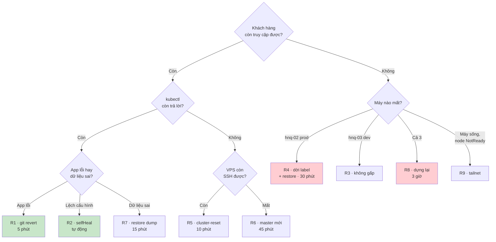

# Phục hồi sự cố

> **Mở file này khi đang có sự cố.** Không đọc từ đầu tới cuối — chạy [60 giây đầu](#60-giây-đầu-tiên), rồi nhảy thẳng tới đúng **một** quy trình `R*`.
>
> Đọc hết là việc của lúc bình thường, và **phải đọc trước** — mỗi quy trình có một hai chỗ ⚠️ mà không biết trước thì mất hàng giờ.

**Chuẩn bị 5 phút, làm hôm nay:** `git clone` repo về máy chính **và** máy phụ, lưu một bản PDF file này vào điện thoại. Lúc control-plane chết mà bạn đang ở ngoài, điện thoại là thứ duy nhất bạn có.

---

## 60 giây đầu tiên

Câu hỏi duy nhất trước khi gõ bất cứ lệnh nào: **khách hàng có đang bị ảnh hưởng không?**

Vì [đường dữ liệu không phụ thuộc master](./PLAN.md#31-đường-dữ-liệu-không-phụ-thuộc-master), câu trả lời rất thường là **không** — và khi đó bạn có cả ngày, không phải 5 phút.

```bash
curl -sS -o /dev/null -w '%{http_code}\n' https://lotus.l2cteam.work/healthz   # (1)
tailscale status | grep -E 'hnq-0[123]'                                        # (2)
kubectl get --raw /readyz ; kubectl get nodes                                  # (3)
make drift                                                                      # (4)
```

| Kết quả | Nghĩa là | Đi tới |
|---|---|---|
| (1) `200`, (3) lỗi | Control-plane chết, **khách hàng không bị ảnh hưởng** | [R5](#r5--etcd-hỏng-hoặc-apiserver-không-lên) → VPS mất thì [R6](#r6--vps-mất-hoàn-toàn). Không gấp. |
| (1) lỗi, (2) thiếu `hnq-02` | Node prod chết | [R4](#r4--node-prod-chết) — **gấp** |
| (1) lỗi, (2) đủ 3, (3) ổn | Lỗi tầng ứng dụng | [R1](#r1--deploy-sai-app-lỗi) |
| (2) thiếu `hnq-03` | Node dev chết | [R3](#r3--node-dev-chết) — không gấp |
| (2) đủ, (3) báo node `NotReady` | Tailnet sự cố | [R9](#r9--tailnet-sự-cố) |
| Dữ liệu sai, mọi thứ `Healthy` | Sự cố dữ liệu | [R7](#r7--xoá-nhầm-dữ-liệu-trong-database) |

> **Quy tắc một dòng:** trước mọi thao tác có `delete`, `reset`, `rm`, `--force` — chạy `make snapshot`. Mất 10 giây, và đã cứu nhiều người hơn mọi cơ chế khác trong tài liệu này.

---

## Recovery kit

Mất cả 3 máy mà còn đủ 3 thứ này thì dựng lại được toàn bộ hệ thống. Thiếu một thứ là **mất vĩnh viễn** một phần.

| # | Thứ | Lấy ở đâu | Cất ở đâu | Không có thì |
|---|---|---|---|---|
| 1 | **etcd snapshot** | tự động 6 giờ/lần lên R2 | R2 + 1 bản tải về máy hằng tháng | Mất toàn bộ trạng thái cluster |
| 2 | **k3s server token** | `/var/lib/rancher/k3s/server/token` | **Password manager** | ⚠️ **Snapshot #1 thành vô dụng** — token là khoá giải bootstrap data trong snapshot |
| 3 | **Sealing key** | `kubectl -n kube-system get secret -l sealedsecrets.bitnami.com/sealed-secrets-key -o yaml` | Password manager, **2 nơi** | Phải tạo lại **toàn bộ** secret bằng tay |

Kèm theo (tiết kiệm nhiều thời gian): token Cloudflare Tunnel, khoá R2, mật khẩu admin ArgoCD, thông tin đăng nhập nhà cung cấp VPS.

⚠️ **Món #2 là chỗ bị bỏ sót nhiều nhất.** Rất nhiều người backup etcd rất cẩn thận rồi phát hiện lúc cần restore lên máy mới là không biết token ở đâu. Không có token thì snapshot **không giải mã được** — bằng không có backup.

### `make kit-check` — hằng tháng

Kit chưa từng kiểm là kit chưa chắc có. Script không in ra giá trị, chỉ trả lời "còn dùng được không":

```bash
# scripts/dr/kit-check.sh — kiểm 4 việc
# 1. snapshot mới nhất trên R2 ≤ 12 giờ tuổi
# 2. token trong password manager khớp token trên server (so bằng sha256, không so giá trị)
# 3. sealing key còn trong cluster + tự xác nhận password manager có 2 bản
# 4. có bản etcd tải về máy dưới 35 ngày (quy tắc 3-2-1)
```

---

## Cây quyết định



---

## R1 · Deploy sai, app lỗi

**5 phút · không mất dữ liệu.** Sự cố hay xảy ra nhất.

```bash
git log --oneline -5 -- registry/apps/<service>/     # PR nào vừa vào main?
git revert <commit> --no-edit
git push origin HEAD:refs/heads/revert-<service>
gh pr create --fill && gh pr merge --auto --squash
argocd app sync <service>-prod                        # ép sync, không chờ webhook
```

⚠️ **Đừng dùng `argocd app rollback`.** Nó đưa cluster về trạng thái cũ nhưng Git vẫn ở trạng thái mới → `selfHeal` kéo lại cái sai trong 3 phút. Sửa ở Git là chỗ duy nhất có tác dụng.

**Nếu cần nhanh hơn 5 phút** (CI đang chậm, khách hàng đang mất tiền) — đường break-glass, và **vẫn phải sửa Git sau đó**:

```bash
kubectl -n argocd patch app <service>-prod --type merge -p '{"spec":{"syncPolicy":{"automated":null}}}'
kubectl -n <service>-prod set image deploy/<service> <service>=ghcr.io/...:<tag-cũ>
```

---

## R2 · Cluster lệch khỏi Git

**Tự động.** `selfHeal: true` ghi đè mọi `kubectl edit` bằng tay sau ≤ 3 phút. Việc của bạn chỉ là **biết** nó đang xảy ra: `make drift`.

Nếu một Application `OutOfSync` không tự hết sau 5 phút:

| Nguyên nhân | Kiểm | Sửa |
|---|---|---|
| Resource bị `finalizer` treo | `kubectl get <res> -o yaml \| grep -A3 finalizers` | Xoá finalizer sau khi hiểu vì sao nó ở đó |
| Chart render ra thứ không apply được | `argocd app diff <app>` | Sửa chart, đi qua PR |
| AppProject chặn (đúng như thiết kế) | `kubectl -n argocd logs deploy/argocd-application-controller \| grep -i permitted` | Chart đang cố tạo resource cấp cluster → bug của chart |

---

## R3 · Node dev chết

**Không gấp** — prod ở `hnq-02`, không bị kéo theo.

```bash
make drift    # đường dữ liệu giờ chỉ còn 1 replica trên hnq-02 — KHÔNG CÒN DỰ PHÒNG
# Dựng lại: cài máy, join theo PLAN §5. Dữ liệu dev không cần restore — ArgoCD dựng lại từ Git.
```

⚠️ **`hnq-03` cũng là nơi chạy monitoring** → node này chết là **mất Prometheus + Alertmanager**. Từ lúc này bạn **không nhận được alert nào nữa**, và im lặng trông giống hệt "mọi thứ đều ổn". Thứ duy nhất còn báo là [dead man's switch](./OPERATIONS.md#dead-mans-switch) — nó sẽ ping trong ~12 phút. Sau khi đã biết nguyên nhân, tạm tắt cảnh báo heartbeat để khỏi bị ping liên tục.

⚠️ Trong lúc `hnq-03` chết, hệ thống **không có dự phòng đường dữ liệu và không có monitoring**. Dựng lại trong vòng vài ngày, đừng để tháng.

---

## R4 · Node prod chết

**30 phút · mất tối đa 1 giờ dữ liệu.** Quy trình gấp nhất. Đọc hết trước khi gõ.

### Bước 0 — quyết định trước đã

| Máy có sống lại trong ≤ 20 phút không? (mất điện, treo, cần cắm lại) |
|---|
| **Có → CHỜ.** Bật lại máy là xong, dữ liệu nguyên vẹn, không mất gì. |
| **Không → đi tiếp bước 1.** |

⚠️ **Đây là bước quan trọng nhất.** Chuyển node là thao tác phá huỷ (phải xoá PVC) và mất tới 1 giờ dữ liệu. Bật lại máy là mất 0. Đừng vì sốt ruột mà chọn đường đắt hơn.

### Bước 1 — dời prod sang node còn sống

```bash
make snapshot                                                  # luôn luôn, trước thao tác phá huỷ
kubectl label node hnq-03 hnq.dev/env-prod=true --overwrite     # hnq-03 giờ nhận CẢ dev LẪN prod
```

Đây là lúc [Q6](./PLAN.md#4-tám-quyết-định-nền-tảng) trả hết tiền: **một lệnh dời cả môi trường**, không sửa file nào, không merge PR nào.

### Bước 2 — nhường tài nguyên cho prod

⚠️ `scale --replicas=0` một mình **không đủ** — `selfHeal` kéo lại sau ≤ 3 phút. Phải dừng `automated` trước:

```bash
for a in $(kubectl -n argocd get app -o name | grep -- '-dev$'); do
  kubectl -n argocd patch "$a" --type merge -p '{"spec":{"syncPolicy":{"automated":null}}}'
done
for ns in $(kubectl get ns -o name | grep -- '-dev$' | cut -d/ -f2); do
  kubectl -n "$ns" scale deploy,statefulset --all --replicas=0
done
```

**Ghi ngay vào `RUNBOOK.md` rằng hệ thống đang ở trạng thái này** — rất dễ quên bật lại sau khi hết sự cố.

> Vòng lặp chỉ đụng namespace `*-dev` nên **monitoring không bị tắt** (nó ở namespace `monitoring`). Chủ ý — bạn cần Grafana và alert chạy suốt quy trình này.

### Bước 3 — cho Kubernetes biết node đã chết

```bash
kubectl delete node hnq-02
```

Pod stateless được tạo lại trên `hnq-03` ngay. Pod **có PVC thì `Pending`** — đúng như dự kiến, đó là bước 4.

### Bước 4 — giải phóng PVC

⚠️ PV dùng `reclaimPolicy: Retain` nên xoá PVC **không** xoá dữ liệu trên đĩa `hnq-02`. Máy sống lại thì dữ liệu vẫn ở `/srv/k3s/data/`. Đây chính là lý do đặt `Retain`.

```bash
for svc in mariadb postgres redis minio opensearch; do
  kubectl -n storage-$svc-prod delete pvc --all --wait=false
  kubectl -n storage-$svc-prod delete pod --all     # StatefulSet tạo lại PVC → cấp volume trên hnq-03
done
kubectl get pvc -A | grep -- '-prod'                # phải Bound hết trong ~1 phút
```

### Bước 5 — nạp lại dữ liệu

```bash
scripts/dr/restore-db.sh mariadb  prod latest       # dump hằng giờ — nhanh nhất
scripts/dr/restore-db.sh postgres prod latest
velero restore create --from-backup "$(velero backup get -o name | head -1)" \
  --include-namespaces storage-minio-prod --wait     # MinIO: Velero, mất tối đa 24 giờ
```

### Bước 6 — xác nhận và ghi lại

```bash
make drift && curl -sS -o /dev/null -w '%{http_code}\n' https://lotus.l2cteam.work/healthz
kubectl get pod -A -o wide | grep -- '-prod'         # tất cả trên hnq-03
```

- [ ] `RUNBOOK.md`: thời gian thực tế, mất bao nhiêu dữ liệu, chỗ nào chậm
- [ ] Cập nhật [bảng diễn tập](#diễn-tập)
- [ ] Dựng lại `hnq-02` — trong lúc chưa xong, **prod và dev chung một node, không có dự phòng nào**

---

## R5 · etcd hỏng hoặc apiserver không lên

**10 phút · mất tối đa 6 giờ. Khách hàng không bị ảnh hưởng trong lúc làm.**

Triệu chứng: `kubectl` timeout hoặc lỗi TLS; `journalctl -u k3s` có `etcdserver:` hoặc `corrupt`.

```bash
# Bước 1 — thử cách rẻ trước. Khoảng một nửa số lần là xong ở đây.
ssh hnq-01 'sudo systemctl restart k3s && sudo journalctl -u k3s -f --no-pager | head -50'
```

```bash
# Bước 2 — restore snapshot
sudo k3s etcd-snapshot ls
sudo systemctl stop k3s

# ⚠️ CHẠY Ở FOREGROUND. Đợi dòng "Managed etcd cluster membership has been reset,
#    restart without --cluster-reset flag now" rồi Ctrl-C. Đừng để nó chạy tiếp.
sudo k3s server --cluster-reset \
  --cluster-reset-restore-path=/var/lib/rancher/k3s/server/db/snapshots/<tên>

sudo systemctl start k3s && kubectl get nodes
```

Nếu đĩa không còn snapshot dùng được, k3s tải thẳng từ R2 — không cần `rclone`:

```bash
sudo k3s server --cluster-reset \
  --etcd-s3 --etcd-s3-endpoint="<account>.r2.cloudflarestorage.com" \
  --etcd-s3-bucket="hnq-etcd-snapshots" \
  --etcd-s3-access-key="..." --etcd-s3-secret-key="..." \
  --cluster-reset-restore-path="<tên object trong bucket>"
```

### ⚠️ Bước 3 — "Node password rejected": chỗ biến 10 phút thành 2 giờ

k3s lưu mật khẩu mỗi agent thành Secret trong `kube-system`. Nếu snapshot bạn restore **có từ trước khi agent join**, mật khẩu không khớp → agent không join được, log có `Node password rejected`.

```bash
kubectl -n kube-system delete secret hnq-02.node-password.k3s hnq-03.node-password.k3s
ssh hnq-02 'sudo systemctl restart k3s-agent'
ssh hnq-03 'sudo systemctl restart k3s-agent'
kubectl get nodes -w
```

### Bước 4 — dọn phần lệch

Snapshot cũ hơn `main` vài giờ. ArgoCD tự kéo về đúng Git — ép nó làm ngay bằng `argocd app sync -l hnq.dev/env`, rồi `make drift`.

⚠️ SealedSecret tạo **sau** thời điểm snapshot sẽ mất bản đã giải trong cluster, nhưng file mã hoá vẫn ở Git nên apply lại là controller giải lại. **Điều kiện: sealing key không đổi** — lý do nó nằm trong recovery kit.

---

## R6 · VPS mất hoàn toàn

**45 phút · mất tối đa 6 giờ. Khách hàng không bị ảnh hưởng trong lúc làm.**

Cần recovery kit món **#1 (snapshot) và #2 (token)**. Không có #2 thì quy trình này không chạy được → phải đi [R8](#r8--mất-toàn-bộ-cluster).

```bash
# Bước 0 — xác nhận bạn có thời gian
curl -sS -o /dev/null -w '%{http_code}\n' https://lotus.l2cteam.work/healthz   # 200 → làm cẩn thận, đừng làm nhanh
```

### ⚠️ Bước 1 — xoá device cũ khỏi tailnet TRƯỚC khi dựng máy mới

Không xoá thì Tailscale đặt tên máy mới là `hnq-01-1`, và tên MagicDNS mà 2 agent đang trỏ vào sẽ **trỏ vào máy đã chết** → phải SSH vào từng agent sửa cấu hình lúc đang gấp.

> Tailscale admin console → Machines → `hnq-01` → Delete

```bash
# Bước 2 — máy mới, cùng hostname
curl -fsSL https://tailscale.com/install.sh | sh
sudo tailscale up --hostname=hnq-01
tailscale status | grep hnq-01     # phải là hnq-01, KHÔNG phải hnq-01-1
```

```yaml
# Bước 3 — /etc/rancher/k3s/config.yaml
cluster-init: true
node-name: hnq-01                  # ⚠️ GIỮ NGUYÊN tên cũ
token: "<token từ recovery kit>"   # ⚠️ BẮT BUỘC — khoá giải bootstrap data trong snapshot
node-ip: <IP Tailscale MỚI>
node-external-ip: <IP public MỚI>
flannel-iface: tailscale0
tls-san: [<IP Tailscale MỚI>, hnq-01.<tailnet>.ts.net, <IP public MỚI>]
write-kubeconfig-mode: "600"
# … phần etcd-s3 giống cấu hình cũ
```

```bash
curl -sfL https://get.k3s.io | INSTALL_K3S_SKIP_START=true sh -   # cài nhưng CHƯA chạy

# Bước 4 — restore từ R2 (giống R5 bước 2, bản S3), rồi:
sudo systemctl start k3s && sudo k3s kubectl get nodes

# Bước 5 — 2 agent quay lại. Vì chúng trỏ vào TÊN MagicDNS nên không phải sửa gì trên agent.
kubectl -n kube-system delete secret hnq-02.node-password.k3s hnq-03.node-password.k3s
ssh hnq-02 'sudo systemctl restart k3s-agent' && ssh hnq-03 'sudo systemctl restart k3s-agent'
```

### Bước 6 — dọn dấu vết IP cũ

| Chỗ | Việc |
|---|---|
| kubeconfig của bạn | **Không phải sửa** — trỏ vào tên MagicDNS |
| `Makefile` (`ssh hnq-01`) | **Không phải sửa** — dùng tên |
| Cloudflare DNS record trỏ IP public cũ | Sửa, hoặc bỏ hẳn (cloudflared đã in-cluster nên record A thường không còn cần) |
| Whitelist theo IP ở dịch vụ bên thứ ba | Cập nhật IP mới |

Rồi `make kit-check` (token máy mới = token trong kit) và đổi mật khẩu admin ArgoCD.

---

## R7 · Xoá nhầm dữ liệu trong database

**15 phút · mất tối đa 1 giờ.** Sự cố dữ liệu gặp nhiều hơn sự cố hạ tầng.

⚠️ **Đừng restore cả PV để lấy lại một bảng** — chậm hơn hàng chục lần.

```bash
# Bước 1 — DỪNG GHI THÊM. Quan trọng hơn mọi bước sau:
#          mỗi giây trôi qua là dữ liệu đúng bị ghi đè thêm.
kubectl -n <service>-prod scale deploy/<service> --replicas=0
```

```bash
# Bước 2 — restore vào database TẠM, không phải bản chính
rclone lsl r2:hnq-dumps/prod/mariadb/ | tail -5       # chọn bản trước lúc sự cố
rclone copy r2:hnq-dumps/prod/mariadb/2026-09-12-14.sql.gz /tmp/

POD=$(kubectl -n storage-mariadb-prod get pod -o name | head -1)
kubectl -n storage-mariadb-prod exec -i "$POD" -- mysql -uroot -p"$PW" -e 'CREATE DATABASE lotus_restore'
gunzip -c /tmp/2026-09-12-14.sql.gz | kubectl -n storage-mariadb-prod exec -i "$POD" -- mysql -uroot -p"$PW" lotus_restore
```

⚠️ **Không restore thẳng lên database đang chạy.** Đó là cách biến sự cố mất 1 giờ dữ liệu thành sự cố mất 1 ngày.

```sql
-- Bước 3 — chỉ lấy đúng phần bị mất, không đụng dữ liệu mới sau đó vẫn đúng
INSERT INTO lotus.patients SELECT * FROM lotus_restore.patients
  WHERE id NOT IN (SELECT id FROM lotus.patients);
```

```bash
# Bước 4 — bật lại, dọn
kubectl -n <service>-prod scale deploy/<service> --replicas=1
kubectl -n storage-mariadb-prod exec -i "$POD" -- mysql -uroot -p"$PW" -e 'DROP DATABASE lotus_restore'
```

- [ ] `RUNBOOK.md`: nguyên nhân gốc, và **làm gì để không xảy ra lần nữa** (thường là bỏ quyền `DELETE` của user ứng dụng, hoặc thêm soft-delete)

---

## R8 · Mất toàn bộ cluster

**3 giờ.** Trường hợp xấu nhất — và cũng là lúc GitOps trả hết tiền: **toàn bộ cấu hình nằm trong Git, không phải trong đầu ai.**

Còn recovery kit thì làm [R6](#r6--vps-mất-hoàn-toàn) trước rồi join 2 node mới — nhanh hơn nhiều, vì giữ được SealedSecret đã giải và toàn bộ trạng thái ArgoCD.

Nếu **không còn snapshot** (chỉ còn Git + sealing key):

| Bước | Việc | Thời gian |
|---|---|---|
| 1 | Dựng 3 máy, Tailscale, k3s 3 node | 30 phút |
| 2 | Gắn label, tạo `/srv/k3s/*` | 5 phút |
| 3 | Cài ArgoCD + `gitops/root.yaml` | 15 phút |
| 4 | ⚠️ **Restore sealing key TRƯỚC khi ArgoCD sync SealedSecret** | 5 phút |
| 5 | Chờ ArgoCD dựng toàn bộ | 30 phút |
| 6 | Restore database từ dump R2 | 30–60 phút |
| 7 | Restore MinIO từ Velero | 30–60 phút |
| 8 | Trỏ lại Cloudflare Tunnel, kiểm từng domain | 15 phút |

⚠️ **Bước 4 là chỗ dễ sai nhất.** Để controller tự sinh key mới rồi mới restore key cũ thì mọi SealedSecret trong Git **không giải được**:

```bash
kubectl -n kube-system apply -f <sealing-key-backup.yaml>     # TRƯỚC
kubectl -n kube-system rollout restart deploy/sealed-secrets-controller
```

⚠️ **Rate limit Let's Encrypt.** Dựng lại từ số không nghĩa là **mọi** chứng chỉ phải cấp lại; LE giới hạn 50 cert/tuần mỗi domain và một vòng lặp lỗi ăn hết rất nhanh. Khi **diễn tập** R8 luôn dùng `letsencrypt-staging`.

---

## R9 · Tailnet sự cố

**Xác định đúng phạm vi, không làm gì phá huỷ.** Triệu chứng đặc trưng của topology này: `kubectl get nodes` báo `NotReady` nhưng SSH vào máy thì container vẫn chạy và vẫn phục vụ request.

```bash
tailscale status                       # hnq-02 "offline"? hay đi qua "relay"?
tailscale ping hnq-02                  # phải là "direct", không phải "via DERP"
ssh hnq-02 'sudo crictl ps | head'     # container còn chạy?
```

| Quan sát | Nghĩa là | Làm gì |
|---|---|---|
| `ping` đi qua **DERP relay** | Mất kết nối direct — chậm hơn nhiều, đủ làm kubelet timeout | Kiểm NAT/firewall, mở UDP 41641 ở nhà |
| Node `NotReady` nhưng container chạy | Chỉ kubelet không gọi được apiserver | **Không làm gì phá huỷ.** Sửa mạng, pod tự ổn lại. |
| Cả 2 node nhà `NotReady` cùng lúc | Thường là mạng ở nhà, không phải Tailscale | Kiểm internet tại chỗ trước khi nghi Tailscale |

⚠️ **Đừng `kubectl delete node`.** Node đang sống, chỉ là không liên lạc được. Xoá node object sẽ kích hoạt xoá pod → mất PVC binding → **tự tạo ra [R4](#r4--node-prod-chết) cho mình một cách không cần thiết.**

> Sau 5 phút `NotReady`, Kubernetes bắt đầu evict pod khỏi node đó. Pod có PVC local sẽ `Pending` — trông như sự cố lớn nhưng không mất gì: mạng về là ổn lại.

---

## R10 · Đĩa đầy

**10 phút.** Trên `hnq-01` đây là sự cố nghiêm trọng — etcd hết chỗ ghi là cluster thành read-only.

```bash
ssh hnq-01 'df -h /var/lib/rancher /srv'
sudo k3s crictl rmi --prune                          # dọn image cũ — thường lấy lại nhiều nhất
sudo du -sh /var/log/pods/* | sort -h | tail -10     # log container không xoay vòng?
sudo k3s etcd-snapshot prune --snapshot-retention 10
```

Phòng ngừa (làm ở P0, không phải sau khi đã đầy lần đầu): `/srv/k3s` trên **partition riêng**, alert ở ngưỡng **85%** (không phải 95% — 15% còn lại là thời gian để xử lý), `etcd-snapshot-retention: 20`.

---

## Diễn tập

Con số ở đầu mỗi quy trình là **mục tiêu**, không phải sự thật, cho tới khi cột "đo thực tế" có số.

| Quy trình | Khi nào | Mục tiêu | Đo thực tế | Lần gần nhất |
|---|---|---|---|---|
| [R5](#r5--etcd-hỏng-hoặc-apiserver-không-lên) restore etcd | **P0** (cluster còn trống) + hằng quý | 10 phút | _chưa đo_ | — |
| [R6](#r6--vps-mất-hoàn-toàn) master mới | **P0** + 6 tháng | 45 phút | _chưa đo_ | — |
| [R7](#r7--xoá-nhầm-dữ-liệu-trong-database) restore database | **P5** + hằng quý | 15 phút | _chưa đo_ | — |
| [R4](#r4--node-prod-chết) dời node prod | **P6** + 6 tháng | 30 phút | _chưa đo_ | — |
| Sealing key | Hằng quý | 10 phút | _chưa đo_ | — |
| [R8](#r8--mất-toàn-bộ-cluster) dựng lại từ 0 | 1 năm, dùng `letsencrypt-staging` | 3 giờ | _chưa đo_ | — |

**Năm quy tắc diễn tập:**

1. Diễn tập ở dev, trừ R5/R6 lần đầu ở P0 — đó là lúc duy nhất phá cluster không mất gì.
2. **Bấm giờ thật, ghi số thật.** Đo ra 50 phút thì sửa mục tiêu thành 50 phút, đừng tự nhủ "lần sau nhanh hơn".
3. Làm theo tài liệu, không làm theo trí nhớ — thiếu bước thì đây là lúc phát hiện.
4. Mỗi lần diễn tập sửa tài liệu ngay: chỗ nào phải dừng lại nghĩ là chỗ tài liệu chưa đủ rõ.
5. **Đặt lịch nhắc, đừng dựa vào ý chí.** Với 1 người, việc không có deadline là việc không bao giờ làm.

---

## Điều gì làm chậm phục hồi

| Thói quen | Chậm bao nhiêu | Thay bằng |
|---|---|---|
| Sửa tay trên cluster cho nhanh | `selfHeal` kéo lại sau 3 phút → tưởng là sự cố mới | Sửa Git ([R1](#r1--deploy-sai-app-lỗi)) |
| `image: latest` | Không biết version nào từng chạy → không quay lui được | Ghim SHA, CI chặn |
| Backup để trong cluster | Cluster chết là mất backup | R2, ngoài cluster |
| **Không biết token ở đâu** | [R8](#r8--mất-toàn-bộ-cluster) 3 giờ thay vì [R6](#r6--vps-mất-hoàn-toàn) 45 phút | `make kit-check` hằng tháng |
| Agent trỏ vào IP thay vì tên MagicDNS | Thay master phải SSH sửa từng agent lúc đang gấp | `server: https://hnq-01.<tailnet>.ts.net:6443` |
| `kubectl delete node` khi node chỉ mất mạng | Tự tạo [R4](#r4--node-prod-chết) không cần thiết | Đọc [R9](#r9--tailnet-sự-cố) trước |
| Restore cả PV để lấy lại một bảng | Hàng chục phút thay vì 2 phút | Dump hằng giờ ([R7](#r7--xoá-nhầm-dữ-liệu-trong-database)) |
| Restore dump thẳng lên DB đang chạy | Mất thêm phần dữ liệu mới đang đúng | DB tạm rồi `INSERT ... SELECT` |
| Diễn tập R8 bằng issuer thật | Hết hạn mức LE → không cấp được cert thật cả tuần | `letsencrypt-staging` |
| Không ghi `RUNBOOK.md` | Gặp lại sự cố cũ và điều tra lại từ đầu | 5 dòng, ghi ngay lúc còn nhớ |
