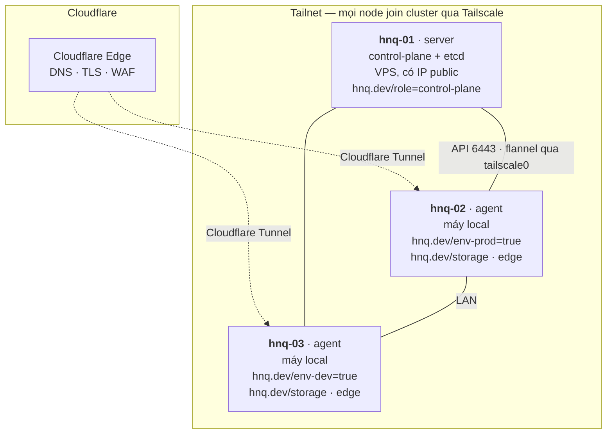
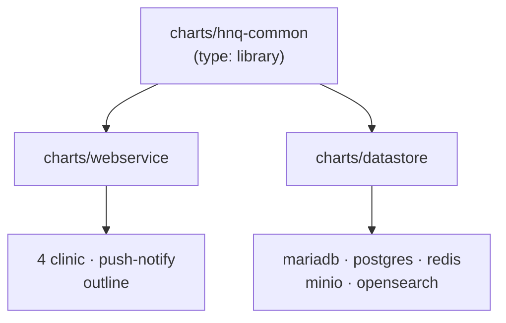
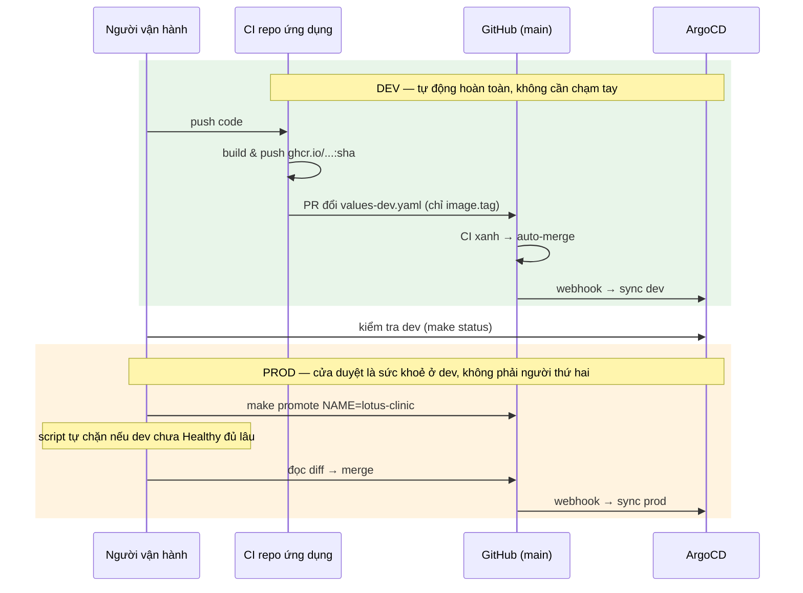
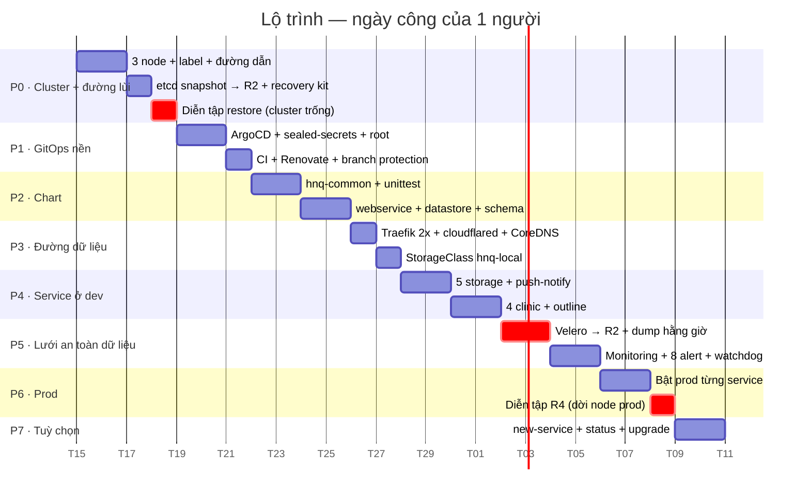

# Kế hoạch xây dựng hạ tầng k3s + ArgoCD

| | |
|---|---|
| **Trạng thái** | Bản nháp v3, chờ duyệt |
| **Ngày** | 12/09/2026 |
| **Bối cảnh** | Xây **mới hoàn toàn** trên repo GitHub mới. Không migrate dữ liệu cũ. |
| **Topology** | **1 server master + 2 node local**, join cluster qua Tailscale. **Không HA, và sẽ không HA.** |
| **Người vận hành** | **1 người** |
| **Mục tiêu vận hành** | Khi có sự cố, phục hồi **nhanh nhất có thể** — xem [DISASTER_RECOVERY.md](./DISASTER_RECOVERY.md) |
| **Cơ sở** | [RESEARCH_BEST_PRACTICES.md](./RESEARCH_BEST_PRACTICES.md) |
| **Liên quan** | [K3S_OPERATIONS.md](./K3S_OPERATIONS.md) · [DISASTER_RECOVERY.md](./DISASTER_RECOVERY.md) · [SECRET_MANAGEMENT.md](./SECRET_MANAGEMENT.md) |

---

## Những gì đã thay đổi so với bản v2

| Thay đổi | Hệ quả |
|---|---|
| **Topology chốt: 1 master + 2 node local qua Tailscale** | Hết câu hỏi "bao nhiêu node" để ngỏ. Vai trò từng node cố định ([Phần 2.2](#22-ba-node-vai-trò-cố-định)). Longhorn: **chốt là không** ([Phần 10.6](#106-longhorn--chốt-là-không)). |
| **Không HA — và đây là quyết định đúng, không phải nhân nhượng** | etcd 3 server nối qua Tailscale/WAN **tệ hơn** 1 server: mỗi lần ghi phải chờ quorum qua đường mạng có độ trễ thay đổi. Chi tiết ở [Phần 2.3](#23-vì-sao-không-ha-là-lựa-chọn-đúng-ở-đây). |
| **3 người → 1 người vận hành** | Bỏ yêu cầu approval trên PR (GitHub không cho tự duyệt PR của mình — bật lên là tự khoá mình ra khỏi repo), bỏ Dex/GitHub OIDC cho ArgoCD, bỏ Tailscale Operator, bỏ luân phiên trong lịch vận hành. Thay "4 mắt" bằng **CI + đường quay lui**. |
| **Mục tiêu mới: MTTR nhỏ nhất, không phải MTBF lớn nhất** | Đảo thứ tự lộ trình: **đường phục hồi phải chạy được trước khi có dữ liệu thật** ([Phần 12](#12-lộ-trình)). Thêm [DISASTER_RECOVERY.md](./DISASTER_RECOVERY.md) với 10 quy trình phục hồi có đo thời gian. |
| **Đường dữ liệu tách khỏi control-plane** | Traefik + cloudflared + CoreDNS chạy 2 replica trên 2 node local. Master chết → **traffic người dùng vẫn được phục vụ** ([Phần 2.4](#24-đường-dữ-liệu-không-phụ-thuộc-master)). Đây là thay đổi kiến trúc quan trọng nhất của bản này. |
| **Lưu trữ: `local-path` + StorageClass riêng thay static `local` PV** | Restore nhanh hơn: Velero tạo lại PVC → provisioner tự cấp volume trên node mới. Không phải viết tay file PV lúc đang sự cố ([Phần 10.4](#104-storageclass-hnq-local)). |

Kết quả: ít thành phần hơn, ít nghi thức hơn, và **mọi thứ còn lại đều có câu trả lời cho câu hỏi "hỏng thì bao lâu thì chạy lại?"**

---

## Mục lục

- [1. Tám quyết định nền tảng](#1-tám-quyết-định-nền-tảng)
- [2. Kiến trúc và topology](#2-kiến-trúc-và-topology)
- [3. Cấu trúc repo](#3-cấu-trúc-repo)
- [4. Registry + ApplicationSet](#4-registry--applicationset)
- [5. Library chart](#5-library-chart)
- [6. Môi trường và promotion](#6-môi-trường-và-promotion)
- [7. Secret](#7-secret)
- [8. AppProject](#8-appproject)
- [9. CI trên GitHub Actions](#9-ci-trên-github-actions)
- [10. Cluster, node và lưu trữ](#10-cluster-node-và-lưu-trữ)
- [11. Thiết kế để phục hồi nhanh](#11-thiết-kế-để-phục-hồi-nhanh)
- [12. Lộ trình](#12-lộ-trình)
- [13. Những gì cố tình KHÔNG làm](#13-những-gì-cố-tình-không-làm)
- [14. Rủi ro](#14-rủi-ro)

---

## 1. Tám quyết định nền tảng

| # | Quyết định | Lý do |
|---|---|---|
| **Q1** | **Một branch `main` duy nhất.** Môi trường tách bằng thư mục và file values. | Branch-per-environment là anti-pattern được cộng đồng nêu tên. Quan trọng hơn: với 1 branch bạn **promote được từng service một**; với 2 branch thì merge là đưa tất cả. ([Research §1](./RESEARCH_BEST_PRACTICES.md#1--tách-môi-trường-branch-hay-thư-mục)) |
| **Q2** | **Mọi thay đổi đều qua Pull Request, nhưng CI là cửa duyệt — không phải người.** | Với 1 người, GitHub **không cho tự approve PR của mình**: bật "require approvals" là tự khoá mình ra khỏi repo lúc 2 giờ sáng. Vẫn giữ PR vì PR cho 3 thứ mà commit thẳng không có: diff để đọc lại, lịch sử để truy, và một commit gọn để `git revert`. |
| **Q3** | **ApplicationSet cho service của mình, App-of-Apps cho chart bên thứ ba.** | Đúng phân vai cộng đồng khuyến nghị: factory cho cái lặp lại, danh sách tường minh cho cái cố định. ([Research §2](./RESEARCH_BEST_PRACTICES.md#2--app-of-apps-hay-applicationset)) |
| **Q4** | **Sealed Secrets.** | Rào cản thấp nhất, không cần hệ thống ngoài. Lộ trình chuẩn là bắt đầu ở đây. ([Research §5](./RESEARCH_BEST_PRACTICES.md#5--secret)) |
| **Q5** | **Prod: `selfHeal: true`, `prune: false`.** Dev: cả hai `true`. | `selfHeal` chống chỉnh tay vào cluster. `prune: false` ở prod để một lỗi ApplicationSet không xoá hàng loạt. ([Research §3](./RESEARCH_BEST_PRACTICES.md#3--chính-sách-sync)) |
| **Q6** | **Node chọn bằng label boolean, không bằng hostname — và label chính là cơ chế failover.** | Node prod chết → `kubectl label node hnq-03 hnq.dev/env-prod=true` là **dời cả môi trường**, không sửa một dòng values nào, không đụng tới dev. Đây là bước 1 của quy trình [R4](./DISASTER_RECOVERY.md#r4--node-prod-chết-node-dev-còn-sống); lý do chọn label boolean ở [10.1](#101-gắn-label-cho-node). |
| **Q7** | **Không xây web UI/API riêng.** Dùng ArgoCD UI + k9s + script. | ArgoCD UI đã có danh sách app, sync/health, log, diff, nút sync. Xây lại là phí. Xem [K3S_OPERATIONS](./K3S_OPERATIONS.md). |
| **Q8** | **Mọi thay đổi phải có đường quay lui đo được bằng phút.** | 1 người, không ca trực → thứ không quay lui được là thứ sẽ thành downtime dài. Cụ thể: image tag **ghim SHA** (không `latest`), `prune: false` ở prod, `reclaimPolicy: Retain` cho mọi PV, snapshot etcd trước mọi việc nguy hiểm, nâng cấp k3s ghim version. |

### Sáu nguyên tắc

| # | Nguyên tắc | Trong thực tế |
|---|---|---|
| **P1** | Git là nguồn sự thật duy nhất | Không `kubectl apply` tay, không `helm install` tay. Kể cả tự động hoá cũng ghi vào Git. |
| **P2** | Khai báo một lần, sinh ra nhiều lần | Một file khai báo service → ArgoCD tự sinh Application cho mọi môi trường. |
| **P3** | Chart chung, values riêng | Service mới chỉ viết values, không viết template. |
| **P4** | Schema là hợp đồng | Một JSON Schema dùng cho cả CI lẫn form UI sau này. |
| **P5** | Đơn giản hơn là tốt hơn | Với 1 người, mỗi lớp trừu tượng phải tự trả giá được. Xem [Phần 13](#13-những-gì-cố-tình-không-làm). |
| **P6** | **Phục hồi đã đo hơn phòng ngừa chưa thử** | Mỗi cơ chế an toàn phải có một lần diễn tập có ghi lại thời gian thực tế. Backup chưa restore thử thì tính là **không có backup**. |

---

## 2. Kiến trúc và topology

### 2.1. Luồng GitOps


Một luồng, không nhánh rẽ. Với 1 người thì đây là điểm quan trọng nhất: **toàn bộ hệ thống vẽ được trên một trang giấy**, nên lúc sự cố không phải tự nhớ lại kiến trúc của chính mình.

### 2.2. Ba node, vai trò cố định



| Node | Vai trò | Chạy gì | Không chạy gì |
|---|---|---|---|
| **hnq-01** (VPS)<br/>`role=control-plane` | server — control-plane + etcd | apiserver, etcd, ArgoCD, sealed-secrets controller, cert-manager, Velero controller | **Không** workload ứng dụng, **không** dữ liệu khách hàng |
| **hnq-02** (local)<br/>`env-prod=true` | agent — môi trường **prod** | mọi service `*-prod` + datastore prod, 1 replica Traefik, 1 replica cloudflared, 1 replica CoreDNS | — |
| **hnq-03** (local)<br/>`env-dev=true` | agent — môi trường **dev** | mọi service `*-dev` + datastore dev, 1 replica Traefik, 1 replica cloudflared, 1 replica CoreDNS, **Prometheus + Grafana + Alertmanager** | — |

Bốn lý do cho cách chia này:

1. **etcd không tranh tài nguyên với workload.** Nguyên nhân phổ biến nhất làm cluster k3s một-server "treo" là etcd bị đói I/O vì một pod nào đó ăn hết đĩa.
2. **Dữ liệu khách hàng không nằm trên VPS.** Mất VPS là mất control-plane, không phải mất dữ liệu.
3. **prod và dev không chung node.** Một câu lệnh sai ở dev không kéo prod theo.
4. **Monitoring nằm trên node dev, không nằm trên master và cũng không nằm trên node prod.** Đặt trên master thì mất master là mất luôn khả năng biết mình mất master. Đặt trên node prod thì node prod chết là mất monitoring **đúng lúc đang có sự cố prod**. Node dev là chỗ duy nhất còn lại — và khi phải dời prod sang đó ([R4](./DISASTER_RECOVERY.md#r4--node-prod-chết-node-dev-còn-sống)) thì dev đã được scale về 0 nên có đủ chỗ.

> Master **không** bị taint. Lý do: taint làm mọi chart bên thứ ba phải thêm toleration, và đó là một lớp phức tạp phải trả giá mãi. Thay vào đó, `nodeSelector` đến từ `env/*.yaml` cho mọi chart của mình, và CI có policy **bắt buộc mọi workload phải khai `nodeSelector`** ([Phần 9](#policy-bắt-buộc-cipolicy)) — sai là CI chặn, không phải phát hiện lúc pod đã nằm sai chỗ.

### 2.3. Vì sao "không HA" là lựa chọn đúng ở đây

Không phải nhân nhượng vì thiếu server. Với topology này, HA thật sự **làm hệ thống tệ hơn**:

| | 1 server (chọn) | 3 server HA qua Tailscale |
|---|---|---|
| Mỗi lần ghi vào etcd | Ghi đĩa local, xong | Phải chờ quorum **qua Tailscale** — độ trễ WAN, thay đổi theo giờ |
| Mất 1 node mạng | Không ảnh hưởng etcd | Có thể **mất quorum → cluster read-only** dù cả 3 máy đều sống |
| Số thứ có thể hỏng | 1 etcd | 3 etcd + 1 load balancer cho API + đồng bộ version giữa 3 server |
| Người cần để sửa | 1 người, quy trình [R5](./DISASTER_RECOVERY.md#r5--etcd-hỏng-hoặc-apiserver-không-lên-đĩa-còn-nguyên) | 1 người, phải hiểu quorum etcd lúc đang sự cố |
| Khi master chết | Workload **vẫn phục vụ** (Phần 2.4), restore ~10–30 phút | Tự động — nếu quorum còn |

Cộng đồng nói cùng một điều cho quy mô này:

> *"For small teams, you probably don't need high availability on day one — a single-node K3s cluster with daily backups and a documented restore procedure will outlast the actual reliability needs of most early-stage products."*

**Kết luận: 1 server, nhưng đổi lại phải làm thật tốt hai thứ** — đường dữ liệu không phụ thuộc master (2.4), và đường phục hồi đã diễn tập ([DISASTER_RECOVERY.md](./DISASTER_RECOVERY.md)).

### 2.4. Đường dữ liệu không phụ thuộc master

Đây là thay đổi kiến trúc quan trọng nhất của bản v3. Khi control-plane chết, **kubelet không giết container đang chạy** — pod vẫn phục vụ. Vấn đề chỉ nằm ở chỗ ba thành phần trên đường đi của request thường bị vô tình đặt hết lên master.

Chữa bằng cách ghim mỗi thứ 2 replica lên 2 node local:

| Thành phần | Cấu hình | Nếu không làm |
|---|---|---|
| **Traefik** | 2 replica, `podAntiAffinity` theo node, `nodeSelector` vào 2 node local | Master chết → không còn ingress controller → 100% request lỗi |
| **cloudflared** | **Chạy in-cluster** như Deployment 2 replica trên 2 node local, thay vì systemd trên VPS | Tunnel nằm trên VPS → master chết là mất luôn đường vào từ Cloudflare |
| **CoreDNS** | 2 replica + `podAntiAffinity` (mẫu đã có sẵn trong repo cũ: `coredns-ha`) | Pod không phân giải được `*.svc.cluster.local` → mọi kết nối nội bộ đứt |

Kết quả: khi `hnq-01` chết hoàn toàn:

- ✅ Cloudflare → tunnel (node local) → Traefik (node local) → pod (node local): **traffic người dùng không bị ảnh hưởng**
- ✅ Database, MinIO, Redis: vẫn chạy, vẫn có dữ liệu
- ❌ Không `kubectl`, không ArgoCD sync, không scheduling pod mới, không cấp mới chứng chỉ
- ❌ Pod nào chết trong lúc đó sẽ **không được tạo lại**

Nghĩa là: mất master là **sự cố cần xử lý trong ngày, không phải sự cố phải thức đêm**. Đó chính là điều biến "1 server, không HA" từ rủi ro thành lựa chọn hợp lý.

> Cái giá phải trả: mỗi lần thêm một thành phần vào đường đi của request, phải tự hỏi *"nó có 2 replica trên 2 node local không?"*. Đưa vào [lịch vận hành hằng tuần](./K3S_OPERATIONS.md#11-lịch-vận-hành) — `make drift` kiểm luôn việc này ([10.7](#107-ghim-đường-dữ-liệu-lên-2-node-local)).

---
## 3. Cấu trúc repo

```text
HNQ-Infra/                          (GitHub, branch main duy nhất)
│
├── registry/                 ⭐ NƠI DUY NHẤT sửa khi thêm service
│   ├── schema/
│   │   └── service.schema.json     # validate CI + sinh form UI sau này
│   └── apps/
│       ├── lotus-clinic/
│       │   ├── service.yaml        # chart nào, bật env nào, cần secret gì
│       │   ├── values-dev.yaml     # chỉ ghi phần KHÁC mặc định
│       │   ├── values-prod.yaml
│       │   └── config/             # file config mount vào ConfigMap
│       ├── giaan-clinic/
│       ├── biboo-clinic/
│       ├── hocmon-clinic/
│       ├── push-notify/
│       ├── storage-mariadb/
│       ├── storage-postgres/
│       ├── storage-redis/
│       ├── storage-minio/
│       ├── storage-opensearch/
│       └── outline/
│
├── charts/                   ⭐ Hiếm khi sửa — 3 chart cho toàn hệ thống
│   ├── hnq-common/                 # library chart
│   ├── webservice/                 # mọi HTTP service
│   └── datastore/                  # mọi datastore một node
│
├── env/                      ⭐ Khác biệt dev ↔ prod
│   ├── dev.yaml
│   └── prod.yaml
│
├── gitops/
│   ├── root.yaml                   # ⭐ FILE DUY NHẤT apply tay, đúng 1 lần
│   └── bootstrap/
│       ├── project-platform.yaml
│       ├── project-apps.yaml
│       ├── appset-apps.yaml        # sinh Application cho registry/apps/*
│       ├── app-cert-manager.yaml   # ↓ chart bên thứ ba, danh sách tường minh
│       ├── app-sealed-secrets.yaml
│       ├── app-monitoring.yaml
│       ├── app-traefik-config.yaml
│       └── app-velero.yaml
│
├── secrets/                        # SealedSecret — an toàn để commit
│   ├── README.md                   # danh mục secret hệ thống cần
│   ├── dev/<service>/*.yaml
│   └── prod/<service>/*.yaml
│
├── .github/
│   ├── workflows/
│   │   ├── validate.yml
│   │   └── auto-merge-dev.yml
│   ├── CODEOWNERS
│   └── renovate.json
│
├── ci/
│   ├── policy/                     # Rego: bắt buộc limits, nodeSelector, cấm latest...
│   └── scripts/
│       ├── new-service.sh
│       ├── render-all.sh
│       ├── check-secrets.sh
│       └── promote.sh
│
├── scripts/
│   ├── status.sh                   # bảng tag dev ↔ prod
│   ├── drift.sh                    # cái gì lệch Git + đường dữ liệu đúng chỗ chưa
│   ├── backup/                     # dump logic database → R2 (lớp 2b)
│   └── dr/                   ⭐ NƠI ĐI TỚI KHI ĐANG SỰ CỐ
│       ├── kit-check.sh            # recovery kit còn đủ và còn dùng được?
│       ├── restore-etcd.sh         # R5 — restore snapshot, đĩa còn nguyên
│       ├── rebuild-master.sh       # R6 — dựng master mới từ snapshot + token
│       ├── failover-prod.sh        # R4 — dời prod sang node còn sống
│       └── restore-db.sh           # R7 — restore 1 database từ dump
│
├── docs/
│   ├── REFACTOR_PLAN.md
│   ├── K3S_OPERATIONS.md
│   ├── DISASTER_RECOVERY.md  ⭐ mở file này TRƯỚC khi gõ lệnh lúc sự cố
│   ├── SECRET_MANAGEMENT.md
│   ├── RUNBOOK.md                  # sự cố đã gặp và cách đã xử lý
│   └── BREAK_GLASS.md              # 1 trang cho người không biết k8s (§14.1)
└── Makefile
```

> `scripts/dr/` tách riêng khỏi `scripts/` là có chủ ý: lúc sự cố, **không phải đọc tên 15 file để tìm cái cần**. Mỗi script trong đó ứng với đúng một quy trình R* trong [DISASTER_RECOVERY.md](./DISASTER_RECOVERY.md), và mỗi script tự in ra việc nó sắp làm rồi chờ xác nhận.

### Tại sao gộp `tenants/` và `platform/` thành `apps/`

Bản trước tách hai thư mục. Nhưng khác biệt đã nằm trong trường `spec.category` của chính file khai báo rồi — tách thư mục chỉ thêm một cấp và thêm một ApplicationSet phải bảo trì.

Cộng đồng khuyến nghị **không lồng quá 4 cấp**. Gộp lại giữ `registry/apps/lotus-clinic/values-dev.yaml` ở 3 cấp, còn dư chỗ cho `config/`.

### Chi phí thêm 1 service mới

```bash
make new-service NAME=abc-clinic CHART=webservice
# → tạo registry/apps/abc-clinic/{service,values-dev,values-prod}.yaml
# → git checkout -b add-abc-clinic && commit && push && gh pr create
```

**Không phải viết file ArgoCD nào.** ApplicationSet tự phát hiện sau khi PR merge.

---

## 4. Registry + ApplicationSet

### 4.1. File khai báo service

`registry/apps/lotus-clinic/service.yaml` — toàn bộ những gì ArgoCD cần biết:

```yaml
apiVersion: hnq.dev/v1
kind: ServiceRelease

metadata:
  name: lotus-clinic
  owner: team-clinic
  description: Backend phòng khám Lotus

spec:
  category: app                  # app | platform
  chart: webservice              # webservice | datastore

  # Môi trường được bật. Chưa có "prod" ở đây → chưa có Application prod.
  environments:
    - env: dev
    - env: prod

  # Tên các secret service cần (KHÔNG phải giá trị).
  # Dùng để CI kiểm tra thiếu sót và sinh form nhập secret sau này.
  requiredSecrets:
    - name: lotus-clinic-backend
      keys: [DB_PASSWORD, JWT_SECRET, MINIO_SECRET_KEY]
```

> Namespace không cần khai — suy ra theo quy ước `<tên>-<env>`. Bớt một chỗ gõ sai.

`registry/apps/lotus-clinic/values-dev.yaml` — chỉ phần khác mặc định:

```yaml
image:
  repository: ghcr.io/hnq-tech/lotus-backend
  tag: 6aebe241

ingress:
  host: lotus-dev.l2cteam.work

app:
  configFile: config/config_dev.yaml
  secretName: lotus-clinic-backend
```

~10 dòng. Mọi thứ khác — `containerPort`, probe, resources, nodeSelector, cert-manager issuer, imagePullSecrets, serviceMonitor — đến từ `env/dev.yaml` và `charts/webservice/values.yaml`.

### 4.2. File mặc định theo môi trường

`env/dev.yaml`:

```yaml
global:
  env: dev
  domainSuffix: l2cteam.work

image:
  pullPolicy: IfNotPresent

ingress:
  className: traefik
  annotations:
    traefik.ingress.kubernetes.io/router.entrypoints: websecure
    cert-manager.io/cluster-issuer: letsencrypt-dev
  tls:
    enabled: true

serviceAccount:
  imagePullSecrets:
    - name: ghcr-pull            # ← một tên chung, không dính tên khách hàng

# Chọn node bằng LABEL, không bằng hostname (Q6).
# Label dạng boolean để một node mang được nhiều môi trường khi failover — Phần 10.1
nodeSelector:
  hnq.dev/env-dev: "true"

resources:
  requests: { cpu: 100m, memory: 128Mi }
  limits:   { cpu: 500m, memory: 512Mi }

serviceMonitor:
  enabled: true

# Luôn dùng StorageClass có reclaimPolicy Retain (Phần 10.4), không dùng
# local-path mặc định của k3s — CI có policy chặn nếu khai sai.
persistence:
  storageClass: hnq-local

# Dev: tự dọn resource thừa
syncPolicy:
  prune: true
```

`env/prod.yaml` khác ở: `nodeSelector: { hnq.dev/env-prod: "true" }`, issuer prod, resources lớn hơn, và **`prune: false`** (Q5).

> **Không đặt `replicas: 2` mặc định cho prod.** Ở topology này mọi pod prod nằm trên cùng một node (`hnq-02`), nên replica thứ hai không chống được sự cố node — nó chỉ nhân đôi mức ăn tài nguyên và nhân đôi số kết nối vào database. Chỉ bật nhiều replica cho thứ **thật sự nằm trên nhiều node**: Traefik, cloudflared, CoreDNS ([10.7](#107-ghim-đường-dữ-liệu-lên-2-node-local)).

### 4.3. ApplicationSet

`gitops/bootstrap/appset-apps.yaml` — một file thay cho 24 file Application:

```yaml
apiVersion: argoproj.io/v1alpha1
kind: ApplicationSet
metadata:
  name: apps
  namespace: argocd
spec:
  goTemplate: true
  goTemplateOptions: ["missingkey=error"]

  generators:
    - matrix:
        generators:
          # (1) Quét mọi file khai báo service
          - git:
              repoURL: &repo https://github.com/hunho247/HNQ-Infra.git
              revision: main
              files:
                - path: "registry/apps/*/service.yaml"
          # (2) Bung theo danh sách môi trường khai báo trong chính file đó
          - list:
              elementsYaml: "{{ toJson .spec.environments }}"

  template:
    metadata:
      name: "{{ .metadata.name }}-{{ .env }}"
      namespace: argocd
      labels:
        hnq.dev/owner: "{{ .metadata.owner }}"
        hnq.dev/env: "{{ .env }}"
      finalizers:
        - resources-finalizer.argocd.argoproj.io
    spec:
      project: "{{ .spec.category }}"        # app | platform
      source:
        repoURL: *repo
        targetRevision: main
        path: "charts/{{ .spec.chart }}"
        helm:
          releaseName: "{{ .metadata.name }}"
          valueFiles:
            - values.yaml
            - "/env/{{ .env }}.yaml"
            - "/registry/apps/{{ .metadata.name }}/values-{{ .env }}.yaml"
          parameters:
            - name: global.serviceName
              value: "{{ .metadata.name }}"
      destination:
        server: https://kubernetes.default.svc
        namespace: "{{ .metadata.name }}-{{ .env }}"
      syncPolicy:
        automated:
          selfHeal: true
          # Q5: dev dọn tự động, prod thì không
          prune: {{ if eq .env "dev" }}true{{ else }}false{{ end }}
        syncOptions:
          - CreateNamespace=true
          - PruneLast=true
          - ServerSideApply=true
        managedNamespaceMetadata:
          labels:
            hnq.dev/env: "{{ .env }}"
            hnq.dev/owner: "{{ .metadata.owner }}"
```

Ba điểm kỹ thuật:

- **`elementsYaml`** (ArgoCD ≥ 2.5) cho generator thứ hai đọc kết quả của generator thứ nhất. Nhờ đó bật/tắt môi trường nằm ngay trong file khai báo service.
- **`valueFiles` bắt đầu bằng `/`** = tính từ gốc repo. Cho phép chart ở `charts/`, values ở `registry/`.
- **`ServerSideApply=true`** cần cho chart có CRD lớn (kube-prometheus-stack).

> Vì chỉ còn **một branch**, `targetRevision: main` ghi cứng được — không cần bọc ApplicationSet trong Helm chart như bản trước. Đây là lợi ích lớn nhất của quyết định Q1 về mặt đơn giản hoá.

### 4.4. Chart bên thứ ba dùng Application tường minh

Nhóm này danh sách ngắn, cố định, mỗi cái một kiểu — ép vào ApplicationSet chỉ thêm phức tạp:

```yaml
# gitops/bootstrap/app-cert-manager.yaml
apiVersion: argoproj.io/v1alpha1
kind: Application
metadata:
  name: cert-manager
  namespace: argocd
spec:
  project: platform
  source:
    repoURL: https://charts.jetstack.io
    chart: cert-manager
    targetRevision: v1.16.2          # ← Renovate tự mở PR nâng phiên bản
    helm:
      values: |
        crds:
          enabled: true
  destination:
    server: https://kubernetes.default.svc
    namespace: cert-manager
  syncPolicy:
    automated: { selfHeal: true, prune: false }
    syncOptions: [CreateNamespace=true, ServerSideApply=true]
```

Danh sách: `cert-manager`, `sealed-secrets`, `kube-prometheus-stack`, `velero`, `traefik-config`. Năm file, thay đổi vài tháng một lần.

### 4.5. Bootstrap — một lệnh duy nhất

```yaml
# gitops/root.yaml — apply tay ĐÚNG MỘT LẦN trong đời cluster
apiVersion: argoproj.io/v1alpha1
kind: Application
metadata:
  name: root
  namespace: argocd
spec:
  project: default
  source:
    repoURL: https://github.com/hunho247/HNQ-Infra.git
    targetRevision: main
    path: gitops/bootstrap
    directory: { recurse: true }
  destination:
    server: https://kubernetes.default.svc
    namespace: argocd
  syncPolicy:
    automated: { selfHeal: true, prune: true }
```

```bash
kubectl -n argocd apply -f gitops/root.yaml
```

Xong. Mọi thứ còn lại tự dựng.

---

## 5. Library chart

### 5.1. Ba chart cho toàn hệ thống



`hnq-common` cung cấp: `hnq.fullname`, `hnq.labels`, `hnq.selectorLabels`, `hnq.image`, `hnq.imagePullSecrets`, `hnq.service`, `hnq.ingress`, `hnq.probes`, `hnq.resources`, `hnq.persistence`, `hnq.podAnnotations`.

Đổi một quy ước label → sửa **một chỗ**, không phải 11 chỗ như cấu trúc cũ.

### 5.2. Sync waves — thêm mới theo research

Đưa thẳng vào `hnq-common` để mọi chart có sẵn, giải quyết bài toán cụ thể: **backend khởi động trước khi MariaDB sẵn sàng**.

```yaml
# charts/hnq-common/templates/_annotations.tpl
{{- define "hnq.syncWave" -}}
argocd.argoproj.io/sync-wave: {{ .wave | quote }}
{{- end -}}
```

Quy ước:

| Wave | Resource |
|---|---|
| `-1` | Namespace, CRD |
| `0` | ConfigMap, Secret, ServiceAccount, PVC |
| `1` | Deployment, StatefulSet |
| `2` | Ingress, HPA, ServiceMonitor |

### 5.3. Không tạo namespace trong chart

Namespace do ArgoCD tạo qua `CreateNamespace=true`, label gắn qua `managedNamespaceMetadata`. Không có `templates/namespace.yaml` trong bất kỳ chart nào — tránh tranh chấp quyền sở hữu resource.

---

## 6. Môi trường và promotion

### 6.1. Mô hình

Một branch `main`. Dev và prod khác nhau bằng file values:

```text
registry/apps/lotus-clinic/values-dev.yaml    → image.tag: 7bcd1234   (mới, đang test)
registry/apps/lotus-clinic/values-prod.yaml   → image.tag: f1eb557d   (ổn định)
```

Prod giữ tag cũ cho tới khi bạn chủ động đổi. **Promote được từng service một** — đây là lý do chính chọn 1 branch.

Và vì tag luôn là SHA cụ thể (Q8), quay lui prod = `git revert` cái PR promote. Một lệnh, không phải đi tìm "trước đó nó chạy version nào".

### 6.2. Luồng



### 6.3. Vì sao vẫn dùng PR khi chỉ có 1 người (Q2)

Câu hỏi hợp lý: 1 người thì PR cho ai đọc?

PR ở đây **không phải để người khác duyệt**, mà để có ba thứ:

| PR cho bạn | Vì sao cần với 1 người |
|---|---|
| Một diff đọc lại trước khi merge | Chính bạn 5 phút trước là "người khác" đủ tốt. Phần lớn sự cố tự gây ra bị bắt ở bước này. |
| Một commit gọn để `git revert` | Merge squash → 1 commit → 1 lệnh quay lui. Đây là Q8. |
| Chỗ để CI chạy **trước** khi vào `main` | `main` luôn là thứ ArgoCD đang sync. `main` đỏ = cluster đỏ. |

Cấu hình branch protection cho `main` — **khác bản v2, đọc kỹ chỗ này**:

| Thiết lập | v2 (3 người) | v3 (1 người) | Vì sao |
|---|---|---|---|
| Require a pull request before merging | ✅ | ✅ | Giữ |
| Require approvals | 1 | **0** | GitHub không cho tự approve PR của mình. Bật = tự khoá mình ra khỏi repo. |
| Require review from Code Owners | ✅ | **Tắt** | Cùng lý do |
| Require status checks to pass | ✅ | ✅ | **Đây là cửa duyệt duy nhất** — nên CI phải nghiêm |
| Require branches to be up to date | ✅ | ✅ | Giữ |
| Allow force push / delete `main` | ❌ | ❌ | Giữ |
| Do not allow bypassing (kể cả admin) | ✅ | **Tắt** | Cần đường break-glass khi CI hỏng mà cluster đang đỏ. Xem dưới. |

> **Break-glass:** cho phép admin bypass, nhưng ràng buộc bằng thói quen chứ không bằng cơ chế: mỗi lần bypass thì viết một dòng vào `docs/RUNBOOK.md`. Trường hợp thật sự cần: GitHub Actions đang sự cố mà prod đang đỏ và cần `git revert` ngay.

`CODEOWNERS` vẫn giữ nhưng đổi mục đích — từ "bắt buộc duyệt" thành **"nhắc mình dừng lại 10 giây"**:

```
# .github/CODEOWNERS
# Không bật "Require review from Code Owners".
# File này chỉ để GitHub tự gán reviewer là mình → PR nào đụng prod
# sẽ hiện thông báo, đủ để dừng lại đọc diff thêm một lần.
/registry/apps/*/values-prod.yaml   @hunho247
/env/prod.yaml                      @hunho247
/gitops/                            @hunho247
/charts/                            @hunho247
/secrets/prod/                      @hunho247
```

### 6.4. Auto-merge cho PR bump tag dev

Không cần token bypass protected branch: PR vẫn đi qua đúng cửa CI, chỉ là tự merge khi xanh.

```yaml
# .github/workflows/auto-merge-dev.yml
name: auto-merge dev image bumps
on: pull_request

jobs:
  auto-merge:
    runs-on: ubuntu-latest
    steps:
      - uses: actions/checkout@v4
        with: { fetch-depth: 0 }

      - name: Chỉ chấp nhận PR đổi đúng image.tag ở values-dev.yaml
        id: check
        run: |
          FILES=$(git diff --name-only origin/main...HEAD)
          # Mọi file thay đổi phải khớp values-dev.yaml
          echo "$FILES" | grep -qvE '^registry/apps/[^/]+/values-dev\.yaml$' && exit 1
          # Mọi dòng thay đổi phải là image.tag
          git diff origin/main...HEAD -U0 -- $FILES \
            | grep -E '^[+-][^+-]' | grep -qvE '^[+-]\s*tag:' && exit 1
          echo "ok=true" >> $GITHUB_OUTPUT

      - if: steps.check.outputs.ok == 'true'
        run: gh pr merge --auto --squash "${{ github.event.number }}"
        env: { GH_TOKEN: "${{ secrets.GITHUB_TOKEN }}" }
```

Lợi ích giữ nguyên từ bản v2:

- Không cần token có quyền bypass protected branch
- Mọi thay đổi đều có PR để xem lại, kể cả dev
- Bất kỳ tự động hoá nào sau này cũng **chỉ cần quyền tạo branch + mở PR** — không bao giờ cần push vào `main`

### 6.5. Script promote — cửa duyệt thay cho người thứ hai

Vì không có ai duyệt, cửa duyệt phải là **một điều kiện đo được**: tag đó đã chạy Healthy ở dev bao lâu rồi. Script chạy trên máy bạn (máy có quyền vào cluster), nên nó **kiểm tra được thứ CI trên GitHub không thấy**.

```bash
#!/usr/bin/env bash
# ci/scripts/promote.sh <tên-service> [--force]
set -euo pipefail
SVC="$1"; FORCE="${2:-}"
MIN_AGE_MIN=${PROMOTE_MIN_AGE_MIN:-30}

TAG=$(yq -r '.image.tag' "registry/apps/$SVC/values-dev.yaml")
CUR=$(yq -r '.image.tag' "registry/apps/$SVC/values-prod.yaml")
[ "$TAG" = "$CUR" ] && { echo "prod đã chạy $TAG rồi"; exit 0; }

# ── Cửa duyệt 1: dev phải Synced + Healthy ─────────────────────────
read -r SYNC HEALTH < <(kubectl -n argocd get app "$SVC-dev" \
  -o jsonpath='{.status.sync.status} {.status.health.status}')
[ "$SYNC/$HEALTH" = "Synced/Healthy" ] || {
  echo "❌ dev đang $SYNC/$HEALTH — sửa dev trước khi promote"; exit 1; }

# ── Cửa duyệt 2: pod dev phải sống liên tục đủ lâu, không restart ──
AGE=$(kubectl -n "$SVC-dev" get pod -l app.kubernetes.io/instance="$SVC" \
  -o jsonpath='{.items[0].status.startTime}')
AGE_MIN=$(( ( $(date +%s) - $(date -d "$AGE" +%s) ) / 60 ))
RESTARTS=$(kubectl -n "$SVC-dev" get pod -l app.kubernetes.io/instance="$SVC" \
  -o jsonpath='{.items[*].status.containerStatuses[*].restartCount}' \
  | tr ' ' '+' | sed 's/+$//' | bc)

if [ "$AGE_MIN" -lt "$MIN_AGE_MIN" ] || [ "${RESTARTS:-0}" -gt 0 ]; then
  echo "⚠️  dev mới chạy ${AGE_MIN} phút, restart ${RESTARTS} lần (ngưỡng: ${MIN_AGE_MIN} phút, 0 restart)"
  [ "$FORCE" = "--force" ] || { echo "Dùng --force nếu bạn chắc."; exit 1; }
fi

# ── Cửa duyệt 3: ghi lại prod đang chạy gì, để quay lui không phải đi tìm ──
git checkout -b "promote/$SVC-$TAG" main
yq -i ".image.tag = \"$TAG\"" "registry/apps/$SVC/values-prod.yaml"
git commit -am "release($SVC): prod $CUR → $TAG

Quay lui: git revert <commit này>  → prod về $CUR
dev đã chạy $TAG liên tục ${AGE_MIN} phút, ${RESTARTS:-0} restart."
git push -u origin "promote/$SVC-$TAG"
gh pr create --fill --base main --title "release($SVC): prod $CUR → $TAG"
```

Ba cửa duyệt này thay cho "đồng nghiệp bấm approve", và thật ra **chặt hơn**: một người duyệt PR đổi tag không có cách nào biết pod ở dev có restart hay không.

---
## 7. Secret

Chi tiết ở [SECRET_MANAGEMENT.md](./SECRET_MANAGEMENT.md). Tóm tắt:

**Sealed Secrets.** Secret mã hoá bằng public key của controller, commit vào Git an toàn, chỉ controller trong cluster giải mã được.

Vì chỉ có 1 người và người đó có quyền vào cluster, quy trình gọn nhất là dùng `kubeseal` ở máy mình — bản rõ không đi qua hệ thống nào khác:

```bash
kubectl create secret generic lotus-clinic-backend \
  --namespace lotus-clinic-prod \
  --from-literal=DB_PASSWORD='...' \
  --dry-run=client -o yaml \
| kubeseal --format yaml > secrets/prod/lotus-clinic/backend.yaml

git add secrets/prod/lotus-clinic/backend.yaml   # an toàn — đã mã hoá
```

**Bắt buộc ngay sau khi cài controller:** backup sealing key ra ngoài cluster. Mất key = phải tạo lại toàn bộ secret.

```bash
kubectl -n kube-system get secret \
  -l sealedsecrets.bitnami.com/sealed-secrets-key -o yaml \
  > sealing-key-backup.yaml     # cất ở password manager, KHÔNG commit
```

CI có `gitleaks` chặn secret thô lọt vào repo, và một job kiểm tra `requiredSecrets` trong registry đã có đủ file trong `secrets/<env>/` chưa.

---

## 8. AppProject

Hai project, không phải sáu. Với 1 người thì ranh giới cần là **giới hạn phạm vi thiệt hại của chính mình** — chặn một chart viết sai làm được thứ nó không nên làm — chứ không phải phân quyền giữa các đội.

```yaml
# gitops/bootstrap/project-apps.yaml
apiVersion: argoproj.io/v1alpha1
kind: AppProject
metadata:
  name: app
  namespace: argocd
spec:
  description: Ứng dụng — không được tạo resource cấp cluster
  sourceRepos:
    - https://github.com/hunho247/HNQ-Infra.git
  destinations:
    - { server: https://kubernetes.default.svc, namespace: "*-dev" }
    - { server: https://kubernetes.default.svc, namespace: "*-prod" }
  clusterResourceWhitelist: []          # ← chặn hoàn toàn ClusterRole, CRD...
```

```yaml
# gitops/bootstrap/project-platform.yaml
apiVersion: argoproj.io/v1alpha1
kind: AppProject
metadata:
  name: platform
  namespace: argocd
spec:
  description: Nền tảng — được tạo resource cấp cluster
  sourceRepos: ["*"]                    # chart bên thứ ba từ nhiều nguồn
  destinations:
    - { server: https://kubernetes.default.svc, namespace: "*" }
  clusterResourceWhitelist:
    - { group: "*", kind: "*" }
```

Giá trị thật: một chart ứng dụng viết sai **không thể** tạo `ClusterRole` hay đụng vào `kube-system`.

### Việc phải làm ngay khi cài ArgoCD

Khác bản v2: **giữ tài khoản `admin`, bỏ Dex/GitHub OIDC.**

Với 1 người, OIDC qua Dex thêm một chuỗi phụ thuộc dài (ArgoCD → Dex → GitHub OAuth → GitHub org) mà mỗi mắt trong chuỗi đó hỏng là **không đăng nhập được vào ArgoCD đúng lúc đang sự cố**. Đổi lại được gì? Danh tính theo người — thứ chỉ có giá trị khi có nhiều người.

Nên: một tài khoản local, mật khẩu dài sinh ngẫu nhiên cất ở password manager, và **ArgoCD không bao giờ có ingress ra internet**.

```yaml
# Trong values của chart argo-cd
configs:
  cm:
    admin.enabled: "true"          # ← giữ, vì đây là đường vào duy nhất
    timeout.reconciliation: 180s   # sync nhanh hơn mặc định 3 phút
  params:
    server.insecure: "true"        # TLS do Traefik lo
  rbac:
    policy.default: ""             # deny-by-default cho mọi thứ khác

server:
  # KHÔNG tạo ingress public. Truy cập qua Tailscale:
  #   kubectl -n argocd port-forward svc/argocd-server 8080:80
  # hoặc ingress chỉ nghe trên entrypoint nội bộ, chặn ở Cloudflare.
  ingress:
    enabled: false

# ArgoCD không có PV → restore etcd snapshot là ArgoCD trở lại nguyên trạng.
# Đây là lý do không cần backup riêng cho ArgoCD.
redis-ha:
  enabled: false
controller:
  replicas: 1
```

| | Dex + GitHub OIDC (v2) | admin + tailnet-only (v3) |
|---|---|---|
| Số thứ phải sống để đăng nhập được | 4 | 1 |
| Đăng nhập được khi GitHub sự cố | ❌ | ✅ |
| Biết ai làm gì | ✅ | Không cần — chỉ có 1 người |
| Bề mặt tấn công | ArgoCD lộ ra internet | **Không có route từ internet** |
| Khi có người thứ 2 | Đã sẵn | Bật Dex lúc đó, ~1 giờ |

Ba việc bắt buộc đi kèm, không được bỏ:

1. **Mật khẩu admin**: đổi mật khẩu sinh tự động ngay sau khi cài, cất vào password manager cùng chỗ với [recovery kit](./DISASTER_RECOVERY.md#2-recovery-kit--ba-thứ-phải-luôn-có).
2. **Không ingress public cho ArgoCD** — kiểm bằng `kubectl -n argocd get ingress` phải trống. Đưa vào [checklist](./K3S_OPERATIONS.md#danh-sách-kiểm-tra-khi-coi-là-xong).
3. **`policy.default: ""`** — RBAC mặc định của ArgoCD quá rộng ([Research §7](./RESEARCH_BEST_PRACTICES.md#7--bảo-mật-và-multi-tenancy)); deny-by-default là miễn phí khi làm từ đầu.

---
## 9. CI trên GitHub Actions

```yaml
# .github/workflows/validate.yml
name: validate
on:
  pull_request:
  push: { branches: [main] }

env:
  HELM_VERSION: "3.16.0"
  KUBECONFORM_VERSION: "0.6.7"
  CONFTEST_VERSION: "0.56.0"

jobs:
  validate:
    runs-on: ubuntu-latest
    steps:
      - uses: actions/checkout@v4

      - name: Cài công cụ
        run: |
          curl -sL "https://get.helm.sh/helm-v${HELM_VERSION}-linux-amd64.tar.gz" | tar xz
          sudo mv linux-amd64/helm /usr/local/bin/
          curl -sL "https://github.com/yannh/kubeconform/releases/download/v${KUBECONFORM_VERSION}/kubeconform-linux-amd64.tar.gz" | sudo tar xz -C /usr/local/bin kubeconform
          curl -sL "https://github.com/open-policy-agent/conftest/releases/download/v${CONFTEST_VERSION}/conftest_${CONFTEST_VERSION}_Linux_x86_64.tar.gz" | sudo tar xz -C /usr/local/bin conftest
          helm plugin install https://github.com/helm-unittest/helm-unittest

      - name: yamllint
        run: yamllint -c ci/yamllint.yaml registry/ env/ gitops/

      - name: Kiểm tra schema của mọi file khai báo service
        run: |
          npx -y ajv-cli@5 validate --spec=draft2020 \
            -s registry/schema/service.schema.json \
            -d "registry/apps/*/service.yaml"

      - name: helm lint + unittest
        run: |
          for c in charts/webservice charts/datastore; do
            helm lint "$c"
            helm unittest "$c"
          done

      - name: Kiểm tra thiếu secret
        run: ci/scripts/check-secrets.sh

      - name: Render mọi service × mọi môi trường
        run: ci/scripts/render-all.sh > rendered.yaml

      - name: kubeconform
        run: |
          kubeconform -strict -summary -kubernetes-version 1.31.0 \
            -schema-location default \
            -schema-location 'https://raw.githubusercontent.com/datreeio/CRDs-catalog/main/{{.Group}}/{{.ResourceKind}}_{{.ResourceAPIVersion}}.json' \
            rendered.yaml

      - name: Policy (conftest)
        run: conftest test --policy ci/policy rendered.yaml

  security:
    runs-on: ubuntu-latest
    steps:
      - uses: actions/checkout@v4
        with: { fetch-depth: 0 }
      - uses: gitleaks/gitleaks-action@v2
      - uses: aquasecurity/trivy-action@master
        with:
          scan-type: config
          scan-ref: charts/
          severity: HIGH,CRITICAL
          exit-code: "1"
```

### Policy bắt buộc (`ci/policy/`)

| Rule | Ngăn được |
|---|---|
| Mọi container có `resources.limits` và `requests` | Một pod ăn hết CPU node |
| Cấm `image: *:latest` | Deploy không tái tạo được |
| Bắt buộc `readinessProbe` | Traffic vào pod chưa sẵn sàng |
| Cấm `hostNetwork` trừ danh sách cho phép | Xung đột port giữa các DaemonSet |
| Cấm `privileged: true` | Thoát container |
| `Ingress` phải có `cert-manager.io/cluster-issuer` | Domain chạy không TLS |
| **Mọi workload phải khai `nodeSelector`** ⭐ | Pod đáp xuống `hnq-01` và tranh I/O với etcd — nguyên nhân "cluster tự treo" phổ biến nhất ([2.2](#22-ba-node-vai-trò-cố-định)) |
| **Mọi PVC phải dùng `storageClassName: hnq-local`** ⭐ | Rơi về StorageClass mặc định `local-path` với `reclaimPolicy: Delete` → xoá PVC là mất dữ liệu ([10.4](#104-storageclass-hnq-local)) |

### Renovate — thêm mới theo research

```json
// .github/renovate.json
{
  "$schema": "https://docs.renovatebot.com/renovate-schema.json",
  "extends": ["config:recommended"],
  "timezone": "Asia/Ho_Chi_Minh",
  "schedule": ["before 9am on monday"],
  "packageRules": [
    {
      "description": "Gom bản vá nhỏ vào 1 PR để đỡ nhiễu",
      "matchUpdateTypes": ["patch", "minor"],
      "groupName": "chart patches"
    },
    {
      "description": "Nâng major phải review riêng",
      "matchUpdateTypes": ["major"],
      "addLabels": ["needs-attention"]
    }
  ]
}
```

Renovate tự mở PR khi `cert-manager`, `kube-prometheus-stack`, `sealed-secrets` có bản mới — và PR đó chạy qua đúng bộ CI như PR của người. Cấu hình 2 giờ, khỏi phải nhớ đi kiểm tra phiên bản thủ công.

---

## 10. Cluster, node và lưu trữ

### 10.1. Gắn label cho node

```bash
# hnq-01 — VPS, control-plane. KHÔNG nhận workload ứng dụng.
kubectl label node hnq-01 hnq.dev/role=control-plane
kubectl label node hnq-01 svccontroller.k3s.cattle.io/enablelb=true   # xem 10.7

# hnq-02 — máy local, môi trường prod
kubectl label node hnq-02 hnq.dev/env-prod=true hnq.dev/storage=true hnq.dev/edge=true

# hnq-03 — máy local, môi trường dev
kubectl label node hnq-03 hnq.dev/env-dev=true  hnq.dev/storage=true hnq.dev/edge=true
```

⚠️ **Vì sao là `hnq.dev/env-prod=true` chứ không phải `hnq.dev/workload=prod`.** Một node chỉ mang được **một giá trị** cho mỗi key. Với `workload=prod|dev`, muốn cho `hnq-03` nhận workload prod thì phải **ghi đè** giá trị `dev` — nghĩa là dev mất chỗ đặt trong cùng lúc đang sự cố. Với label dạng boolean, một node mang được cả hai, nên [R4](./DISASTER_RECOVERY.md#r4--node-prod-chết-node-dev-còn-sống) gọn lại thành **đúng một lệnh không phá gì**:

```bash
kubectl label node hnq-03 hnq.dev/env-prod=true --overwrite    # hnq-03 giờ nhận CẢ dev LẪN prod
```

Values trong repo tham chiếu **label**, không tham chiếu hostname (Q6). Ba hệ quả:

- Thêm/đổi node không phải sửa file nào
- `hnq.dev/edge=true` cho phép ghim Traefik + cloudflared lên đúng 2 node local
- **Quan trọng nhất:** thêm `hnq.dev/env-prod=true` cho node khác là **dời cả môi trường prod** — bước đầu của quy trình [R4](./DISASTER_RECOVERY.md#r4--node-prod-chết-node-dev-còn-sống)

### 10.2. Đường dẫn thống nhất

```text
/srv/k3s/data/          ← local-path provisioner cấp volume ở đây
/srv/k3s/dump/          ← dump logic của database (xem 10.5, lớp 2b)
/srv/k3s/snapshots/     ← etcd snapshot (chỉ trên hnq-01)
```

Một quy ước, mọi node. Tạo sẵn khi dựng server, đặt trên **partition riêng nếu được** — để một service ghi log vô hạn không làm đầy đĩa hệ thống và kéo theo etcd (nguyên nhân "cluster tự treo" phổ biến nhất).

### 10.3. Vì sao bỏ static `local` PersistentVolume

Bản v2 dùng `local` PV viết tay cho từng datastore. Đúng về kỹ thuật, nhưng **sai về mục tiêu MTTR**: lúc node prod chết, quy trình phục hồi có thêm bước *"viết tay 5 file PV trỏ sang node mới rồi apply"* — làm lúc đang gấp, và rất dễ gõ sai `path`.

| | static `local` PV (v2) | StorageClass `local-path` riêng (v3) |
|---|---|---|
| Thêm datastore mới | Viết file PV + chọn node bằng tay | Chỉ khai `persistence.size` trong values |
| Velero restore sang node khác | Phải tạo PV trước, đúng node, đúng path | PVC được tạo lại → provisioner tự cấp trên node pod đáp xuống |
| Ràng buộc node | Viết trong `nodeAffinity` của PV | `WaitForFirstConsumer` + `nodeSelector` của pod |
| Bảo vệ khi lỡ xoá PVC | `Retain` | `Retain` (khai trong StorageClass) |
| Số dòng YAML phải bảo trì | ~25 dòng × mỗi datastore | 12 dòng, một lần |

### 10.4. StorageClass `hnq-local`

k3s có sẵn `local-path-provisioner`. StorageClass mặc định `local-path` dùng `reclaimPolicy: Delete` — xoá PVC là mất dữ liệu. Nên tự khai một StorageClass thứ hai dùng chung provisioner đó nhưng **`Retain`**:

```yaml
# gitops/bootstrap/storageclass-hnq-local.yaml
apiVersion: storage.k8s.io/v1
kind: StorageClass
metadata:
  name: hnq-local
provisioner: rancher.io/local-path
reclaimPolicy: Retain             # ← Q8: xoá PVC KHÔNG mất dữ liệu
volumeBindingMode: WaitForFirstConsumer
allowVolumeExpansion: false
```

Và trỏ provisioner vào đường dẫn của mình:

```yaml
# gitops/bootstrap/local-path-config.yaml — patch ConfigMap của k3s
apiVersion: v1
kind: ConfigMap
metadata:
  name: local-path-config
  namespace: kube-system
data:
  config.json: |
    {
      "nodePathMap": [
        { "node": "DEFAULT_PATH_FOR_NON_LISTED_NODES", "paths": ["/srv/k3s/data"] }
      ]
    }
```

`env/dev.yaml` và `env/prod.yaml` khai `persistence.storageClass: hnq-local`, nên không service nào phải tự nhớ.

> **Đánh đổi phải nói thẳng:** volume vẫn là node-local. Node chết là volume đó không truy cập được cho tới khi restore. Đây là lựa chọn có ý thức — xem 10.6.

### 10.5. Backup — ba lớp, và một lớp mới

Chi tiết quy trình ở [DISASTER_RECOVERY.md](./DISASTER_RECOVERY.md). Ở đây chỉ chốt cấu hình:

| Lớp | Cái gì | Đi đâu | Tần suất | RPO |
|---|---|---|---|---|
| **1 · etcd snapshot** | Toàn bộ trạng thái Kubernetes (kể cả ArgoCD, SealedSecret) | **Cloudflare R2** (ngoài cluster) | 6 giờ/lần + trước mọi thao tác nguy hiểm | 6 giờ |
| **2a · Velero** | Dữ liệu trong PV | **R2 trực tiếp** (không qua MinIO trong cluster) | prod 1 ngày/lần | 24 giờ |
| **2b · Dump logic** ⭐ mới | `mysqldump` / `pg_dump` / `mongodump` từng database | `/srv/k3s/dump/` → R2 | **1 giờ/lần**, giữ 7 ngày | **1 giờ** |
| **3 · Git** | Toàn bộ cấu hình | GitHub | mỗi commit | 0 |

Hai thay đổi so với v2, cả hai đều vì MTTR:

**Velero ghi trực tiếp vào R2, không qua MinIO trong cluster.** Bản v2 để Velero ghi vào MinIO trong cluster rồi `rclone sync` ra ngoài hằng tuần — nghĩa là backup mới nhất *thật sự dùng được* có thể đã 7 ngày tuổi. Với R2 thì bỏ được cả MinIO trung gian lẫn job đồng bộ, và **R2 không thu phí egress** nên lúc restore không phải tính tiền.

```yaml
# Lưu ý cấu hình R2 cho Velero — không có 2 dòng cuối là upload lỗi
backupStorageLocation:
  - name: r2
    provider: aws
    bucket: hnq-velero
    config:
      region: auto
      s3Url: https://<account>.r2.cloudflarestorage.com
      s3ForcePathStyle: "true"
      checksumAlgorithm: ""      # ← R2 không hỗ trợ checksum kiểu mới của AWS SDK
```

**Thêm lớp 2b — dump logic hằng giờ.** Lý do: phần lớn sự cố dữ liệu thật sự không phải "node cháy", mà là *"vừa chạy sai một câu UPDATE"*. Restore cả PV để lấy lại một bảng là dùng dao mổ trâu, và chậm. Một `mysqldump` 200 MB restore trong 2 phút; restore PV 50 GB qua internet nhà thì hàng chục phút tới hàng giờ.

Repo cũ đã có sẵn `infra/scripts/mariadb_backup_restore.sh` và `minio_backup_restore.sh` — port sang `scripts/backup/` và cho chạy bằng CronJob trong cluster.

> ⚠️ **Không đẩy backup vào MinIO chạy trong chính cluster này.** Cluster chết là mất luôn backup. Snapshot etcd chỉ vài MB, dump database vài trăm MB — R2 hoặc Backblaze B2 gần như không tốn tiền ở quy mô này.

### 10.6. Longhorn — chốt là không

Bản v2 để ngỏ câu hỏi *"các node có chung LAN không?"*. Với topology đã chốt, câu trả lời rõ: **`hnq-01` là VPS ở xa, nối với 2 node local qua Tailscale/WAN.**

| | Longhorn |
|---|---|
| Được gì | Volume replicate → node prod chết thì pod tự chạy lại ở node khác, không cần restore |
| Mất gì | Replication khối qua WAN tới VPS: chậm và không ổn định. Giới hạn replica trong 2 node local thì `replicaCount: 2` = **không còn chỗ để rebuild** khi mất 1 node. Thêm một hệ thống lưu trữ phân tán phải tự vận hành, tự nâng cấp, tự debug. |
| Với 1 người | Khi Longhorn hỏng, thời gian sửa **dài hơn** thời gian restore từ dump. Nó tăng MTBF nhưng tăng cả MTTR — ngược mục tiêu. |

**Kết luận: không Longhorn.** Đổi lại chấp nhận: node prod chết → prod down trong lúc chạy [R4](./DISASTER_RECOVERY.md#r4--node-prod-chết-node-dev-còn-sống) (mục tiêu 30 phút, RPO 1 giờ nhờ lớp 2b).

Xét lại khi nào: có node local thứ ba **chung LAN**, và đã có ai đó ngoài bạn biết vận hành Longhorn.

### 10.7. Ghim đường dữ liệu lên 2 node local

Phần này hiện thực hoá [2.4](#24-đường-dữ-liệu-không-phụ-thuộc-master). Ba mảnh cấu hình, đều đi qua Git như mọi thứ khác:

**Traefik** — k3s cài Traefik bằng HelmChart, sửa qua `HelmChartConfig`:

```yaml
# gitops/bootstrap/traefik-config.yaml
apiVersion: helm.cattle.io/v1
kind: HelmChartConfig
metadata:
  name: traefik
  namespace: kube-system
spec:
  valuesContent: |-
    deployment:
      replicas: 2
    nodeSelector:
      hnq.dev/edge: "true"
    affinity:
      podAntiAffinity:
        requiredDuringSchedulingIgnoredDuringExecution:
          - topologyKey: kubernetes.io/hostname
            labelSelector:
              matchLabels:
                app.kubernetes.io/name: traefik
```

`requiredDuringScheduling` (không phải `preferred`) là có chủ ý: thà pod thứ hai `Pending` và thấy ngay, hơn là cả 2 replica âm thầm nằm chung một node rồi phát hiện lúc node đó chết.

**cloudflared** — chuyển từ systemd trên VPS vào cluster:

```yaml
# registry/apps/cloudflared/service.yaml
spec:
  category: platform
  chart: webservice
  environments: [{ env: prod }]
  requiredSecrets:
    - { name: cloudflared-token, keys: [TUNNEL_TOKEN] }
```

```yaml
# registry/apps/cloudflared/values-prod.yaml
replicas: 2
nodeSelector: { hnq.dev/edge: "true" }
podAntiAffinity: hostname          # helper trong hnq-common
service: { enabled: false }        # không cần Service, chỉ đi ra
ingress: { enabled: false }
```

Tunnel của Cloudflare vốn hỗ trợ nhiều replica cùng chạy: Cloudflare tự chia traffic và tự chuyển khi một replica mất. Nghĩa là **đường vào từ internet không còn đi qua VPS**.

**CoreDNS** — 2 replica, đặt trên 2 node local:

```yaml
# gitops/bootstrap/coredns-config.yaml — HelmChartConfig tương tự Traefik
# replicas: 2 + podAntiAffinity theo hostname + nodeSelector hnq.dev/edge
```

> Mẫu đã có trong repo cũ ở `infra/argocd/manifests/platform/coredns-ha/` — port sang, thêm `nodeSelector`.

**Kiểm tra sau khi cấu hình** — đưa vào `make drift` và lịch hằng tuần:

```bash
for app in traefik cloudflared coredns; do
  echo "── $app"
  kubectl get pod -A -l "app.kubernetes.io/name=$app" \
    -o custom-columns=POD:.metadata.name,NODE:.spec.nodeName --no-headers
done
# Mỗi app phải hiện đúng 2 pod, trên 2 NODE khác nhau, và không node nào là hnq-01.
```

---
## 11. Thiết kế để phục hồi nhanh

Toàn bộ quy trình nằm ở [DISASTER_RECOVERY.md](./DISASTER_RECOVERY.md). Phần này chỉ nói **những gì trong thiết kế tồn tại chỉ vì mục tiêu MTTR** — để sau này không ai (kể cả bạn) tưởng chúng là thừa và gỡ đi.

### 11.1. Mục tiêu thời gian

| Sự cố | Mục tiêu phục hồi | RPO | Quy trình |
|---|---|---|---|
| Deploy sai, app lỗi | **≤ 5 phút** | 0 | [R1](./DISASTER_RECOVERY.md#r1--deploy-sai-app-lỗi-sau-khi-sync) — `git revert` |
| Ai đó sửa tay vào cluster | **Tự động** | 0 | [R2](./DISASTER_RECOVERY.md#r2--cluster-lệch-khỏi-git) — `selfHeal` |
| Node dev chết | Không ảnh hưởng prod | — | [R3](./DISASTER_RECOVERY.md#r3--node-dev-chết) |
| Node prod chết | **≤ 30 phút** | 1 giờ | [R4](./DISASTER_RECOVERY.md#r4--node-prod-chết-node-dev-còn-sống) — dời label + restore dump |
| etcd hỏng, đĩa VPS còn | **≤ 10 phút** | 6 giờ | [R5](./DISASTER_RECOVERY.md#r5--etcd-hỏng-hoặc-apiserver-không-lên-đĩa-còn-nguyên) — `--cluster-reset` |
| VPS mất hoàn toàn | **≤ 45 phút** | 6 giờ | [R6](./DISASTER_RECOVERY.md#r6--vps-mất-hoàn-toàn-dựng-master-mới) |
| Xoá nhầm dữ liệu trong DB | **≤ 15 phút** | 1 giờ | [R7](./DISASTER_RECOVERY.md#r7--xoá-nhầm-dữ-liệu-trong-database) — restore dump logic |
| Mất cả 3 node | **≤ 3 giờ** | 1 giờ | [R8](./DISASTER_RECOVERY.md#r8--mất-toàn-bộ-cluster-dựng-lại-từ-số-không) |

Mấy con số này là **cam kết với chính mình**, và mỗi cái phải được một lần diễn tập xác nhận (P6). Nếu diễn tập ra số lớn hơn → sửa số trong bảng này, đừng tự nhủ "lần sau nhanh hơn".

### 11.2. Bảy thứ trong thiết kế tồn tại chỉ vì MTTR

| Thứ | Nếu gỡ đi thì phục hồi chậm ở đâu |
|---|---|
| **Image tag luôn là SHA, không `latest`** (Q8, có policy CI chặn) | `git revert` không đưa về đúng version cũ → phải đi tìm version nào từng chạy |
| **`prune: false` ở prod** (Q5) | Một lỗi ApplicationSet xoá hàng loạt Application → phải restore etcd thay vì sửa một dòng |
| **`reclaimPolicy: Retain`** (10.4) | Xoá PVC là mất dữ liệu ngay, không còn đường lùi |
| **Node chọn bằng label** (Q6) | Dời môi trường sang node khác phải sửa và merge hàng loạt values, thay vì 1 lệnh `kubectl label` |
| **Đường dữ liệu trên node local** (2.4) | Master chết trở thành sự cố P1 phải thức đêm, thay vì việc xử lý trong ngày |
| **Dump logic hằng giờ** (10.5) | RPO 24 giờ thay vì 1 giờ, và mọi sự cố dữ liệu phải restore cả PV |
| **ArgoCD không có PV, không Dex** (§8) | Thêm 1 volume và 4 phụ thuộc phải khôi phục đúng thứ tự trước khi đăng nhập được |

### 11.3. Ba thứ phải luôn nằm ngoài cluster

Nếu chỉ nhớ được một điều từ tài liệu này thì nhớ điều này. Mất cả 3 node mà còn đủ 3 thứ dưới đây thì dựng lại được toàn bộ hệ thống; thiếu một thứ là mất vĩnh viễn một phần.

| # | Thứ | Ở đâu | Không có nó thì |
|---|---|---|---|
| 1 | **etcd snapshot** | R2 + 1 bản tải về máy hằng tháng | Mất toàn bộ trạng thái cluster — dựng lại được từ Git nhưng mất SealedSecret đã giải, mất history ArgoCD |
| 2 | **k3s server token** | Password manager | **Snapshot etcd thành vô dụng** — token là khoá giải bootstrap data trong snapshot |
| 3 | **Sealed Secrets sealing key** | Password manager, 2 nơi | Phải tạo lại **toàn bộ** secret bằng tay |

> Điểm dễ bị bỏ sót nhất là **#2**. Rất nhiều người backup etcd cẩn thận rồi phát hiện lúc cần restore lên máy mới là không có token. Xem [DISASTER_RECOVERY §2](./DISASTER_RECOVERY.md#2-recovery-kit--ba-thứ-phải-luôn-có).

---
## 12. Lộ trình

Greenfield nên không có phase migrate. Khác bản v2 ở hai điểm:

1. **Đơn vị là ngày công của 1 người**, không phải tuần lịch. 1 người làm không toàn thời gian thì tuần lịch là con số tự dối mình.
2. **Đường phục hồi đi trước dữ liệu thật.** Bản v2 đặt Velero + test restore ở Tuần 5, sau khi prod đã chạy ở Tuần 4 — nghĩa là có một tuần prod chạy mà chưa có đường lùi. Bản này đảo lại.



**Tổng ~26 ngày công.** Làm 2–3 ngày/tuần thì khoảng 9–12 tuần lịch. Con số này thật hơn "6 tuần" ở bản v2 — bản đó ngầm giả định 3 người làm song song.

### Hai cửa chặn không được vượt

> 🚧 **Cửa 1 — không đi tiếp P1 trước khi P0 xong.** Diễn tập restore etcd lúc cluster còn trống là lúc **rẻ nhất và an toàn nhất** trong cả đời cluster: sai thì `k3s-uninstall.sh` rồi làm lại, không mất gì. Bỏ qua đây là sẽ diễn tập lần đầu lúc đang có dữ liệu thật.
>
> 🚧 **Cửa 2 — không bật prod (P6) trước khi P5 xong.** Không có Velero + dump hằng giờ thì mọi service prod đang chạy **không có RPO**. Đây là cửa quan trọng nhất của cả lộ trình.

### P0 — Cluster và đường lùi (4 ngày)

> Có một quyết định **không sửa lại được sau này** — xem [K3S_OPERATIONS §2.1](./K3S_OPERATIONS.md#21-quyết-định-không-sửa-lại-được-datastore).

- [ ] `hnq-01`: cài k3s server với `--cluster-init`, Tailscale, `--tls-san` có tên MagicDNS
- [ ] `hnq-02`, `hnq-03`: join agent qua **tên MagicDNS** của master (không phải IP — xem [Phụ lục B](#phụ-lục-b--dựng-3-node-từ-máy-trắng))
- [ ] Gắn label 3 node theo [10.1](#101-gắn-label-cho-node) (**label boolean**, không phải `workload=prod|dev`), tạo `/srv/k3s/{data,dump,snapshots}`
- [ ] Kiểm MTU pod network qua Tailscale (mục hay bị bỏ sót nhất — [K3S_OPERATIONS §2.5](./K3S_OPERATIONS.md#25-tailscale-làm-mạng-cluster--ba-chỗ-hay-sai))
- [ ] `etcd-snapshot-schedule-cron` + upload **R2**
- [ ] Cất **recovery kit**: snapshot + token + (sealing key thêm ở P1)
- [ ] **Diễn tập [R5](./DISASTER_RECOVERY.md#r5--etcd-hỏng-hoặc-apiserver-không-lên-đĩa-còn-nguyên) và [R6](./DISASTER_RECOVERY.md#r6--vps-mất-hoàn-toàn-dựng-master-mới), ghi thời gian thực tế vào bảng [11.1](#111-mục-tiêu-thời-gian)**

**Xong khi:** xoá `/var/lib/rancher/k3s/server/db` rồi restore lại từ snapshot trên R2 thành công, và 2 agent tự rejoin không cần cài lại.

### P1 — GitOps nền (3 ngày)

- [ ] ArgoCD: giữ `admin`, **không ingress public**, `policy.default: ""` ([§8](#việc-phải-làm-ngay-khi-cài-argocd))
- [ ] Sealed Secrets + **backup sealing key ngay**, cất 2 nơi
- [ ] `gitops/root.yaml` + 2 AppProject + Application cho chart bên thứ ba
- [ ] Repo GitHub: branch protection theo bảng [6.3](#63-vì-sao-vẫn-dùng-pr-khi-chỉ-có-1-người-q2), `validate.yml`, `renovate.json`

**Xong khi:** `kubectl -n argocd apply -f gitops/root.yaml` dựng được cert-manager + sealed-secrets, và recovery kit đủ 3 món.

### P2 — Chart (4 ngày)

- [ ] `charts/hnq-common` — library chart + `helm unittest`
- [ ] `charts/webservice`, `charts/datastore`
- [ ] Sync waves trong library chart
- [ ] `registry/schema/service.schema.json`
- [ ] `ci/scripts/render-all.sh`, `check-secrets.sh`

**Xong khi:** `helm unittest` xanh, `helm template` ra manifest hợp lệ cho cả 2 chart.

### P3 — Đường dữ liệu tách khỏi control-plane (2 ngày)

- [ ] Traefik 2 replica + antiAffinity + `nodeSelector: hnq.dev/edge` ([10.7](#107-ghim-đường-dữ-liệu-lên-2-node-local))
- [ ] cloudflared vào cluster, 2 replica, xoá service systemd trên VPS
- [ ] CoreDNS 2 replica trên 2 node local
- [ ] StorageClass `hnq-local` + `local-path-config`
- [ ] **Thử nghiệm:** `systemctl stop k3s` trên `hnq-01` trong 5 phút, xác nhận một domain public vẫn trả 200

**Xong khi:** thử nghiệm trên trả 200, và `kubectl get pod -o wide` cho thấy không có replica nào của 3 thành phần đó nằm trên `hnq-01`.

### P4 — Service ở dev (4 ngày)

- [ ] `gitops/bootstrap/appset-apps.yaml`
- [ ] 5 storage: mariadb, postgres, redis, minio, opensearch
- [ ] `push-notify`, 4 clinic, `outline` — tất cả **chỉ ở dev**
- [ ] Secret dev bằng `kubeseal`, commit vào `secrets/dev/`

**Xong khi:** toàn bộ service `Synced` + `Healthy` ở dev, đều nằm trên `hnq-03`.

### P5 — Lưới an toàn dữ liệu (4 ngày) 🚧 cửa chặn

- [ ] Velero → **R2 trực tiếp**, lịch backup, `checksumAlgorithm: ""`
- [ ] CronJob dump logic hằng giờ cho mariadb/postgres → `/srv/k3s/dump/` → R2
- [ ] kube-prometheus-stack **trên `hnq-03`** — không trên master, không trên node prod ([K3S_OPERATIONS §2.2](./K3S_OPERATIONS.md#22-ba-node-và-cái-gì-chạy-ở-đâu))
- [ ] **8 alert** + trường `action` bắt buộc ([K3S_OPERATIONS §6.2](./K3S_OPERATIONS.md#62-tám-alert--không-hơn))
- [ ] **Watchdog → heartbeat ngoài** ([K3S_OPERATIONS §6.4](./K3S_OPERATIONS.md#64-dead-mans-switch--thứ-quan-trọng-nhất-khi-chỉ-có-1-người))
- [ ] ArgoCD Notifications → kênh chat, chỉ báo khi thất bại
- [ ] **Diễn tập [R7](./DISASTER_RECOVERY.md#r7--xoá-nhầm-dữ-liệu-trong-database)** — restore một database từ dump

**Xong khi:** restore một database từ dump thành công dưới 15 phút, và tắt Prometheus thì 10 phút sau điện thoại có thông báo từ heartbeat ngoài.

### P6 — Prod (3 ngày)

- [ ] Bật `env: prod` cho từng service đã ổn ở dev, **từng cái một**
- [ ] Secret prod bằng `kubeseal`
- [ ] `ci/scripts/promote.sh` + thử promote thật một service
- [ ] **Diễn tập [R4](./DISASTER_RECOVERY.md#r4--node-prod-chết-node-dev-còn-sống)**: tắt `hnq-02`, dời label sang `hnq-03`, restore dữ liệu, đo thời gian
- [ ] `docs/RUNBOOK.md` — viết trước 8 tình huống ([K3S_OPERATIONS §10.2](./K3S_OPERATIONS.md#102-khung-có-sẵn-cho-những-sự-cố-hay-gặp))

**Xong khi:** prod chạy, promote hoạt động, và diễn tập R4 xong dưới 30 phút với số đo đã ghi lại.

### P7 — Tuỳ chọn (2 ngày)

- [ ] `make new-service` — scaffold CLI (**nên làm**)
- [ ] `scripts/status.sh` — bảng tag dev ↔ prod ([K3S_OPERATIONS §5](./K3S_OPERATIONS.md#5-makefile--lệnh-hằng-ngày))
- [ ] `system-upgrade-controller` + `Plan` ghim version

> **Lời khuyên thật lòng:** làm `make new-service` trước, dùng 2–3 tháng. Nếu vẫn thấy khó chịu khi thêm service thì hãy xây API. Rất có thể script là đủ.

---
## 13. Những gì cố tình KHÔNG làm

Phần này quan trọng ngang với phần làm gì. Mỗi mục dưới đây **đã được cân nhắc và quyết định bỏ** vì với 1 người vận hành, nó làm tăng MTTR nhiều hơn giảm MTBF.

| Không làm | Vì sao | Khi nào nên xét lại |
|---|---|---|
| **HA 3 server** | Quorum etcd qua Tailscale/WAN **tệ hơn** 1 server: mất 1 đường mạng là cluster read-only dù cả 3 máy đều sống. Xem [2.3](#23-vì-sao-không-ha-là-lựa-chọn-đúng-ở-đây). | Khi có 3 server **chung một LAN** và có SLA cam kết với khách hàng |
| **Longhorn / storage phân tán** | Thêm một hệ thống phân tán phải tự debug. Khi nó hỏng, sửa lâu hơn restore. Xem [10.6](#106-longhorn--chốt-là-không). | Khi có node local thứ 3 chung LAN **và** có người thứ hai biết vận hành nó |
| **Dex / GitHub OIDC cho ArgoCD** | 4 phụ thuộc phải sống để đăng nhập được, đúng lúc đang sự cố. Đổi lại danh tính theo người — thứ chỉ có nghĩa khi nhiều người. Xem [§8](#việc-phải-làm-ngay-khi-cài-argocd). | Khi có người thứ hai vào cluster |
| **Tailscale Kubernetes Operator** | Thêm một thành phần nằm giữa bạn và apiserver. 1 người, 2 máy thì kubeconfig `chmod 600` qua tailnet là đủ. Xem [K3S_OPERATIONS §4](./K3S_OPERATIONS.md#4-truy-cập-cluster). | Khi có ≥ 3 người hoặc cần RBAC theo từng người |
| **Require approvals trên PR** | GitHub không cho tự approve PR của mình → bật lên là tự khoá mình ra khỏi repo. Cửa duyệt là CI + [3 cửa của `promote.sh`](#65-script-promote--cửa-duyệt-thay-cho-người-thứ-hai). | Ngay khi có người thứ hai |
| **2 branch dev/prod** | Không promote chọn lọc được. 1 branch + file values đạt cùng mục tiêu, đơn giản hơn. | Không bao giờ |
| **Kargo** | Công cụ promotion chuyên dụng. Ngưỡng hữu ích là từ 3 môi trường. | Khi thêm `staging` |
| **Backstage** | IDP đầy đủ, kèm Postgres + hệ plugin. | Khi có >10 đội |
| **AppProject theo từng môi trường** | 2 project đủ giới hạn phạm vi thiệt hại. | Khi có đội ngoài deploy |
| **Sync window** (chặn deploy ngoài giờ) | Với 1 người, rào cản chỉ gây phiền đúng lúc đang sự cố. | Khi có ca trực và SLA |
| **NetworkPolicy** | Chưa có mô hình đe doạ rõ ràng trong cluster. | Khi chạy workload của bên thứ ba |
| **ArgoCD HA** | 1 replica đủ, và **không có PV nên restore là tự động**. ArgoCD chết thì cluster vẫn chạy, chỉ là không sync được. | Khi >100 Application |
| **MinIO làm chỗ chứa backup** | Backup vào chính cluster là vòng lặp vô nghĩa khi cluster chết. Đổi sang R2. Xem [10.5](#105-backup--ba-lớp-và-một-lớp-mới). | Không bao giờ |
| **Progressive Sync** | Chỉ có ý nghĩa với nhiều cluster. | Khi có cluster thứ hai |
| **kube-score** | Trùng phần lớn với `conftest` đã có. | Không cần |
| **Web UI / API riêng để deploy** | ArgoCD UI + k9s + script đã phủ hết. | Khi có người ngoài cần deploy, hoặc >25 service |
| **External Secrets Operator** | Cần Vault hoặc cloud secret manager. | Khi có cluster thứ hai hoặc cần xoay vòng tự động |

> Mỗi dòng ở đây tiết kiệm được vài ngày công và một thứ phải bảo trì mãi mãi. Với 1 người, **cái không xây là cái không hỏng lúc 2 giờ sáng**.

---

## 14. Rủi ro

Xây mới nên không còn nguy cơ ArgoCD xoá mất workload đang chạy khi chuyển đổi. Nhưng 1 người + 1 master tạo ra một bộ rủi ro khác, và phải nhìn thẳng vào nó.

| Rủi ro | Khả năng | Mức độ | Cách giảm |
|---|---|---|---|
| **Người duy nhất không liên lạc được** (nghỉ phép, ốm, mất máy) | Trung bình | 🔴 Cao | [14.1](#141-rủi-ro-lớn-nhất-một-người) — bắt buộc, không phải "nên làm" |
| **Mất k3s server token** → snapshot etcd thành vô dụng | Thấp | 🔴 Cao | Nằm trong [recovery kit](#113-ba-thứ-phải-luôn-nằm-ngoài-cluster), kiểm hằng tháng bằng `make kit-check` |
| **Mất sealing key Sealed Secrets** | Thấp | 🔴 Cao | Backup ngay khi cài, 2 nơi ngoài cluster, kiểm hằng quý |
| **Chưa diễn tập, tới lúc cần thì hỏng** | Trung bình | 🔴 Cao | Diễn tập là **cửa chặn** của P0/P5/P6, không phải mục "nếu còn thời gian" |
| **VPS bị nhà cung cấp khoá / xoá** | Thấp | 🟠 Cao | [R6](./DISASTER_RECOVERY.md#r6--vps-mất-hoàn-toàn-dựng-master-mới) dựng master mới ≤ 45 phút; đường dữ liệu không phụ thuộc master ([2.4](#24-đường-dữ-liệu-không-phụ-thuộc-master)) nên traffic không đứt trong lúc đó |
| **Node prod chết, dữ liệu local không truy cập được** | Thấp | 🟠 Cao | Dump hằng giờ → RPO 1 giờ. Diễn tập R4 ở P6. |
| **Mất điện / mất internet ở chỗ đặt 2 node local** | Trung bình | 🟠 Cao | Đây là điểm yếu thật của topology này. UPS cho 2 máy local là món rẻ nhất mua được thêm uptime. Nếu mạng nhà là single-ISP thì chấp nhận, hoặc thêm 4G dự phòng. |
| **Tailnet sự cố** → node `NotReady` | Thấp | 🟡 Vừa | Container vẫn chạy ([2.4](#24-đường-dữ-liệu-không-phụ-thuộc-master)); [R9](./DISASTER_RECOVERY.md#r9--tailnet-sự-cố-node-notready-nhưng-pod-vẫn-chạy) |
| **MTU pod network sai qua Tailscale** | Trung bình | 🟡 Vừa | Kiểm ngay ở P0; triệu chứng rất khó đoán (request nhỏ chạy, request lớn treo) nên phải bắt sớm |
| `prune: true` ở dev xoá nhầm | Thấp | 🟡 Vừa | Dev dựng lại được. Prod đã đặt `prune: false`. |
| ApplicationSet sinh Application sai tên | Trung bình | 🟡 Vừa | CI render toàn bộ trước khi merge |

### 14.1. Rủi ro lớn nhất: một người

Với 3 người, rủi ro là *"chỉ một người hiểu hệ thống"*. Với 1 người thì nó không còn là rủi ro về kiến thức nữa — **nó là single point of failure của cả hệ thống**, và không có `ONBOARDING.md` nào chữa được.

Ba việc dưới đây là mức tối thiểu thật sự, làm ở P6, mỗi việc dưới 1 giờ:

**1. Một người thứ hai giữ được recovery kit.** Không cần biết Kubernetes. Chỉ cần: truy cập được mục recovery kit trong password manager (chia sẻ emergency access của 1Password/Bitwarden), và biết rằng nó tồn tại.

**2. Một trang `docs/BREAK_GLASS.md` viết cho người không biết k8s.** Không phải hướng dẫn vận hành — chỉ là bản đồ để người khác gọi được đúng người:

```markdown
# Nếu không liên lạc được với người vận hành

Hệ thống chạy trên: 1 VPS (hnq-01, nhà cung cấp X, tài khoản Y) + 2 máy ở <địa chỉ>.
Khách hàng đang dùng: <danh sách domain>.

## Việc gì KHÔNG được làm
- Không tắt, không cài lại 2 máy local — dữ liệu khách hàng nằm ở đó.
- Không xoá VPS. Nếu VPS bị khoá vì chưa trả tiền: <cách trả>.

## Nếu website khách hàng không truy cập được
1. Kiểm 2 máy local còn điện và mạng không → đây là nguyên nhân phổ biến nhất.
2. Nếu còn: gọi <người vận hành>, hoặc <người kỹ thuật dự phòng: tên, sđt>.
3. Recovery kit + toàn bộ mật khẩu: mục "HNQ recovery kit" trong <password manager>.

## Toàn bộ hạ tầng được mô tả trong Git
github.com/hunho247/HNQ-Infra → docs/DISASTER_RECOVERY.md
Người biết Kubernetes đọc file đó là dựng lại được hệ thống từ số không.
```

**3. Hệ thống phải tự sống được vài ngày không ai chạm.** Đây là lý do thật sự của những thứ sau, chứ không phải vì "best practice":

| Cơ chế | Tự chữa được gì |
|---|---|
| `selfHeal: true` | Lệch cấu hình |
| `restartPolicy` + probe đúng | Pod treo, pod chết |
| k3s systemd `Restart=always` | Process k3s chết |
| Traefik/cloudflared/CoreDNS 2 replica | Mất 1 node local |
| Renovate gom PR hằng tuần | Không phải nhớ đi kiểm version |
| **Watchdog → heartbeat ngoài** | Cho bạn biết là hệ thống **đã** chết, khi mọi cơ chế bên trong đã chết theo |

> Thứ tự ưu tiên khi phải chọn: **thứ tự động chữa được > thứ có runbook > thứ chỉ mình biết.** Mọi lần bạn định làm một thứ "thông minh mà chỉ mình hiểu", nhớ rằng người phải debug nó lúc 2 giờ sáng cũng là bạn, và lúc đó bạn không thông minh bằng bây giờ.

---
## Phụ lục A — Makefile

```makefile
.PHONY: help new-service validate render lint promote secret status drift snapshot kit-check

help:
	@grep -E '^[a-zA-Z_-]+:.*?## .*$$' $(MAKEFILE_LIST) | \
	  awk 'BEGIN {FS=":.*?## "}; {printf "  \033[36m%-14s\033[0m %s\n", $$1, $$2}'

new-service:  ## Tạo service mới: make new-service NAME=x CHART=webservice
	@ci/scripts/new-service.sh "$(NAME)" "$(CHART)"

validate:     ## Chạy đủ bộ kiểm tra như CI
	@ci/scripts/validate.sh

render:       ## Render mọi service × mọi môi trường
	@ci/scripts/render-all.sh

lint:         ## helm lint + unittest
	@for c in charts/webservice charts/datastore; do helm lint $$c && helm unittest $$c; done

promote:      ## Đưa image dev lên prod: make promote NAME=lotus-clinic
	@ci/scripts/promote.sh "$(NAME)"

secret:       ## Mã hoá secret: make secret SVC=x ENV=prod KEY=DB_PASSWORD
	@ci/scripts/seal-secret.sh "$(SVC)" "$(ENV)" "$(KEY)"

# ── Vận hành và phục hồi (chi tiết ở K3S_OPERATIONS và DISASTER_RECOVERY) ──

status:       ## Bảng service: tag dev ↔ prod ↔ trạng thái ArgoCD
	@scripts/status.sh

drift:        ## Cái gì đang lệch khỏi Git + đường dữ liệu có đúng chỗ không
	@scripts/drift.sh

snapshot:     ## etcd snapshot ngay — CHẠY TRƯỚC MỌI VIỆC NGUY HIỂM
	@ssh hnq-01 'sudo k3s etcd-snapshot save --name manual-$(shell date +%Y%m%d-%H%M)'

kit-check:    ## Kiểm recovery kit còn đủ và còn dùng được (hằng tháng)
	@scripts/dr/kit-check.sh
```

## Phụ lục B — Dựng 3 node từ máy trắng

> Bốn chỗ dễ sai ở topology này được đánh dấu ⚠️. Ba trong số đó **không sửa được sau này mà không cài lại**.

### B1. Tailscale trước, k3s sau — trên cả 3 máy

```bash
curl -fsSL https://tailscale.com/install.sh | sh
sudo tailscale up --hostname=hnq-01          # hnq-02 / hnq-03 trên 2 máy local
tailscale ip -4                              # ghi lại IP 100.x.y.z của từng máy
tailscale status                              # 3 máy phải thấy nhau
```

⚠️ **Đặt `--hostname` đúng ngay từ đầu.** Tên MagicDNS (`hnq-01.<tailnet>.ts.net`) sẽ đi vào TLS SAN của apiserver và vào `server:` của 2 agent. Đổi tên sau này = cấp lại cert + sửa cấu hình cả 2 agent.

### B2. `hnq-01` — server

```yaml
# /etc/rancher/k3s/config.yaml  (tạo TRƯỚC khi cài)
cluster-init: true                 # ⚠️ embedded etcd — xem K3S_OPERATIONS §2.1
node-name: hnq-01
node-label:
  - "hnq.dev/role=control-plane"
  - "svccontroller.k3s.cattle.io/enablelb=true"

node-ip: 100.x.y.z                 # IP Tailscale của hnq-01
node-external-ip: <IP public VPS>
flannel-iface: tailscale0          # ⚠️ pod network đi qua tailnet

tls-san:
  - 100.x.y.z
  - hnq-01.<tailnet>.ts.net        # ⚠️ tên này là chìa khoá để thay máy master nhanh
  - <IP public VPS>

write-kubeconfig-mode: "600"       # mặc định k3s là 644 — ai trên máy đó cũng đọc được

# etcd snapshot → R2, ngoài cluster
etcd-snapshot-schedule-cron: "0 */6 * * *"
etcd-snapshot-retention: 20
etcd-s3: true
etcd-s3-endpoint: "<account>.r2.cloudflarestorage.com"
etcd-s3-bucket: "hnq-etcd-snapshots"
etcd-s3-access-key: "..."
etcd-s3-secret-key: "..."
```

```bash
curl -sfL https://get.k3s.io | sh -
sudo cat /var/lib/rancher/k3s/server/token     # ⚠️ CẤT NGAY vào password manager
```

⚠️ **Token này là món #2 của [recovery kit](#113-ba-thứ-phải-luôn-nằm-ngoài-cluster).** Không có nó thì snapshot etcd không restore được lên máy mới. Đây là chỗ bị bỏ sót nhiều nhất.

### B3. `hnq-02` và `hnq-03` — agent

```yaml
# /etc/rancher/k3s/config.yaml trên mỗi node local
server: https://hnq-01.<tailnet>.ts.net:6443   # ⚠️ tên MagicDNS, KHÔNG phải IP
token: <token ở B2>
node-name: hnq-02                               # hnq-03 trên máy còn lại
node-ip: 100.x.y.z                              # IP Tailscale của chính node đó
flannel-iface: tailscale0
node-label:
  - "hnq.dev/env-prod=true"                     # hnq-03: hnq.dev/env-dev=true
  - "hnq.dev/storage=true"
  - "hnq.dev/edge=true"
```

```bash
curl -sfL https://get.k3s.io | K3S_URL=https://hnq-01.<tailnet>.ts.net:6443 \
  K3S_TOKEN=<token> sh -
```

⚠️ **Dùng tên MagicDNS, không dùng IP, cho `server:`.** Khi phải dựng VPS mới ([R6](./DISASTER_RECOVERY.md#r6--vps-mất-hoàn-toàn-dựng-master-mới)), IP Tailscale của máy mới sẽ khác. Nếu agent trỏ vào IP thì phải SSH vào từng node sửa cấu hình đúng lúc đang sự cố; nếu trỏ vào tên thì chỉ cần **xoá device cũ khỏi tailnet trước** (để Tailscale trả lại tên `hnq-01`, không thành `hnq-01-1`) là 2 agent tự rejoin.

> **Cách khác:** k3s ≥ 1.27 có tích hợp Tailscale sẵn qua `--vpn-auth="name=tailscale,joinKey=<authkey>"`, tự cấu hình `node-ip` và `flannel-iface`. Gọn hơn, nhưng ít nhìn thấy hơn — và cấu hình tường minh ở trên là cái đang chạy ổn ở hệ thống cũ. Chọn cách tường minh, vì lúc sự cố thứ mình đọc được cấu hình của nó là thứ sửa được nhanh hơn.

### B4. Kiểm ngay sau khi 3 node lên — 4 việc

```bash
# 1. Đủ 3 node, đúng role, Internal-IP đều là dải 100.x
kubectl get nodes -o wide

# 2. ⚠️ MTU pod network — chỗ hay sai nhất khi flannel đi qua Tailscale.
#    tailscale0 có MTU 1280 → flannel vxlan còn ~1230.
ssh hnq-02 'cat /run/flannel/subnet.env'        # ghi lại FLANNEL_MTU
kubectl run mtu-a --image=nicolaka/netshoot --overrides='{"spec":{"nodeSelector":{"hnq.dev/env-prod":"true"}}}' -it --rm -- \
  ping -M do -s 1400 <IP pod trên node khác>    # PHẢI lỗi "message too long"
#   rồi thử -s 1180 → phải chạy được.
#   Nếu -s 1400 lại chạy được thì MTU đang sai và bạn sẽ gặp lỗi
#   "TLS handshake treo với payload lớn" — rất khó đoán về sau.

# 3. svclb chỉ chạy trên hnq-01 (node duy nhất có IP public)
kubectl -n kube-system get pod -l svccontroller.k3s.cattle.io/svcname -o wide

# 4. Thư mục dữ liệu trên 2 node local
ssh hnq-02 'sudo mkdir -p /srv/k3s/{data,dump} && sudo chmod 755 /srv/k3s'
ssh hnq-03 'sudo mkdir -p /srv/k3s/{data,dump} && sudo chmod 755 /srv/k3s'
ssh hnq-01 'sudo mkdir -p /srv/k3s/snapshots'
```

### B5. Bootstrap ArgoCD — lệnh cuối cùng gõ tay

```bash
helm repo add argo https://argoproj.github.io/argo-helm
helm install argocd argo/argo-cd -n argocd --create-namespace \
  -f gitops/install/argocd-values.yaml          # admin bật, không ingress public

kubectl -n argocd apply -f gitops/root.yaml     # ⭐ lệnh duy nhất apply tay trong đời cluster
```

### B6. Ngay sau khi Sealed Secrets lên — backup key

```bash
kubectl -n kube-system get secret \
  -l sealedsecrets.bitnami.com/sealed-secrets-key -o yaml \
  > ~/sealing-key-backup.yaml
# → dán vào password manager (2 nơi), rồi: shred -u ~/sealing-key-backup.yaml
```

### B7. Diễn tập restore **ngay lúc này**, khi cluster còn trống

Đây là cửa chặn của P0 và là lúc rẻ nhất trong cả đời cluster để làm việc này — sai thì `k3s-uninstall.sh` rồi làm lại, không mất gì.

```bash
make snapshot
ssh hnq-01 'sudo systemctl stop k3s && sudo rm -rf /var/lib/rancher/k3s/server/db'
# → làm theo R5 trong DISASTER_RECOVERY.md, bấm giờ, ghi số vào bảng 11.1
```

## Phụ lục C — Tham khảo

- [RESEARCH_BEST_PRACTICES.md](./RESEARCH_BEST_PRACTICES.md) — cơ sở cho mọi quyết định ở Phần 1
- [DISASTER_RECOVERY.md](./DISASTER_RECOVERY.md) — 10 quy trình phục hồi, recovery kit, lịch diễn tập
- [ApplicationSet Matrix generator](https://argo-cd.readthedocs.io/en/stable/operator-manual/applicationset/Generators-Matrix/)
- [Helm library chart](https://helm.sh/docs/topics/library_charts/)
- [Sealed Secrets](https://github.com/bitnami-labs/sealed-secrets)
- [k3s — Volumes and Storage](https://docs.k3s.io/add-ons/storage) · [Backup và Restore](https://docs.k3s.io/datastore/backup-restore) · [Tailscale VPN integration](https://docs.k3s.io/networking/distributed-multicloud)
- [local-path-provisioner](https://github.com/rancher/local-path-provisioner) — `nodePathMap`, StorageClass riêng
- [Cloudflare Tunnel — nhiều replica](https://developers.cloudflare.com/cloudflare-one/networks/connectors/cloudflare-tunnel/deployment-guides/kubernetes/)
- [kubeconform](https://github.com/yannh/kubeconform) · [conftest](https://www.conftest.dev/) · [Renovate](https://docs.renovatebot.com/)
