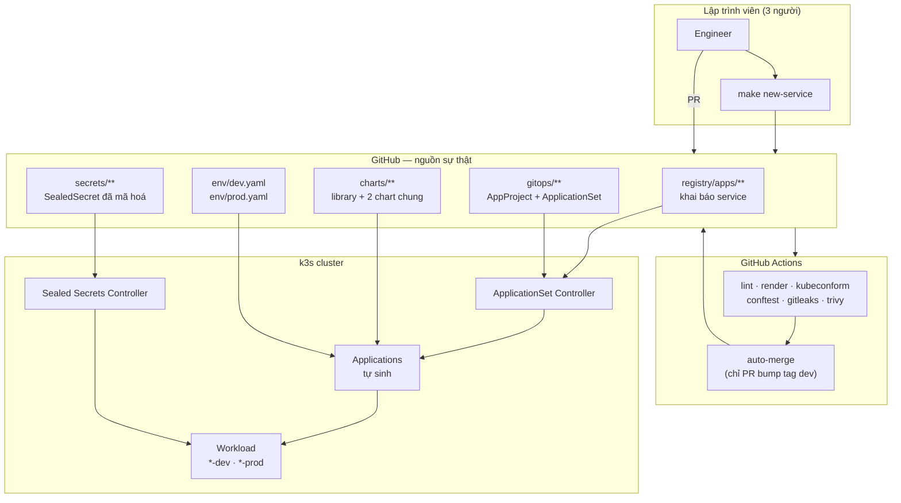
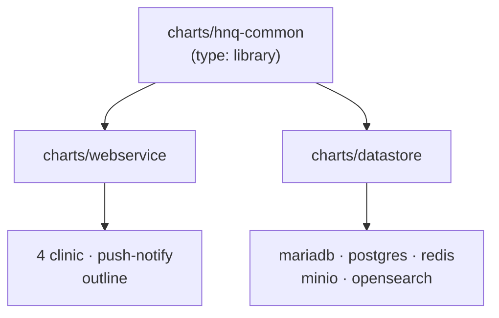
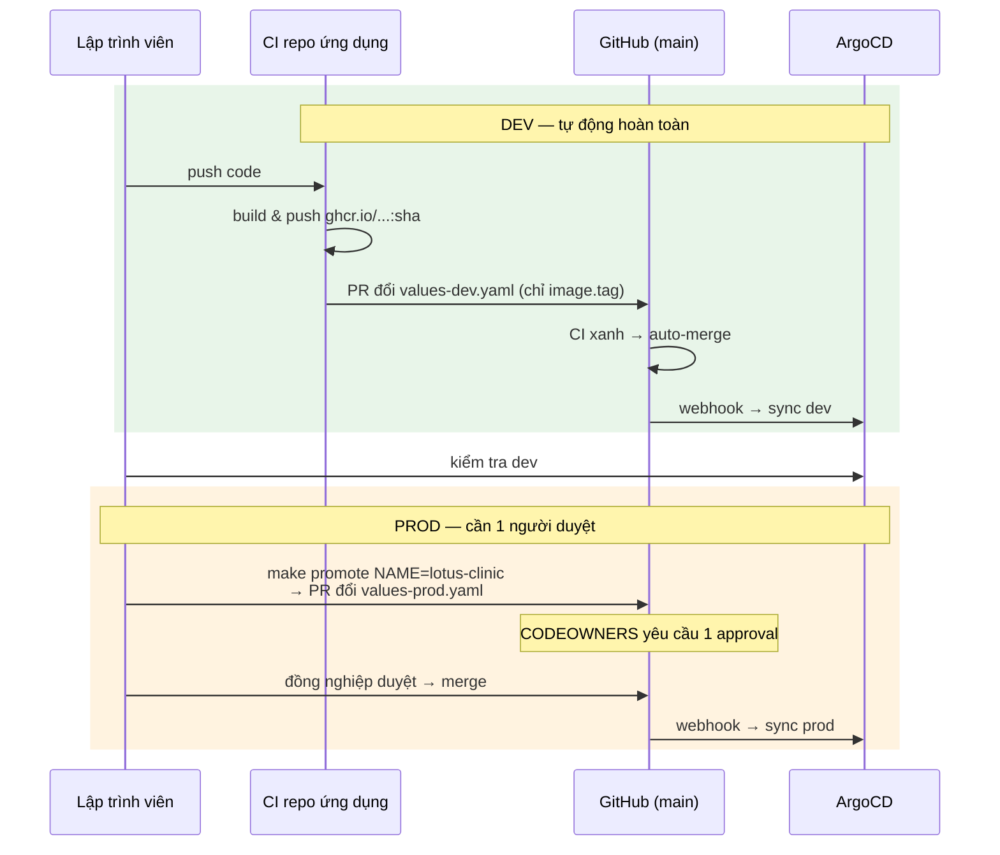
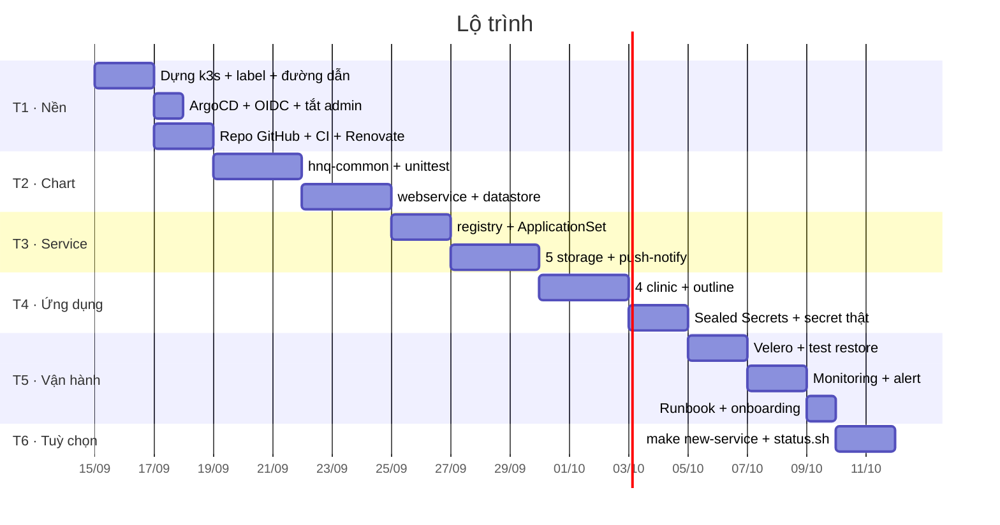

# Kế hoạch xây dựng hạ tầng k3s + ArgoCD

| | |
|---|---|
| **Trạng thái** | Bản nháp, chờ duyệt |
| **Ngày** | 11/09/2026 |
| **Bối cảnh** | Xây **mới hoàn toàn** trên server mới + repo GitHub mới. Không migrate dữ liệu cũ. |
| **Quy mô đội** | 3 người vận hành |
| **Cơ sở** | [RESEARCH_BEST_PRACTICES.md](./RESEARCH_BEST_PRACTICES.md) |
| **Liên quan** | [K3S_OPERATIONS.md](./K3S_OPERATIONS.md) · [SECRET_MANAGEMENT.md](./SECRET_MANAGEMENT.md) |

---

## Những gì đã thay đổi so với bản trước

Bản này viết lại hoàn toàn dựa trên 3 thông tin mới từ bạn:

| Thay đổi | Hệ quả |
|---|---|
| **Xây mới, không migrate** | Bỏ toàn bộ phần backup/baseline/cutover. Rủi ro lớn nhất của bản trước (ArgoCD xoá mất workload khi chuyển đổi) **biến mất hoàn toàn**. |
| **Chỉ 3 người vận hành** | Cắt mọi thứ mang tính "tổ chức lớn": 4 vai trò → 2, 6 AppProject → 2, bỏ sync window, bỏ NetworkPolicy, bỏ HA. |
| **1 branch `main`** (theo research) | Bỏ được Helm chart bootstrap phức tạp. Promote được **từng service một**. |
| **GitHub thay GitLab** | GitHub Actions thay GitLab CI. PR thay MR. Dùng auto-merge + CODEOWNERS thay vì token bypass. |

Kết quả: kế hoạch ngắn hơn, ít bước hơn, và **6 tuần thay vì 11 tuần**.

---

## Mục lục

- [1. Bảy quyết định nền tảng](#1-bảy-quyết-định-nền-tảng)
- [2. Kiến trúc tổng quan](#2-kiến-trúc-tổng-quan)
- [3. Cấu trúc repo](#3-cấu-trúc-repo)
- [4. Registry + ApplicationSet](#4-registry--applicationset)
- [5. Library chart](#5-library-chart)
- [6. Môi trường và promotion](#6-môi-trường-và-promotion)
- [7. Secret](#7-secret)
- [8. AppProject](#8-appproject)
- [9. CI trên GitHub Actions](#9-ci-trên-github-actions)
- [10. Cluster và lưu trữ](#10-cluster-và-lưu-trữ)
- [11. Lộ trình 6 tuần](#11-lộ-trình-6-tuần)
- [12. Những gì cố tình KHÔNG làm](#12-những-gì-cố-tình-không-làm)
- [13. Rủi ro](#13-rủi-ro)

---

## 1. Bảy quyết định nền tảng

| # | Quyết định | Lý do |
|---|---|---|
| **Q1** | **Một branch `main` duy nhất.** Môi trường tách bằng thư mục và file values. | Branch-per-environment là anti-pattern được cộng đồng nêu tên. Quan trọng hơn: với 1 branch bạn **promote được từng service một**; với 2 branch thì merge là đưa tất cả. ([Research §1](./RESEARCH_BEST_PRACTICES.md#1--tách-môi-trường-branch-hay-thư-mục)) |
| **Q2** | **Mọi thay đổi đều qua Pull Request.** PR chỉ đổi image tag ở dev thì tự merge khi CI xanh. | Uniform, dễ hiểu, có audit đầy đủ. Không cần token bypass protected branch. |
| **Q3** | **ApplicationSet cho service của mình, App-of-Apps cho chart bên thứ ba.** | Đúng phân vai cộng đồng khuyến nghị: factory cho cái lặp lại, danh sách tường minh cho cái cố định. ([Research §2](./RESEARCH_BEST_PRACTICES.md#2--app-of-apps-hay-applicationset)) |
| **Q4** | **Sealed Secrets.** | Rào cản thấp nhất, không cần hệ thống ngoài. Lộ trình chuẩn là bắt đầu ở đây. ([Research §5](./RESEARCH_BEST_PRACTICES.md#5--secret)) |
| **Q5** | **Prod: `selfHeal: true`, `prune: false`.** Dev: cả hai `true`. | `selfHeal` chống chỉnh tay vào cluster. `prune: false` ở prod để một lỗi ApplicationSet không xoá hàng loạt. ([Research §3](./RESEARCH_BEST_PRACTICES.md#3--chính-sách-sync)) |
| **Q6** | **Node chọn bằng label, không bằng hostname.** | Server mới = cơ hội làm đúng. Đổi node không phải sửa values. |
| **Q7** | **Không xây web UI/API riêng.** Dùng ArgoCD UI + k9s + script. | ArgoCD UI đã có danh sách app, sync/health, log, diff, nút sync. Xây lại là phí. Xem [K3S_OPERATIONS](./K3S_OPERATIONS.md). |

### Năm nguyên tắc

| # | Nguyên tắc | Trong thực tế |
|---|---|---|
| **P1** | Git là nguồn sự thật duy nhất | Không `kubectl apply` tay, không `helm install` tay. Kể cả tự động hoá cũng ghi vào Git. |
| **P2** | Khai báo một lần, sinh ra nhiều lần | Một file khai báo service → ArgoCD tự sinh Application cho mọi môi trường. |
| **P3** | Chart chung, values riêng | Service mới chỉ viết values, không viết template. |
| **P4** | Schema là hợp đồng | Một JSON Schema dùng cho cả CI lẫn form UI sau này. |
| **P5** | Đơn giản hơn là tốt hơn | Với 3 người, mỗi lớp trừu tượng phải tự trả giá được. Xem [Phần 12](#12-những-gì-cố-tình-không-làm). |

---

## 2. Kiến trúc tổng quan



Một luồng, không nhánh rẽ. Với 3 người thì đây là điểm quan trọng nhất: **ai cũng hiểu được toàn bộ hệ thống trong một buổi chiều.**

---

## 3. Cấu trúc repo

```text
HNQ-Infra/                          (GitHub, branch main duy nhất)
│
├── registry/                 ⭐ NƠI DUY NHẤT sửa khi thêm service
│   ├── schema/
│   │   └── service.schema.json     # validate CI + sinh form UI sau này
│   └── apps/
│       ├── lotus-clinic/
│       │   ├── service.yaml        # chart nào, bật env nào, cần secret gì
│       │   ├── values-dev.yaml     # chỉ ghi phần KHÁC mặc định
│       │   ├── values-prod.yaml
│       │   └── config/             # file config mount vào ConfigMap
│       ├── giaan-clinic/
│       ├── biboo-clinic/
│       ├── hocmon-clinic/
│       ├── push-notify/
│       ├── storage-mariadb/
│       ├── storage-postgres/
│       ├── storage-redis/
│       ├── storage-minio/
│       ├── storage-opensearch/
│       └── outline/
│
├── charts/                   ⭐ Hiếm khi sửa — 3 chart cho toàn hệ thống
│   ├── hnq-common/                 # library chart
│   ├── webservice/                 # mọi HTTP service
│   └── datastore/                  # mọi datastore một node
│
├── env/                      ⭐ Khác biệt dev ↔ prod
│   ├── dev.yaml
│   └── prod.yaml
│
├── gitops/
│   ├── root.yaml                   # ⭐ FILE DUY NHẤT apply tay, đúng 1 lần
│   └── bootstrap/
│       ├── project-platform.yaml
│       ├── project-apps.yaml
│       ├── appset-apps.yaml        # sinh Application cho registry/apps/*
│       ├── app-cert-manager.yaml   # ↓ chart bên thứ ba, danh sách tường minh
│       ├── app-sealed-secrets.yaml
│       ├── app-monitoring.yaml
│       ├── app-traefik-config.yaml
│       └── app-velero.yaml
│
├── secrets/                        # SealedSecret — an toàn để commit
│   ├── README.md                   # danh mục secret hệ thống cần
│   ├── dev/<service>/*.yaml
│   └── prod/<service>/*.yaml
│
├── .github/
│   ├── workflows/
│   │   ├── validate.yml
│   │   └── auto-merge-dev.yml
│   ├── CODEOWNERS
│   └── renovate.json
│
├── ci/
│   ├── policy/                     # Rego: bắt buộc limits, cấm latest...
│   └── scripts/
│       ├── new-service.sh
│       ├── render-all.sh
│       └── promote.sh
│
├── scripts/                        # script vận hành
├── docs/
└── Makefile
```

### Tại sao gộp `tenants/` và `platform/` thành `apps/`

Bản trước tách hai thư mục. Nhưng khác biệt đã nằm trong trường `spec.category` của chính file khai báo rồi — tách thư mục chỉ thêm một cấp và thêm một ApplicationSet phải bảo trì.

Cộng đồng khuyến nghị **không lồng quá 4 cấp**. Gộp lại giữ `registry/apps/lotus-clinic/values-dev.yaml` ở 3 cấp, còn dư chỗ cho `config/`.

### Chi phí thêm 1 service mới

```bash
make new-service NAME=abc-clinic CHART=webservice
# → tạo registry/apps/abc-clinic/{service,values-dev,values-prod}.yaml
# → git checkout -b add-abc-clinic && commit && push && gh pr create
```

**Không phải viết file ArgoCD nào.** ApplicationSet tự phát hiện sau khi PR merge.

---

## 4. Registry + ApplicationSet

### 4.1. File khai báo service

`registry/apps/lotus-clinic/service.yaml` — toàn bộ những gì ArgoCD cần biết:

```yaml
apiVersion: hnq.dev/v1
kind: ServiceRelease

metadata:
  name: lotus-clinic
  owner: team-clinic
  description: Backend phòng khám Lotus

spec:
  category: app                  # app | platform
  chart: webservice              # webservice | datastore

  # Môi trường được bật. Chưa có "prod" ở đây → chưa có Application prod.
  environments:
    - env: dev
    - env: prod

  # Tên các secret service cần (KHÔNG phải giá trị).
  # Dùng để CI kiểm tra thiếu sót và sinh form nhập secret sau này.
  requiredSecrets:
    - name: lotus-clinic-backend
      keys: [DB_PASSWORD, JWT_SECRET, MINIO_SECRET_KEY]
```

> Namespace không cần khai — suy ra theo quy ước `<tên>-<env>`. Bớt một chỗ gõ sai.

`registry/apps/lotus-clinic/values-dev.yaml` — chỉ phần khác mặc định:

```yaml
image:
  repository: ghcr.io/hnq-tech/lotus-backend
  tag: 6aebe241

ingress:
  host: lotus-dev.l2cteam.work

app:
  configFile: config/config_dev.yaml
  secretName: lotus-clinic-backend
```

~10 dòng. Mọi thứ khác — `containerPort`, probe, resources, nodeSelector, cert-manager issuer, imagePullSecrets, serviceMonitor — đến từ `env/dev.yaml` và `charts/webservice/values.yaml`.

### 4.2. File mặc định theo môi trường

`env/dev.yaml`:

```yaml
global:
  env: dev
  domainSuffix: l2cteam.work

image:
  pullPolicy: IfNotPresent

ingress:
  className: traefik
  annotations:
    traefik.ingress.kubernetes.io/router.entrypoints: websecure
    cert-manager.io/cluster-issuer: letsencrypt-dev
  tls:
    enabled: true

serviceAccount:
  imagePullSecrets:
    - name: ghcr-pull            # ← một tên chung, không dính tên khách hàng

# Chọn node bằng LABEL, không bằng hostname (Q6)
nodeSelector:
  hnq.dev/workload: dev

resources:
  requests: { cpu: 100m, memory: 128Mi }
  limits:   { cpu: 500m, memory: 512Mi }

serviceMonitor:
  enabled: true

# Dev: tự dọn resource thừa
syncPolicy:
  prune: true
```

`env/prod.yaml` khác ở: `nodeSelector: hnq.dev/workload=prod`, issuer prod, resources lớn hơn, `replicas: 2`, và **`prune: false`** (Q5).

### 4.3. ApplicationSet

`gitops/bootstrap/appset-apps.yaml` — một file thay cho 24 file Application:

```yaml
apiVersion: argoproj.io/v1alpha1
kind: ApplicationSet
metadata:
  name: apps
  namespace: argocd
spec:
  goTemplate: true
  goTemplateOptions: ["missingkey=error"]

  generators:
    - matrix:
        generators:
          # (1) Quét mọi file khai báo service
          - git:
              repoURL: &repo https://github.com/hunho247/HNQ-Infra.git
              revision: main
              files:
                - path: "registry/apps/*/service.yaml"
          # (2) Bung theo danh sách môi trường khai báo trong chính file đó
          - list:
              elementsYaml: "{{ toJson .spec.environments }}"

  template:
    metadata:
      name: "{{ .metadata.name }}-{{ .env }}"
      namespace: argocd
      labels:
        hnq.dev/owner: "{{ .metadata.owner }}"
        hnq.dev/env: "{{ .env }}"
      finalizers:
        - resources-finalizer.argocd.argoproj.io
    spec:
      project: "{{ .spec.category }}"        # app | platform
      source:
        repoURL: *repo
        targetRevision: main
        path: "charts/{{ .spec.chart }}"
        helm:
          releaseName: "{{ .metadata.name }}"
          valueFiles:
            - values.yaml
            - "/env/{{ .env }}.yaml"
            - "/registry/apps/{{ .metadata.name }}/values-{{ .env }}.yaml"
          parameters:
            - name: global.serviceName
              value: "{{ .metadata.name }}"
      destination:
        server: https://kubernetes.default.svc
        namespace: "{{ .metadata.name }}-{{ .env }}"
      syncPolicy:
        automated:
          selfHeal: true
          # Q5: dev dọn tự động, prod thì không
          prune: {{ if eq .env "dev" }}true{{ else }}false{{ end }}
        syncOptions:
          - CreateNamespace=true
          - PruneLast=true
          - ServerSideApply=true
        managedNamespaceMetadata:
          labels:
            hnq.dev/env: "{{ .env }}"
            hnq.dev/owner: "{{ .metadata.owner }}"
```

Ba điểm kỹ thuật:

- **`elementsYaml`** (ArgoCD ≥ 2.5) cho generator thứ hai đọc kết quả của generator thứ nhất. Nhờ đó bật/tắt môi trường nằm ngay trong file khai báo service.
- **`valueFiles` bắt đầu bằng `/`** = tính từ gốc repo. Cho phép chart ở `charts/`, values ở `registry/`.
- **`ServerSideApply=true`** cần cho chart có CRD lớn (kube-prometheus-stack).

> Vì chỉ còn **một branch**, `targetRevision: main` ghi cứng được — không cần bọc ApplicationSet trong Helm chart như bản trước. Đây là lợi ích lớn nhất của quyết định Q1 về mặt đơn giản hoá.

### 4.4. Chart bên thứ ba dùng Application tường minh

Nhóm này danh sách ngắn, cố định, mỗi cái một kiểu — ép vào ApplicationSet chỉ thêm phức tạp:

```yaml
# gitops/bootstrap/app-cert-manager.yaml
apiVersion: argoproj.io/v1alpha1
kind: Application
metadata:
  name: cert-manager
  namespace: argocd
spec:
  project: platform
  source:
    repoURL: https://charts.jetstack.io
    chart: cert-manager
    targetRevision: v1.16.2          # ← Renovate tự mở PR nâng phiên bản
    helm:
      values: |
        crds:
          enabled: true
  destination:
    server: https://kubernetes.default.svc
    namespace: cert-manager
  syncPolicy:
    automated: { selfHeal: true, prune: false }
    syncOptions: [CreateNamespace=true, ServerSideApply=true]
```

Danh sách: `cert-manager`, `sealed-secrets`, `kube-prometheus-stack`, `velero`, `traefik-config`. Năm file, thay đổi vài tháng một lần.

### 4.5. Bootstrap — một lệnh duy nhất

```yaml
# gitops/root.yaml — apply tay ĐÚNG MỘT LẦN trong đời cluster
apiVersion: argoproj.io/v1alpha1
kind: Application
metadata:
  name: root
  namespace: argocd
spec:
  project: default
  source:
    repoURL: https://github.com/hunho247/HNQ-Infra.git
    targetRevision: main
    path: gitops/bootstrap
    directory: { recurse: true }
  destination:
    server: https://kubernetes.default.svc
    namespace: argocd
  syncPolicy:
    automated: { selfHeal: true, prune: true }
```

```bash
kubectl -n argocd apply -f gitops/root.yaml
```

Xong. Mọi thứ còn lại tự dựng.

---

## 5. Library chart

### 5.1. Ba chart cho toàn hệ thống



`hnq-common` cung cấp: `hnq.fullname`, `hnq.labels`, `hnq.selectorLabels`, `hnq.image`, `hnq.imagePullSecrets`, `hnq.service`, `hnq.ingress`, `hnq.probes`, `hnq.resources`, `hnq.persistence`, `hnq.podAnnotations`.

Đổi một quy ước label → sửa **một chỗ**, không phải 11 chỗ như cấu trúc cũ.

### 5.2. Sync waves — thêm mới theo research

Đưa thẳng vào `hnq-common` để mọi chart có sẵn, giải quyết bài toán cụ thể: **backend khởi động trước khi MariaDB sẵn sàng**.

```yaml
# charts/hnq-common/templates/_annotations.tpl
{{- define "hnq.syncWave" -}}
argocd.argoproj.io/sync-wave: {{ .wave | quote }}
{{- end -}}
```

Quy ước:

| Wave | Resource |
|---|---|
| `-1` | Namespace, CRD |
| `0` | ConfigMap, Secret, ServiceAccount, PVC |
| `1` | Deployment, StatefulSet |
| `2` | Ingress, HPA, ServiceMonitor |

### 5.3. Không tạo namespace trong chart

Namespace do ArgoCD tạo qua `CreateNamespace=true`, label gắn qua `managedNamespaceMetadata`. Không có `templates/namespace.yaml` trong bất kỳ chart nào — tránh tranh chấp quyền sở hữu resource.

---

## 6. Môi trường và promotion

### 6.1. Mô hình

Một branch `main`. Dev và prod khác nhau bằng file values:

```text
registry/apps/lotus-clinic/values-dev.yaml    → image.tag: 7bcd1234   (mới, đang test)
registry/apps/lotus-clinic/values-prod.yaml   → image.tag: f1eb557d   (ổn định)
```

Prod giữ tag cũ cho tới khi bạn chủ động đổi. **Promote được từng service một** — đây là lý do chính chọn 1 branch.

### 6.2. Luồng



### 6.3. Vì sao dev cũng dùng PR (Q2)

Bản trước cho dev commit thẳng để nhanh. Nhưng trên GitHub, muốn commit thẳng vào branch được bảo vệ thì phải cấp quyền bypass cho bot — thêm một cơ chế đặc quyền phải quản.

Cách gọn hơn: **tất cả đều qua PR**, và PR của dev tự merge:

```yaml
# .github/workflows/auto-merge-dev.yml
name: auto-merge dev image bumps
on: pull_request

jobs:
  auto-merge:
    runs-on: ubuntu-latest
    steps:
      - uses: actions/checkout@v4
        with: { fetch-depth: 0 }

      - name: Chỉ chấp nhận PR đổi đúng image.tag ở values-dev.yaml
        id: check
        run: |
          FILES=$(git diff --name-only origin/main...HEAD)
          # Mọi file thay đổi phải khớp values-dev.yaml
          echo "$FILES" | grep -qvE '^registry/apps/[^/]+/values-dev\.yaml$' && exit 1
          # Mọi dòng thay đổi phải là image.tag
          git diff origin/main...HEAD -U0 -- $FILES \
            | grep -E '^[+-][^+-]' | grep -qvE '^[+-]\s*tag:' && exit 1
          echo "ok=true" >> $GITHUB_OUTPUT

      - if: steps.check.outputs.ok == 'true'
        run: gh pr merge --auto --squash "${{ github.event.number }}"
        env: { GH_TOKEN: "${{ secrets.GITHUB_TOKEN }}" }
```

Lợi ích:

- Không cần token có quyền bypass protected branch
- Mọi thay đổi đều có PR để xem lại, kể cả dev
- Bất kỳ tự động hoá nào sau này cũng **chỉ cần quyền tạo branch + mở PR** — không bao giờ cần push vào `main`

### 6.4. CODEOWNERS

```
# .github/CODEOWNERS
# Mặc định: ai review cũng được
*                                   @hunho247/infra

# Thay đổi ảnh hưởng prod → cần người của đội hạ tầng duyệt
/registry/apps/*/values-prod.yaml   @hunho247/infra
/env/prod.yaml                      @hunho247/infra
/gitops/                            @hunho247/infra
/charts/                            @hunho247/infra
/secrets/prod/                      @hunho247/infra
```

Cài đặt branch protection cho `main`: yêu cầu PR, 1 approval, CI xanh, và bật "Require review from Code Owners".

> Với 3 người thì 1 approval là vừa — luôn có người duyệt được, mà vẫn có 4 mắt nhìn vào mọi thay đổi prod.

### 6.5. Script promote

```bash
#!/usr/bin/env bash
# ci/scripts/promote.sh <tên-service>
set -euo pipefail
SVC="$1"
TAG=$(yq '.image.tag' "registry/apps/$SVC/values-dev.yaml")
CUR=$(yq '.image.tag' "registry/apps/$SVC/values-prod.yaml")

[ "$TAG" = "$CUR" ] && { echo "prod đã chạy $TAG rồi"; exit 0; }

git checkout -b "promote/$SVC-$TAG" main
yq -i ".image.tag = \"$TAG\"" "registry/apps/$SVC/values-prod.yaml"
git commit -am "release($SVC): prod $CUR → $TAG"
git push -u origin "promote/$SVC-$TAG"
gh pr create --fill --base main \
  --title "release($SVC): prod $CUR → $TAG" \
  --body "Đã chạy ở dev từ $(git log -1 --format=%cr -- registry/apps/$SVC/values-dev.yaml)."
```

---

## 7. Secret

Chi tiết ở [SECRET_MANAGEMENT.md](./SECRET_MANAGEMENT.md). Tóm tắt:

**Sealed Secrets.** Secret mã hoá bằng public key của controller, commit vào Git an toàn, chỉ controller trong cluster giải mã được.

Vì đội chỉ 3 người và ai cũng có quyền vào cluster, quy trình chuẩn là dùng `kubeseal` ở máy mình:

```bash
kubectl create secret generic lotus-clinic-backend \
  --namespace lotus-clinic-prod \
  --from-literal=DB_PASSWORD='...' \
  --dry-run=client -o yaml \
| kubeseal --format yaml > secrets/prod/lotus-clinic/backend.yaml

git add secrets/prod/lotus-clinic/backend.yaml   # an toàn — đã mã hoá
```

**Bắt buộc ngay sau khi cài controller:** backup sealing key ra ngoài cluster. Mất key = phải tạo lại toàn bộ secret.

```bash
kubectl -n kube-system get secret \
  -l sealedsecrets.bitnami.com/sealed-secrets-key -o yaml \
  > sealing-key-backup.yaml     # cất ở password manager, KHÔNG commit
```

CI có `gitleaks` chặn secret thô lọt vào repo, và một job kiểm tra `requiredSecrets` trong registry đã có đủ file trong `secrets/<env>/` chưa.

---

## 8. AppProject

Hai project, không phải sáu. Với 3 người thì ranh giới cần là **giới hạn phạm vi thiệt hại**, không phải phân quyền giữa các đội.

```yaml
# gitops/bootstrap/project-apps.yaml
apiVersion: argoproj.io/v1alpha1
kind: AppProject
metadata:
  name: app
  namespace: argocd
spec:
  description: Ứng dụng — không được tạo resource cấp cluster
  sourceRepos:
    - https://github.com/hunho247/HNQ-Infra.git
  destinations:
    - { server: https://kubernetes.default.svc, namespace: "*-dev" }
    - { server: https://kubernetes.default.svc, namespace: "*-prod" }
  clusterResourceWhitelist: []          # ← chặn hoàn toàn ClusterRole, CRD...
```

```yaml
# gitops/bootstrap/project-platform.yaml
apiVersion: argoproj.io/v1alpha1
kind: AppProject
metadata:
  name: platform
  namespace: argocd
spec:
  description: Nền tảng — được tạo resource cấp cluster
  sourceRepos: ["*"]                    # chart bên thứ ba từ nhiều nguồn
  destinations:
    - { server: https://kubernetes.default.svc, namespace: "*" }
  clusterResourceWhitelist:
    - { group: "*", kind: "*" }
```

Giá trị thật: một chart ứng dụng viết sai **không thể** tạo `ClusterRole` hay đụng vào `kube-system`.

### Việc phải làm ngay khi cài ArgoCD

```yaml
# Trong values của chart argo-cd
configs:
  cm:
    # Tắt tài khoản admin dùng chung — đăng nhập bằng GitHub OIDC
    admin.enabled: "false"
  rbac:
    policy.default: ""                  # deny-by-default
    policy.csv: |
      g, hunho247:infra, role:admin
    scopes: '[org, team]'
  dex.config: |
    connectors:
      - type: github
        id: github
        name: GitHub
        config:
          clientID: $github-oidc:clientID
          clientSecret: $github-oidc:clientSecret
          orgs: [{ name: hunho247, teams: [infra] }]
```

RBAC mặc định của ArgoCD quá rộng ([Research §7](./RESEARCH_BEST_PRACTICES.md#7--bảo-mật-và-multi-tenancy)) — với server mới thì làm đúng ngay từ đầu là miễn phí.

---

## 9. CI trên GitHub Actions

```yaml
# .github/workflows/validate.yml
name: validate
on:
  pull_request:
  push: { branches: [main] }

env:
  HELM_VERSION: "3.16.0"
  KUBECONFORM_VERSION: "0.6.7"
  CONFTEST_VERSION: "0.56.0"

jobs:
  validate:
    runs-on: ubuntu-latest
    steps:
      - uses: actions/checkout@v4

      - name: Cài công cụ
        run: |
          curl -sL "https://get.helm.sh/helm-v${HELM_VERSION}-linux-amd64.tar.gz" | tar xz
          sudo mv linux-amd64/helm /usr/local/bin/
          curl -sL "https://github.com/yannh/kubeconform/releases/download/v${KUBECONFORM_VERSION}/kubeconform-linux-amd64.tar.gz" | sudo tar xz -C /usr/local/bin kubeconform
          curl -sL "https://github.com/open-policy-agent/conftest/releases/download/v${CONFTEST_VERSION}/conftest_${CONFTEST_VERSION}_Linux_x86_64.tar.gz" | sudo tar xz -C /usr/local/bin conftest
          helm plugin install https://github.com/helm-unittest/helm-unittest

      - name: yamllint
        run: yamllint -c ci/yamllint.yaml registry/ env/ gitops/

      - name: Kiểm tra schema của mọi file khai báo service
        run: |
          npx -y ajv-cli@5 validate --spec=draft2020 \
            -s registry/schema/service.schema.json \
            -d "registry/apps/*/service.yaml"

      - name: helm lint + unittest
        run: |
          for c in charts/webservice charts/datastore; do
            helm lint "$c"
            helm unittest "$c"
          done

      - name: Kiểm tra thiếu secret
        run: ci/scripts/check-secrets.sh

      - name: Render mọi service × mọi môi trường
        run: ci/scripts/render-all.sh > rendered.yaml

      - name: kubeconform
        run: |
          kubeconform -strict -summary -kubernetes-version 1.31.0 \
            -schema-location default \
            -schema-location 'https://raw.githubusercontent.com/datreeio/CRDs-catalog/main/{{.Group}}/{{.ResourceKind}}_{{.ResourceAPIVersion}}.json' \
            rendered.yaml

      - name: Policy (conftest)
        run: conftest test --policy ci/policy rendered.yaml

  security:
    runs-on: ubuntu-latest
    steps:
      - uses: actions/checkout@v4
        with: { fetch-depth: 0 }
      - uses: gitleaks/gitleaks-action@v2
      - uses: aquasecurity/trivy-action@master
        with:
          scan-type: config
          scan-ref: charts/
          severity: HIGH,CRITICAL
          exit-code: "1"
```

### Policy bắt buộc (`ci/policy/`)

| Rule | Ngăn được |
|---|---|
| Mọi container có `resources.limits` và `requests` | Một pod ăn hết CPU node |
| Cấm `image: *:latest` | Deploy không tái tạo được |
| Bắt buộc `readinessProbe` | Traffic vào pod chưa sẵn sàng |
| Cấm `hostNetwork` trừ danh sách cho phép | Xung đột port giữa các DaemonSet |
| Cấm `privileged: true` | Thoát container |
| `Ingress` phải có `cert-manager.io/cluster-issuer` | Domain chạy không TLS |

### Renovate — thêm mới theo research

```json
// .github/renovate.json
{
  "$schema": "https://docs.renovatebot.com/renovate-schema.json",
  "extends": ["config:recommended"],
  "timezone": "Asia/Ho_Chi_Minh",
  "schedule": ["before 9am on monday"],
  "packageRules": [
    {
      "description": "Gom bản vá nhỏ vào 1 PR để đỡ nhiễu",
      "matchUpdateTypes": ["patch", "minor"],
      "groupName": "chart patches"
    },
    {
      "description": "Nâng major phải review riêng",
      "matchUpdateTypes": ["major"],
      "addLabels": ["needs-attention"]
    }
  ]
}
```

Renovate tự mở PR khi `cert-manager`, `kube-prometheus-stack`, `sealed-secrets` có bản mới — và PR đó chạy qua đúng bộ CI như PR của người. Cấu hình 2 giờ, khỏi phải nhớ đi kiểm tra phiên bản thủ công.

---

## 10. Cluster và lưu trữ

Server mới = làm đúng từ đầu, không phải sửa sau.

### 10.1. Gắn label cho node

```bash
# Thay cho việc ghim nodeSelector theo hostname (Q6)
kubectl label node <node-dev>  hnq.dev/workload=dev
kubectl label node <node-prod> hnq.dev/workload=prod
kubectl label node <node-prod> hnq.dev/storage=true
```

Sau này đổi/thêm node chỉ cần gắn label, không phải sửa một dòng values nào.

### 10.2. Đường dẫn thống nhất

```text
/srv/k3s/<env>/<service>/

ví dụ:  /srv/k3s/prod/mariadb/
        /srv/k3s/dev/minio/
```

Một quy ước, mọi node, mọi môi trường. Tạo sẵn khi dựng server.

### 10.3. local PersistentVolume thay hostPath

`hostPath` thô không cho scheduler biết ràng buộc, phải ghim node bằng tay. `local` PV đặt ràng buộc ngay trong PV:

```yaml
apiVersion: v1
kind: PersistentVolume
metadata:
  name: mariadb-prod
spec:
  capacity: { storage: 50Gi }
  accessModes: [ReadWriteOnce]
  persistentVolumeReclaimPolicy: Retain      # bảo vệ khi lỡ xoá PVC
  storageClassName: local-storage
  local:
    path: /srv/k3s/prod/mariadb
  nodeAffinity:
    required:
      nodeSelectorTerms:
        - matchExpressions:
            - key: hnq.dev/storage
              operator: In
              values: ["true"]
```

### 10.4. Backup

Velero, lưu vào MinIO trong cluster:

| Phạm vi | Tần suất | Giữ |
|---|---|---|
| Namespace `*-prod` + PV | 6 giờ/lần | 30 ngày |
| Namespace `*-dev` | 1 ngày/lần | 7 ngày |
| **Namespace `argocd`** | 1 ngày/lần | 30 ngày |

Namespace `argocd` là bổ sung theo research — mất nó là mất toàn bộ cấu hình GitOps.

**Bắt buộc: test restore một lần trong Phase 4.** Backup chưa restore thử thì chưa phải backup.

### 10.5. Longhorn — chưa làm

Tài liệu chính thức k3s nói rõ local-path là node-local, không phù hợp production đa node. Longhorn là hướng đúng — **nhưng chỉ khi các node nằm chung LAN**.

Nếu server mới vẫn dùng Tailscale làm `flannel-iface` như hệ thống cũ, replication khối qua WAN sẽ rất chậm và dễ gây ra chính sự cố nó định phòng. Cộng đồng chấp nhận mô hình lai: local-path/local PV cho phần lớn, Longhorn cho những gì thật sự cần.

> **Cần bạn xác nhận:** server mới có nhiều node không, và các node có chung LAN không? Câu trả lời quyết định mục này.

---

## 11. Lộ trình 6 tuần

Greenfield nên không có phase migrate. Mỗi phase kết thúc ở trạng thái chạy được.



### Tuần 1 — Nền

> Phần dựng cluster có một quyết định **không sửa lại được sau này** — xem [K3S_OPERATIONS §2.1](./K3S_OPERATIONS.md#21-quyết-định-quan-trọng-nhất-datastore).

- [ ] Dựng k3s trên server mới, gắn label node, tạo `/srv/k3s/<env>/`
- [ ] Cài ArgoCD: **tắt tài khoản `admin`**, bật GitHub OIDC, RBAC deny-by-default
- [ ] Tạo repo GitHub, bật branch protection + CODEOWNERS
- [ ] `.github/workflows/validate.yml` + `renovate.json`
- [ ] `gitops/root.yaml` + 2 AppProject + 5 Application chart bên thứ ba
- [ ] Cài Sealed Secrets, **backup sealing key ngay**

**Xong khi:** `kubectl -n argocd apply -f gitops/root.yaml` dựng được cert-manager, sealed-secrets, monitoring.

### Tuần 2 — Chart

- [ ] `charts/hnq-common` — library chart + `helm unittest`
- [ ] `charts/webservice` — HTTP service
- [ ] `charts/datastore` — datastore một node
- [ ] Sync waves trong library chart
- [ ] `registry/schema/service.schema.json`
- [ ] `ci/scripts/render-all.sh`, `check-secrets.sh`

**Xong khi:** `helm unittest` xanh, `helm template` ra manifest hợp lệ cho cả 2 chart.

### Tuần 3 — Hạ tầng service

- [ ] `gitops/bootstrap/appset-apps.yaml`
- [ ] `registry/apps/` cho 5 storage: mariadb, postgres, redis, minio, opensearch
- [ ] `registry/apps/push-notify/`
- [ ] Tạo PV + StorageClass `local-storage`

**Xong khi:** 6 service chạy ở dev, ArgoCD `Synced` + `Healthy`.

### Tuần 4 — Ứng dụng

- [ ] 4 clinic + outline vào registry
- [ ] Tạo toàn bộ secret bằng `kubeseal`, commit vào `secrets/`
- [ ] Bật prod cho những service đã ổn ở dev
- [ ] `ci/scripts/promote.sh` + thử promote một service

**Xong khi:** dev đầy đủ, prod chạy, promote hoạt động.

### Tuần 5 — Vận hành

> Chi tiết từng mục ở [K3S_OPERATIONS.md](./K3S_OPERATIONS.md).

- [ ] Velero + lịch backup + **test restore thật**
- [ ] kube-prometheus-stack: dashboard + alert cơ bản (pod restart, disk, cert sắp hết hạn)
- [ ] `docs/RUNBOOK.md` — sự cố thường gặp và cách xử lý
- [ ] `docs/ONBOARDING.md` — người mới đọc 1 lần là làm được

**Xong khi:** restore thử thành công, alert gửi về được nơi 3 người cùng thấy.

### Tuần 6 — Tuỳ chọn

- [ ] `make new-service` — scaffold CLI (1 ngày, **nên làm**)
- [ ] `scripts/status.sh` — bảng tag dev ↔ prod, thứ ArgoCD UI không có ([K3S_OPERATIONS §5](./K3S_OPERATIONS.md#5-makefile--lệnh-hằng-ngày))

> **Lời khuyên thật lòng:** làm `make new-service` trước, dùng 2–3 tháng. Nếu đội 3 người vẫn thấy khó chịu khi thêm service thì hãy xây API. Rất có thể script là đủ.

---

## 12. Những gì cố tình KHÔNG làm

Phần này quan trọng ngang với phần làm gì. Mỗi mục dưới đây **đã được cân nhắc và quyết định bỏ** vì không xứng với quy mô 3 người.

| Không làm | Vì sao | Khi nào nên xét lại |
|---|---|---|
| **2 branch dev/prod** | Không promote chọn lọc được. 1 branch + file values đạt cùng mục tiêu, đơn giản hơn. | Không bao giờ |
| **Kargo** | Công cụ promotion chuyên dụng. Ngưỡng hữu ích là từ 3 môi trường. | Khi thêm `staging` |
| **Backstage** | IDP đầy đủ, kèm Postgres + hệ plugin. Quá nặng cho 3 người. | Khi có >10 đội |
| **4 vai trò phân quyền** | 3 người thì `developer` + `admin` là đủ. | Khi mở cho người ngoài đội |
| **AppProject theo từng môi trường** | 6 project cho 3 người là bureaucracy. 2 project đủ giới hạn phạm vi thiệt hại. | Khi có đội ngoài deploy |
| **Sync window** (chặn deploy ngoài giờ) | 3 người tự biết khi nào nên deploy. Thêm rào cản chỉ gây phiền lúc có sự cố. | Khi có ca trực và SLA |
| **NetworkPolicy** | Chưa có mô hình đe doạ rõ ràng trong cluster. | Khi chạy workload của bên thứ ba |
| **ArgoCD HA** | 1 replica đủ. ArgoCD chết thì cluster vẫn chạy, chỉ là không sync được. | Khi >100 Application |
| **Longhorn** | Chậm khi node nối qua WAN. | Khi các node chung LAN |
| **Progressive Sync** | Chỉ có ý nghĩa với nhiều cluster. | Khi có cluster thứ hai |
| **kube-score** | Trùng phần lớn với `conftest` đã có. | Không cần |
| **Web UI / API riêng để deploy** | ArgoCD UI + k9s + script đã phủ hết. Xây lại tốn 3,5 tuần và thành một app phải nuôi. | Khi có người ngoài 3 người cần deploy, hoặc >25 service |
| **External Secrets Operator** | Cần Vault hoặc cloud secret manager. | Khi có cluster thứ hai hoặc cần xoay vòng tự động |

> Mỗi dòng ở đây tiết kiệm được vài ngày công và một thứ phải bảo trì mãi mãi. Với đội 3 người, **cái không xây là cái không hỏng**.

---

## 13. Rủi ro

Vì xây mới nên rủi ro thấp hơn hẳn bản trước — không còn nguy cơ ArgoCD xoá mất workload đang chạy khi chuyển đổi.

| Rủi ro | Khả năng | Mức độ | Cách giảm |
|---|---|---|---|
| **Mất sealing key Sealed Secrets** | Thấp | 🔴 Cao | Backup ngay khi cài, cất 2 nơi ngoài cluster. Kiểm tra khôi phục ở Tuần 5. |
| **Chưa test restore, tới lúc cần thì hỏng** | Trung bình | 🔴 Cao | Test restore là mục bắt buộc của Tuần 5, không được bỏ qua. |
| `prune: true` ở dev xoá nhầm | Thấp | 🟡 Vừa | Dev có thể dựng lại. Prod đã đặt `prune: false`. |
| ApplicationSet sinh Application sai tên | Trung bình | 🟡 Vừa | CI render toàn bộ trước khi merge |
| Chỉ 1 người hiểu hệ thống | Trung bình | 🟠 Cao | `ONBOARDING.md` ở Tuần 5. Với 3 người, đây là rủi ro thật. |
| Node chết, data local PV không truy cập được | Thấp | 🟠 Cao | Velero backup 6 giờ/lần. Chấp nhận mất tối đa 6 giờ dữ liệu. |
| Quá tải vì làm cả 6 tuần cùng lúc | Cao | 🟡 Vừa | Mỗi tuần một phase, kết thúc ở trạng thái chạy được |

### Điều đáng lo nhất với đội 3 người

Không phải lỗi kỹ thuật, mà là **kiến thức tập trung vào một người**. Nếu chỉ một người hiểu ApplicationSet và library chart, thì lúc người đó nghỉ phép mà hệ thống có sự cố sẽ rất khó.

Cách giảm — đưa vào lộ trình chứ không để tự phát:

- `ONBOARDING.md` viết cho người chưa biết gì về ArgoCD
- Mỗi người tự tay thêm ít nhất một service trong Tuần 4
- `RUNBOOK.md` ghi từng sự cố gặp phải và cách đã xử lý
- Ưu tiên thứ đơn giản dễ hiểu hơn thứ tối ưu khó hiểu — đây chính là lý do [Phần 12](#12-những-gì-cố-tình-không-làm) tồn tại

---

## Phụ lục A — Makefile

```makefile
.PHONY: help new-service validate render lint promote secret

help:
	@grep -E '^[a-zA-Z_-]+:.*?## .*$$' $(MAKEFILE_LIST) | \
	  awk 'BEGIN {FS=":.*?## "}; {printf "  \033[36m%-14s\033[0m %s\n", $$1, $$2}'

new-service:  ## Tạo service mới: make new-service NAME=x CHART=webservice
	@ci/scripts/new-service.sh "$(NAME)" "$(CHART)"

validate:     ## Chạy đủ bộ kiểm tra như CI
	@ci/scripts/validate.sh

render:       ## Render mọi service × mọi môi trường
	@ci/scripts/render-all.sh

lint:         ## helm lint + unittest
	@for c in charts/webservice charts/datastore; do helm lint $$c && helm unittest $$c; done

promote:      ## Đưa image dev lên prod: make promote NAME=lotus-clinic
	@ci/scripts/promote.sh "$(NAME)"

secret:       ## Mã hoá secret: make secret SVC=x ENV=prod KEY=DB_PASSWORD
	@ci/scripts/seal-secret.sh "$(SVC)" "$(ENV)" "$(KEY)"
```

## Phụ lục B — Việc cần làm khi dựng server mới

```bash
# 1. k3s — đặt tên node rõ ràng ngay từ đầu
curl -sfL https://get.k3s.io | INSTALL_K3S_EXEC="--node-name=hnq-01" sh -

# 2. Label node theo vai trò, KHÔNG theo hostname
kubectl label node hnq-01 hnq.dev/workload=prod hnq.dev/storage=true

# 3. Thư mục dữ liệu
sudo mkdir -p /srv/k3s/{dev,prod}
sudo chmod 755 /srv/k3s

# 4. ArgoCD
helm repo add argo https://argoproj.github.io/argo-helm
helm install argocd argo/argo-cd -n argocd --create-namespace \
  -f gitops/install/argocd-values.yaml     # đã tắt admin, bật OIDC

# 5. Bootstrap — lệnh cuối cùng phải gõ tay
kubectl -n argocd apply -f gitops/root.yaml

# 6. Sealed Secrets đã được root.yaml cài. Backup key NGAY:
kubectl -n kube-system get secret \
  -l sealedsecrets.bitnami.com/sealed-secrets-key -o yaml \
  > ~/sealing-key-backup.yaml
# → cất vào password manager, rồi shred file này
```

## Phụ lục C — Tham khảo

- [RESEARCH_BEST_PRACTICES.md](./RESEARCH_BEST_PRACTICES.md) — cơ sở cho mọi quyết định ở Phần 1
- [ApplicationSet Matrix generator](https://argo-cd.readthedocs.io/en/stable/operator-manual/applicationset/Generators-Matrix/)
- [Helm library chart](https://helm.sh/docs/topics/library_charts/)
- [Sealed Secrets](https://github.com/bitnami-labs/sealed-secrets)
- [k3s — Volumes and Storage](https://docs.k3s.io/add-ons/storage)
- [kubeconform](https://github.com/yannh/kubeconform) · [conftest](https://www.conftest.dev/) · [Renovate](https://docs.renovatebot.com/)
