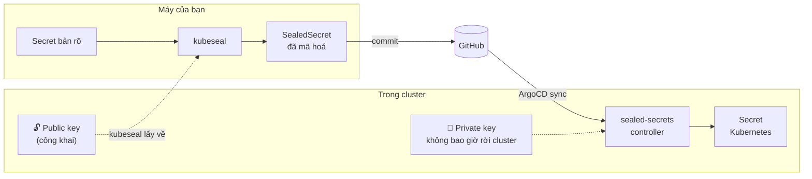
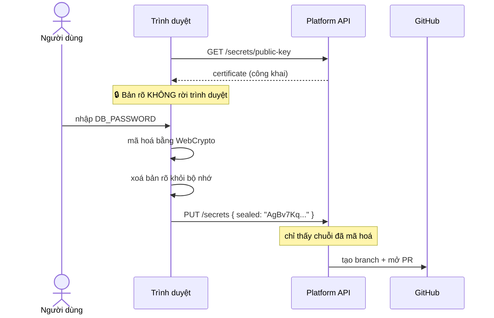

# Quản lý Secret

| | |
|---|---|
| **Trạng thái** | Bản nháp, chờ duyệt |
| **Ngày** | 11/09/2026 |
| **Bối cảnh** | Hệ thống mới, đội 3 người, repo GitHub, 1 branch `main` |
| **Liên quan** | [REFACTOR_PLAN.md](./REFACTOR_PLAN.md) · [PLATFORM_API_PLAN.md](./PLATFORM_API_PLAN.md) |

---

## Tóm tắt

**Sealed Secrets.** Secret được mã hoá bằng public key của controller trước khi commit. Chỉ controller trong cluster giải mã được. File mã hoá an toàn để đẩy lên GitHub, kể cả repo public.

Với đội 3 người mà ai cũng có quyền vào cluster, quy trình gọn nhất là **dùng `kubeseal` ở máy mình** — bản rõ không đi qua hệ thống nào khác. Không cần backend, không cần UI, không có bề mặt tấn công mới.

Phần quản lý secret qua UI chỉ có ý nghĩa khi bạn xây [Platform API](./PLATFORM_API_PLAN.md). Thiết kế cho trường hợp đó nằm ở [Phần 5](#5-khi-có-platform-api).

---

## Mục lục

- [1. Sealed Secrets hoạt động thế nào](#1-sealed-secrets-hoạt-động-thế-nào)
- [2. Quy trình hằng ngày](#2-quy-trình-hằng-ngày)
- [3. Sao lưu sealing key](#3-sao-lưu-sealing-key--phần-quan-trọng-nhất)
- [4. Khai báo secret trong registry](#4-khai-báo-secret-trong-registry)
- [5. Khi có Platform API](#5-khi-có-platform-api)
- [6. Xoay vòng secret](#6-xoay-vòng-secret)
- [7. Khi nghi ngờ bị lộ](#7-khi-nghi-ngờ-bị-lộ)
- [8. Danh sách kiểm tra](#8-danh-sách-kiểm-tra)

---

## 1. Sealed Secrets hoạt động thế nào



Mã hoá chỉ cần **public key**, mà public key thì không phải bí mật — controller công khai nó. Giải mã cần private key, và key đó không bao giờ rời cluster.

### Phạm vi (scope) — chi tiết bảo mật quan trọng

Mỗi giá trị được mã hoá kèm một "nhãn" quyết định nó dùng được ở đâu:

| Phạm vi | Nhãn | Nghĩa |
|---|---|---|
| **`strict`** (mặc định) | `<namespace>/<tên secret>` | Chỉ giải mã được đúng namespace đó, đúng tên đó |
| `namespace-wide` | `<namespace>` | Đổi tên được, không đổi namespace |
| `cluster-wide` | `""` | Dùng ở đâu cũng được |

> **Quy định:** hệ thống chỉ dùng `strict` — cũng là mặc định của `kubeseal`, nên chỉ cần **không thêm cờ nào**. Nhờ đó nếu ai lấy được file secret của prod, họ vẫn không thể áp nó vào namespace dev để đọc giá trị.

---

## 2. Quy trình hằng ngày

### Tạo secret mới

```bash
kubectl create secret generic lotus-clinic-backend \
  --namespace lotus-clinic-prod \
  --from-literal=DB_PASSWORD='...' \
  --from-literal=JWT_SECRET="$(openssl rand -hex 32)" \
  --dry-run=client -o yaml \
| kubeseal --format yaml > secrets/prod/lotus-clinic/backend.yaml

git add secrets/prod/lotus-clinic/backend.yaml    # ✅ an toàn, đã mã hoá
```

Bản rõ chỉ tồn tại trong đường ống lệnh, không ghi ra file bao giờ.

### Từ file (keystore, certificate, service-account JSON)

```bash
kubectl create secret generic lotus-clinic-keystore \
  --namespace lotus-clinic-prod \
  --from-file=keystore.jks=/đường/dẫn/keystore.jks \
  --dry-run=client -o yaml \
| kubeseal --format yaml > secrets/prod/lotus-clinic/keystore.yaml
```

### Script gói lại cho gọn

```bash
#!/usr/bin/env bash
# ci/scripts/seal-secret.sh <service> <env> <KEY>
# Đọc giá trị từ stdin, không hiện trên màn hình, không vào ~/.bash_history
set -euo pipefail
SVC="$1"; ENV="$2"; KEY="$3"
OUT="secrets/$ENV/$SVC/$(echo "$KEY" | tr 'A-Z_' 'a-z-').yaml"

read -rsp "Giá trị cho $KEY: " VALUE; echo
mkdir -p "$(dirname "$OUT")"

kubectl create secret generic "$SVC" \
  --namespace "$SVC-$ENV" \
  --from-literal="$KEY=$VALUE" \
  --dry-run=client -o yaml \
| kubeseal --format yaml --merge-into "$OUT" 2>/dev/null \
  || kubectl create secret generic "$SVC" \
       --namespace "$SVC-$ENV" --from-literal="$KEY=$VALUE" \
       --dry-run=client -o yaml | kubeseal --format yaml > "$OUT"

unset VALUE
echo "✅ $OUT — commit được rồi"
```

Dùng: `make secret SVC=lotus-clinic ENV=prod KEY=DB_PASSWORD`

> `--merge-into` cho phép thêm key vào file đã có mà không phải nhập lại các key cũ — rất tiện khi chỉ đổi một giá trị.

### Ba thói quen cần giữ

| Nên | Không nên |
|---|---|
| Nhập giá trị qua `read -rs` hoặc pipe | Gõ giá trị thẳng trên dòng lệnh (vào `~/.bash_history`) |
| Sinh giá trị ngẫu nhiên: `openssl rand -hex 32` | Đặt mật khẩu tự nghĩ |
| Dùng `--dry-run=client` | `kubectl create secret` thật rồi mới seal — secret bản rõ nằm lại trong cluster |

---

## 3. Sao lưu sealing key — phần quan trọng nhất

Đây là điểm yếu duy nhất của Sealed Secrets: **mất private key là mất khả năng giải mã toàn bộ secret trong repo.**

### Làm ngay sau khi cài controller

```bash
kubectl -n kube-system get secret \
  -l sealedsecrets.bitnami.com/sealed-secrets-key \
  -o yaml > ~/sealing-key-$(date +%Y%m%d).yaml
```

File này **là bí mật cấp cao nhất của hệ thống**. Ai có nó thì giải mã được mọi secret trong repo.

### Cất ở đâu

| Nơi | Ghi chú |
|---|---|
| ✅ Password manager của đội (1Password / Bitwarden) | Mục riêng, cả 3 người truy cập được |
| ✅ USB mã hoá, cất nơi an toàn | Bản offline, phòng khi mất password manager |
| ❌ Trong repo Git | Vô nghĩa — vòng lặp |
| ❌ Trong chính cluster | Cluster chết là mất cả hai |
| ❌ Chỉ một người giữ | Với đội 3 người, người đó nghỉ là kẹt |

Sau khi cất xong: `shred -u ~/sealing-key-*.yaml`

### Controller tự xoay key mỗi 30 ngày

Sealed Secrets tạo key mới định kỳ và **giữ lại key cũ** để giải mã secret đã seal trước đó. Nghĩa là backup cần cập nhật lại.

**Khuyến nghị:** giữ tự xoay key, và **đặt lịch nhắc backup lại mỗi quý**. Một sự kiện lặp trong calendar là đủ.

### Kiểm tra khôi phục — bắt buộc một lần ở Tuần 5

```bash
k3d cluster create test-restore
kubectl apply -f ~/sealing-key-backup.yaml
helm install sealed-secrets sealed-secrets/sealed-secrets -n kube-system
kubectl apply -f secrets/prod/lotus-clinic/backend.yaml
kubectl -n lotus-clinic-prod get secret lotus-clinic-backend -o jsonpath='{.data.DB_PASSWORD}' | base64 -d
# → phải ra đúng giá trị gốc
k3d cluster delete test-restore
```

Ghi kết quả vào `docs/RUNBOOK.md`. **Backup chưa từng khôi phục thử thì chưa phải backup.**

---

## 4. Khai báo secret trong registry

Registry khai báo service **cần** secret nào, nhưng không chứa giá trị:

```yaml
# registry/apps/lotus-clinic/service.yaml
spec:
  requiredSecrets:
    - name: lotus-clinic-backend
      keys: [DB_PASSWORD, JWT_SECRET, MINIO_SECRET_KEY]
    - name: lotus-clinic-keystore
      keys: [keystore.jks]
      type: binary
```

Ba tác dụng:

1. **CI phát hiện thiếu** trước khi deploy hỏng
2. **Người mới** nhìn một file là biết cần chuẩn bị gì
3. **Sinh form** nếu sau này có Platform API

```bash
#!/usr/bin/env bash
# ci/scripts/check-secrets.sh — chạy trong CI
set -euo pipefail
FAIL=0
for svc in registry/apps/*/service.yaml; do
  name=$(basename "$(dirname "$svc")")
  for env in $(yq -r '.spec.environments[].env' "$svc"); do
    for sec in $(yq -r '.spec.requiredSecrets[]?.name' "$svc"); do
      ls "secrets/$env/$name/"*.yaml >/dev/null 2>&1 \
        || { echo "❌ $name/$env: thiếu secret '$sec'"; FAIL=1; }
    done
  done
done
exit $FAIL
```

---

## 5. Khi có Platform API

Phần này **chỉ áp dụng nếu bạn xây [Platform API](./PLATFORM_API_PLAN.md)**. Chưa xây thì bỏ qua — quy trình `kubeseal` ở Phần 2 đã đủ và an toàn hơn.

### Mối lo cần giải

Thêm backend nghĩa là thêm một con đường cho secret đi qua: trình duyệt → backend → Git. Câu hỏi phải trả lời: **backend bị chiếm quyền thì mất gì?**

### Câu trả lời: không mất gì, nhờ 4 hàng rào

#### Hàng rào 1 — Bản rõ không bao giờ tới backend

Trình duyệt mã hoá bằng public key **trước khi** gửi đi. Backend chỉ nhận chuỗi đã mã hoá.



> ⚠️ Tự viết code mã hoá là việc dễ sai. **Không bật tính năng này cho người dùng** cho tới khi có bộ test đối chiếu output với `kubeseal` thật (seal bằng JS → apply vào cluster test → so với bản rõ ban đầu, gồm cả Unicode, chuỗi rỗng, và nội dung nhị phân).
>
> Cho tới lúc đó, UI chỉ cần hiển thị **lệnh `kubeseal` đã điền sẵn namespace và tên** để người dùng copy, rồi dán kết quả vào. Đơn giản, không rủi ro, và với 3 người thì hoàn toàn chấp nhận được.

#### Hàng rào 2 — Backend không đọc được secret trong cluster

ServiceAccount **cố ý không có** quyền nào trên `secrets`:

```yaml
apiVersion: rbac.authorization.k8s.io/v1
kind: ClusterRole
metadata:
  name: platform-api
rules:
  - apiGroups: [""]
    resources: [pods, services, events, configmaps, pods/log]
    verbs: [get, list, watch]
  - apiGroups: [apps]
    resources: [deployments, statefulsets]
    verbs: [get, list, watch]
  - apiGroups: [argoproj.io]
    resources: [applications]
    verbs: [get, list, watch]

  # ❌ KHÔNG có quyền nào trên "secrets"
  # ❌ KHÔNG có create / update / delete trên bất cứ thứ gì
```

Kiểm chứng sau khi deploy:

```bash
SA=system:serviceaccount:platform-api-prod:platform-api
kubectl auth can-i get    secrets     --as=$SA -A   # phải là "no"
kubectl auth can-i create deployments --as=$SA -A   # phải là "no"
kubectl auth can-i get    pods        --as=$SA -A   # phải là "yes"
```

#### Hàng rào 3 — Backend không push được vào `main`

Nhờ quyết định Q2 trong [REFACTOR_PLAN](./REFACTOR_PLAN.md#1-bảy-quyết-định-nền-tảng) (mọi thay đổi qua PR), backend **chỉ cần quyền tạo branch và mở PR**. Không bao giờ cần push vào `main`.

GitHub App của backend cấp quyền:

| Quyền | Mức |
|---|---|
| Contents | Write *(để tạo branch)* |
| Pull requests | Write |
| **`main`** | Protected — chỉ merge qua PR + 1 approval |

Kẻ chiếm được backend chỉ **mở được PR**. Muốn vào cluster vẫn cần một con người nhìn diff rồi bấm duyệt.

#### Hàng rào 4 — Không có API nào trả về giá trị secret

Không cho admin, không cho ai. Chỉ đọc được metadata:

```json
{
  "name": "lotus-clinic-backend",
  "keys": ["DB_PASSWORD", "JWT_SECRET"],
  "updatedAt": "2026-09-10T14:23:11Z",
  "updatedBy": "nguyen.van.a"
}
```

Và ba quy tắc trong code:

- Không log body của route `/secrets` — dùng **danh sách trắng** (chỉ log trường được liệt kê), không phải danh sách đen kiểu "che trường tên là password" (luôn sót)
- Không lưu giá trị vào database — schema không có cột nào chứa được
- Thông báo lỗi không chứa dữ liệu đầu vào

### Tổng kết: backend bị chiếm thì sao?

| Kẻ tấn công muốn | Được không | Bị chặn bởi |
|---|---|---|
| Đọc secret hiện có | ❌ | Hàng rào 2 |
| Đọc secret đang được nhập | ❌ | Hàng rào 1 |
| Deploy image độc hại lên prod | ❌ | Hàng rào 3 |
| Sửa thẳng resource trong cluster | ❌ | Hàng rào 2 |
| Mở PR độc hại | ✅ | Nhưng cần người duyệt, diff hiện rõ |

---

## 6. Xoay vòng secret

### Vấn đề dễ quên: pod không tự nhận giá trị mới

Kubernetes **không restart pod** khi Secret đổi. Với secret nạp qua `envFrom`, pod cũ giữ giá trị cũ cho tới khi được tạo lại. Triệu chứng: *"đổi mật khẩu rồi mà app vẫn báo sai"*.

Xử lý sẵn trong `charts/hnq-common` — gắn annotation checksum vào pod template:

```yaml
spec:
  template:
    metadata:
      annotations:
        # Secret đổi → checksum đổi → pod template đổi → rolling restart
        hnq.dev/secret-checksum: {{ .Values.app.secretChecksum | default "none" | quote }}
```

Script `seal-secret.sh` cập nhật `secretChecksum` trong `values-<env>.yaml` cùng lúc. Một PR vừa đổi secret vừa kích hoạt restart.

### Lịch khuyến nghị

| Loại | Chu kỳ |
|---|---|
| Mật khẩu database | 6 tháng, hoặc ngay khi có người rời đội |
| Khoá ký JWT | 3 tháng |
| Access key MinIO | 6 tháng |
| Token GitHub / registry | 12 tháng, hoặc dùng token có hạn |
| **Bất kỳ secret nào nghi lộ** | **Ngay lập tức** |

> Với 3 người, một lịch nhắc hằng quý để rà lại toàn bộ là thực tế hơn là đặt lịch riêng cho từng secret.

---

## 7. Khi nghi ngờ bị lộ

### Bước 1 — Vô hiệu hoá ngay, đừng chờ điều tra

```bash
# Ví dụ: lộ mật khẩu MariaDB
kubectl exec -n mariadb-prod mariadb-0 -- \
  mysql -uroot -p -e "ALTER USER 'app'@'%' IDENTIFIED BY 'mật-khẩu-mới';"
```

Đổi trước, điều tra sau.

### Bước 2 — Seal lại và mở PR

Theo Phần 2. Nhớ cập nhật `secretChecksum` để pod restart.

### Bước 3 — Nếu bản rõ đã bị commit

```bash
git filter-repo --path secrets/prod/lotus-clinic/leaked.yaml --invert-paths
git push --force-with-lease origin main
```

Nhưng phải hiểu rõ: **xoá khỏi lịch sử Git không làm secret an toàn trở lại.** Repo đã được clone, GitHub Actions có thể còn artifact, GitHub có thể còn cache. Coi như đã lộ vĩnh viễn — **bắt buộc đổi giá trị**, xoá lịch sử chỉ là dọn dẹp.

### Bước 4 — Rà phạm vi

- Secret đó còn dùng ở đâu nữa? (`grep` tên secret trong `registry/`)
- Ai đã dùng nó truy cập gì? (log database, log MinIO)
- Lộ từ bao giờ? (`git log` của file)

### Bước 5 — Ghi lại

Vào `docs/RUNBOOK.md`: lộ thế nào, phát hiện ra sao, và **đổi gì để lần sau không lặp lại**.

---

## 8. Danh sách kiểm tra

### Khi dựng hệ thống (Tuần 1)

- [ ] Sealed Secrets controller đã chạy
- [ ] **Sealing key đã backup ra ngoài cluster, cất ở 2 nơi, cả 3 người truy cập được**
- [ ] `gitleaks` chạy trong GitHub Actions
- [ ] `secrets/README.md` liệt kê mọi secret hệ thống cần
- [ ] `check-secrets.sh` chạy trong CI
- [ ] `make secret` hoạt động, cả 3 người đã thử qua

### Tuần 5

- [ ] **Đã kiểm tra khôi phục sealing key thành công một lần**
- [ ] Kết quả ghi vào `docs/RUNBOOK.md`
- [ ] Đã đặt lịch nhắc backup lại key hằng quý

### Chỉ khi xây Platform API

- [ ] `kubectl auth can-i get secrets --as=<SA>` trả về `no`
- [ ] `kubectl auth can-i create deployments --as=<SA>` trả về `no`
- [ ] GitHub App không push được vào `main` — đã thử thật
- [ ] Không endpoint nào trả về giá trị secret — đã rà toàn bộ route
- [ ] Middleware log dùng danh sách trắng — đã test với payload chứa secret
- [ ] Thông báo lỗi không chứa dữ liệu đầu vào — đã test
- [ ] **Nếu bật mã hoá tại trình duyệt:** bộ test đối chiếu với `kubeseal` đã xanh

---

## Tham khảo

- [Sealed Secrets](https://github.com/bitnami-labs/sealed-secrets) · [Scopes](https://github.com/bitnami-labs/sealed-secrets#scopes)
- [gitleaks](https://github.com/gitleaks/gitleaks) · [git-filter-repo](https://github.com/newren/git-filter-repo)
- [OWASP Secrets Management Cheat Sheet](https://cheatsheetseries.owasp.org/cheatsheets/Secrets_Management_Cheat_Sheet.html)
