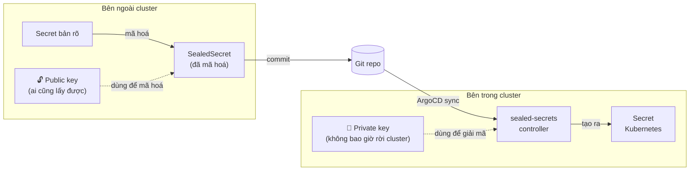
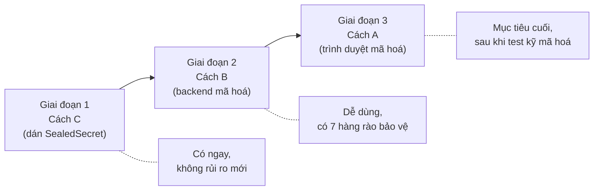
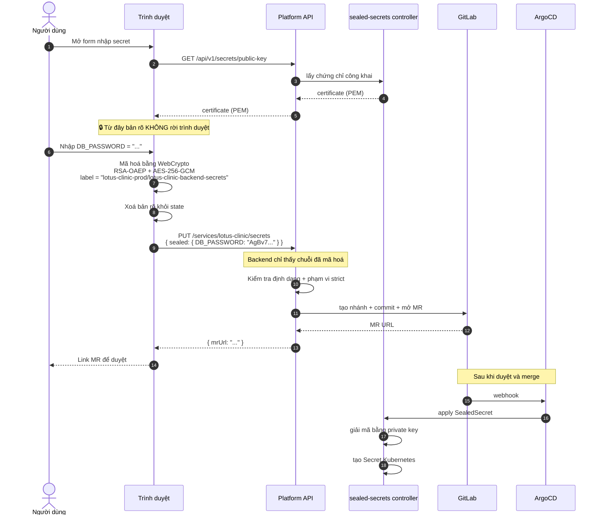
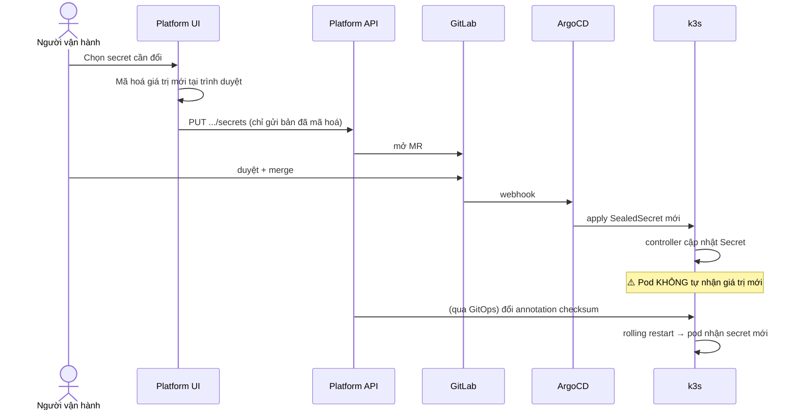

# Thiết kế quản lý Secret

| | |
|---|---|
| **Trạng thái** | Bản nháp, chờ duyệt |
| **Ngày** | 11/09/2026 |
| **Liên quan** | [REFACTOR_PLAN.md](./REFACTOR_PLAN.md) · [PLATFORM_API_PLAN.md](./PLATFORM_API_PLAN.md) |

---

## Tóm tắt

Yêu cầu của bạn: **có UI nhập secret, nhưng không được để lộ.**

Đây là phần nhạy cảm nhất của cả hệ thống, vì nó tạo ra một con đường mới để secret đi qua: trình duyệt → backend → Git → cluster. Mỗi chặng là một chỗ có thể rò rỉ.

Giải pháp gồm 3 lớp:

| Lớp | Nội dung |
|---|---|
| **1. Mã hoá ngay tại trình duyệt** | Secret được mã hoá **trước khi rời máy người dùng**. Backend chỉ nhận bản đã mã hoá, không bao giờ thấy bản rõ. |
| **2. Backend không có khả năng đọc secret** | Ngay cả khi backend bị chiếm quyền hoàn toàn: nó không có quyền `get secrets` trên Kubernetes, không lưu secret ở đâu, và token Git của nó không push được vào `develop`/`main`. |
| **3. Kiểm soát và ghi vết** | Mọi thao tác secret đều có audit log, nhưng log chỉ ghi *tên key* và *vân tay SHA-256*, không bao giờ ghi giá trị. |

**Nguyên tắc xuyên suốt:** *Hệ thống được thiết kế sao cho backend **không thể** làm lộ secret, chứ không phải **hứa là sẽ không** làm lộ.*

---

## Mục lục

- [1. Mô hình đe doạ](#1-mô-hình-đe-doạ)
- [2. Sealed Secrets hoạt động thế nào](#2-sealed-secrets-hoạt-động-thế-nào)
- [3. Ba cách đưa secret vào hệ thống](#3-ba-cách-đưa-secret-vào-hệ-thống)
- [4. Cách A — Mã hoá tại trình duyệt (khuyến nghị)](#4-cách-a--mã-hoá-tại-trình-duyệt-khuyến-nghị)
- [5. Cách B — Mã hoá tại backend](#5-cách-b--mã-hoá-tại-backend)
- [6. Cách C — Dán SealedSecret có sẵn](#6-cách-c--dán-sealedsecret-có-sẵn)
- [7. Bảy hàng rào bảo vệ](#7-bảy-hàng-rào-bảo-vệ)
- [8. Khai báo secret trong registry](#8-khai-báo-secret-trong-registry)
- [9. Xoay vòng secret](#9-xoay-vòng-secret)
- [10. Sao lưu sealing key](#10-sao-lưu-sealing-key)
- [11. Khi có sự cố lộ secret](#11-khi-có-sự-cố-lộ-secret)
- [12. Danh sách kiểm tra](#12-danh-sách-kiểm-tra-trước-khi-mở-cho-người-dùng)

---

## 1. Mô hình đe doạ

Trước khi thiết kế, phải nói rõ đang phòng chống cái gì.

| # | Kịch bản | Thiết kế phải đảm bảo |
|---|---|---|
| T1 | Ai đó đọc được repo Git (lộ token, clone nhầm, backup rò rỉ) | Secret trong Git đã mã hoá, không giải mã được nếu không có private key trong cluster |
| T2 | **Backend Platform API bị chiếm quyền** (RCE, lộ token, thư viện độc hại) | Backend không đọc được secret hiện có, không lấy được bản rõ, không deploy thẳng lên cluster được |
| T3 | Secret lọt vào log (log ứng dụng, log truy cập, APM, Sentry) | Không endpoint nào log body chứa secret; middleware che có danh sách trắng |
| T4 | Secret lọt vào lịch sử Git dưới dạng bản rõ | `gitleaks` chặn ở CI + pre-commit hook |
| T5 | Người dùng nội bộ vượt quyền (developer đọc secret prod) | Không có endpoint nào trả về giá trị secret — kể cả cho admin |
| T6 | Trình duyệt bị XSS trên trang nhập secret | CSP nghiêm ngặt, không `innerHTML`, không thư viện bên thứ ba trên trang đó |
| T7 | Mất sealing key của Sealed Secrets | Có backup offline, có quy trình khôi phục đã kiểm chứng |
| T8 | Kẻ tấn công ở giữa (MITM) giữa trình duyệt và backend | TLS bắt buộc + HSTS; và với Cách A thì dù có MITM cũng chỉ thấy bản đã mã hoá |

**Mối đe doạ quan trọng nhất là T2.** Backend Platform API là mục tiêu hấp dẫn: nó có token Git, có thể ghi vào repo hạ tầng, và nếu thiết kế cẩu thả thì có cả quyền đọc secret của toàn cluster. Toàn bộ phần còn lại của tài liệu này xoay quanh việc làm cho T2 trở nên vô hại.

---

## 2. Sealed Secrets hoạt động thế nào

Cần hiểu cơ chế này thì mới hiểu vì sao "mã hoá tại trình duyệt" là khả thi.



**Điểm mấu chốt: mã hoá chỉ cần public key.** Public key không phải bí mật — controller công khai nó qua API. Nghĩa là **bất cứ ai cũng mã hoá được**, kể cả JavaScript chạy trong trình duyệt. Chỉ có controller trong cluster mới giải mã được.

### Cấu trúc dữ liệu

Sealed Secrets dùng mã hoá lai (hybrid):

```
Với mỗi giá trị cần mã hoá:
  1. Sinh ngẫu nhiên khoá phiên AES-256
  2. Mã hoá giá trị bằng AES-256-GCM với khoá phiên đó
  3. Mã hoá khoá phiên bằng RSA-OAEP (SHA-256) với public key của controller,
     dùng "label" làm nhãn xác thực
  4. Kết quả = [2 byte: độ dài phần RSA][phần RSA][phần AES-GCM], mã hoá base64
```

**`label` quyết định phạm vi sử dụng của secret** — đây là chi tiết bảo mật quan trọng:

| Phạm vi | Giá trị label | Nghĩa là |
|---|---|---|
| `strict` (mặc định) | `<namespace>/<tên secret>` | Chỉ giải mã được đúng namespace đó, đúng tên đó. Copy sang chỗ khác là hỏng. |
| `namespace-wide` | `<namespace>` | Đổi tên được, nhưng không đổi namespace |
| `cluster-wide` | `""` | Dùng ở đâu cũng được — **tránh dùng** |

> **Quy định bắt buộc:** Hệ thống chỉ dùng phạm vi `strict`. Backend từ chối mọi SealedSecret khai báo phạm vi khác. Lý do: nếu ai đó lấy được file SealedSecret của prod, họ vẫn không thể áp nó vào namespace dev để đọc giá trị.

> ⚠️ Chi tiết nhị phân ở trên cần **đối chiếu với `crypto.go` của bản sealed-secrets đang cài** trước khi tự viết code mã hoá. Định dạng ổn định nhưng không có cam kết API chính thức.

---

## 3. Ba cách đưa secret vào hệ thống

| | **A. Mã hoá tại trình duyệt** | **B. Mã hoá tại backend** | **C. Dán SealedSecret có sẵn** |
|---|---|---|---|
| Backend thấy bản rõ? | ❌ Không bao giờ | ✅ Có (trong RAM, trong 1 request) | ❌ Không bao giờ |
| Công sức triển khai | Cao (tự viết mã hoá bằng JS) | Thấp | Rất thấp |
| Trải nghiệm người dùng | Tốt | Tốt | Kém (phải chạy `kubeseal` ở máy mình) |
| Chịu được T2 (backend bị chiếm) | ✅ Có | ⚠️ Chỉ chịu được một phần | ✅ Có |
| Cần cài gì ở máy người dùng | Không | Không | `kubeseal` + quyền vào cluster |
| Rủi ro lớn nhất | Lỗi khi tự viết mã hoá | Backend bị chiếm đúng lúc có người nhập secret | Người dùng ngại dùng |

### Khuyến nghị

**Triển khai cả ba, theo thứ tự:**



- **Cách C làm trước** vì nó không tạo ra rủi ro mới nào — backend chỉ là chỗ chứa file. Có thể bật ngay ở Phase 3.
- **Cách B là mặc định khi mở cho người dùng thường**, kèm đủ 7 hàng rào ở [mục 7](#7-bảy-hàng-rào-bảo-vệ).
- **Cách A là mục tiêu**, nhưng chỉ bật khi đã có bộ test đối chiếu output với `kubeseal` thật (xem [mục 4.3](#43-kiểm-thử-bắt-buộc-trước-khi-bật)).
- **Cách C luôn giữ lại** như lối thoát cho những secret nhạy cảm nhất (khoá ký, credential ngân hàng...) mà bạn không muốn đi qua backend dù chỉ trong RAM.

---

## 4. Cách A — Mã hoá tại trình duyệt (khuyến nghị)

### 4.1. Luồng



### 4.2. Cài đặt phía trình duyệt

Tất cả đều dùng được bằng `crypto.subtle` có sẵn trong trình duyệt, không cần thư viện ngoài:

```js
// Ghi chú: đây là phác thảo thuật toán, không phải code chạy được ngay.
// Bắt buộc đối chiếu với crypto.go của bản sealed-secrets đang dùng.

async function sealValue(publicKeyPem, label, plaintext) {
  const pubKey = await importRsaPublicKey(publicKeyPem);   // RSA-OAEP, SHA-256

  // 1. Khoá phiên AES-256 ngẫu nhiên
  const sessionKey = crypto.getRandomValues(new Uint8Array(32));

  // 2. Mã hoá khoá phiên bằng RSA-OAEP, label làm nhãn xác thực
  const encKey = await crypto.subtle.encrypt(
    { name: "RSA-OAEP", label: new TextEncoder().encode(label) },
    pubKey,
    sessionKey
  );

  // 3. Mã hoá giá trị bằng AES-256-GCM
  const aesKey = await crypto.subtle.importKey("raw", sessionKey, "AES-GCM", false, ["encrypt"]);
  const ct = await crypto.subtle.encrypt(
    { name: "AES-GCM", iv: new Uint8Array(12) },   // ⚠️ đối chiếu cách sinh IV với upstream
    aesKey,
    new TextEncoder().encode(plaintext)
  );

  // 4. Ghép: [2 byte độ dài phần RSA][phần RSA][phần AES]
  return base64(concat(uint16be(encKey.byteLength), encKey, ct));
}
```

Với `label` ở chế độ `strict`:

```js
const label = `${namespace}/${secretName}`;
// ví dụ: "lotus-clinic-prod/lotus-clinic-backend-secrets"
```

### 4.3. Kiểm thử bắt buộc trước khi bật

Tự viết code mã hoá là việc dễ sai và sai thì hậu quả nặng. **Không bật Cách A cho người dùng cho tới khi qua được đủ bộ test này:**

| # | Test | Cách kiểm |
|---|---|---|
| 1 | Output của JS giải mã được bởi controller thật | Seal bằng JS → apply vào cluster test → so `Secret` tạo ra với bản rõ ban đầu |
| 2 | Output của JS và của `kubeseal` cùng giải mã ra một kết quả | Seal cùng một giá trị bằng cả hai đường, apply cả hai, so kết quả |
| 3 | Sai `label` thì controller từ chối | Seal với label của namespace khác → apply → controller phải báo lỗi, không tạo Secret |
| 4 | Giá trị Unicode, chuỗi rỗng, chuỗi 1MB | Seal → apply → so byte-for-byte |
| 5 | Nội dung nhị phân (file keystore, certificate) | Seal base64 → apply → so checksum |
| 6 | Fuzz: 1000 giá trị ngẫu nhiên | Vòng lặp seal → apply → so sánh, không được sai lần nào |

Đóng gói bộ test này thành job CI chạy hằng tuần, vì bản sealed-secrets có thể nâng cấp và đổi định dạng.

### 4.4. Bảo vệ trang nhập secret

Cách A chỉ an toàn nếu trang web không bị chèn mã. Bắt buộc:

```http
Content-Security-Policy: default-src 'self';
                         script-src 'self';
                         connect-src 'self';
                         object-src 'none';
                         base-uri 'none';
                         frame-ancestors 'none'
```

Và ở phía frontend:

- **Không** load thư viện bên thứ ba nào trên route nhập secret — không CDN, không analytics, không widget chat
- **Không** dùng `innerHTML` / `dangerouslySetInnerHTML` trên route đó
- **Không** lưu bản rõ vào `localStorage`, `sessionStorage`, hay Redux/Zustand store
- Xoá bản rõ khỏi biến ngay sau khi mã hoá xong
- Đặt `autocomplete="off"` và `spellcheck="false"` trên ô nhập (tránh trình duyệt gửi nội dung đi kiểm tra chính tả)
- Cảnh báo rõ trên UI: "Giá trị này sẽ được mã hoá ngay trên máy bạn. Sau khi lưu, không ai xem lại được — kể cả quản trị viên."

---

## 5. Cách B — Mã hoá tại backend

Dùng khi Cách A chưa sẵn sàng. Backend nhận bản rõ qua HTTPS, mã hoá ngay, và không lưu lại gì.

### 5.1. Yêu cầu bắt buộc đối với code backend

| # | Yêu cầu | Kiểm chứng thế nào |
|---|---|---|
| B1 | Bản rõ chỉ tồn tại trong phạm vi một request handler | Code review + không có biến module-level nào giữ giá trị |
| B2 | **Không ghi ra đĩa.** Không file tạm, không `/tmp`, không cache | Dùng thư viện mã hoá trong tiến trình; nếu buộc phải gọi `kubeseal` thì truyền qua stdin, không qua file |
| B3 | **Không ghi vào log.** Body của các endpoint secret bị loại khỏi mọi logger | Middleware che có **danh sách trắng** — chỉ log những trường được phép, không phải "loại bỏ những trường cấm" |
| B4 | **Không lưu vào database.** Không có cột nào chứa giá trị secret | Schema review; database chỉ có tên key + vân tay SHA-256 + thời điểm |
| B5 | **Không trả về trong bất kỳ response nào**, kể cả response lỗi | Test: gửi secret sai định dạng → thông báo lỗi không được chứa giá trị |
| B6 | Không gửi sang dịch vụ giám sát lỗi | Cấu hình Sentry/APM `beforeSend` loại bỏ toàn bộ body của route `/secrets` |
| B7 | Giới hạn kích thước request | `bodyLimit` riêng cho route secret, ví dụ 1MB |
| B8 | Buffer chứa bản rõ được ghi đè bằng 0 sau khi dùng | `buf.fill(0)` — không đảm bảo tuyệt đối trong Node do GC, nhưng giảm cửa sổ phơi nhiễm |

### 5.2. Middleware che log — dùng danh sách trắng

Đây là chi tiết dễ làm sai nhất. **Không dùng kiểu "che các trường có tên là password, secret, token"** — kiểu đó luôn sót, vì chỉ cần ai đó đặt tên trường là `dbPass` là lọt.

Đúng cách là **danh sách trắng**: mặc định không log gì cả, chỉ log những trường được liệt kê rõ.

```ts
// SAI — danh sách đen, luôn có kẽ hở
const REDACT = ['password', 'secret', 'token'];

// ĐÚNG — danh sách trắng, mặc định là không log
const LOGGABLE_BY_ROUTE = {
  'PUT /api/v1/services/:name/secrets': ['service', 'env', 'keyNames'],
  //                                     ↑ chỉ 3 trường này được vào log
};
```

### 5.3. Ghi rõ cho người dùng biết

Trên UI phải nói thẳng, không giấu:

> ⚠️ Giá trị secret sẽ được gửi tới máy chủ để mã hoá, rồi bị xoá khỏi bộ nhớ ngay sau đó. Nó không được lưu vào cơ sở dữ liệu, không ghi vào log, và không thể xem lại.
>
> Nếu bạn cần mức bảo vệ cao hơn (secret không bao giờ rời máy bạn), hãy dùng chế độ "Mã hoá tại máy" hoặc tự chạy `kubeseal`.

Minh bạch quan trọng hơn cảm giác an toàn giả tạo. Người dùng biết rõ mô hình thì họ tự chọn được cách phù hợp với mức nhạy cảm của từng secret.

---

## 6. Cách C — Dán SealedSecret có sẵn

Đơn giản nhất và an toàn nhất. Người dùng tự chạy `kubeseal` ở máy mình, rồi dán kết quả vào UI.

```bash
# Người dùng chạy ở máy mình
kubectl create secret generic lotus-clinic-backend-secrets \
  --namespace lotus-clinic-prod \
  --from-literal=DB_PASSWORD='...' \
  --dry-run=client -o yaml \
| kubeseal --format yaml --controller-namespace kube-system
```

Backend chỉ làm 3 việc:

1. Kiểm tra đây đúng là `kind: SealedSecret` hợp lệ
2. Kiểm tra `metadata.namespace` khớp với service + môi trường đang thao tác
3. Kiểm tra không có annotation `sealedsecrets.bitnami.com/cluster-wide` hoặc `namespace-wide`

Rồi commit và mở MR. Backend không cần hiểu nội dung, không cần public key, không chạm vào bản rõ.

Để hỗ trợ người dùng, UI hiển thị sẵn **lệnh `kubeseal` đã điền đủ namespace và tên secret** để họ copy — chỉ cần thay giá trị.

---

## 7. Bảy hàng rào bảo vệ

Đây là phần trả lời trực tiếp cho T2 — *backend bị chiếm quyền thì sao?*

### Hàng rào 1 — Backend không có quyền đọc secret trong cluster

ServiceAccount của Platform API **cố ý không có** quyền `get`/`list` trên `secrets`:

```yaml
apiVersion: rbac.authorization.k8s.io/v1
kind: ClusterRole
metadata:
  name: platform-api
rules:
  # Đọc trạng thái workload — cần cho tính năng xem status
  - apiGroups: [""]
    resources: [pods, services, events, configmaps]
    verbs: [get, list, watch]
  - apiGroups: [apps]
    resources: [deployments, statefulsets, replicasets]
    verbs: [get, list, watch]
  - apiGroups: [""]
    resources: [pods/log]
    verbs: [get, list]
  - apiGroups: [argoproj.io]
    resources: [applications]
    verbs: [get, list, watch]

  # ❌ KHÔNG CÓ quyền nào trên "secrets".
  #    Backend bị chiếm cũng không đọc được secret của bất kỳ service nào.
  #
  # ❌ KHÔNG CÓ create/update/delete trên bất kỳ resource nào.
  #    Backend không deploy thẳng được — mọi thay đổi phải đi qua Git.
```

Đây là hàng rào quan trọng nhất. Nó biến một backend bị chiếm quyền từ "thảm hoạ toàn hệ thống" thành "phiền phức có giới hạn".

### Hàng rào 2 — Token Git không push được vào branch deploy

Token Git của backend bị giới hạn bằng **protected branch** của GitLab:

| Branch | Backend được làm gì |
|---|---|
| `platform/*` | ✅ Tạo nhánh, push |
| `develop` | ❌ Không push được |
| `main` | ❌ Không push được |

Kèm theo, trên GitLab đặt:

- `develop` và `main` là protected branch
- Merge bắt buộc qua MR, bắt buộc ≥1 approval từ người **không phải** tác giả
- Tài khoản của backend **không có** quyền approve

Kết quả: backend bị chiếm quyền thì kẻ tấn công chỉ **mở được MR**. Muốn thay đổi thực sự vào cluster vẫn phải có một con người bấm duyệt — và người đó nhìn thấy diff.

### Hàng rào 3 — Không có endpoint nào trả về giá trị secret

Toàn bộ API **không có** endpoint đọc giá trị secret. Không cho admin, không cho ai. Cái duy nhất đọc được:

```json
{
  "service": "lotus-clinic",
  "env": "prod",
  "secrets": [
    {
      "name": "lotus-clinic-backend-secrets",
      "keys": ["DB_PASSWORD", "JWT_SECRET", "MINIO_SECRET_KEY"],
      "fingerprints": {
        "DB_PASSWORD": "sha256:8f4e2a1c...",
        "JWT_SECRET": "sha256:3b9d7f05...",
        "MINIO_SECRET_KEY": "sha256:c1a4e8b2..."
      },
      "updatedAt": "2026-09-10T14:23:11Z",
      "updatedBy": "nguyen.van.a",
      "sealedScope": "strict"
    }
  ]
}
```

**Vân tay dùng để làm gì:** biết giá trị *đã đổi hay chưa*, và so sánh giữa dev với prod xem có bị trùng secret không — mà không cần biết giá trị là gì.

**Vân tay phải có muối (salt):** `sha256(salt || value)` với salt cố định của từng cluster, lưu như một secret riêng. Không có salt thì với những secret ngắn hoặc đoán được (`admin`, `password123`), kẻ tấn công có thể dò ngược bằng bảng tra.

### Hàng rào 4 — Danh sách trắng cho log

Như mục 5.2. Mặc định không log gì, chỉ log trường được liệt kê. Áp dụng cho cả access log, error log, và APM.

Thêm một bước kiểm tra: **job CI quét log của môi trường staging** tìm dấu hiệu secret lọt ra (entropy cao, khớp mẫu base64 dài). Chạy hằng tuần.

### Hàng rào 5 — `gitleaks` chặn hai tầng

- **Pre-commit hook** ở máy lập trình viên — bắt sớm nhất
- **Job CI** chạy trên mọi MR — bắt cả những trường hợp bỏ qua hook

Cấu hình thêm mẫu riêng cho hệ thống: chuỗi giống JWT, chuỗi giống private key, và các tên biến quen dùng trong repo này.

### Hàng rào 6 — Audit log không sửa được

Mọi thao tác secret ghi vào bảng audit (append-only, không có UPDATE/DELETE):

```json
{
  "id": "01J8X...",
  "ts": "2026-09-11T09:15:22Z",
  "actor": "nguyen.van.a",
  "actorIp": "100.74.143.12",
  "action": "secret.update",
  "service": "lotus-clinic",
  "env": "prod",
  "secretName": "lotus-clinic-backend-secrets",
  "keyNames": ["DB_PASSWORD"],
  "sealMode": "browser",
  "fingerprintBefore": "sha256:8f4e2a1c...",
  "fingerprintAfter": "sha256:5c7b91ff...",
  "mrUrl": "https://gitlab.com/hnq-tech/hnq-infra/-/merge_requests/142",
  "result": "mr_opened"
}
```

Không có trường nào chứa giá trị. Ghi thêm ra file append-only ngoài database để phòng trường hợp database bị sửa.

### Hàng rào 7 — Mọi thay đổi secret đều phải qua MR, kể cả dev

Với deploy thường, dev được commit thẳng cho nhanh. **Với secret thì không.** Dù là dev, mọi thay đổi secret đều mở MR.

Lý do: MR tạo ra một bản ghi có người đọc. Nếu backend bị chiếm và kẻ tấn công thay secret dev (rồi lợi dụng để lấy quyền truy cập database dev), sẽ có một MR bất thường nằm đó cho người khác nhìn thấy.

### Tóm tắt: backend bị chiếm quyền thì hậu quả tới đâu?

| Kẻ tấn công muốn | Có làm được không | Bị chặn bởi |
|---|---|---|
| Đọc secret hiện có của service bất kỳ | ❌ | Hàng rào 1 (không có RBAC trên secrets) |
| Đọc secret vừa có người nhập (Cách A) | ❌ | Bản rõ không bao giờ tới backend |
| Đọc secret vừa có người nhập (Cách B) | ⚠️ Có, nếu chiếm quyền đúng lúc | Đây chính là lý do Cách A là mục tiêu |
| Deploy image độc hại lên prod | ❌ | Hàng rào 2 (không push được `main`) + bắt buộc approval |
| Sửa thẳng resource trong cluster | ❌ | Hàng rào 1 (không có create/update) |
| Xoá dấu vết | ❌ | Hàng rào 6 (audit append-only + file ngoài DB) |
| Mở MR độc hại | ✅ Được | Nhưng cần người duyệt, và diff hiện rõ trên MR |

---

## 8. Khai báo secret trong registry

Registry khai báo **service cần những secret nào**, nhưng không bao giờ chứa giá trị:

```yaml
# registry/tenants/lotus-clinic/service.yaml
spec:
  requiredSecrets:
    - name: lotus-clinic-backend-secrets
      keys: [DB_PASSWORD, JWT_SECRET, MINIO_SECRET_KEY]
      description: Thông tin kết nối database và khoá ký JWT

    - name: lotus-clinic-keystore
      keys: [keystore.jks]
      type: binary
      description: Keystore ký bản build Android
```

Khai báo này phục vụ 4 việc:

1. **Sinh form trên UI** — UI biết cần hỏi những ô nào, không phải đoán
2. **Kiểm tra thiếu sót trong CI** — job so `requiredSecrets` với các file trong `secrets/<env>/<service>/`, thiếu cái nào báo cái đó
3. **Onboarding** — người mới nhìn một file là biết service cần chuẩn bị gì
4. **Kiểm tra trước khi bật môi trường mới** — chưa đủ secret thì chưa cho bật prod

Job CI kiểm tra:

```bash
# ci/scripts/check-secrets.sh
for svc in registry/*/*/service.yaml; do
  name=$(basename $(dirname "$svc"))
  for env in $(yq '.spec.environments[].env' "$svc"); do
    for sec in $(yq '.spec.requiredSecrets[].name' "$svc"); do
      f="secrets/$env/$name/$sec.yaml"
      [ -f "$f" ] || echo "❌ THIẾU: $f (service $name cần secret này ở môi trường $env)"
    done
  done
done
```

---

## 9. Xoay vòng secret

### 9.1. Quy trình



### 9.2. Vấn đề "pod không nhận secret mới"

Kubernetes **không tự restart pod** khi Secret thay đổi. Với secret nạp qua `envFrom`, pod cũ vẫn giữ giá trị cũ cho tới khi được tạo lại. Đây là lỗi rất hay gặp: "đổi secret rồi mà app vẫn báo sai mật khẩu".

Xử lý trong `charts/library/hnq-common`: gắn annotation checksum vào pod template.

```yaml
# charts/apps/webservice/templates/deployment.yaml
spec:
  template:
    metadata:
      annotations:
        # Secret đổi → checksum đổi → pod template đổi → rolling restart tự động
        hnq.dev/secret-checksum: {{ .Values.app.secretChecksum | default "none" | quote }}
```

Giá trị `secretChecksum` do backend ghi vào `values-<env>.yaml` trong cùng MR đổi secret. Nhờ đó **một MR duy nhất vừa đổi secret vừa kích hoạt restart** — không cần thao tác thủ công thêm bước nào.

### 9.3. Lịch xoay vòng khuyến nghị

| Loại | Chu kỳ | Ghi chú |
|---|---|---|
| Mật khẩu database | 6 tháng | Hoặc ngay khi có người rời team |
| Khoá ký JWT | 3 tháng | Cần cơ chế chấp nhận 2 khoá trong thời gian chuyển tiếp |
| Access key S3/MinIO | 6 tháng | |
| Token registry | 12 tháng | Hoặc dùng deploy token có hạn |
| **Bất kỳ secret nào bị nghi lộ** | **Ngay lập tức** | Xem mục 11 |

---

## 10. Sao lưu sealing key

Đây là điểm yếu duy nhất của Sealed Secrets: **mất private key là mất khả năng giải mã toàn bộ secret trong Git.**

### 10.1. Sao lưu ngay khi cài

```bash
kubectl -n kube-system get secret \
  -l sealedsecrets.bitnami.com/sealed-secrets-key \
  -o yaml > sealing-key-backup-$(date +%Y%m%d).yaml
```

File này **là bí mật cấp cao nhất của hệ thống**. Ai có nó thì giải mã được mọi secret trong repo.

### 10.2. Cất ở đâu

| Nơi cất | Lưu ý |
|---|---|
| Password manager của tổ chức (1Password/Bitwarden) | Mục riêng, giới hạn 2–3 người |
| USB mã hoá, cất két | Bản offline, phòng trường hợp mất luôn password manager |
| ❌ **Không** cất trong repo Git | Dù có mã hoã bằng chính SealedSecret — vòng lặp vô nghĩa |
| ❌ **Không** cất trong cùng cluster | Cluster chết là mất cả hai |

### 10.3. Kiểm tra định kỳ

Mỗi quý, thực hiện diễn tập:

1. Dựng cluster k3d tạm
2. Cài sealed-secrets controller
3. Khôi phục key từ backup
4. Apply một SealedSecret lấy từ repo
5. Xác nhận `Secret` được tạo đúng giá trị
6. Xoá cluster tạm

Ghi kết quả vào `docs/RUNBOOK.md`. **Backup chưa từng khôi phục thử thì chưa phải backup.**

### 10.4. Controller tự xoay khoá

Sealed Secrets mặc định tạo khoá mới mỗi 30 ngày và **giữ lại khoá cũ** để giải mã secret đã seal trước đó. Nghĩa là backup cần cập nhật định kỳ, hoặc:

```yaml
# Tắt tự xoay khoá để chỉ phải backup một lần
# Đánh đổi: khoá dùng lâu hơn, rủi ro cao hơn nếu lộ
args:
  - --key-renew-period=0
```

**Khuyến nghị: giữ tự xoay khoá bật, và backup lại hằng quý.** Một lịch nhắc trong calendar là đủ.

---

## 11. Khi có sự cố lộ secret

Quy trình rút gọn, chi tiết sẽ nằm trong `docs/RUNBOOK.md`:

### Bước 1 — Vô hiệu hoá ngay (không chờ điều tra)

```bash
# Ví dụ: lộ mật khẩu MariaDB
kubectl exec -n storage-mariadb-prod mariadb-0 -- \
  mysql -uroot -p -e "ALTER USER 'app'@'%' IDENTIFIED BY 'mật-khẩu-mới';"
```

Đổi trước, điều tra sau. Vài phút chậm trễ có thể là vài nghìn bản ghi bị lấy đi.

### Bước 2 — Xoay secret qua GitOps

Theo mục 9. Dùng Cách A hoặc Cách C — thời điểm này không nên tin bất cứ đường nào có thể đã bị xâm phạm.

### Bước 3 — Nếu bản rõ đã lọt vào lịch sử Git

```bash
# Chỉ dùng khi bản rõ đã bị commit
git filter-repo --path secrets/prod/lotus-clinic/leaked.yaml --invert-paths
git push --force-with-lease origin develop main
```

Nhưng phải hiểu rõ: **xoá khỏi lịch sử Git không có nghĩa là secret an toàn trở lại.** Repo đã được clone, GitLab có thể còn cache, CI có thể còn artifact. Coi như đã lộ vĩnh viễn — **bắt buộc phải đổi giá trị**, việc xoá lịch sử chỉ là dọn dẹp.

### Bước 4 — Rà soát phạm vi ảnh hưởng

- Secret đó còn dùng ở đâu nữa? (dùng vân tay ở Hàng rào 3 để so giữa các service)
- Có ai đã dùng nó truy cập gì không? (log database, log MinIO, audit ArgoCD)
- Lộ từ khi nào? (git log của file, audit log của Platform API)

### Bước 5 — Ghi lại

Ghi vào `docs/RUNBOOK.md`: lộ thế nào, phát hiện ra sao, mất bao lâu để xử lý, và **thay đổi gì để lần sau không lặp lại**.

---

## 12. Danh sách kiểm tra trước khi mở cho người dùng

Chỉ bật tính năng quản lý secret trên UI khi **tất cả** các mục dưới đây đã ✅.

### Hạ tầng

- [ ] Sealed Secrets controller đã chạy ở cả dev và prod
- [ ] Sealing key đã backup ra ngoài cluster, cất ở ít nhất 2 nơi
- [ ] Đã diễn tập khôi phục key thành công một lần
- [ ] Toàn bộ secret hiện có đã chuyển sang SealedSecret
- [ ] `secrets/README.md` liệt kê đầy đủ secret hệ thống cần

### Backend

- [ ] ServiceAccount **không có** quyền nào trên `secrets` — đã kiểm bằng `kubectl auth can-i --as=system:serviceaccount:...`
- [ ] ServiceAccount **không có** `create`/`update`/`delete` trên bất kỳ resource nào
- [ ] Token Git không push được vào `develop`/`main` — đã thử và xác nhận bị từ chối
- [ ] Tài khoản backend trên GitLab không có quyền approve MR
- [ ] Middleware che log dùng **danh sách trắng**, đã test
- [ ] Không endpoint nào trả về giá trị secret — đã rà toàn bộ route
- [ ] Thông báo lỗi không chứa giá trị đầu vào — đã test với dữ liệu sai
- [ ] Sentry/APM đã cấu hình loại bỏ body của route `/secrets`
- [ ] Vân tay dùng salt riêng của cluster, salt được lưu như secret

### Frontend

- [ ] CSP nghiêm ngặt trên route nhập secret
- [ ] Không thư viện bên thứ ba nào load trên route đó
- [ ] Bản rõ không vào `localStorage`/`sessionStorage`/state manager
- [ ] Bộ test mã hoá (6 mục ở 4.3) chạy xanh — **nếu bật Cách A**
- [ ] UI nói rõ secret đi đường nào, và không thể xem lại

### Quy trình

- [ ] `gitleaks` chạy ở cả pre-commit hook và CI
- [ ] Audit log append-only, có bản ghi ra file ngoài database
- [ ] Mọi thay đổi secret đều qua MR, kể cả dev
- [ ] `develop` và `main` là protected branch, bắt buộc approval
- [ ] Job CI kiểm tra thiếu secret (`check-secrets.sh`) đã bật
- [ ] Lịch xoay vòng secret đã đưa vào calendar
- [ ] Quy trình xử lý sự cố lộ secret đã viết trong `docs/RUNBOOK.md`

---

## Phụ lục — Tham khảo

- Sealed Secrets — https://github.com/bitnami-labs/sealed-secrets
- Phạm vi seal (`strict` / `namespace-wide` / `cluster-wide`) — https://github.com/bitnami-labs/sealed-secrets#scopes
- Web Crypto API — https://developer.mozilla.org/en-US/docs/Web/API/SubtleCrypto
- gitleaks — https://github.com/gitleaks/gitleaks
- git-filter-repo — https://github.com/newren/git-filter-repo
- OWASP Secrets Management Cheat Sheet — https://cheatsheetseries.owasp.org/cheatsheets/Secrets_Management_Cheat_Sheet.html
