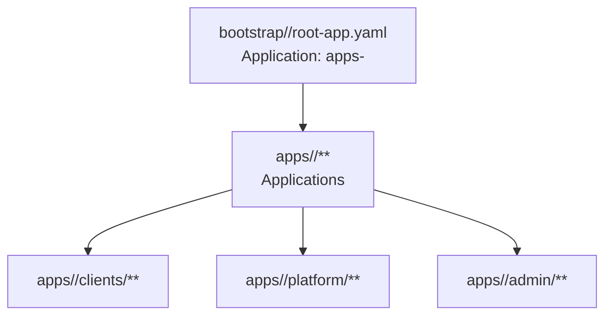
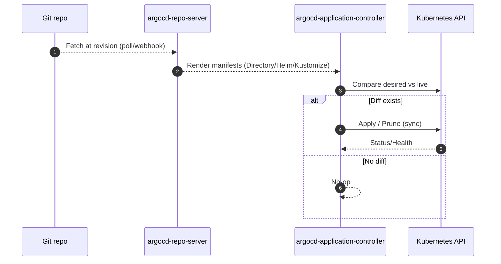

# ArgoCD (GitOps)

Thư mục `infra/argocd/` là **nguồn GitOps** cho ArgoCD: chứa các `Application` và (tuỳ chọn) Kubernetes manifests dạng YAML thuần.

Các env chuẩn: `dev` / `prod`.

## Cấu trúc hiện tại

```text
infra/argocd/
├── bootstrap/
│   └── <env>/
│       └── root-app.yaml          # App-of-Apps: sync toàn bộ apps/<env>
├── apps/
│   └── <env>/
│       ├── clients/               # Application cho từng khách hàng (tenant)
│       ├── platform/              # Application cho platform chung: traefik, monitoring, storage...
│       └── admin/                 # (dev) Application cho admin tools
└── manifests/
    └── platform/                  # YAML thuần cho các thành phần nền tảng (vd: k3s traefik config)
```

`manifests/` (YAML thuần) hiện được dùng cho các config nền tảng cần apply trực tiếp.

## Diagram: App-of-Apps



## Bootstrap (App-of-Apps)

Chỉ cần apply 1 lần root app cho môi trường:

```bash
kubectl -n argocd apply -f infra/argocd/bootstrap/dev/root-app.yaml
```

Sau đó ArgoCD sẽ tự sync các `Application` nằm dưới `infra/argocd/apps/dev/`.

Các root app khác:
- `infra/argocd/bootstrap/prod/root-app.yaml`

## Thêm service / khách hàng mới

Bạn có 2 lựa chọn chuẩn:

1) **Directory (YAML thuần)**: tạo thư mục dưới `infra/argocd/manifests/...`, rồi tạo `Application` trỏ vào đúng `path`.

2) **Helm chart trong repo GitOps**: tạo `Application` trỏ vào `infra/helm/...`, dùng `spec.source.helm.valueFiles` theo env, và set `destination.namespace` đúng tenant/env (chart dùng `.Release.Namespace`).

> Lưu ý: tránh trỏ `Directory` vào thư mục có `Chart.yaml` để ArgoCD auto-detect nhầm loại source.

## Sequence: ArgoCD sync



## Troubleshooting nhanh

- **"multiple application sources defined: Helm,Directory"**
  - Nguyên nhân thường gặp: Application đang có cả `spec.source.helm/chart` lẫn `spec.source.path/directory` (hoặc `spec.sources`).
  - Cách xử lý: đảm bảo chỉ dùng **một** loại source, rồi apply lại `Application`.

- **Xoá nhầm kind khi dùng kubectl**
  - ArgoCD dùng kind: `Application` (apiVersion `argoproj.io/...`).
  - Lệnh đúng:
    - `kubectl -n argocd get application <name>`
    - `kubectl -n argocd delete application <name>`
