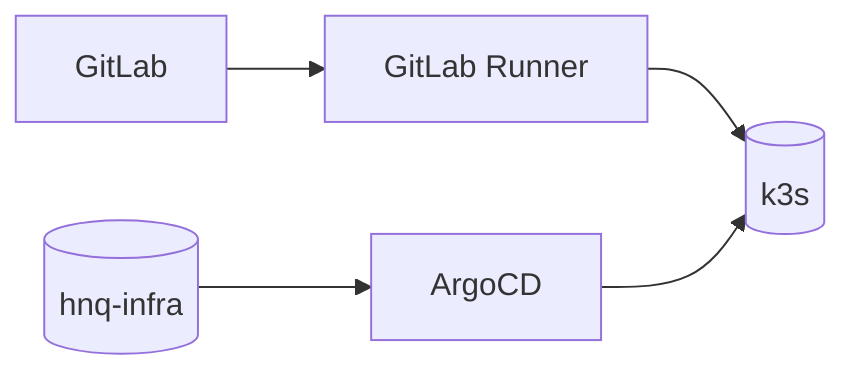

# CICD charts

Charts phục vụ CI/CD platform (không phải business service).

## Thành phần

- `argocd/`: chart wrapper để cài ArgoCD (xem `infra/helm/cicd/argocd/README.md`).
- `gitlab-runner/`: chart để cài GitLab Runner (xem `infra/helm/cicd/gitlab-runner/README.md`).

## Diagram

