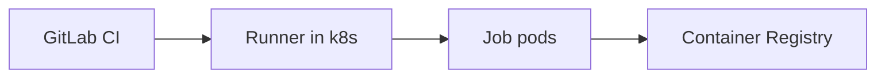

# GitLab Runner (k3s)

Chart wrapper để cài GitLab Runner lên cluster (thường dùng executor Kubernetes).

Thư mục này wrap upstream chart `gitlab-runner` bằng Helm dependency (alias: `gitlabRunner`).

## Cài đặt (ví dụ)

> Lưu ý: token/secret không commit vào Git. Dùng GitLab CI Variables hoặc secret manager.

```bash
helm dependency update infra/helm/cicd/gitlab-runner

helm upgrade --install gitlab-runner infra/helm/cicd/gitlab-runner \
  -n gitlab-runner --create-namespace \
  -f infra/helm/cicd/gitlab-runner/values.yaml
```

## Diagram


