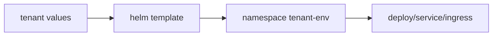

# Clients charts

`infra/helm/clients/` chứa chart deploy cho nhóm khách hàng.

Hiện có:
- `obgyn-clinic-service/`
  - `lotus-clinic/values-dev.yaml`
  - `lotus-clinic/values-prod.yaml`
  - `giaan-clinic/values-dev.yaml`
  - `giaan-clinic/values-prod.yaml`
  - `hocmon-clinic/values-dev.yaml`
  - `hocmon-clinic/values-prod.yaml`

## Pattern khuyến nghị

- 1 chart/service dùng chung cho nhiều tenant, mỗi tenant có folder values riêng.
- Values tách theo env trong folder tenant:
  - `<tenant>/values-dev.yaml`
  - `<tenant>/values-prod.yaml`
- Namespace set qua ArgoCD `destination.namespace` (chart dùng `.Release.Namespace`), theo `<tenant>-<env>`.

## Diagram

