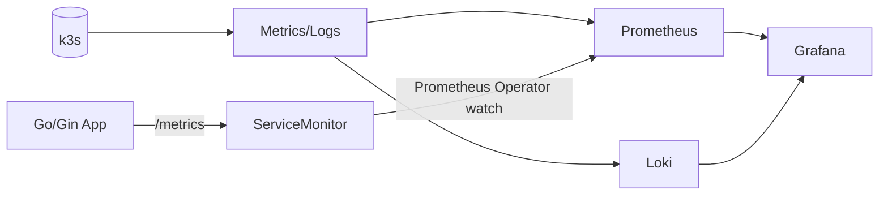

# Monitoring charts

Nơi đặt chart cho stack monitoring (Prometheus, Grafana, Loki, ...).

## Table of Contents

- [Diagram](#diagram)
- [Stack hiện tại](#stack-hiện-tại)
- [Cấu trúc file](#cấu-trúc-file)
- [Cài đặt step by step](#cài-đặt-step-by-step)
- [Scrape app metrics (ServiceMonitor)](#scrape-app-metrics-servicemonitor)
- [Grafana Dashboard](#grafana-dashboard)
- [Alert cho app mới](#alert-cho-app-mới)
  - [Tổng quan routing](#tổng-quan-routing)
  - [Tắt service mà không bị alert](#tắt-service-mà-không-bị-alert)
  - [Alert có sẵn](#alert-có-sẵn-tự-động-không-cần-config-thêm)
  - [Alert custom theo metric của app](#thêm-alert-custom-theo-metric-của-app)
  - [Checklist deploy app mới](#checklist-deploy-app-mới-có-alert)
  - [Verify alert](#verify-alert-đang-hoạt-động-cho-app)
  - [Cập nhật webhook Discord](#cập-nhật-webhook-discord-khi-đổi-channel)
- [Secrets](#secrets)
- [Lưu ý quan trọng](#lưu-ý-quan-trọng)

---

## Diagram



## Stack hiện tại

`kube-prometheus-stack` — gộp Prometheus + Grafana + node-exporter + kube-state-metrics.

- Namespace: `monitoring`
- ArgoCD app: `monitoring` (`infra/argocd/apps/dev/platform/monitoring.yaml`)
- Grafana URL: `https://admin-grafana.l2cteam.work`

## Cấu trúc file

```
kube-prometheus-stack/
  Chart.yaml        # dependency: prometheus-community/kube-prometheus-stack
  Chart.lock        # pin exact version (bắt buộc commit)
  values.yaml       # base config (retention, resources, serviceMonitorSelector)
  values-dev.yaml   # overrides: nodeSelector, ingress, password

dashboards/
  app-overview.json # Grafana dashboard cho Go/Gin apps (import thủ công)
```

---

## Cài đặt step by step

### 1. Helm dependency update

```bash
cd infra/helm/monitoring/kube-prometheus-stack
helm dependency update
```

Commit `Chart.lock`. **Không commit** `charts/*.tgz` (thêm vào `.gitignore`).

### 2. Đảm bảo traefik-worker đã deploy

`traefik-worker` là Traefik phụ chạy DaemonSet trên worker nodes, bind hostNetwork port 80.
Cloudflare Tunnel forward vào `127.0.0.1:80` → traefik-worker route theo Host header.

```bash
kubectl apply -f infra/argocd/manifests/platform/cloudflared-dev-worker/traefik-worker-helmchart.yaml
kubectl get pods -A | grep traefik-worker
```

### 3. Config Cloudflare Tunnel

Zero Trust → Networks → Tunnels → chọn tunnel → Edit → Public Hostname → Add:

| Field | Value |
|---|---|
| Subdomain | `admin-grafana` |
| Domain | `l2cteam.work` |
| Type | `HTTP` |
| URL | `127.0.0.1:80` |

### 4. Push và ArgoCD sync

```bash
git add infra/helm/monitoring/ infra/argocd/apps/dev/platform/monitoring.yaml
git commit -m "feat(monitoring): add kube-prometheus-stack"
git push
```

ArgoCD tự sync sau ~3 phút, hoặc:

```bash
argocd app sync monitoring
```

### 5. Verify

```bash
kubectl get pods -n monitoring
kubectl get ingress -n monitoring
```

---

## Scrape app metrics (ServiceMonitor)

### Tổng quan

Prometheus mặc định không biết app nào cần scrape. Cần tạo **ServiceMonitor** — CRD do Prometheus Operator quản lý. Flow:

```
Ta tạo ServiceMonitor
    ↓
Prometheus Operator detect → generate scrape config
    ↓
Prometheus scrape /metrics của app mỗi 15s
    ↓
Metrics vào Prometheus → Grafana query được
```

Có 2 loại metrics:
- **Không cần ServiceMonitor**: CPU, memory, pod status, restarts (đã có từ cadvisor + kube-state-metrics)
- **Cần ServiceMonitor**: gin HTTP metrics (request rate, latency p95/p99, error rate, slow requests)

### Yêu cầu Prometheus watch all namespaces

Mặc định Prometheus chỉ watch ServiceMonitor trong namespace `monitoring`. Đã config trong `values.yaml`:

```yaml
kube-prometheus-stack:
  prometheus:
    prometheusSpec:
      serviceMonitorNamespaceSelector: {}   # watch all namespaces
      serviceMonitorSelector: {}            # watch all ServiceMonitors
      podMonitorNamespaceSelector: {}
      podMonitorSelector: {}
```

### Yêu cầu với app Helm chart

Để Prometheus scrape được app, Helm chart của app cần:

**1. Service phải có label `app: <tên>`** trong `metadata.labels` (không chỉ `spec.selector`):

```yaml
# templates/service.yaml
metadata:
  labels:
    app: backend-service   # ← bắt buộc, Prometheus dùng để filter target
```

**2. ServiceMonitor template** (`templates/servicemonitor.yaml`):

```yaml
{{- if .Values.serviceMonitor.enabled }}
apiVersion: monitoring.coreos.com/v1
kind: ServiceMonitor
metadata:
  name: {{ include "chart.fullname" . }}
  namespace: {{ .Release.Namespace }}
  labels:
    release: monitoring   # ← bắt buộc, match với Prometheus selector
spec:
  selector:
    matchLabels:
      app: backend-service   # match với Service metadata.labels.app
  endpoints:
    - port: http             # tên port trong Service spec.ports
      path: /metrics
      interval: {{ .Values.serviceMonitor.interval | default "15s" }}
{{- end }}
```

**3. Default values** (`values.yaml`):

```yaml
serviceMonitor:
  enabled: false
  interval: 15s
```

**4. Enable cho từng env** (`values-dev.yaml` hoặc `values-prod.yaml`):

```yaml
serviceMonitor:
  enabled: true
  interval: 15s
```

### Thêm ServiceMonitor cho service mới

1. Đảm bảo Service có `metadata.labels.app`
2. Thêm `templates/servicemonitor.yaml` vào Helm chart (xem template trên)
3. Thêm default `serviceMonitor.enabled: false` vào `values.yaml`
4. Set `serviceMonitor.enabled: true` trong `values-dev.yaml` / `values-prod.yaml`
5. Commit + push → ArgoCD sync

Verify sau sync:

```bash
# ServiceMonitor đã tạo chưa
kubectl get servicemonitor -n <namespace>

# Prometheus có scrape không (dùng đúng pod)
kubectl get pod -n monitoring -l app.kubernetes.io/name=prometheus
kubectl exec -n monitoring <prometheus-pod> -c prometheus \
  -- wget -qO- 'http://localhost:9090/api/v1/targets' | \
  python3 -c "
import sys, json
data = json.load(sys.stdin)
for t in data['data']['activeTargets']:
    if '<namespace>' in t.get('scrapePool',''):
        print(t['health'], t['scrapeUrl'], t.get('lastError',''))
"

# Metrics có data chưa (cần có ít nhất 1 HTTP request vào app trước)
kubectl exec -n monitoring <prometheus-pod> -c prometheus \
  -- wget -qO- 'http://localhost:9090/api/v1/query?query=gin_request_total%7Bnamespace%3D%22<namespace>%22%7D' | \
  python3 -m json.tool
```

**Lưu ý:** Gin metrics (`gin_request_total`, `gin_request_duration_bucket`, ...) chỉ xuất hiện sau khi app nhận ít nhất 1 HTTP request.

---

## Grafana Dashboard

Dashboard `dashboards/app-overview.json` hiển thị:

| Section | Panels |
|---|---|
| Overview | Running pods, Pod restarts (1h), Request rate, Error rate %, p95, p99 |
| Pod Resources | Pod status table (phase + restarts + CPU + mem), CPU chart, Memory chart |
| HTTP Metrics | Request rate by method, HTTP status code breakdown (donut), p95/p99/avg latency time series |
| Latency Details | Top 5 slowest endpoints (p95), Slow requests p99 > 1s |
| Errors | Error rate bars (4xx/5xx stacked), Error breakdown by endpoint |

**Import:** Grafana → Dashboards → Import → Upload JSON file → chọn `app-overview.json`.

**Variable:** Chọn `Namespace` để filter theo app + environment (mỗi namespace = 1 app + 1 env).

---

## Alert cho app mới

### Tổng quan routing

Alert tự động route theo **suffix namespace**:

| Namespace | Channel Discord | Silence |
|---|---|---|
| `*-dev` | `#dev-alerts` | 22:00 – 06:00 |
| `*-prod` | `#prod-alerts` | Không |
| Infra / node | `#prod-alerts` | Không |

Config trong K8s Secret `alertmanager-config` (namespace `monitoring`) — lưu tại `~/hnq-secret/k3s_secret/monitoring.yaml`, apply thủ công.

---

### Tắt service mà không bị alert

Các alert hiện tại (`PodCrashLooping`, `OOMKilled`, `PodRestartTooMany`) chỉ fire khi pod **crash hoặc restart**. Scale về 0 hoặc xóa deployment không trigger alert nào.

```bash
# Scale về 0 — không bị alert
kubectl scale deployment <tên> -n <namespace> --replicas=0

# Hoặc xóa hẳn — cũng không bị alert
kubectl delete deployment <tên> -n <namespace>
```

> Ví dụ: tắt `giaan-clinic-dev`, `hocmon-clinic-dev` → scale về 0, không cần làm gì thêm.

---

### Alert có sẵn (tự động, không cần config thêm)

`PrometheusRule/hnq-alerts` cover tất cả namespace trong cluster:

| Alert | Trigger | Severity |
|---|---|---|
| `PodCrashLooping` | Container CrashLoopBackOff ≥ 2 phút | critical |
| `OOMKilled` | Container bị kill do OOM | critical |
| `PodRestartTooMany` | Restart > 5 lần / giờ | warning |
| `NodeNotReady` | Node not ready ≥ 5 phút | critical |
| `NodeHighMemory` | RAM > 80% ≥ 5 phút | warning |
| `NodeHighCPU` | CPU > 80% ≥ 5 phút | warning |

**Khi deploy app mới vào namespace `*-dev` hoặc `*-prod` → các alert trên tự hoạt động ngay, không cần làm gì thêm.**

---

### Thêm alert custom theo metric của app

Dùng khi cần alert theo business metric (HTTP 5xx rate, queue lag, ...).

Thêm `PrometheusRule` vào Helm chart của app:

**`templates/prometheus-rules.yaml`** (trong Helm chart của app):

```yaml
{{- if .Values.prometheusRule.enabled }}
apiVersion: monitoring.coreos.com/v1
kind: PrometheusRule
metadata:
  name: {{ include "chart.fullname" . }}
  namespace: {{ .Release.Namespace }}
  labels:
    app: kube-prometheus-stack
    release: monitoring
spec:
  groups:
    - name: {{ .Release.Namespace }}.app.rules
      rules:
        - alert: HighErrorRate
          expr: |
            sum(rate(gin_request_total{namespace="{{ .Release.Namespace }}", status=~"5.."}[5m]))
            /
            sum(rate(gin_request_total{namespace="{{ .Release.Namespace }}"}[5m])) > 0.05
          for: 5m
          labels:
            severity: critical
            namespace: {{ .Release.Namespace }}
          annotations:
            summary: High error rate in {{ .Release.Namespace }}
            description: Error rate {{ "{{ $value | printf \"%.1f\" }}" }}% over last 5m.
{{- end }}
```

**`values.yaml`** (default off):

```yaml
prometheusRule:
  enabled: false
```

**`values-dev.yaml`** và **`values-prod.yaml`**:

```yaml
prometheusRule:
  enabled: true
```

> **Bắt buộc:** Label `release: monitoring` phải có trong PrometheusRule metadata để Prometheus discover được.

---

### Checklist deploy app mới có alert

**Dev:**
- [ ] Namespace có suffix `-dev` (ví dụ: `my-app-dev`)
- [ ] Deploy app → alert pod/node tự hoạt động
- [ ] (Tùy chọn) Enable `prometheusRule.enabled: true` trong `values-dev.yaml` nếu cần custom alert
- [ ] Verify: kiểm tra `#dev-alerts` Discord channel

**Prod:**
- [ ] Namespace có suffix `-prod` (ví dụ: `my-app-prod`)
- [ ] Deploy app → alert pod/node tự hoạt động
- [ ] (Tùy chọn) Enable `prometheusRule.enabled: true` trong `values-prod.yaml` nếu cần custom alert
- [ ] Verify: kiểm tra `#prod-alerts` Discord channel

---

### Verify alert đang hoạt động cho app

```bash
# Check PrometheusRule của app đã được load
kubectl get prometheusrule -n <namespace>

# Kiểm tra rule health trong Prometheus
kubectl port-forward -n monitoring svc/monitoring-kube-prometheus-prometheus 9090:9090 &
curl -s "http://localhost:9090/api/v1/rules" | \
  python3 -c "
import sys, json
d = json.load(sys.stdin)
for g in d['data']['groups']:
    if '<namespace>' in g['name']:
        print(f'GROUP: {g[\"name\"]}')
        for r in g['rules']:
            print(f'  - {r[\"name\"]}: {r[\"health\"]}')
"
```

```bash
# Fire test alert để kiểm tra routing Discord
kubectl port-forward -n monitoring svc/monitoring-kube-prometheus-alertmanager 9093:9093 &
curl -X POST http://localhost:9093/api/v2/alerts \
  -H "Content-Type: application/json" \
  -d "[{
    \"labels\": {\"alertname\": \"TestAlert\", \"namespace\": \"<namespace>\", \"severity\": \"critical\"},
    \"annotations\": {\"summary\": \"Test\", \"description\": \"Test routing\"},
    \"endsAt\": \"2099-01-01T00:00:00Z\"
  }]"
# Thay <namespace> bằng my-app-dev hoặc my-app-prod
# Đợi ~30s → kiểm tra Discord
```

---

### Cập nhật webhook Discord (khi đổi channel)

Secret `alertmanager-config` không quản lý bởi ArgoCD — cần update thủ công:

```bash
# Edit file secret
vi ~/hnq-secret/k3s_secret/monitoring.yaml

# Apply lại
kubectl apply -f ~/hnq-secret/k3s_secret/monitoring.yaml

# Alertmanager tự reload trong ~1 phút, hoặc force:
kubectl rollout restart statefulset/alertmanager-monitoring-kube-prometheus-alertmanager -n monitoring
```

---

## Secrets

**Tất cả secrets không được commit vào repo này.** Lưu tại repo riêng:

```
~/hnq-secret/k3s_secret/monitoring.yaml   ← alertmanager-config, grafana-admin-secret
```

Apply thủ công (không qua ArgoCD):
```bash
kubectl apply -f ~/hnq-secret/k3s_secret/monitoring.yaml
```

---

## Lưu ý quan trọng

**Node pinning:** Prometheus và Grafana pin vào `server01` qua `nodeSelector`. node-exporter chạy DaemonSet trên tất cả node.

**Traffic path:** Cloudflare Tunnel → cloudflared (server01) → traefik-worker (hostNetwork 127.0.0.1:80) → Grafana pod. Không đi qua Traefik control-plane (Vietnix).

**TLS:** Do Cloudflare xử lý. Ingress dùng `entrypoints: web` (HTTP), không cần cert-manager.

**ingressClassName phải là `traefik-worker`**, không phải `traefik`. Dùng `traefik` sẽ đi qua Vietnix node và không qua tunnel.

**Password:** Đổi `adminPassword` trong `values-dev.yaml` trước khi deploy lên prod. Nên chuyển sang Kubernetes Secret.

**ArgoCD CRD lớn:** `syncOptions` cần có `ServerSideApply=true` để tránh lỗi annotation size limit.

**Hai Prometheus instances:** Nếu thấy 2 pod Prometheus (`kube-prometheus-stack-*` và `monitoring-*`), pod đúng là `monitoring-kube-prometheus-prometheus-0`. Pod cũ là orphan từ lần deploy trước với release name khác.

**ServiceMonitor label bắt buộc:** ServiceMonitor phải có label `release: monitoring` để match `serviceMonitorSelector` của Prometheus. Nếu thiếu → Prometheus bỏ qua hoàn toàn.
