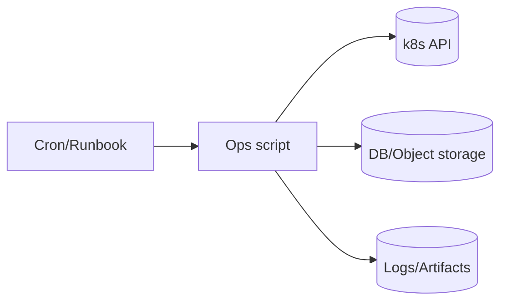
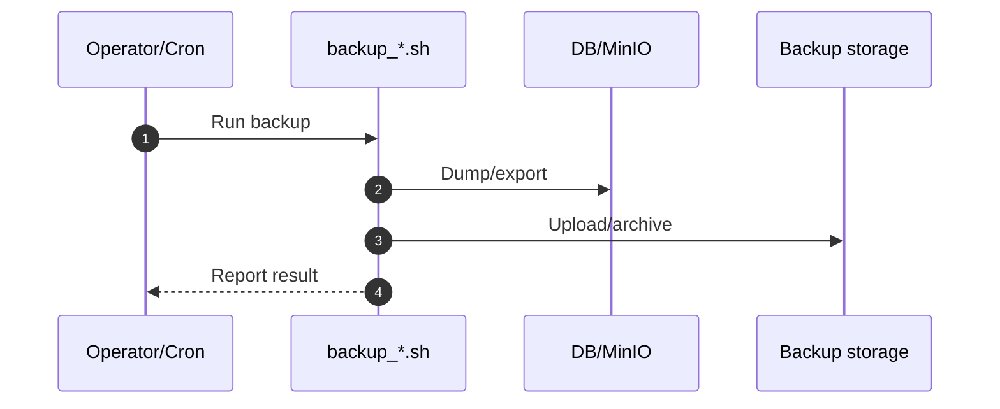

# Ops scripts

`infra/scripts/` dành cho các tác vụ vận hành (backup/restore/cleanup). Các script ở đây **không nên tự chạy âm thầm**; ưu tiên có `--help`, có confirm với thao tác nguy hiểm, và log rõ ràng.

## Diagram



## Sequence: backup (khái quát)



## MariaDB backup/restore (k3s)

Script thống nhất:

```bash
bash infra/scripts/mariadb_backup_restore.sh --help
```

Liệt kê MariaDB pod trong cluster:

```bash
bash infra/scripts/mariadb_backup_restore.sh list
```

Chạy interactive (tự chọn backup/restore, chọn pod MariaDB, chọn database):

```bash
bash infra/scripts/mariadb_backup_restore.sh
```

Backup 1 database và lưu backup trên máy chạy script:

```bash
bash infra/scripts/mariadb_backup_restore.sh backup \
  --namespace storage-mariadb-dev \
  --db lotus_clinic \
  --user lotus \
  --ask-pass \
  --output /home/server01/k3s/hnq_backup
```

Export toàn bộ database:

```bash
bash infra/scripts/mariadb_backup_restore.sh backup \
  --namespace storage-mariadb-dev \
  --all-databases \
  --user root \
  --ask-pass \
  --output /home/server01/k3s/hnq_backup/all_databases.sql.gz
```

Import backup vào MariaDB pod:

```bash
bash infra/scripts/mariadb_backup_restore.sh restore \
  --namespace storage-mariadb-dev \
  --db lotus_clinic \
  --user lotus \
  --file /home/server01/k3s/hnq_backup/lotus_clinic_storage-mariadb-dev_20260214_120000.sql.gz \
  --ask-pass \
  --yes
```

Import vào database mới khi user ứng dụng không có quyền `CREATE DATABASE`:

```bash
bash infra/scripts/mariadb_backup_restore.sh restore \
  --namespace storage-mariadb-prod \
  --db db_hocmon_clinic_prod \
  --user lotus \
  --ask-pass \
  --admin-user <admin_user> \
  --admin-ask-pass \
  --file /home/server01/k3s/hnq_backup/lotus_clinic_storage-mariadb-dev_20260214_120000.sql.gz \
  --yes
```

Lưu ý:

- File backup được ghi ra máy đang chạy script (không nằm trong pod).
- Có thể chỉ định `--namespace/--pod` hoặc để script tự hiển thị danh sách MariaDB rồi chọn.
- Nên dùng `--ask-pass` để tránh lộ mật khẩu trong shell history.
- Nếu user restore không có quyền tạo DB/grant, script sẽ thử fallback bằng admin user (`--admin-user`) hoặc root password trong pod (nếu root còn đăng nhập được).
- `infra/scripts/backup_mysql.sh` và `infra/scripts/restore_mysql.sh` hiện là wrapper gọi script thống nhất.

## MinIO backup/restore (k3s)

Script thống nhất:

```bash
bash infra/scripts/minio_backup_restore.sh --help
```

Liệt kê MinIO pod trong cluster:

```bash
bash infra/scripts/minio_backup_restore.sh list
```

Chạy interactive (tự chọn backup/restore, chọn pod MinIO):

```bash
bash infra/scripts/minio_backup_restore.sh
```

Backup bucket cụ thể ra file local:

```bash
bash infra/scripts/minio_backup_restore.sh backup \
  --namespace storage-minio-dev \
  --bucket lotus-clinic \
  --output /home/server01/k3s/hnq_backup
```

Backup 1 bucket cụ thể (toàn bộ object trong bucket đó):

```bash
bash infra/scripts/minio_backup_restore.sh backup \
  --namespace storage-minio-dev \
  --bucket lotus-clinic \
  --output /home/server01/k3s/hnq_backup/lotus-clinic.tar.gz
```

Restore từ file backup vào MinIO pod:

```bash
bash infra/scripts/minio_backup_restore.sh restore \
  --namespace storage-minio-dev \
  --file /home/server01/k3s/hnq_backup/minio_storage-minio-dev_minio-7cdbb8879d-lfd95_20260219_100000.tar.gz \
  --yes
```

Restore 1 bucket cụ thể từ backup:

```bash
bash infra/scripts/minio_backup_restore.sh restore \
  --namespace storage-minio-dev \
  --file /home/server01/k3s/hnq_backup/minio_storage-minio-dev_minio-7cdbb8879d-lfd95_20260219_100000.tar.gz \
  --bucket lotus-clinic \
  --yes
```

Restore sang bucket khác tên (nếu chưa tồn tại sẽ tự tạo):

```bash
bash infra/scripts/minio_backup_restore.sh restore \
  --namespace storage-minio-dev \
  --file /home/server01/k3s/hnq_backup/minio_storage-minio-dev_minio-7cdbb8879d-lfd95_20260219_100000.tar.gz \
  --bucket lotus-clinic \
  --target-bucket lotus-clinic-restore-test \
  --yes
```

Restore và xóa dữ liệu cũ trước khi import:

```bash
bash infra/scripts/minio_backup_restore.sh restore \
  --namespace storage-minio-dev \
  --file /home/server01/k3s/hnq_backup/minio_storage-minio-dev_minio-7cdbb8879d-lfd95_20260219_100000.tar.gz \
  --clear-destination \
  --yes
```

Lưu ý:

- Script backup/restore theo kiểu tar stream dữ liệu trong thư mục `/data` của container MinIO.
- File backup được ghi ra máy đang chạy script (không nằm trong pod).
- `--clear-destination` là thao tác nguy hiểm (xóa dữ liệu hiện có trong `--data-dir` trước khi restore).
- Nếu image MinIO không có `tar`, script sẽ ưu tiên:
  - fallback `hostPath` khi path mount có sẵn local.
  - fallback `pod_mc_stream` (dùng helper pod `minio/mc`) khi không có `hostPath` local.
- Backup tạo từ mode `pod_mc_stream` có marker `.backup_mode=pod_mc_stream_v1`; restore file này có thể chạy ở mọi nơi miễn pod có `mc`.
- Backup raw `/data` (không có marker) cần restore bằng `hostPath` local hoặc pod có `tar`.
- Mỗi lần backup/restore chỉ hỗ trợ **1 bucket**; `--all-buckets` đã bị khóa.
- `--bucket` là source bucket; `--target-bucket` dùng cho restore sang bucket khác hoặc bucket mới.

## MinIO migrate: Docker -> k3s

Script cho luồng migrate từ MinIO chạy Docker container sang MinIO pod trong k3s:

```bash
bash infra/scripts/minio_docker_to_k3s_backup_restore.sh --help
```

Liệt kê MinIO Docker container (source) và MinIO k3s pod (target):

```bash
bash infra/scripts/minio_docker_to_k3s_backup_restore.sh list
```

Backup từ Docker MinIO container ra file local:

```bash
bash infra/scripts/minio_docker_to_k3s_backup_restore.sh backup \
  --docker-container minio \
  --docker-data-dir /data \
  --output /home/server01/k3s/hnq_backup
```

Backup 1 bucket cụ thể từ Docker MinIO:

```bash
bash infra/scripts/minio_docker_to_k3s_backup_restore.sh backup \
  --docker-container minio \
  --bucket lotus-clinic \
  --output /home/server01/k3s/hnq_backup
```

Restore file backup vào MinIO pod trên k3s:

```bash
bash infra/scripts/minio_docker_to_k3s_backup_restore.sh restore \
  --namespace storage-minio-dev \
  --pod minio-7cdbb8879d-lfd95 \
  --file /home/server01/k3s/hnq_backup/minio_docker_minio_20260221_101500.tar.gz \
  --clear-destination \
  --yes
```

Restore backup bucket sang bucket tên khác trên k3s:

```bash
bash infra/scripts/minio_docker_to_k3s_backup_restore.sh restore \
  --namespace storage-minio-dev \
  --pod minio-7cdbb8879d-lfd95 \
  --file /home/server01/k3s/hnq_backup/minio_bucket_lotus-clinic_minio_20260221_101500.tar.gz \
  --target-bucket lotus-clinic-restore-test \
  --yes
```

Lưu ý:

- Backup theo kiểu archive toàn bộ thư mục data (`/data`) từ Docker container.
- Có thể backup theo bucket với `--bucket`; file backup bucket sẽ có marker `.backup_mode=bucket_mc_v1`.
- Backup sẽ validate archive có `.minio.sys/format.json` và log `format UUID` để đối chiếu.
- Restore mặc định chạy theo chế độ an toàn:
  - tự scale workload MinIO (Deployment/StatefulSet) về `0` trước khi restore;
  - restore qua hostPath (local hoặc helper pod trên đúng node);
  - scale workload lên lại sau restore.
- Với backup bucket (`bucket_mc_v1`), restore chạy object-level và hỗ trợ đổi tên bucket đích bằng `--target-bucket`.
- Restore bucket sẽ ưu tiên dùng `mc` local; nếu máy không có `mc` thì fallback chạy `mc` qua Docker image.
- Restore mặc định **không cho merge dữ liệu**. Bạn cần `--clear-destination` (khuyến nghị).
- Nếu cố tình merge restore, phải thêm `--allow-merge-restore` (unsafe).
- Nếu muốn giữ behavior cũ (restore khi MinIO đang chạy), phải thêm `--allow-live-restore` (unsafe, dễ gây lệch metadata `.minio.sys`).

## Tunnel qua 80, public qua 443 (k3s ingress)

Script kiểm tra nhanh trạng thái Traefik + ingress và hỗ trợ mở firewall host (ufw) theo policy:

- `allow 443/tcp`
- `deny 80/tcp` từ Internet (tunnel vẫn gọi `127.0.0.1:80`)

```bash
bash infra/scripts/ensure_k3s_dual_ingress_access.sh check
```

## Move local dev data: `hnq` -> `server01`

Script copy trực tiếp các thư mục `hostPath` dev đang dùng cho `mariadb/minio/opensearch/postgres/redis` từ node `hnq` sang `server01`, không cần SSH vào node. Cơ chế là tạo 2 helper pod, mount cùng `hostPath`, rồi stream dữ liệu qua `kubectl exec`.

Kiểm tra dung lượng source/target:

```bash
bash infra/scripts/move_hnq_local_data_to_server01.sh check
```

Copy toàn bộ data và xóa dữ liệu cũ ở target trước khi giải nén:

```bash
bash infra/scripts/move_hnq_local_data_to_server01.sh sync --clear-target --yes
```

Chỉ copy một phần service:

```bash
bash infra/scripts/move_hnq_local_data_to_server01.sh sync \
  --services "mariadb postgres redis" \
  --clear-target \
  --yes
```

Lưu ý:

- Script chỉ xử lý data copy; việc reschedule pod sang `server01` cần đi cùng việc đổi `nodeSelector` trong Helm values.
- Với database/object storage, nên scale workload xuống trước khi chạy `sync --clear-target` để tránh copy file đang bị ghi.
- Nếu cần giữ helper pod để debug, thêm `--keep-helpers`.

Chạy chế độ apply và mở firewall bằng ufw:

```bash
bash infra/scripts/ensure_k3s_dual_ingress_access.sh apply \
  --open-firewall \
  --domain app.example.com \
  --public-ip 14.225.222.153
```

Lưu ý:

- Script chỉ chạm vào firewall khi bạn bật `--open-firewall`.
- `cloudflared` route vào `http://127.0.0.1:80` theo cấu hình Tunnel origin.

## Recover node k3s bi Unavailable/NotReady

Script chuan doan va ho tro recover node khi bi taint `node.kubernetes.io/unreachable` (kubelet/k3s-agent mat heartbeat):

```bash
bash infra/scripts/recover_k3s_unreachable_node.sh check --node hnq
```

Che do `apply` co confirm cho cac thao tac quan trong:

```bash
bash infra/scripts/recover_k3s_unreachable_node.sh apply \
  --node hnq \
  --ssh root@100.103.136.98 \
  --wait-seconds 180
```

Neu node van NotReady, co the bat them cac buoc cuoi:

```bash
bash infra/scripts/recover_k3s_unreachable_node.sh apply \
  --node hnq \
  --force-delete-terminating-pods \
  --delete-node-if-still-notready
```

Luu y:

- Mac dinh script se hoi confirm; them `--yes` de bo qua prompt.
- `--ssh` la tuy chon, dung de restart `tailscaled` va `k3s-agent`/`k3s` tren host node.
- `--delete-node-if-still-notready` la thao tac manh, chi dung khi da xac nhan host node khong the recover nhanh.
